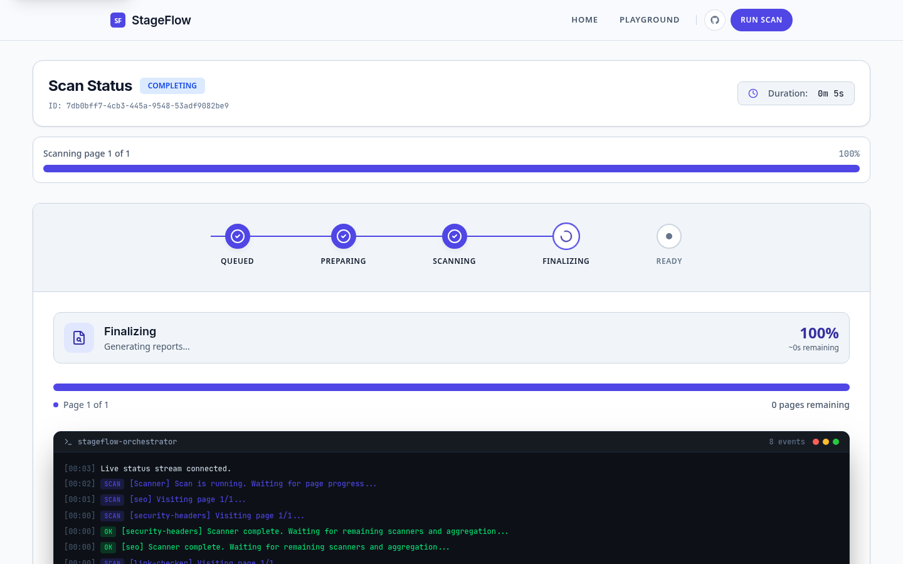

# StageFlow

[](https://github.com/mattboback/stageflow/actions/workflows/ci.yml)
[](LICENSE)
[](SECURITY.md)

**[Live Demo](https://stageflow.org)** | Try the scanning pipeline against any public URL

Podman-native web accessibility and quality scanning platform.

StageFlow runs multi-scanner audits against live URLs or static-site ZIP archives, then aggregates outputs into one normalized report stream. It is built for self-hosting, strict intake validation, and operational transparency.


## Why StageFlow

- Run accessibility and quality scans in infrastructure you control.
- Submit one job and run multiple scanner modules in parallel.
- Track job progress in real time through SSE (`/api/v1/jobs/{id}/stream`).
- Keep scanner execution isolated in per-job pods.
- Produce one deduplicated report from heterogeneous scanner outputs.

## At a Glance

```text
Client/UI -> Platform API -> NATS JetStream -> Orchestrator -> Podman job pod
                                                      |            |- Extractor (ZIP jobs)
                                                      |            `- Scanner runners
                                                      `-> Status + artifacts -> MinIO -> unified report
```

- API validates intake, applies SSRF guardrails, and publishes job events.
- Orchestrator owns the job FSM and scanner lifecycle.
- Scanner runner loads plugins by manifest and validates scanner options.
- Frontend receives live status with SSE and fallback refresh logic.

Full design details: [ARCHITECTURE.md](docs/ARCHITECTURE.md).

## Screenshots

### Scanners

Six built-in scanner modules run in parallel inside isolated containers. Choose scanners per run and get one normalized report.


### Workflow

Submit a target, run isolated scanners, and ship one unified report.


### Playground

Configure input type, target URLs, scanner selection, and run options from a single control surface.


Scanner presets (Coverage, Quick, Custom) let you select modules with one click. Each scanner card shows its focus area and current state.


### Scan Execution

Real-time SSE event stream shows scanner progress, container status, and log output as the scan runs.

<table>
  <tr>
    <td></td>
    <td></td>
  </tr>
  <tr>
    <td align="center"><em>Live progress stream during execution</em></td>
    <td align="center"><em>Completed scan with report and artifact links</em></td>
  </tr>
</table>

### Report

The unified report aggregates findings from all scanners into one view with severity breakdown, Lighthouse scores, and scanner status.


<table>
  <tr>
    <td></td>
    <td></td>
  </tr>
  <tr>
    <td align="center"><em>Issues tab — grouped findings with severity and fix guidance</em></td>
    <td align="center"><em>Scans tab — per-scanner results and timing</em></td>
  </tr>
</table>

### Page-Level Evidence

The Pages tab renders an annotated screenshot of each scanned page with bounding boxes highlighting issue locations. Click any marker to open full remediation detail.

<table>
  <tr>
    <td></td>
    <td></td>
  </tr>
  <tr>
    <td align="center"><em>Annotated page screenshot with bounding boxes</em></td>
    <td align="center"><em>Issue detail with evidence crop, selector, and fix guidance</em></td>
  </tr>
</table>


### CLI

The `stageflow` CLI submits scans, lists scanners, and fetches reports from the terminal.

<table>
  <tr>
    <td></td>
    <td></td>
  </tr>
  <tr>
    <td align="center"><em>CLI commands and flags</em></td>
    <td align="center"><em>Available scanners with categories and versions</em></td>
  </tr>
</table>

## Built-In Scanners

| Scanner | Focus |
| --- | --- |
| `axe` | Accessibility (WCAG rule violations) |
| `lighthouse` | Performance and quality audits |
| `seo` | SEO best-practice checks |
| `security-headers` | HTTP security header posture |
| `link-checker` | Broken link detection |
| `ai-navigator` | Goal-driven browser flow evaluation |

## Tech Stack

| Layer | Technology |
| --- | --- |
| Backend services | Go 1.25.4 |
| Scanner runtime | TypeScript + Bun + Playwright |
| Frontend | SvelteKit 5 + Tailwind v4 |
| Messaging | NATS JetStream |
| Storage | MinIO (artifacts) + PostgreSQL (job state/events) |
| Container runtime | Podman |
| Edge/proxy | Caddy |
| Monitoring | Grafana |

## Quality & Testing

StageFlow is built to be production-ready and deeply tested across the stack:
- **100% Type Safety**: Frontend and scanner-runner enforce strict TypeScript (`noUncheckedIndexedAccess`, zero `any` usage).
- **Backend Quality**: Go codebase is fully linted (golangci-lint), race-tested, and audited via `govulncheck`.
- **Frontend Testing**: 220+ unit tests with Vitest, comprehensive component testing with Storybook, and Playwright a11y interaction tests.
- **Continuous Integration**: The entire CI pipeline enforces stringent quality gates on every commit.

## Prerequisites

- [Go 1.25.4](https://go.dev/dl/)
- [Bun](https://bun.sh/)
- [Podman](https://podman.io/) (with `podman compose`)
- [just](https://github.com/casey/just)
- [golangci-lint v2](https://golangci-lint.run/)

## Quick Start

```bash
git clone https://github.com/mattboback/stageflow.git
cd stageflow

cp .env.example .env

# Keep .env files local and out of version control.

just setup
just dev up
just dev init
just images
```

After startup:

- Frontend: `http://localhost:3000`
- API: `http://localhost:8080`
- Orchestrator admin API: `http://localhost:8081`

Tip: `just demo` runs setup, starts the stack, initializes buckets, builds images, and prints a URL-scan command.

## Production on the shared VPS

This repo does not own standalone production deployment on the shared VPS.

Production operations for `stageflow.org` run from the shared root control
plane at `/home/matt/Deployment`. Use the root `justfile` there when you need
to operate the live stack:

```bash
cd /home/matt/Deployment
just stageflow-deploy
just stageflow-restart
just stageflow-logs
just stageflow-health
just health
```

Repo-local `just prod ...` and `just deploy ...` intentionally stop and point
back to `/home/matt/Deployment`. Keep local and staging work in this repo, but
keep VPS production ownership at `/home/matt/Deployment`.

## First URL Scan (API)

```bash
job_id="$({
  curl -sS -X POST http://localhost:8080/api/v1/jobs/urls \
    -H 'content-type: application/json' \
    -d '{"urls":["https://example.com"]}'
} | jq -r .job_id)"

curl -N "http://localhost:8080/api/v1/jobs/$job_id/stream"
```

SSRF protections reject loopback/private/link-local/metadata destinations for URL jobs.

## Optional CLI Mode

StageFlow also includes an optional CLI client (`tools/stageflow-cli/`) that
talks to the existing Platform API. It submits URL jobs, waits for completion,
and fetches the aggregated report via `GET /api/v1/jobs/{id}/results`.

Public URL scans:

```bash
go run ./tools/stageflow-cli scan https://example.com
```

For a local install that avoids stale binaries:

```bash
just cli-install
stageflow scanners
stageflow scan https://example.com
stageflow scan https://example.com --format json > report.json
```

Or build a local binary in place:

```bash
cd tools/stageflow-cli
go build -o stageflow .
./stageflow scanners
./stageflow scan https://example.com
./stageflow scan https://example.com --format json > report.json
```

Local project mode (starts a dev server and scans `localhost`):

- Run the local stack with the local-only overlay (enables private targets + host-network job pods):
  - `just dev up local`
  - `just dev init local`
  - `just images`
- In your web project repo, run `stageflow project init` (optionally pass a
  project path as an arg). This generates:
  - `.stageflow/config.yaml`
  - `.stageflow/README.md`
- Run `stageflow project doctor` to validate config and local dev readiness
  before scanning.
- Run `stageflow project` to start dev, wait for readiness, and run scans.

Environment variables:

- `STAGEFLOW_API_URL` (default `http://localhost:8080`)
- `STAGEFLOW_API_KEY` (optional, sent as `X-Api-Key`)

Notes:

- Text output is the default. Use `--format json` for machine-readable output.
- `--json` remains available for backward compatibility, but `--format json`
  is the preferred form.
- `localhost`/private target submissions require the API instance to allow
  private scans (`PLATFORM_API_ALLOW_PRIVATE_TARGETS=true`), which is enabled
  by `just dev up local`.
- The CLI auto-enables `allow_private_targets=true` when targets are loopback
  or private literals (`localhost`, `127.0.0.1`, RFC1918, IPv6 ULA).
- The CLI refuses to submit private/loopback targets to a non-loopback `--api`
  URL to avoid accidentally scanning the server's own localhost.
- New project templates use a placeholder `dev.start.cmd`; `stageflow project`
  exits with clear setup guidance until you replace it.
- Use `stageflow project doctor --skip-dev` to validate config and scan
  preflight only.
- Project mode executes commands from your repo config; only run it on trusted repos.
- On macOS/Windows with Podman VM, `POD_NETNS_MODE=host` typically refers to the VM, not your host machine.

## Refreshing changed local services

Use `just dev-refresh` when you change `platform-api`, `orchestrator`, or
`frontend` and want to rebuild only those services in the local compose stack.
The command uses the same compose overlays as `just dev`, rebuilds the selected
services, and retries automatically if Podman hits the common container
name-collision state.

Refresh the default local trio:

```bash
just dev-refresh ENV=local SERVICES='platform-api orchestrator frontend'
```

Refresh only the API:

```bash
just dev-refresh ENV=local SERVICES='platform-api'
```

If Podman still refuses to recreate the service, run the manual fallback:

```bash
podman compose -p stageflow \
  -f infra/compose/podman-compose.yml \
  -f infra/compose/podman-compose.local.yml \
  rm -sf platform-api orchestrator frontend

podman compose -p stageflow \
  -f infra/compose/podman-compose.yml \
  -f infra/compose/podman-compose.local.yml \
  up -d --build --force-recreate --no-deps platform-api orchestrator frontend
```

Refresh `platform-api` before `frontend`, or refresh both together, when the
frontend depends on new live-status fields.

## Day-to-Day Commands

Run `just help` for the full recipe list.

| Area | Command | Purpose |
| --- | --- | --- |
| Setup | `just setup` | Install deps, sync workspace, create network |
| Local stack | `just dev up` / `just dev down` / `just dev logs` | Start, stop, or inspect local compose stack |
| Local refresh | `just dev-refresh ENV=local SERVICES='platform-api orchestrator frontend'` | Rebuild and recreate selected local compose services |
| Staging stack | `just staging up` / `just staging down` | Manage staging compose environment |
| Build | `just build` | Build Go services, frontend, scanner-runner |
| Images | `just images` | Build container images |
| Quality | `just ci` | Lint, typecheck, tests, audits |
| Service run | `just run frontend` / `just run storybook` / `just run api` / `just run orchestrator` | Run one service locally |
| Component testing | `just storybook-test` | Run Storybook interaction + a11y tests |
| Production | `cd /home/matt/Deployment && just stageflow-deploy` | Shared VPS production control plane |

Storybook testing conventions: `docs/testing/storybook-component-testing.md`.

## Scanner Plugin System

Scanners are discovered via manifest files and loaded dynamically by the scanner runtime.

Discovery paths (in order):

1. Built-in scanners in `platform/scanner-runner/src/scanners`
2. Mounted `/plugins`
3. User plugins at `~/.stageflow/plugins`
4. Extra paths from `PLUGIN_PATHS`

To add a custom scanner:

1. Implement a scanner module (extends `ScannerBase`).
2. Add a valid `manifest.json` (schema-backed).
3. Make the plugin available in a discovery path.

Reference docs:

- [ARCHITECTURE.md](docs/ARCHITECTURE.md#scanner-plugin-system)
- `packages/contracts/scanner-manifest/schema/README.md`

## Security and Runtime Boundaries

- URL intake blocks private/loopback/link-local/metadata targets.
- ZIP extraction enforces archive safety limits and path sanitization.
- Scanner execution is containerized per job.
- API status streaming uses SSE with reconnect-safe behavior.
- Edge rate limiting is expected at proxy/load-balancer/CDN layers.

See [SECURITY.md](SECURITY.md) and [ARCHITECTURE.md](docs/ARCHITECTURE.md#security-and-trust-boundaries).

## Repository Layout

```text
stageflow/
|- platform/              # API, orchestrator, extractor, scanner-runner
|- frontend/              # SvelteKit app
|- packages/              # Contracts + shared Go modules
|- infra/                 # Compose, Caddy, Quadlets, monitoring, scanner config
|- tools/                 # stageflow-cli, job-status-cli, suite-runner
|- tests/                 # End-to-end tests
`- scripts/               # Build/deploy scripts
```

## Documentation Map

- [ARCHITECTURE.md](docs/ARCHITECTURE.md): deep system design, flows, and constraints
- [REPOMAP.md](docs/REPOMAP.md): service ownership map, API/event surfaces, and file-level index
- [CONFIGURATION.md](docs/CONFIGURATION.md): environment and deployment configuration guide
- [TOOLS.md](docs/TOOLS.md): CLI tooling and common workflows
- [CONTRIBUTING.md](CONTRIBUTING.md): local workflow, standards, and PR checklist
- [SECURITY.md](SECURITY.md): vulnerability reporting policy
- [SUPPORT.md](SUPPORT.md): help channels and debugging checklist
- [tools/README.md](tools/README.md): operational tooling (`stageflow-cli`, `job-status-cli`, `suite-runner`)
- [CODE_OF_CONDUCT.md](CODE_OF_CONDUCT.md): community conduct standards
- [CHANGELOG.md](CHANGELOG.md): release history

## Contributing

Contributions are welcome. Start with [CONTRIBUTING.md](CONTRIBUTING.md).

## License

[MIT](LICENSE) © 2025-2026 Matthew Boback
