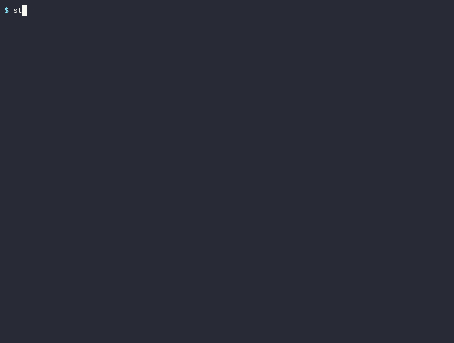
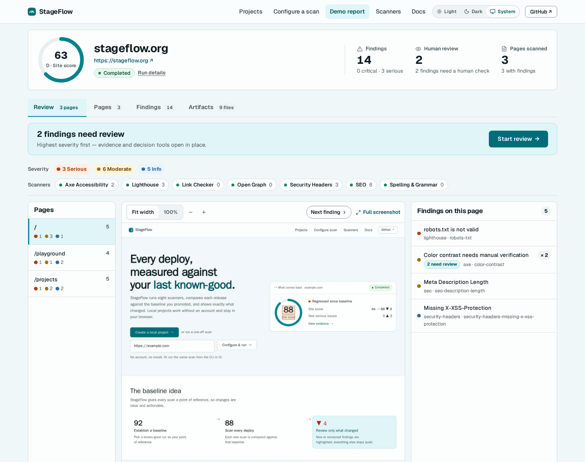
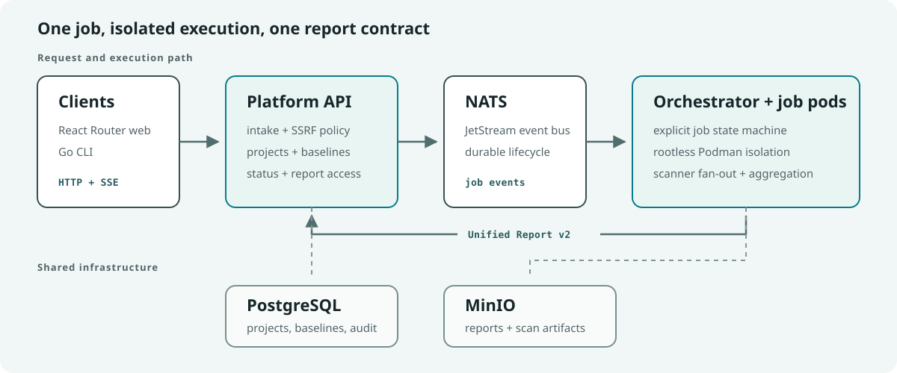

# StageFlow

[](https://github.com/mattboback/stageflow/actions/workflows/ci.yml)
[](LICENSE)

StageFlow is a self-hostable **frontend quality platform**. It ships eight
built-in scanners — accessibility, performance, SEO, links, security headers,
social metadata, content quality, and agent-driven navigation — behind a single
report contract, and remembers a **baseline per project** so every scan can
answer the question that matters in CI: _did this change make the frontend
worse?_

**▶ Live demo: [stageflow.org](https://stageflow.org)** — scan any public URL and
explore a real, interactive report in the browser. No StageFlow account is
required on the demo; uploads and generated artifacts expire after 24 hours.

Reviewing this codebase? The [code tour](docs/code-tour.md) maps contracts, SSRF guards, the job state machine, and the test strategy into a 5–15 minute path.

## Try It in 60 Seconds

The CLI is a single Go binary that submits scans to any StageFlow API and
streams live results to your terminal. Point it at the hosted demo — nothing to
deploy:

```bash
export PATH="$HOME/.local/bin:$PATH"
just cli-install          # or download a binary from GitHub Releases
stageflow scan https://example.com --api https://stageflow.org
```

Prefer a browser? Submit the same scan at [stageflow.org](https://stageflow.org)
and watch it stream live.

Common CLI workflows:

```bash
# Choose scanners and return JSON for automation.
stageflow scan https://example.com --scanner axe,seo --format json --api https://stageflow.org

# Fail the command (exit 1) when serious-or-worse issues are found — a CI gate.
stageflow scan https://example.com --fail-on serious --api https://stageflow.org

# Scan several routes in one job.
stageflow scan https://example.com https://example.com/about --format markdown --api https://stageflow.org

# Scan a local build before it ships anywhere: the directory is zipped,
# uploaded, and served by the platform — no dev server or public URL needed.
stageflow scan ./dist --api https://stageflow.org
```



Exit codes are machine-readable: `0` clean, `1` threshold tripped, `2` CLI/API error. Release binaries are on [GitHub Releases](https://github.com/mattboback/stageflow/releases); see the [CLI guide](docs/cli.md) for workflows and the [generated reference](docs/reference/cli/stageflow/stageflow.md) for exact flags.

## The Report

Every scan — CLI or browser — produces one unified report built for triage. Use
Review for page screenshots, overlays, and human decisions; Findings for
searchable issues grouped by scanner and rule; and Artifacts for owned HTML and
JSON report downloads.



When a scanner supplies element-location evidence, StageFlow overlays the
finding on a full-page screenshot. Select a bounding box in Review to open that
finding's guidance, references, and evidence. Page-level and manual-review
findings remain available for triage even when no visual overlay exists.

The report shape is a versioned contract. To see it without running a scan,
open the committed fixture
[`libs/contracts/report/fixtures/unified-report.v2.all-scans.json`](libs/contracts/report/fixtures/unified-report.v2.all-scans.json)
— a full multi-scanner report validated against the v2 schema.

## Regression Memory: The Headline Capability

Register a project once, promote a known-good scan as its baseline, and every
later scan diffs against it — new issues or a tripped severity gate exit
non-zero, so it drops straight into CI:

```bash
stageflow project create marketing-site --url https://example.com --scanner axe --scanner seo
stageflow project scan marketing-site --format json     # streams live, then diffs vs. baseline
stageflow project promote marketing-site --job-id <id>  # accept a run as the new reference
```

The full lifecycle, a CI gate snippet, and auth details are in the [CLI guide](docs/cli.md#projects-and-baselines).

Prefer the browser? The `/projects` workspace keeps named projects, completed
runs, and manually promoted baselines in your browser's IndexedDB. It requires
no StageFlow account and performs no cloud sync; clearing site data removes that
local project history.

## Going Deeper

- **CLI workflows** — one-off scans, local dev loops, registered projects, baselines, and CI gates: [docs/cli.md](docs/cli.md).
- **Architecture** — clients → Platform API → NATS JetStream → Orchestrator →
  per-job rootless Podman pods, with SSRF and ZIP-bomb guards at the trust
  boundaries: [docs/architecture.md](docs/architecture.md).
- **Self-hosting** — local modes, public edge guidance, and the hosted-demo boundary: [docs/self-hosting.md](docs/self-hosting.md).
- **Product & design rationale** — who the platform serves and why the report
  UI looks the way it does: [docs/product.md](docs/product.md) and
  [docs/design.md](docs/design.md).
- **Documentation assets** — reproduce the Review screenshot and social card
  from committed local inputs: [docs/images/README.md](docs/images/README.md).
- **Engineering case study** — the major architecture, security, contract, and
  delivery tradeoffs, with links to inspectable evidence: [docs/case-study.md](docs/case-study.md).



## Engineering Evidence

| Signal                               | Repository evidence                                                                      |
| ------------------------------------ | ---------------------------------------------------------------------------------------- |
| End-to-end regression proof          | [Golden Regression workflow](.github/workflows/golden-regression.yml)                    |
| Schema-first Go/TypeScript contracts | [Contract fixture](libs/contracts/report/fixtures/unified-report.v2.all-scans.json)      |
| Explicit trust boundaries            | [Security model](docs/architecture.md#security-model) and [security policy](SECURITY.md) |
| Broad automated quality gate         | [CI workflow](.github/workflows/ci.yml) and `just ci`                                    |
| Reviewer-oriented source path        | [Five-to-fifteen-minute code tour](docs/code-tour.md)                                    |

## Self-Host Locally

With Go 1.26.5, Node.js 22, Bun 1.3.8, Podman Compose, and `just` installed:

```bash
cp .env.example .env
just diagnose
just demo
```

The web UI starts at `http://localhost:3000`, the API at `http://localhost:8080`, and Grafana at `http://localhost:3001`. See [Self-hosting](docs/self-hosting.md) for private-target development, manual lifecycle commands, public edge guidance, and required hardening.

## What StageFlow Runs

Built-in scanners:

- `axe` for accessibility
- `lighthouse` for performance, best-practices, and PWA signals
- `seo` for title, metadata, heading, and structured-data checks
- `security-headers` for common HTTP response-header policy
- `link-checker` for internal and external link health
- `open-graph` for social preview metadata
- `spelling-grammar` for content quality
- `ai-navigator` for natural-language navigation objectives through an LLM

Scanner enablement and resource overrides are configured through
[infra/scanners/scanners.example.yaml](infra/scanners/scanners.example.yaml).
The local example enables a smaller default set for resource use; request or
enable additional scanners when you need them. The AI Navigator is optional and
requires `OPENROUTER_API_KEY` when enabled.

## Repository Map

| Path                         | Purpose                                                                        |
| ---------------------------- | ------------------------------------------------------------------------------ |
| `clients/cli`                | Go CLI for scans, the dev loop, baselines, reports, and docs generation        |
| `clients/web`                | React Router/Vite app for hosted/local browser workflows                       |
| `services/platform-api`      | Public HTTP API, auth, CORS, URL/ZIP intake, SSE, projects, reports            |
| `services/orchestrator`      | Job state machine, Podman pod lifecycle, aggregation, persistence              |
| `services/archive-extractor` | Safe ZIP extraction and static serving inside job pods                         |
| `services/scanner-runner`    | Bun/TypeScript Playwright scanner runtime                                      |
| `libs/contracts`             | JSON Schema contracts; Go/TypeScript types are generated during setup/CI       |
| `infra`                      | Compose, Caddy, MinIO, Grafana, scanner, and security examples                 |
| `docs`                       | Canonical architecture, CLI, self-hosting, design, and reference documentation |

## Development

Install dependencies and local config:

```bash
just setup
```

From a fresh checkout, run `just setup` or `just generate-contracts` before
running focused Go or TypeScript build commands directly; generated contract
code is intentionally ignored.

Run the repository quality gate:

```bash
just ci
```

Pre-commit hooks are a fast local guard for common mistakes before a commit.
`just ci` is the full repo quality gate and is the command to use before
opening a PR or handing work to CI.

Useful focused checks:

```bash
just shell-tests
(cd clients/web && bun run ci)
(cd services/scanner-runner && bun run ci)
just dead-code
just project-golden
```

See [CONTRIBUTING.md](CONTRIBUTING.md) for pull request expectations and
workspace-specific validation commands.

Committed screenshots and reviewer-facing images live under `docs/images`.
Temporary QA/build evidence belongs under ignored artifact, output, or cache
paths such as `artifacts/`, `output/`, and `.cache/`; `just clean` may remove
those ephemeral files.

## Security

StageFlow scans websites and can run browser automation, so deployment
boundaries matter. Public deployments should keep API authentication enabled,
avoid private-target scans unless explicitly intended, isolate scanner pods, and
use environment-specific credentials.

Report vulnerabilities privately through [SECURITY.md](SECURITY.md). Do not
open public issues for vulnerabilities. Before using the hosted demo, review
its [data handling and 24-hour retention policy](docs/privacy.md).

## License

StageFlow is released under the [MIT License](LICENSE).
