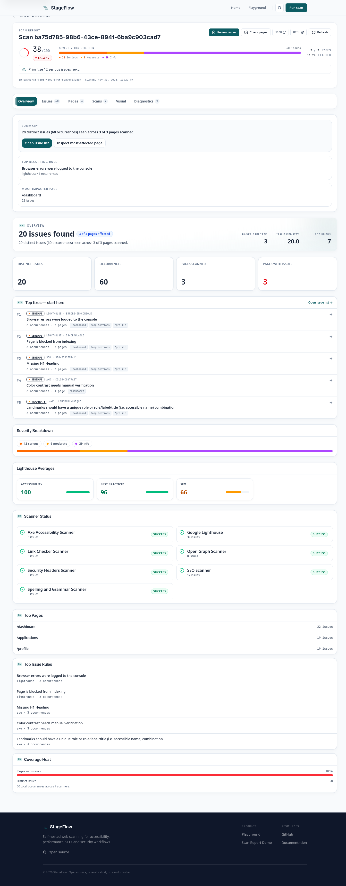
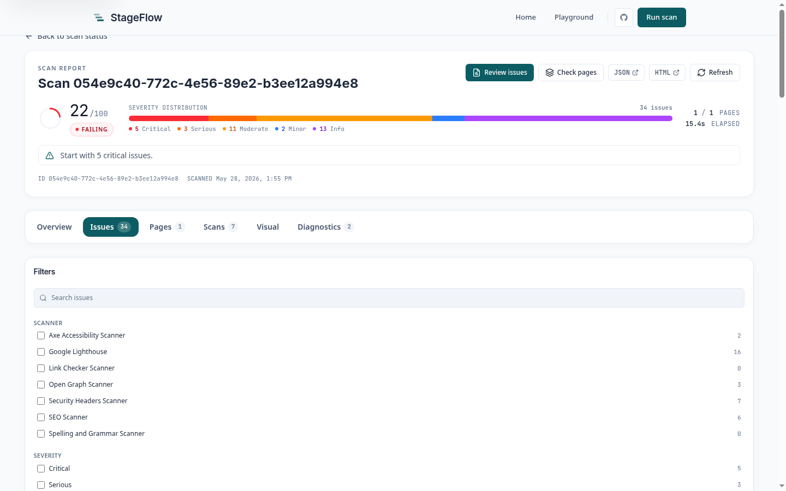

# StageFlow

[](https://github.com/mattboback/stageflow/actions/workflows/ci.yml)
[](LICENSE)

StageFlow is a self-hostable **frontend quality platform**. It runs eight
scanners — accessibility, performance, SEO, links, security headers, social
metadata, content quality, and agent-driven navigation — as one pipeline behind
a single report contract, and remembers a **baseline per project** so every scan
can answer the question that matters in CI: *did this change make the frontend
worse?*

There are three ways to use the platform, all backed by the same API:

- **CLI** — a single Go binary that submits scans to any StageFlow API and
  streams live results to your terminal or CI, with machine-readable exit codes.
- **Remote projects** — named projects with promoted baselines and regression
  diffing, created and driven entirely from the CLI against a local or hosted
  API. See [docs/remote.md](docs/remote.md).
- **Hosted + self-host** — a browser report UI at `stageflow.org`, or the
  identical Podman stack run yourself.

The CLI is a thin client over an HTTP + SSE API: the same binary scans a one-off
URL, drives a registered project, and gates CI on regressions.



## Start With the CLI

Use the CLI when you want a terminal-friendly scan result, JSON for automation,
or a CI gate based on issue severity.

Download a release asset from
[GitHub Releases](https://github.com/mattboback/stageflow/releases), or build
from source. To build from source, ensure `~/.local/bin` is on your `PATH` (or
export it for the current session), then install:

```bash
export PATH="$HOME/.local/bin:$PATH"
just cli-install
stageflow version
```

`just cli-install` installs to `~/.local/bin` by default and verifies that the
`stageflow` command on `PATH` resolves to that binary. If your shell finds a
different `stageflow`, put `~/.local/bin` earlier on `PATH` and rerun the
install. See [docs/operations/devtools.md](docs/operations/devtools.md) for
details.

Run a hosted scan:

```bash
stageflow scan https://example.com --api https://stageflow.org
```

Common CLI workflows:

```bash
# Choose scanners and return JSON for automation.
stageflow scan https://example.com --scanners axe,seo --format json --api https://stageflow.org

# Fail the command when serious-or-worse issues are found.
stageflow scan https://example.com --fail-on serious --api https://stageflow.org

# Scan several routes in one job.
stageflow scan https://example.com https://example.com/about \
  --format markdown \
  --api https://stageflow.org

# Scan a local dev server through a local StageFlow API.
stageflow scan http://127.0.0.1:5173 --allow-private-targets
```

Exit codes are intentionally machine-readable:

| Exit code | Meaning                                                             |
| --------- | ------------------------------------------------------------------- |
| `0`       | Scan completed and no displayed issue met the `--fail-on` threshold |
| `1`       | Scan completed and at least one displayed issue met the threshold   |
| `2`       | CLI or API error                                                    |

For the full command reference, see [clients/cli/README.md](clients/cli/README.md)
and [docs/reference/cli/stageflow](docs/reference/cli/stageflow).

## Hosted StageFlow

The hosted `stageflow.org` service runs the same application code as this repo
and is the fastest way to try StageFlow without operating the stack. Use it from
the CLI with `--api https://stageflow.org`, or use the browser UI for scan
submission, live status, and report review.

The report UI is built for triage:

- score and severity distribution at a glance
- issue grouping by scanner/rule
- page screenshots and occurrence evidence
- remediation details for engineers
- downloads for JSON and HTML report artifacts



Hosted production deployment, monitoring, rollback, and VPS control-plane
automation are intentionally managed outside this public repository. This repo
contains the application source, local development stack, and self-hosting
examples.

## Remote Projects & Regression Memory

The platform's headline capability: register a project once, promote a baseline,
and let every later scan tell you whether the frontend regressed — all from the
CLI, against a local stack or hosted `stageflow.org`.

```bash
# Register a project (URLs + scanners) on a StageFlow API.
stageflow project create marketing-site \
  --url https://example.com --scanner axe --scanner seo

# Scan it; streams live, then diffs against the promoted baseline.
stageflow scan --project marketing-site --format json

# Accept a known-good run as the reference point.
stageflow project promote marketing-site --job-id <job-id>
```

A project scan exits non-zero when new issues appear or the severity gate trips,
so it drops straight into CI. The full lifecycle, a CI gate snippet, and auth
details are in [docs/remote.md](docs/remote.md).

## Project Mode (local dev loop)

Project Mode turns the CLI into a repeatable local regression loop. It can start
your dev server, wait for readiness, run a scan, stream progress, stop the
server, and emit JSON that agents or CI jobs can parse.

```bash
stageflow project init
stageflow project doctor
stageflow project --format json
```

When a repo's `.stageflow/config.yaml` declares a hosted project slug, run the
hosted baseline/diff loop from the same repo without starting a dev server:

```bash
stageflow project hosted --format json
```

See [docs/PROJECT_MODE.md](docs/PROJECT_MODE.md) for the config reference and
[docs/remote.md](docs/remote.md) for the remote project workflow.

## Self-Host Locally

The local stack uses Podman, NATS JetStream, PostgreSQL, MinIO, the Go Platform
API and Orchestrator, the TypeScript scanner runner, and the SvelteKit web app.

Prerequisites:

- Go `1.26.4` or newer in the `1.26` line
- Node.js `22.x`
- Bun `1.3.8` or newer
- Podman with Compose support
- `just`

Run the fastest local smoke test:

```bash
cp .env.example .env
just diagnose
just demo
```

`just demo` uses an isolated local compose project and Podman network by
default (`stageflow_dev` / `stageflow_dev_net`). Set `COMPOSE_PROJECT_NAME` or
`STAGEFLOW_NETWORK_NAME` when you intentionally want a different local stack
identity.

When the demo is ready:

- Web UI: `http://localhost:3000`
- API: `http://localhost:8080`
- Grafana: `http://localhost:3001`

Manual stack commands are available when you want more control:

```bash
just setup
just images
just dev up
just dev init
just dev logs
```

Before exposing StageFlow on a public domain, replace every `change-me` value
in `.env`, set explicit CORS origins, keep API authentication enabled, and
review [docs/reference/configuration.md](docs/reference/configuration.md) and
[infra/security/egress-policy.example.md](infra/security/egress-policy.example.md).

## What StageFlow Runs

Built-in scanners:

- `axe` for accessibility
- `lighthouse` for performance, best-practices, and PWA signals
- `seo` for title, metadata, heading, and structured-data checks
- `security-headers` for common HTTP response-header policy
- `link-checker` for internal and external link health
- `open-graph` for social preview metadata
- `spelling-grammar` for content quality
- `ai-navigator` for natural-language navigation objectives through an LLM

Scanner enablement and resource overrides are configured through
[infra/scanners/scanners.example.yaml](infra/scanners/scanners.example.yaml).
The AI Navigator is optional and requires `OPENROUTER_API_KEY` when enabled.

## Repository Map

| Path                         | Purpose                                                                  |
| ---------------------------- | ------------------------------------------------------------------------ |
| `clients/cli`                | Go CLI for scans, Project Mode, baselines, reports, and docs generation  |
| `clients/web`                | SvelteKit app for hosted/local browser workflows                         |
| `services/platform-api`      | Public HTTP API, auth, CORS, URL/ZIP intake, SSE, projects, reports      |
| `services/orchestrator`      | Job state machine, Podman pod lifecycle, aggregation, persistence        |
| `services/archive-extractor` | Safe ZIP extraction and static serving inside job pods                   |
| `services/scanner-runner`    | Bun/TypeScript Playwright scanner runtime                                |
| `libs/contracts`             | JSON Schema contracts and generated Go/TypeScript types                  |
| `infra`                      | Compose, Caddy, MinIO, Grafana, scanner, and security examples           |
| `docs`                       | Architecture, remote projects, Project Mode, configuration, and CLI reference |

For the system architecture and trust boundaries, start with
[ARCHITECTURE.md](ARCHITECTURE.md), then read
[docs/architecture/system.md](docs/architecture/system.md).

## Development

Install dependencies and local config:

```bash
just setup
```

Run the repository quality gate:

```bash
just ci
```

Useful focused checks:

```bash
just shell-tests
just storybook-test
just dead-code
just project-golden
```

See [CONTRIBUTING.md](CONTRIBUTING.md) for pull request expectations and
workspace-specific validation commands.

## Security

StageFlow scans websites and can run browser automation, so deployment
boundaries matter. Public deployments should keep API authentication enabled,
avoid private-target scans unless explicitly intended, isolate scanner pods, and
use environment-specific credentials.

Report vulnerabilities privately through [SECURITY.md](SECURITY.md). Do not
open public issues for vulnerabilities.

## License

StageFlow is released under the [MIT License](LICENSE).
