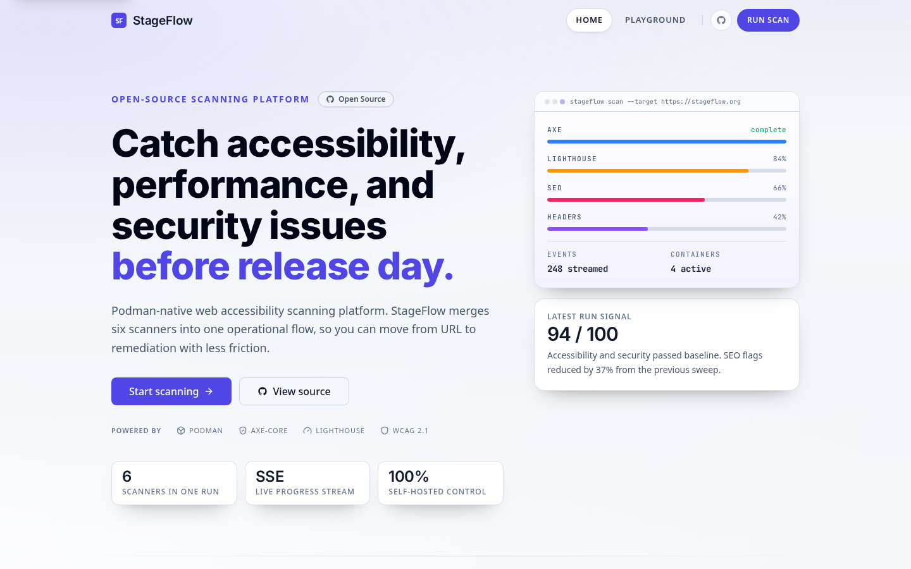
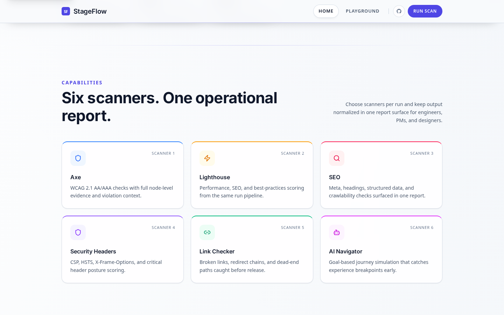
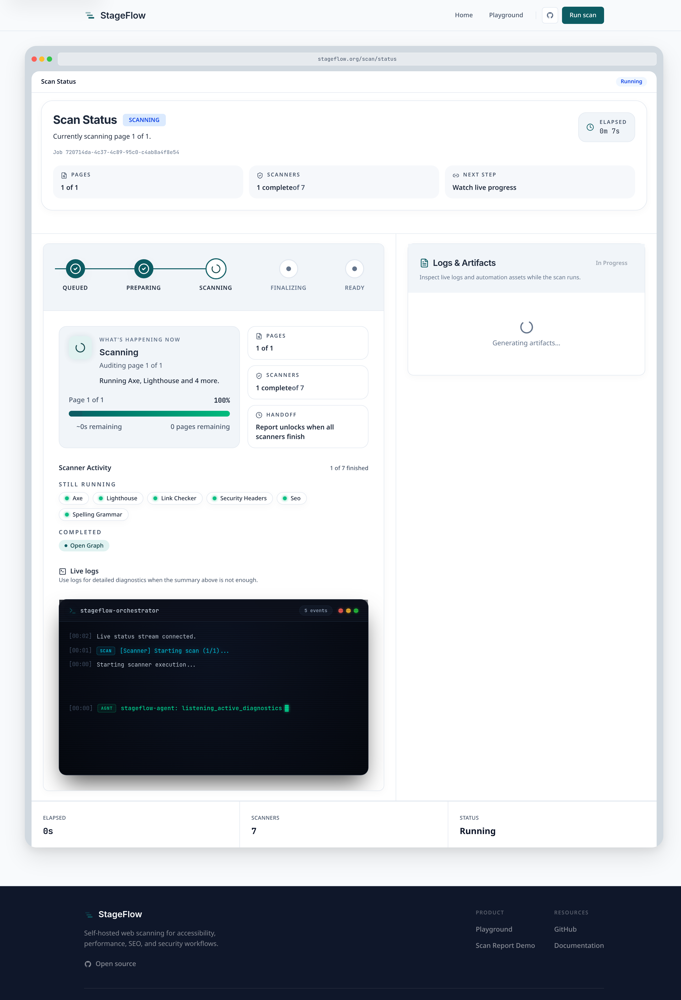
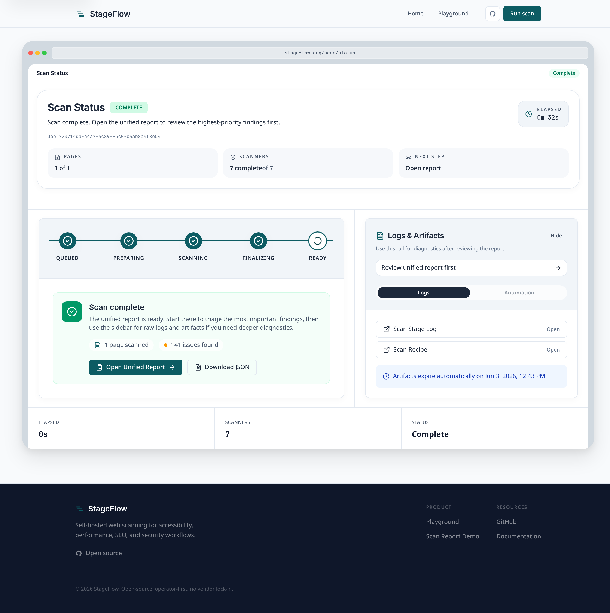
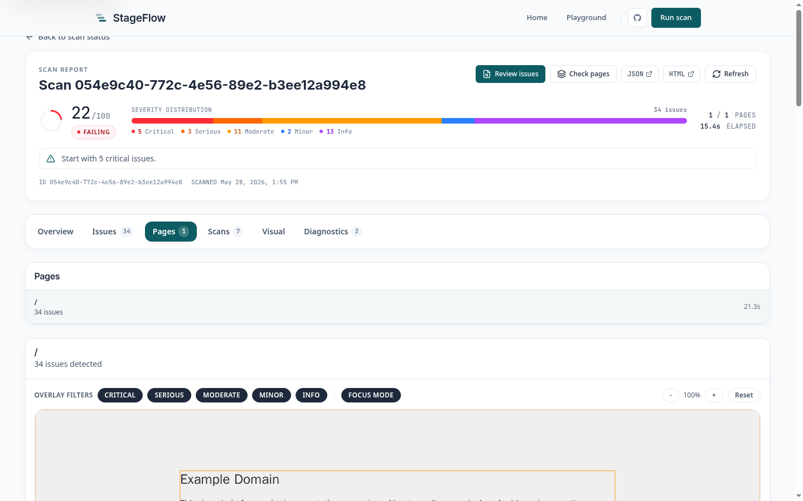
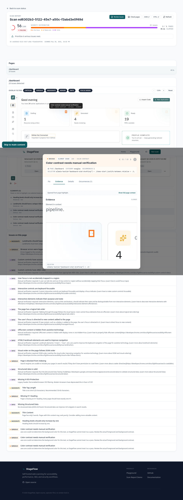
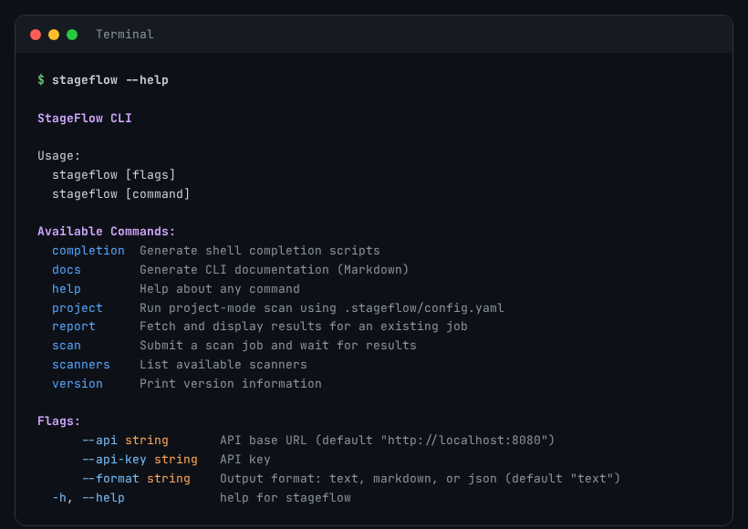
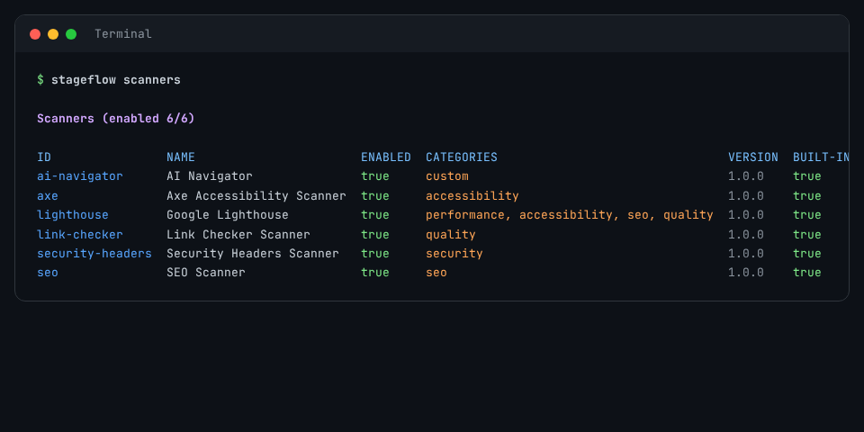

# StageFlow

[](https://github.com/mattboback/stageflow/actions/workflows/ci.yml)
[](LICENSE)

**Live demo:** [stageflow.org](https://stageflow.org) | **Run locally:** `cp .env.example .env && just diagnose && just demo`

Podman-native web accessibility and quality scanning platform.

StageFlow runs multi-scanner audits against live URLs or static-site ZIP archives, streams job progress in real time, and merges heterogeneous scanner outputs into one normalized report. Everything needed to run StageFlow is in this repo — the hosted demo and a self-hosted instance use identical code.



## Engineering highlights

- Multi-service Go/TypeScript architecture coordinated through NATS JetStream
- Real-time SSE streaming from orchestrator through API to browser and CLI
- Per-job Podman pod isolation for scanner execution
- Contract-driven report normalization across 8 heterogeneous scanners
- Dual-surface API: same backend drives both a SvelteKit web UI and a Go CLI

## Architecture at a glance

```text
Client/UI -> Platform API -> NATS JetStream -> Orchestrator -> Podman job pod
                                                     |            |- Extractor (ZIP jobs)
                                                     |            `- Scanner runners
                                                     `-> Status + artifacts -> MinIO -> unified report
```

- `services/platform-api` — intake validation, SSRF guardrails, SSE streaming, scan/report APIs
- `services/orchestrator` — job state machine, Podman pod lifecycle, report aggregation
- `services/scanner-runner` — scanner plugin runtime, Playwright-based browser execution
- `clients/web` — SvelteKit web app with live status, report views, and submission workflows
- `clients/cli` — Go CLI with streaming progress, Project Mode, and structured JSON output

For the full system design, see [docs/architecture/system.md](docs/architecture/system.md).

## Repo map

| Directory                 | Contents                                       |
| ------------------------- | ---------------------------------------------- |
| `clients/web`             | SvelteKit web app                              |
| `clients/cli`             | `stageflow` CLI                                |
| `services/platform-api`   | Intake API, SSE stream, report APIs            |
| `services/orchestrator`   | Job FSM and scanner orchestration              |
| `services/scanner-runner` | Scanner Runner and Playwright-based execution  |
| `libs/contracts`          | Shared schemas and generated contracts         |
| `devtools`                | Internal ops and QA helpers                    |
| `qa`                      | End-to-end and verification assets             |

## Screenshots

### Scanner selection



### Live scan execution

<table>
  <tr>
    <td></td>
    <td></td>
  </tr>
  <tr>
    <td align="center"><em>Live progress stream during execution</em></td>
    <td align="center"><em>Completed scan with report and artifact links</em></td>
  </tr>
</table>

### Unified report

<table>
  <tr>
    <td></td>
    <td></td>
  </tr>
  <tr>
    <td align="center"><em>Overview with severity, scores, and scanner status</em></td>
    <td align="center"><em>Issues tab with grouped findings and remediation detail</em></td>
  </tr>
</table>

### Page-level evidence

<table>
  <tr>
    <td></td>
    <td></td>
  </tr>
  <tr>
    <td align="center"><em>Annotated screenshots for page-level evidence</em></td>
    <td align="center"><em>Issue detail with evidence crop and fix guidance</em></td>
  </tr>
</table>

## CLI

The `stageflow` CLI submits scan jobs, streams live progress, and renders unified reports in text, markdown, or JSON. See the [CLI README](clients/cli/README.md) for the full reference.

<table>
  <tr>
    <td></td>
    <td></td>
  </tr>
  <tr>
    <td align="center"><em>CLI command surface</em></td>
    <td align="center"><em>Scanner discovery from the terminal</em></td>
  </tr>
</table>

```bash
stageflow scan https://example.com
stageflow scan https://example.com --api https://stageflow.org
stageflow scan https://example.com --scanners axe,seo --format json
stageflow scan https://example.com --fail-on serious   # exit 1 on regressions
```

## Built-in scanners

| Scanner            | Categories                               | Focus                                                                     |
| ------------------ | ---------------------------------------- | ------------------------------------------------------------------------- |
| `axe`              | accessibility                            | WCAG violations — landmarks, ARIA, color contrast, alt text, keyboard nav |
| `lighthouse`       | performance, accessibility, seo, quality | Google Lighthouse audits — Core Web Vitals, best practices, scores        |
| `seo`              | seo                                      | Meta tags, canonical URLs, structured data, content depth, title length   |
| `security-headers` | security                                 | HTTP header posture — CSP, HSTS, X-Frame-Options, Permissions-Policy      |
| `link-checker`     | quality                                  | Broken links, redirect chains, link quality                               |
| `open-graph`       | seo                                      | Open Graph and Twitter Card metadata validation                           |
| `spelling-grammar` | quality                                  | AI-assisted spelling and grammar analysis                                 |
| `ai-navigator`     | custom                                   | LLM-powered Playwright agent — goal-driven browser flow evaluation        |

## Quick start

### Prerequisites

- [Go 1.26.1](https://go.dev/dl/)
- [Bun](https://bun.sh/)
- [Podman](https://podman.io/) with `podman compose`
- [just](https://github.com/casey/just)
- [golangci-lint v2](https://golangci-lint.run/)

### Fastest local smoke test

```bash
git clone https://github.com/mattboback/stageflow.git
cd stageflow
cp .env.example .env

just diagnose
just demo
```

`just demo` runs the local prerequisite checks, builds the images, restarts the stack, waits for the health endpoints, initializes MinIO, and prints the next scan commands.

### Manual bootstrap

```bash
just setup
just images
just dev up
just dev init
```

| Service                | `dev` mode (default)    | `local` overlay mode    |
| ---------------------- | ----------------------- | ----------------------- |
| Web App                | `http://localhost:3000` | `http://localhost:3010` |
| Platform API           | `http://localhost:8080` | `http://localhost:8080` |
| Orchestrator Admin API | `http://localhost:8081` | `http://localhost:8081` |

### Run a first scan

```bash
just cli-install
stageflow scan https://example.com
```

To scan `localhost` or private targets, use the local overlay: `just setup && just images && just dev up local && just dev init local`.

This repo already includes a working `.stageflow/config.yaml`, so after the local overlay is up you can dogfood StageFlow against `clients/web` with `stageflow project doctor .` and `stageflow project .`.

### Validation

```bash
just ci              # full quality gate (Go + web app + Storybook + Scanner Runner)
just storybook-test  # Storybook interaction + accessibility tests
just shell-tests     # shell regression tests
just project-golden  # baseline -> promote -> regression -> diff against the local overlay
```

## Built for evaluation

StageFlow is a portfolio project built to demonstrate a broad surface of backend, web app, infrastructure, and developer tooling work.

- **Distributed system design** — multi-service Go/TypeScript architecture coordinated through NATS JetStream, with explicit service boundaries, a documented job FSM, and Podman pod isolation.
- **Contract-driven development** — JSON Schema as the single source of truth for the report format, with generated TypeScript and Go types used by all consumers.
- **Testing at every layer** — Go race tests and `golangci-lint` across modules; Vitest unit tests; Storybook interaction and axe-based accessibility tests; orchestrator E2E with a mock Podman adapter; and a golden shell test for the full project scan → baseline → diff pipeline.
- **Developer experience** — a Go CLI with streaming SSE, Project Mode, JSON output, and `--fail-on` severity gating; a `just`-based task runner; pre-commit hooks; and generated CLI reference docs that stay in sync with the code.
- **Security and operational discipline** — SSRF guardrails, archive extraction limits, API key middleware, `govulncheck` in CI, and clear separation of credentials per environment.

See the [Evaluator guide](docs/evaluators-guide.md) for a structured path through the codebase aimed at reviewers and hiring managers.

## Docs

- [Architecture deep-dive](docs/architecture/system.md)
- [Configuration reference](docs/reference/configuration.md)
- [CLI README](clients/cli/README.md)

## License

[MIT](LICENSE)
