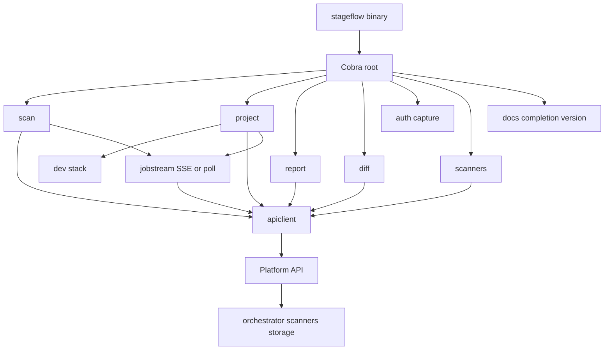
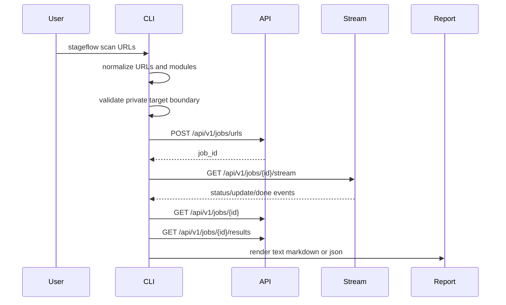
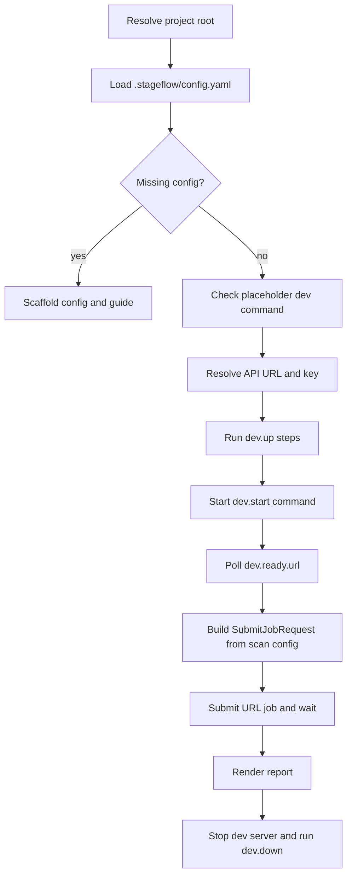

# StageFlow CLI Repo Map

This map documents the `clients/cli` Go module as of 2026-05-30. Source citations use `path:line` from `nl -ba`; upstream library notes were checked against official docs where local code depends on Cobra/pflag or HTTP/SSE behavior.

## Runtime Responsibility

`clients/cli` is the terminal front end for StageFlow. It owns command parsing, local/project-mode orchestration, API requests, job waiting, report/diff/scanner rendering, shell completion, generated command docs, and CLI install/version metadata. It does not own scanner execution, report generation, project persistence, NATS, MinIO, or Platform API authorization; those sit behind HTTP endpoints and shared contracts.

| Boundary | Owned here | Outside this slice | Evidence |
| --- | --- | --- | --- |
| Process entry | `main` calls `run(os.Args, os.Getenv, os.Stdout, os.Stderr)` and exits with its return code | Shell, PATH, OS process table | `clients/cli/main.go:7`, `clients/cli/run.go:12` |
| Command tree | Cobra root, persistent options, subcommands | Cobra framework implementation | `clients/cli/cobra_root.go:16`, `clients/cli/cobra_root.go:56` |
| Network client | URL resolution, JSON request/response helpers, `X-Api-Key` header | Platform API behavior and storage redirects | `clients/cli/internal/apiclient/client.go:21`, `clients/cli/internal/apiclient/client.go:47` |
| URL scans | Submit URL job, wait, fetch report, render | Job scheduling, scanner pods, artifact creation | `clients/cli/scan_job.go:140`, `services/platform-api/internal/api/handlers_jobs_url_submit.go:77` |
| Project Mode | Read `.stageflow/config.yaml`, start dev command, readiness poll, scan, cleanup | User repo's dev server and commands | `clients/cli/project_run.go:152`, `clients/cli/dev_stack.go:46` |
| Hosted project commands | CRUD, project scan, baseline promotion, job diff fetch | Project store and baseline validation | `clients/cli/cobra_project_remote.go:14`, `services/platform-api/internal/api/handlers_projects.go:35` |
| SSE stream | Client-side stream parsing and fallback to polling | Server stream production and event source | `clients/cli/internal/jobstream/sse.go:55`, `services/platform-api/internal/api/router.go:23` |
| Reports and diffs | CLI envelopes and text/Markdown/JSON rendering | Contract-generated report types and shared diff computation | `clients/cli/report_output.go:155`, `clients/cli/internal/diffrender/diffrender.go:17`, `libs/go/diff/diff.go:38` |
| Auth intake | Local storage-state capture, local recipe validation, request shaping | API-side auth validation/storage and scanner credential resolution | `clients/cli/cobra_auth.go:1`, `clients/cli/auth_intake.go:1`, `services/platform-api/internal/api/handlers_jobs_url_submit.go:49` |



## Source Map

| Path | Role | Key facts |
| --- | --- | --- |
| `clients/cli/main.go` | Binary entry | Exits with `run(...)` result. `clients/cli/main.go:7` |
| `clients/cli/run.go` | Testable command runner and exit-code adapter | Defaults errors to code 2, preserves `exitCodeError.Code`, prints non-nil errors to stderr. `clients/cli/run.go:12`, `clients/cli/run.go:16` |
| `clients/cli/cobra_root.go` | Root command and global options | Initializes env-backed API defaults, validates output format before commands, registers subcommands. `clients/cli/cobra_root.go:16`, `clients/cli/cobra_root.go:27`, `clients/cli/cobra_root.go:40`, `clients/cli/cobra_root.go:56` |
| `clients/cli/output_format.go` | Output format normalization | Supports `text`, `markdown`, `json`; deprecated `--json` wins. `clients/cli/output_format.go:16`, `clients/cli/output_format.go:27` |
| `clients/cli/constants.go` | Shared defaults | Done/failed states, default scanners `axe,lighthouse,seo,link-checker`, report limits. `clients/cli/constants.go:3` |
| `clients/cli/cobra_scan.go` | URL scan command | Handles direct URL scans, project scan delegation, auth flags, scanner parsing, private-target handling. `clients/cli/cobra_scan.go:14`, `clients/cli/cobra_scan.go:32`, `clients/cli/cobra_scan.go:123` |
| `clients/cli/scan_job.go` | Job submit, wait, remote project scan, project diff state | Posts to `/api/v1/jobs/urls`, waits for terminal state, fetches report, handles project diff fallbacks. `clients/cli/scan_job.go:55`, `clients/cli/scan_job.go:91`, `clients/cli/scan_job.go:140`, `clients/cli/scan_job.go:191` |
| `clients/cli/scan_output.go` | JSON project scan envelope | Emits `stageflow-cli/project-scan@v1` with project, decision, report, optional diff. `clients/cli/scan_output.go:14`, `clients/cli/scan_output.go:52` |
| `clients/cli/cobra_project.go` | Project command tree | Defines `project`, `init`, `doctor`, `hosted`, and remote project subcommands. `clients/cli/cobra_project.go:9`, `clients/cli/cobra_project.go:82` |
| `clients/cli/project_config.go` | `.stageflow/config.yaml` schema, loader, validation, scaffold | Uses YAML known fields, validates version, URLs, dev command/readiness, optional remote API URL. `clients/cli/project_config.go:18`, `clients/cli/project_config.go:75`, `clients/cli/project_config.go:117`, `clients/cli/project_config.go:206` |
| `clients/cli/project_init.go` | Project bootstrap command | Creates `.stageflow/config.yaml` and `.stageflow/README.md`, JSON envelope for automation, flag-changed helper. `clients/cli/project_init.go:25`, `clients/cli/project_init.go:50`, `clients/cli/project_init.go:145`, `clients/cli/project_init.go:168` |
| `clients/cli/project_run.go` | Local project scan lifecycle | Resolves config/env/flag precedence, starts dev stack, runs scan, renders report. `clients/cli/project_run.go:18`, `clients/cli/project_run.go:54`, `clients/cli/project_run.go:89`, `clients/cli/project_run.go:152` |
| `clients/cli/dev_stack.go` | Dev process management | Runs setup commands, starts dev server, polls readiness URL, stops process group with configured/default signal. `clients/cli/dev_stack.go:23`, `clients/cli/dev_stack.go:46`, `clients/cli/dev_stack.go:94`, `clients/cli/dev_stack.go:168` |
| `clients/cli/project_doctor.go` | Project doctor | Produces text or `stageflow-cli/project-doctor@v1`, can skip dev readiness, exposes hosted memory commands. `clients/cli/project_doctor.go:17`, `clients/cli/project_doctor.go:43`, `clients/cli/project_doctor.go:79`, `clients/cli/project_doctor.go:172` |
| `clients/cli/project_hosted.go` | Hosted project scan from local config | Requires `stageflow.remote_project`, prefers `remote_api_url` when `--api` is not explicit, delegates to remote project scan. `clients/cli/project_hosted.go:13`, `clients/cli/project_hosted.go:60`, `clients/cli/project_hosted.go:85` |
| `clients/cli/cobra_project_remote.go` | Remote project CRUD and promote | Create/list/show/delete/promote commands and text/JSON project output. `clients/cli/cobra_project_remote.go:14`, `clients/cli/cobra_project_remote.go:25`, `clients/cli/cobra_project_remote.go:157`, `clients/cli/cobra_project_remote.go:186` |
| `clients/cli/cobra_project_update.go` | Remote project update | Uses pflag `Changed` to send only supplied fields. `clients/cli/cobra_project_update.go:11`, `clients/cli/cobra_project_update.go:26` |
| `clients/cli/cobra_auth.go` | Auth capture command | Launches `npx playwright open --save-storage`, validates nonempty output, chmods captured state to 0600. `clients/cli/cobra_auth.go:31`, `clients/cli/cobra_auth.go:44`, `clients/cli/cobra_auth.go:112`, `clients/cli/cobra_auth.go:154` |
| `clients/cli/auth_intake.go` | Auth file intake | Caps storage-state files at 1 MiB, base64 encodes state, validates form recipes and `{from_env: NAME}`. `clients/cli/auth_intake.go:35`, `clients/cli/auth_intake.go:47`, `clients/cli/auth_intake.go:105`, `clients/cli/auth_intake.go:213` |
| `clients/cli/cobra_report.go` | Existing job report command | Fetches status, requires `DONE`, fetches results, renders report with report flags. `clients/cli/cobra_report.go:12`, `clients/cli/cobra_report.go:28`, `clients/cli/cobra_report.go:33`, `clients/cli/cobra_report.go:41` |
| `clients/cli/report_flags.go` | Shared report flags | Binds filtering, truncation, grouping, summary, and severity gate flags; hidden subset for scan. `clients/cli/report_flags.go:9`, `clients/cli/report_flags.go:32`, `clients/cli/report_flags.go:73` |
| `clients/cli/report_output.go` | Report fetch/render/envelope | Fetches `/jobs/{id}` and `/results`, filters/sorts issues, writes text/JSON/Markdown, applies `--fail-on`. `clients/cli/report_output.go:166`, `clients/cli/report_output.go:177`, `clients/cli/report_output.go:205`, `clients/cli/report_output.go:316` |
| `clients/cli/report_output_markdown.go` | Markdown report renderer | Writes summary, Lighthouse, scanners, pages, findings, artifacts, errors. `clients/cli/report_output_markdown.go:22`, `clients/cli/report_output_markdown.go:40` |
| `clients/cli/cobra_diff.go` | Diff command | Compares report envelopes or baseline versus live URL, gates on new/regression, renders in root format. `clients/cli/cobra_diff.go:81`, `clients/cli/cobra_diff.go:129`, `clients/cli/cobra_diff.go:182`, `clients/cli/cobra_diff.go:207` |
| `clients/cli/internal/diffrender/diffrender.go` | Diff envelope and rendering | Wraps `diff.Result`, detects remote URL targets, evaluates regression, writes JSON/text/Markdown. `clients/cli/internal/diffrender/diffrender.go:17`, `clients/cli/internal/diffrender/diffrender.go:57`, `clients/cli/internal/diffrender/diffrender.go:99`, `clients/cli/internal/diffrender/diffrender.go:129` |
| `clients/cli/cobra_scanners.go`, `scanners_output.go` | Scanner metadata command/rendering | GET `/api/v1/scanners`, render JSON/Markdown/text sorted by ID. `clients/cli/cobra_scanners.go:11`, `clients/cli/scanners_output.go:54`, `clients/cli/scanners_output.go:70` |
| `clients/cli/cobra_docs.go` | Generated CLI docs | Runs Cobra Markdown tree generation and removes Cobra footer lines. `clients/cli/cobra_docs.go:16`, `clients/cli/cobra_docs.go:35`, `clients/cli/cobra_docs.go:86` |
| `clients/cli/cobra_completion.go` | Shell completions | Supports bash, zsh, fish, PowerShell through Cobra generators. `clients/cli/cobra_completion.go:9`, `clients/cli/cobra_completion.go:20` |
| `clients/cli/cobra_version.go`, `version.go` | Version command and ldflags variables | Prints `version [commit] [date]`; build script populates vars. `clients/cli/cobra_version.go:9`, `clients/cli/version.go:5`, `devtools/scripts/install-cli.sh:17` |
| `clients/cli/internal/apiclient/*` | HTTP API client and DTOs | Builds URLs, closes bodies, JSON encodes/decodes, project endpoints, job/report/scanner/auth DTOs. `clients/cli/internal/apiclient/client.go:33`, `clients/cli/internal/apiclient/client.go:55`, `clients/cli/internal/apiclient/client_projects.go:23`, `clients/cli/internal/apiclient/types.go:8` |
| `clients/cli/internal/jobstream/sse.go` | SSE and polling wait logic | Tries SSE unless hidden `--no-stream`, falls back to poll on stream errors, parses `event:` and `data:` lines. `clients/cli/internal/jobstream/sse.go:55`, `clients/cli/internal/jobstream/sse.go:120`, `clients/cli/internal/jobstream/sse.go:166` |
| `clients/cli/internal/urlcheck/urlcheck.go` | URL and module validation | Normalizes bare hosts, rejects private targets against non-local APIs, detects private literal IPs. `clients/cli/internal/urlcheck/urlcheck.go:14`, `clients/cli/internal/urlcheck/urlcheck.go:36`, `clients/cli/internal/urlcheck/urlcheck.go:73` |
| `clients/cli/internal/projectmode/project_root.go` | Project root discovery | Resolves explicit path or current working directory to Git root when present. `clients/cli/internal/projectmode/project_root.go:10`, `clients/cli/internal/projectmode/project_root.go:51` |
| `clients/cli/internal/manifesttmpl/manifesttmpl.go` | Project Mode scaffold templates | Produces default config/guide and placeholder command. `clients/cli/internal/manifesttmpl/manifesttmpl.go:11`, `clients/cli/internal/manifesttmpl/manifesttmpl.go:31`, `clients/cli/internal/manifesttmpl/manifesttmpl.go:95` |

## Command Tree

Cobra is the command framework. Local dependency versions are Cobra `v1.10.2` and pflag `v1.0.9` in `clients/cli/go.mod:9` and `clients/cli/go.mod:19`. Cobra's documented model is a command tree whose `Execute` traverses args and runs the selected command; local code wires that via `ExecuteContext`. Persistent flags come from Cobra/pflag and are inherited by subcommands, while local flags are command-specific.

| Command | Responsibility | Important flags | Output | Exit behavior |
| --- | --- | --- | --- | --- |
| `stageflow` | Root help when no subcommand | `--api`, `--api-key`, `--format`, deprecated `--json` | Help | Root `RunE` calls help. `clients/cli/cobra_root.go:32` |
| `scan [url...]` | Submit URL job, wait, render report | `--scanners`, `--screenshot`, `--allow-private-targets`, `--timeout`, `--auth-state`, `--auth-recipe`, hidden `--no-stream`, report flags | Text/Markdown/JSON report | Code 1 if report fail gate trips; code 2 for validation/API. `clients/cli/cobra_scan.go:27`, `clients/cli/report_output.go:224` |
| `scan --project <slug>` | Remote project scan using Platform project config | `--project`, `--timeout`, hidden `--no-stream`, report flags | Text/Markdown report plus diff, or JSON project-scan envelope | Code 1 if severity gate or diff regression, code 2 on API/validation. `clients/cli/cobra_scan.go:33`, `clients/cli/scan_job.go:226` |
| `project [path]` | Local Project Mode lifecycle | `--timeout`, `--max-issues`, hidden `--no-stream` | Text/Markdown/JSON report | Bootstraps on missing config and exits 0; otherwise code 1 for report gate, 2 for errors. `clients/cli/project_run.go:173`, `clients/cli/project_run.go:233` |
| `project init [path]` | Scaffold config and guide | Root format only | Text or JSON `stageflow-cli/project-init@v1` | Code 2 for path/scaffold/format errors. `clients/cli/project_init.go:179`, `clients/cli/project_init.go:145` |
| `project doctor [path]` | Validate config, scan preflight, optional dev readiness | `--timeout`, `--skip-dev` | Text or JSON `stageflow-cli/project-doctor@v1` | Code 2 for failed checks or invalid config; skipped dev is pass. `clients/cli/project_doctor.go:172`, `clients/cli/project_doctor.go:237` |
| `project hosted [path]` | Read local config, scan configured hosted project | `--timeout`, hidden `--no-stream`, report flags | Same as `scan --project` | Requires `stageflow.remote_project`. `clients/cli/project_hosted.go:13`, `clients/cli/project_hosted.go:122` |
| `project create/list/show/update/delete/promote` | Hosted project CRUD and baseline memory | `--url`, `--scanner`, `--name`, `--job-id` as applicable | Text or JSON for read/create/update; text confirmations for delete/promote | Code 2 for validation/API. `clients/cli/cobra_project_remote.go:25`, `clients/cli/cobra_project_update.go:11` |
| `report <job-id>` | Fetch existing job status/results and render | Full report flags | Text/Markdown/JSON report | Requires job state `DONE`; failed or pending is code 2. `clients/cli/cobra_report.go:33` |
| `diff <baseline.json> <current.json | url>` | Compare reports or baseline versus live URL | `--fail-on-new`, `--fail-on-regression`, `--timeout`, hidden `--no-stream` | Text/Markdown/JSON diff | Code 1 when configured regression gate trips; code 2 for load/scan/render errors. `clients/cli/cobra_diff.go:129`, `clients/cli/cobra_diff.go:175` |
| `auth capture <url>` | Interactive Chromium login to storage-state JSON | `--output/-o`, repeatable `--playwright-arg` | Stderr status text | Code 2 for missing output, missing `npx`, runner failure, empty file. `clients/cli/cobra_auth.go:44`, `clients/cli/cobra_auth.go:154` |
| `scanners` | List Platform scanners | Root format only | Text/Markdown/JSON scanner metadata | Code 2 for API/render errors. `clients/cli/cobra_scanners.go:11` |
| `docs` | Generate Markdown CLI reference | `--out-dir` | Files in output dir | Code 2 for path/generation/normalization errors. `clients/cli/cobra_docs.go:16` |
| `completion [bash|zsh|fish|powershell]` | Generate shell completion script | Shell arg | Shell script | Cobra arg validation rejects unsupported shell. `clients/cli/cobra_completion.go:9` |
| `version` | Print build metadata | None | Single line | Always command-level success unless writer fails outside local handling. `clients/cli/cobra_version.go:9` |

## Primary Flows

### `stageflow scan`



| Step | Behavior | Evidence |
| --- | --- | --- |
| Argument and flag validation | Direct scans require at least one URL unless `--project`; `--max-issues` must be nonnegative; `--auth-state` and `--auth-recipe` are mutually exclusive. | `clients/cli/cobra_scan.go:33`, `clients/cli/cobra_scan.go:44`, `clients/cli/cobra_scan.go:147` |
| URL/module normalization | Bare hosts get `http://`; schemes must be HTTP(S); scanner list is comma-split and rejects empty entries. | `clients/cli/internal/urlcheck/urlcheck.go:36`, `clients/cli/internal/urlcheck/urlcheck.go:50`, `clients/cli/internal/urlcheck/urlcheck.go:14` |
| Private target boundary | Private or loopback targets cannot be sent to a non-local API; direct scans auto-enable `allow_private_targets` when the URL is private and user did not set the flag. | `clients/cli/internal/urlcheck/urlcheck.go:73`, `clients/cli/cobra_scan.go:72` |
| Submission | `SubmitJobRequest` contains URLs, modules, screenshot, allow-private, optional auth; submitted to `/api/v1/jobs/urls`. | `clients/cli/cobra_scan.go:84`, `clients/cli/internal/apiclient/types.go:8`, `clients/cli/scan_job.go:153` |
| Waiting | Wait uses SSE by default, hidden `--no-stream` switches to polling; after stream/poll terminal state it fetches status and results. | `clients/cli/internal/jobstream/sse.go:55`, `clients/cli/scan_job.go:55` |
| Rendering | Text, Markdown, or JSON renderers share issue filtering, selection, and fail severity logic. | `clients/cli/report_output.go:205`, `clients/cli/report_output.go:270`, `clients/cli/report_output.go:316` |

### `stageflow project`



| Step | Behavior | Evidence |
| --- | --- | --- |
| Root resolution | Empty path means current directory, which must be in a Git repo; explicit path can be any directory and is upgraded to Git root when found. | `clients/cli/internal/projectmode/project_root.go:10`, `clients/cli/internal/projectmode/project_root.go:35` |
| Missing config bootstrap | `project` auto-scaffolds `.stageflow/config.yaml` and `.stageflow/README.md` and exits without scanning. | `clients/cli/project_run.go:173`, `clients/cli/project_init.go:25`, `clients/cli/project_init.go:40` |
| Config readiness | Scaffold placeholder `__STAGEFLOW_SET_DEV_START_CMD__` blocks real project runs. | `clients/cli/internal/manifesttmpl/manifesttmpl.go:11`, `clients/cli/project_init.go:121`, `clients/cli/project_init.go:131` |
| Dev lifecycle | Runs `dev.up`, starts `dev.start.cmd` with cwd/env, waits for HTTP 2xx/3xx readiness, stops process group and then runs `dev.down`. | `clients/cli/project_run.go:54`, `clients/cli/dev_stack.go:23`, `clients/cli/dev_stack.go:46`, `clients/cli/dev_stack.go:94`, `clients/cli/dev_stack.go:168` |
| Scan request | Uses config scanners or default list; screenshot defaults true unless `scan.screenshot` is set; allow-private defaults false but auto-enables for private URLs when config omits it. | `clients/cli/project_run.go:119`, `clients/cli/project_run.go:135`, `clients/cli/project_run.go:140`, `clients/cli/project_run.go:103` |
| Timeout | `--timeout` wins over `scan.timeout`; otherwise config duration wins over default 10 minutes. | `clients/cli/cobra_project.go:10`, `clients/cli/project_run.go:37` |

### `project init`, `doctor`, and `hosted`

| Flow | Behavior | Evidence |
| --- | --- | --- |
| `project init` | Resolves project root, creates config and guide if absent, returns existing paths if already present, and supports JSON envelope. | `clients/cli/project_init.go:179`, `clients/cli/project_init.go:194`, `clients/cli/project_init.go:204`, `clients/cli/project_init.go:216` |
| Bootstrap detection | Looks for Just recipes and package scripts in a fixed order, then falls back to the placeholder. | `clients/cli/project_bootstrap.go:47`, `clients/cli/project_bootstrap.go:89` |
| Scaffold template | Writes `version: 1`, `stageflow.api_url`, scan URL/scanners/allow-private, and dev start/ready fields. | `clients/cli/internal/manifesttmpl/manifesttmpl.go:31`, `clients/cli/internal/manifesttmpl/manifesttmpl.go:68` |
| `project doctor` | Loads config, builds scan request for validation, checks private-target boundary, emits config and scan-preflight checks, and optionally starts dev server/readiness. | `clients/cli/project_doctor.go:172`, `clients/cli/project_doctor.go:207`, `clients/cli/project_doctor.go:227`, `clients/cli/project_doctor.go:237` |
| Doctor JSON | JSON schema is `stageflow-cli/project-doctor@v1`; includes API URL, URLs, auto private-target decision, hosted memory, and checks. | `clients/cli/project_doctor.go:17`, `clients/cli/project_doctor.go:51` |
| `project hosted` | Reads config without requiring local scan/dev fields, requires remote project slug, resolves hosted API/key precedence, and delegates to remote project scan. | `clients/cli/project_hosted.go:33`, `clients/cli/project_hosted.go:60`, `clients/cli/project_hosted.go:122` |

### Remote Project Commands

```mermaid
flowchart LR
  A[project create] --> P[/api/v1/projects]
  B[project list] --> P
  C[project show] --> Q[/api/v1/projects/{slug}]
  D[project update] --> Q
  E[project delete] --> Q
  F[scan --project or project hosted] --> R[/api/v1/projects/{slug}/scan]
  G[project promote] --> S[/api/v1/projects/{slug}/promote]
  H[project diff state] --> T[/api/v1/jobs/{jobID}/diff]
```

| Command | API client method | API endpoint | Local behavior |
| --- | --- | --- | --- |
| `project create <slug>` | `CreateProject` | `POST /api/v1/projects` | Requires at least one `--url`; default name is slug. `clients/cli/cobra_project_remote.go:25`, `clients/cli/internal/apiclient/client_projects.go:23` |
| `project list` | `ListProjects` | `GET /api/v1/projects` | JSON outputs raw slice; text prints slug/name/baseline/url count. `clients/cli/cobra_project_remote.go:69`, `clients/cli/internal/apiclient/client_projects.go:41` |
| `project show <slug>` | `GetProject` | `GET /api/v1/projects/{slug}` | Text uses `printProject`; JSON outputs project. `clients/cli/cobra_project_remote.go:115`, `clients/cli/internal/apiclient/client_projects.go:50` |
| `project update <slug>` | `UpdateProject` | `PATCH /api/v1/projects/{slug}` | Sends only flags whose pflag `Changed` bit is true. `clients/cli/cobra_project_update.go:26`, `clients/cli/internal/apiclient/client_projects.go:61` |
| `project delete <slug>` | `DeleteProject` | `DELETE /api/v1/projects/{slug}` | Text confirmation only. `clients/cli/cobra_project_remote.go:138`, `clients/cli/internal/apiclient/client_projects.go:72` |
| `project promote <slug>` | `PromoteBaseline` | `POST /api/v1/projects/{slug}/promote` | Requires `--job-id`. `clients/cli/cobra_project_remote.go:157`, `clients/cli/internal/apiclient/client_projects.go:89` |
| `scan --project`, `project hosted` | `ProjectScan` | `POST /api/v1/projects/{slug}/scan` | Waits on returned job and then fetches `/jobs/{id}/diff`. `clients/cli/scan_job.go:191`, `clients/cli/internal/apiclient/client_projects.go:78` |

### Auth Capture and Intake

| Flow | Local CLI behavior | API/pipeline handoff |
| --- | --- | --- |
| `auth capture` | Creates output parent directory mode 0700 if needed, runs `npx --yes playwright open --save-storage=<path> <url>`, requires nonempty output, chmods file to 0600. | None during capture; password stays in the local browser flow. `clients/cli/cobra_auth.go:76`, `clients/cli/cobra_auth.go:166`, `clients/cli/cobra_auth.go:89`, `clients/cli/cobra_auth.go:112` |
| `scan --auth-state` | Opens state file, caps at 1 MiB, requires nonempty valid JSON, base64 encodes as `auth.mode=storage_state`. | Platform API decodes, validates, uploads to `jobID/auth/storage-state.json`, and forwards `artifact_key`. `clients/cli/auth_intake.go:47`, `clients/cli/auth_intake.go:70`, `clients/cli/auth_intake.go:87`, `services/platform-api/internal/api/handlers_jobs_url_submit.go:290` |
| `scan --auth-recipe` | Reads YAML/JSON, requires `mode: form`, `login_url`, nonempty steps, success type, action value shape and env var names. | Platform API revalidates and forwards unresolved `{from_env: NAME}` references. `clients/cli/auth_intake.go:105`, `clients/cli/auth_intake.go:213`, `clients/cli/auth_intake.go:306`, `services/platform-api/internal/api/handlers_jobs_url_submit.go:390` |
| Project scans | Direct auth flags are rejected with `--project`; auth must be configured on the remote project/API side. | `clients/cli/cobra_scan.go:33` |

## Config, Env, and Flag Precedence

### Global Options

| Setting | Default/source | Override order | Evidence |
| --- | --- | --- | --- |
| API URL | `STAGEFLOW_API_URL`, else `http://localhost:8080` | Root `--api` writes the same option variable as the env default; Project Mode may override with config when `--api` was not explicitly changed. | `clients/cli/cobra_root.go:17`, `clients/cli/cobra_root.go:40`, `clients/cli/project_init.go:168` |
| API key | `STAGEFLOW_API_KEY`, else empty | Root `--api-key`; Project Mode can read env var named by `stageflow.api_key_env` when `--api-key` was not changed. | `clients/cli/cobra_root.go:18`, `clients/cli/cobra_root.go:41`, `clients/cli/project_run.go:29` |
| Output format | `text` | `--format`; deprecated `--json` forces JSON. Root pre-run rejects unsupported values. | `clients/cli/cobra_root.go:42`, `clients/cli/cobra_root.go:48`, `clients/cli/output_format.go:16`, `clients/cli/cobra_root.go:27` |
| Error exit code | 2 | `exitCodeError` can carry code 1 or 2; code 1 is used for quality/regression gates. | `clients/cli/run.go:16`, `clients/cli/cli_errors.go:3`, `clients/cli/report_flags.go:80` |

### `.stageflow/config.yaml` Schema

The loader accepts `.stageflow/config.yaml` or `.stageflow/config.yml`, decodes with YAML known-field enforcement, and then validates required fields. Unknown fields fail because `decoder.KnownFields(true)` is set. `clients/cli/project_config.go:75`, `clients/cli/project_config.go:117`.

| YAML field | Type | Required | Default or precedence | Evidence |
| --- | --- | --- | --- | --- |
| `version` | int | Yes | Must equal `1`. | `clients/cli/project_config.go:18`, `clients/cli/project_config.go:206` |
| `stageflow.api_url` | string | No for hosted config, indirectly used for local project scans | Used by `project` when `--api` was not changed; fallback is root API URL. | `clients/cli/project_config.go:25`, `clients/cli/project_run.go:24` |
| `stageflow.api_key_env` | string | No | Names an env var read only if `--api-key` was not changed. | `clients/cli/project_config.go:25`, `clients/cli/project_run.go:29` |
| `stageflow.remote_project` | string | Required for `project hosted`; optional otherwise | Slug passed to remote project scan. | `clients/cli/project_config.go:25`, `clients/cli/project_hosted.go:18`, `clients/cli/project_hosted.go:122` |
| `stageflow.remote_api_url` | string | No | For hosted, wins over `api_url` when `--api` is not explicit; must be HTTP(S) if set. | `clients/cli/project_hosted.go:68`, `clients/cli/project_config.go:247` |
| `scan.urls` | `[]string` | Yes for local `project` and `doctor` | Each must be nonempty HTTP(S) URL with host. | `clients/cli/project_config.go:32`, `clients/cli/project_config.go:211` |
| `scan.scanners` | string CSV | No | Defaults to `axe,lighthouse,seo,link-checker`. | `clients/cli/project_config.go:32`, `clients/cli/project_run.go:119`, `clients/cli/constants.go:7` |
| `scan.screenshot` | nullable bool | No | Defaults true. | `clients/cli/project_config.go:32`, `clients/cli/project_run.go:135` |
| `scan.allow_private_targets` | nullable bool | No | Defaults false in request builder, but `project` auto-enables for private targets when omitted. | `clients/cli/project_config.go:32`, `clients/cli/project_run.go:140`, `clients/cli/project_run.go:103` |
| `scan.timeout` | Go duration string | No | Used only when command `--timeout` was not explicitly changed. | `clients/cli/project_config.go:32`, `clients/cli/project_run.go:37` |
| `dev.up` | `[][]string` | No | Commands run before dev server, cwd project root, env inherited. | `clients/cli/project_config.go:40`, `clients/cli/dev_stack.go:23` |
| `dev.start.cmd` | `[]string` | Yes for local project/doctor without `--skip-dev` | Executed as trusted repo config. Placeholder blocks scan. | `clients/cli/project_config.go:48`, `clients/cli/project_config.go:239`, `clients/cli/project_init.go:121` |
| `dev.start.cwd` | string | No | Relative cwd resolves from project root; empty means project root. | `clients/cli/project_config.go:48`, `clients/cli/dev_stack.go:56` |
| `dev.start.env` | map | No | Overlays process environment by replacing matching keys. | `clients/cli/project_config.go:48`, `clients/cli/dev_stack.go:235` |
| `dev.ready.url` | string | Yes | Polled with GET until HTTP status 200-399. | `clients/cli/project_config.go:54`, `clients/cli/project_config.go:243`, `clients/cli/dev_stack.go:122` |
| `dev.ready.timeout` | duration string | No | Defaults 60s. | `clients/cli/dev_stack.go:100` |
| `dev.ready.interval` | duration string | No | Defaults 500ms. | `clients/cli/dev_stack.go:108` |
| `dev.down` | `[][]string` | No | Runs after stopping dev server under a 2 minute cleanup context. | `clients/cli/project_config.go:40`, `clients/cli/project_run.go:70` |
| `dev.stop.signal` | string | No | Defaults SIGINT; supports SIGINT, SIGTERM, SIGKILL. | `clients/cli/project_config.go:60`, `clients/cli/dev_stack.go:173`, `clients/cli/dev_stack.go:205` |
| `dev.stop.timeout` | duration string | No | Defaults 10s, then kills. | `clients/cli/dev_stack.go:184`, `clients/cli/dev_stack.go:195` |

### Scaffolded Default

`project init` renders the initial YAML through `manifesttmpl.ConfigYAML`. When no dev command is detected, `dev.start.cmd` is the placeholder `__STAGEFLOW_SET_DEV_START_CMD__`; default API is `http://localhost:8080`; default ready URL is `http://127.0.0.1:3000`; default scanners come from the CLI constant; `allow_private_targets: true` is included in the scaffold. `clients/cli/internal/manifesttmpl/manifesttmpl.go:31`, `clients/cli/internal/manifesttmpl/manifesttmpl.go:34`, `clients/cli/internal/manifesttmpl/manifesttmpl.go:39`, `clients/cli/internal/manifesttmpl/manifesttmpl.go:68`.

## Output Contracts

| Output | Schema or shape | Producer | Notes |
| --- | --- | --- | --- |
| Report JSON | `stageflow-cli/report@v1` envelope with `cli`, `api`, `job`, `links`, `urls`, `filters`, `report` | `scan`, `project`, `report` direct JSON path | Built by `buildReportEnvelope`; issue list can be filtered/truncated or omitted for summary-only. `clients/cli/report_output.go:155`, `clients/cli/report_output.go:235`, `clients/cli/report_output.go:265` |
| Project scan JSON | `stageflow-cli/project-scan@v1` | `scan --project --format json`, `project hosted --format json` | Includes `decision.passed`, `severityFailed`, `regressed`, and optional diff. `clients/cli/scan_output.go:52` |
| Project init JSON | `stageflow-cli/project-init@v1` | `project init --format json` | Gives absolute root/config/guide paths and next steps. `clients/cli/project_init.go:145` |
| Project doctor JSON | `stageflow-cli/project-doctor@v1` | `project doctor --format json` | Includes hosted memory commands when configured. `clients/cli/project_doctor.go:17`, `clients/cli/project_doctor.go:79` |
| Diff JSON | `stageflow/diff@v1` inside CLI diff envelope shape | `diff --format json`, project diff JSON | `libs/go/diff` owns schema; `diffrender` wraps file/job metadata. `libs/go/diff/diff.go:85`, `clients/cli/internal/diffrender/diffrender.go:17` |
| Markdown report | Sections for scan summary, Lighthouse, scanners, pages, findings, artifacts, report errors | `--format markdown` | Findings default group-by is category unless overridden. `clients/cli/report_output_markdown.go:22`, `clients/cli/report_output_markdown.go:55` |
| Text report | Compact summary and issue details | default `--format text` | Built from summary lines and selected issue details. `clients/cli/report_output.go:370` |
| Scanner JSON/Markdown/text | Raw scanner response or rendered table | `scanners` | Text/Markdown sort by scanner ID. `clients/cli/scanners_output.go:54`, `clients/cli/scanners_output.go:70` |

## API Integration Points

| CLI call site | HTTP contract | Platform API handler evidence | Local contract type |
| --- | --- | --- | --- |
| `runScanJob` | `POST /api/v1/jobs/urls` returns `job_id` | Router and handler: `services/platform-api/internal/api/router.go:13`, `services/platform-api/internal/api/handlers_jobs_url_submit.go:77` | `SubmitJobRequest`, `SubmitJobResponse` in `clients/cli/internal/apiclient/types.go:8` |
| `fetchJobStatus` | `GET /api/v1/jobs/{id}` | Route dispatch and response: `services/platform-api/internal/api/handlers_jobs_status.go:25`, `services/platform-api/internal/api/handlers_jobs_status.go:60` | `JobStatus` in `clients/cli/internal/apiclient/types.go:56` |
| `fetchReport` | `GET /api/v1/jobs/{id}/results` redirects to/presents report JSON through client | Handler requires done job and report JSON key: `services/platform-api/internal/api/handlers_jobs_status.go:153`, `services/platform-api/internal/api/handlers_jobs_status.go:170` | `report.UnifiedReportV2` in `clients/cli/report_output.go:177` |
| `jobstream.sseJobState` | `GET /api/v1/jobs/{id}/stream`, `Accept: text/event-stream` | Stream route bypasses timeout middleware: `services/platform-api/internal/api/router.go:23` | `jobStreamUpdate` in `clients/cli/internal/jobstream/sse.go:31` |
| `ProjectScan` | `POST /api/v1/projects/{slug}/scan` | Handler publishes URL job and records project/job mapping: `services/platform-api/internal/api/handlers_projects.go:261`, `services/platform-api/internal/api/handlers_projects.go:340` | `SubmitJobResponse` |
| Remote project CRUD | `GET/POST/PATCH/DELETE /api/v1/projects...` | Router switch: `services/platform-api/internal/api/handlers_projects.go:35` | `RemoteProject` in `clients/cli/internal/apiclient/client_projects.go:12` |
| Promote baseline | `POST /api/v1/projects/{slug}/promote` | Checks job belongs to project and is done before baseline set. `services/platform-api/internal/api/handlers_projects.go:358`, `services/platform-api/internal/api/handlers_projects.go:388` | `PromoteBaseline` in `clients/cli/internal/apiclient/client_projects.go:89` |
| Job diff | `GET /api/v1/jobs/{id}/diff` | Requires project scan, baseline, current/baseline reports, then computes shared diff. `services/platform-api/internal/api/handlers_jobs_status.go:201`, `services/platform-api/internal/api/handlers_jobs_status.go:285` | `FetchJobDiff` in `clients/cli/internal/apiclient/client_projects.go:95` |
| Scanners | `GET /api/v1/scanners` | Returns registry metadata or fallback Axe metadata. `services/platform-api/internal/api/handlers_scanners.go:10`, `services/platform-api/internal/api/handlers_scanners.go:48` | `ScannersResponse` in `clients/cli/internal/apiclient/types.go:76` |

## SSE and HTTP Semantics

The local implementation is deliberately small. It opens a GET request with `Accept: text/event-stream`, then parses lines whose fields start with `event:` or `data:` and ignores comment keepalives. It treats `status`, `update`, and `done` events specially. Official SSE docs define event streams as UTF-8 text with field lines separated by blank lines; local code matches that subset and does not implement reconnection IDs or retry fields. `clients/cli/internal/jobstream/sse.go:120`, `clients/cli/internal/jobstream/sse.go:166`, `clients/cli/internal/jobstream/sse.go:226`.

The API client closes response bodies after JSON and DELETE requests; the SSE path drains and closes its body. This lines up with Go `net/http` client guidance that callers close response bodies when done. `clients/cli/internal/apiclient/client.go:71`, `clients/cli/internal/apiclient/client.go:147`, `clients/cli/internal/jobstream/sse.go:155`.

## Docs, Completion, Version, and Install

| Surface | Behavior | Evidence |
| --- | --- | --- |
| Generated reference docs | `stageflow docs --out-dir ...` creates the dir, uses Cobra `doc.GenMarkdownTree`, then strips "Auto generated by spf13/cobra" footers. The repo CI recipe regenerates `docs/reference/cli/stageflow`. | `clients/cli/cobra_docs.go:25`, `clients/cli/cobra_docs.go:35`, `clients/cli/cobra_docs.go:86`, `justfile:537` |
| Shell completion | `completion` validates one shell arg and calls Cobra's shell-specific generators. | `clients/cli/cobra_completion.go:14`, `clients/cli/cobra_completion.go:20` |
| Version | Defaults to `dev`; commit is trimmed to 12 chars; date included if set. | `clients/cli/version.go:5`, `clients/cli/version.go:12` |
| Install script | `just cli-install` delegates to `devtools/scripts/install-cli.sh`; script builds with ldflags for version/commit/date, installs mode 0755, then verifies `command -v stageflow` resolves to the installed binary. | `justfile:545`, `devtools/scripts/install-cli.sh:17`, `devtools/scripts/install-cli.sh:23`, `devtools/scripts/install-cli.sh:26` |

## Tests and Verification Surface

| Area | Test files | Coverage signal |
| --- | --- | --- |
| Command smoke | `clients/cli/cli_smoke_test.go` | Help/version, completion, docs, project init/doctor smoke, API-backed scanners/report/scan, remote project JSON envelopes. `clients/cli/cli_smoke_test.go:23`, `clients/cli/cli_smoke_test.go:179`, `clients/cli/cli_smoke_test.go:224` |
| Scan command and auth scan | `cobra_scan_test.go`, `cobra_scan_auth_test.go` | Screenshot default, project diff error interpretation, auth-state/recipe attachment, mutual exclusion, project/auth incompatibility. `clients/cli/cobra_scan_test.go:8`, `clients/cli/cobra_scan_auth_test.go:67` |
| Project Mode commands | `cobra_project_test.go`, `project_config_test.go`, `project_run_test.go`, `project_doctor_test.go`, `project_bootstrap_test.go`, `dev_stack_test.go` | Init scaffolding, JSON envelopes, placeholder preflight, hosted precedence, known-field YAML, validation failures, dev env/readiness/signal behavior. `clients/cli/cobra_project_test.go:67`, `clients/cli/project_config_test.go:217`, `clients/cli/dev_stack_test.go:89` |
| Report output | `report_output_test.go`, `report_flags_test.go`, `filter_test.go`, `output_format_test.go` | JSON/Markdown/text rendering, grouping, summary-only, filters, fail severity, truncation, output normalization. `clients/cli/report_output_test.go:15`, `clients/cli/report_output_test.go:424`, `clients/cli/report_output_test.go:551` |
| Auth intake/capture | `auth_intake_test.go`, `cobra_auth_test.go` | Storage-state validation, recipe validation, env-var shape, capture output chmod, runner errors. `clients/cli/auth_intake_test.go:23`, `clients/cli/cobra_auth_test.go:53` |
| Scanners/version | `scanners_output_test.go`, `version_test.go` | Scanner text/JSON/Markdown output and version command formatting. `clients/cli/scanners_output_test.go:11`, `clients/cli/version_test.go:9` |
| Internal diffrender | `internal/diffrender/diffrender_test.go` | Regression detection, URL target detection, regression gate, JSON/text rendering, score formatting. `clients/cli/internal/diffrender/diffrender_test.go:14`, `clients/cli/internal/diffrender/diffrender_test.go:48` |
| Internal jobstream | `internal/jobstream/sse_test.go` | Body close/drain, scanner completion summaries, poll path escaping, SSE status-error body close. `clients/cli/internal/jobstream/sse_test.go:46`, `clients/cli/internal/jobstream/sse_test.go:130` |
| Internal project/url/template | `internal/projectmode`, `internal/urlcheck`, `internal/manifesttmpl` tests | Root discovery, URL/private-target validation, module parsing, config/guide templates. `clients/cli/internal/projectmode/project_root_test.go:10`, `clients/cli/internal/urlcheck/urlcheck_test.go:75`, `clients/cli/internal/manifesttmpl/manifesttmpl_test.go:8` |
| API client | No `clients/cli/internal/apiclient/*_test.go` file exists in the current tree | API client behavior is exercised indirectly through command smoke tests and httptest servers, but package-local tests are absent. Verified by file listing, not a code citation. |

## Known Gaps and Cautions

| Item | Note |
| --- | --- |
| `go.mod` Go version | The module declares `go 1.26.3`; this map records the local directive and does not change it. `clients/cli/go.mod:3` |
| `internal/apiclient` tests | No package-local apiclient tests were found; command smoke tests cover many paths indirectly. |
| Hidden `--no-stream` | Present on scan/project/diff/hosted for polling fallback/testing, but hidden from help. `clients/cli/cobra_scan.go:149`, `clients/cli/cobra_project.go:38`, `clients/cli/cobra_diff.go:123` |
| Auth secrets | Local code intentionally does not resolve `{from_env: NAME}` values; storage state is base64-transmitted once, then server-side storage takes over. `clients/cli/auth_intake.go:10`, `services/platform-api/internal/api/handlers_jobs_url_submit.go:57` |
| Project Mode commands are trusted input | Dev commands execute from repo config via `os/exec`; comments mark this as trusted configuration. `clients/cli/dev_stack.go:31`, `clients/cli/dev_stack.go:64` |
| Generated CLI reference docs | Root `docs/reference/cli/stageflow` are generated by `stageflow docs`; this map intentionally does not modify them. `justfile:537` |

## Upstream References Checked

| Topic | Official reference | Local use |
| --- | --- | --- |
| Cobra command execution, command tree, persistent/local flags, Markdown docs | <https://pkg.go.dev/github.com/spf13/cobra> and <https://pkg.go.dev/github.com/spf13/cobra/doc> | Root/subcommand registration, `ExecuteContext`, generated docs, completion functions. |
| pflag changed flag semantics | <https://github.com/spf13/pflag> | `cobraFlagChanged` and `project update` use `Flag.Changed`/`cmd.Flags().Changed(...)` to distinguish explicit flags from defaults. |
| Go HTTP client response bodies | <https://pkg.go.dev/net/http#Client.Do> | Client helpers close response bodies after requests; SSE drains/closes after stream. |
| Server-Sent Events stream shape | <https://developer.mozilla.org/en-US/docs/Web/API/Server-sent_events/Using_server-sent_events> | Client parser supports `event:` and `data:` line fields and blank-line event delimiters. |
