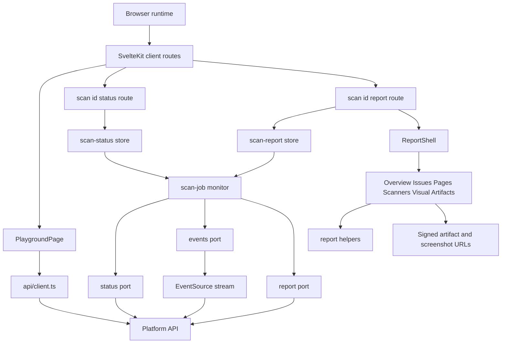
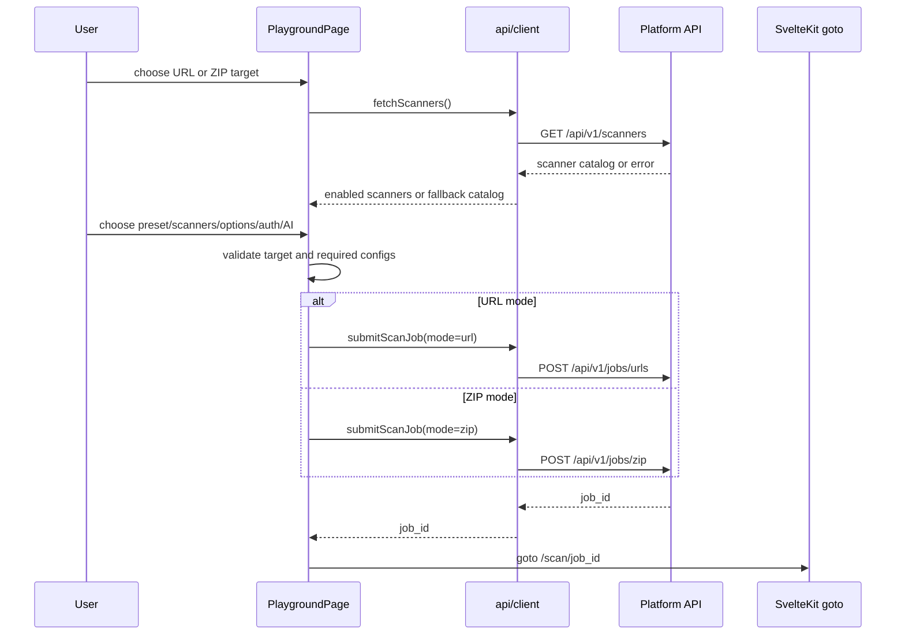
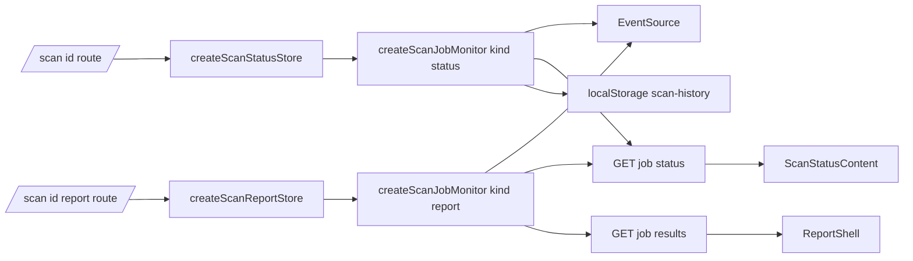
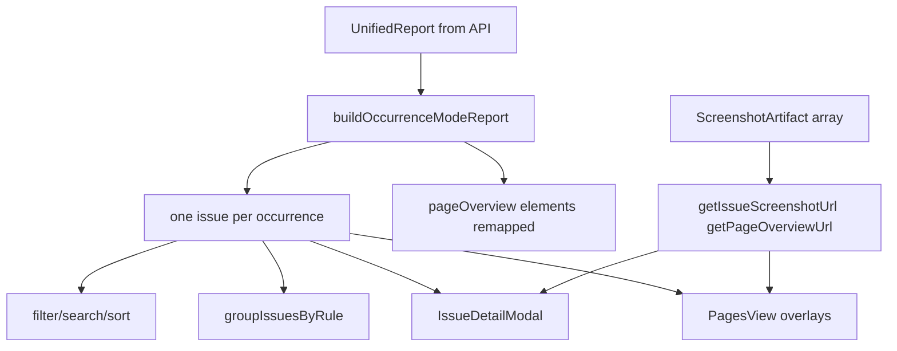

# StageFlow Web Repo Map

This document maps the `clients/web` SvelteKit application as of the inspected worktree. It is grounded in local code citations (`path:line`) and only describes behavior visible in this slice or in adjacent API documentation that the web app calls.

Framework semantics checked while writing:

- Local package versions: SvelteKit `^2.57.1`, Svelte `^5.45.6`, Vite `^7.3.2`, Tailwind Vite plugin `^4.1.18`, Storybook `8.6.17`, Vitest `^4.0.13` (`clients/web/package.json:56`, `clients/web/package.json:57`, `clients/web/package.json:58`, `clients/web/package.json:76`, `clients/web/package.json:77`, `clients/web/package.json:81`, `clients/web/package.json:82`, `clients/web/package.json:89`).
- SvelteKit official docs via Context7: `adapter-static` emits static files and a `fallback` such as `200.html` enables SPA fallback; `export const prerender = true` controls prerendering for routes.
- Svelte official docs via Context7: Svelte 5 runes use `$state` for reactive state and `$derived` for computed state, including in `.svelte.ts` modules.

## Runtime Responsibility

`clients/web` is a static SvelteKit frontend for StageFlow. It renders marketing/landing pages, scan submission, live scan status, and a unified report explorer. It does not define local SvelteKit API routes in this slice; browser code calls the platform API through `fetch`, `EventSource`, and signed artifact URLs.

| Responsibility          | Local entry points                                                                                                                                                                 | Notes                                                                                                                                                                       |
| ----------------------- | ---------------------------------------------------------------------------------------------------------------------------------------------------------------------------------- | --------------------------------------------------------------------------------------------------------------------------------------------------------------------------- |
| Landing and navigation  | `clients/web/src/routes/+page.svelte:75`, `clients/web/src/routes/+layout.svelte:38`, `clients/web/src/lib/components/nav/Navigation.svelte:48`                                    | Landing page advertises scanners, links to `/playground`, and injects structured data. Layout imports fonts, global CSS, navigation, footer, canonical/Open Graph metadata. |
| Scan playground         | `clients/web/src/routes/playground/+page.svelte:1`, `clients/web/src/lib/components/playground/PlaygroundPage.svelte:33`                                                           | Client-side form supports URL and ZIP modes, scanner discovery, presets, screenshots, highlight style, auth config, and AI Navigator config.                                |
| API client boundary     | `clients/web/src/lib/api/client.ts:183`, `clients/web/src/lib/api/client.ts:271`, `clients/web/src/lib/api/utils.ts:13`                                                            | Builds API URLs from `VITE_API_URL`, dev default, or browser origin; submits scans and fetches scanner definitions.                                                         |
| SSE live stream         | `clients/web/src/lib/api/sse.ts:24`, `clients/web/src/lib/stores/scan-monitor/ports.ts:77`                                                                                         | Wraps browser `EventSource`, parses `status` and `update` events, reports transport failures to the monitor.                                                                |
| Live status             | `clients/web/src/routes/scan/[id]/+page.svelte:13`, `clients/web/src/lib/stores/scan-status.svelte.ts:6`, `clients/web/src/lib/components/scan-status/ScanStatusContent.svelte:23` | Route creates a status store per job id, starts monitoring on mount, and renders header/content/artifacts.                                                                  |
| Report explorer         | `clients/web/src/routes/scan/[id]/report/+page.svelte:7`, `clients/web/src/lib/stores/scan-report.svelte.ts:6`, `clients/web/src/lib/components/report/ReportShell.svelte:38`      | Route creates a report store; shell controls query-param state for report section, filters, sorting, issue modal, and artifacts.                                            |
| Report helpers          | `clients/web/src/lib/report/index.ts:1`, `clients/web/src/lib/report/occurrence-mode.ts:251`, `clients/web/src/lib/report/grouping.ts:119`                                         | Helpers normalize occurrence mode, group findings, sort/filter issues, resolve screenshots, classify issue kind, and compute severity/score display.                        |
| Design system           | `clients/web/src/lib/components/ui/index.ts:1`, `clients/web/src/app.css:4`                                                                                                        | UI primitives export CVA variants and Svelte components. Global CSS defines theme tokens, font stacks, focus rings, and layout utilities.                                   |
| Static production shape | `clients/web/svelte.config.js:8`, `clients/web/Dockerfile:36`, `clients/web/nginx.conf:30`                                                                                         | `adapter-static` writes `build/` with `fallback: '200.html'`; Docker serves via nginx; nginx proxies `/api/` to `platform-api:8080`.                                        |

## Architecture Diagram

## Route Map

| Route               | SvelteKit file                                                                                                                                    | Rendering/runtime shape                                 | Primary responsibilities                                                                                                         |
| ------------------- | ------------------------------------------------------------------------------------------------------------------------------------------------- | ------------------------------------------------------- | -------------------------------------------------------------------------------------------------------------------------------- |
| `/`                 | `clients/web/src/routes/+page.ts:1`, `clients/web/src/routes/+page.svelte:75`                                                                     | Prerendered static page.                                | Landing hero, scanner capability cards driven by `SCANNER_META`, workflow, CTA, structured data, links to playground and source. |
| `/playground`       | `clients/web/src/routes/playground/+page.ts:1`, `clients/web/src/routes/playground/+page.svelte:1`                                                | Prerendered static page with client-side form behavior. | Mounts `PlaygroundPage`; page head names scan playground.                                                                        |
| `/scan/[id]`        | `clients/web/src/routes/scan/[id]/+page.svelte:13`                                                                                                | Client-side dynamic route behind static fallback.       | Reads `page.params.id`, creates `createScanStatusStore`, starts monitor, cleans up on route change/unmount.                      |
| `/scan/[id]/report` | `clients/web/src/routes/scan/[id]/report/+page.svelte:7`                                                                                          | Client-side dynamic route behind static fallback.       | Reads job id, creates `createScanReportStore`, starts monitor, passes report/job/screenshots/logs/error into `ReportShell`.      |
| Route errors        | `clients/web/src/routes/+error.svelte:7`, `clients/web/src/routes/playground/+error.svelte:7`, `clients/web/src/routes/scan/[id]/+error.svelte:7` | Client-facing error pages.                              | Root, playground, and scan-specific recovery UI with noindex metadata and retry/navigation actions.                              |
| Layout              | `clients/web/src/routes/+layout.svelte:1`, `clients/web/src/app.html:1`                                                                           | Shared shell.                                           | Self-hosted fonts, CSS, SEO/social metadata, skip link, nav, footer, SvelteKit body/head placeholders.                           |

Notes:

- `adapter-static` is configured with `pages: 'build'`, `assets: 'build'`, and `fallback: '200.html'`, making dynamic routes rely on the SPA fallback in deployed static hosting (`clients/web/svelte.config.js:9`, `clients/web/svelte.config.js:12`).
- The route `+page.ts` files for `/` and `/playground` export `prerender = true` (`clients/web/src/routes/+page.ts:1`, `clients/web/src/routes/playground/+page.ts:1`).

## Source Directory Map

| Path                              | Role                                                                                                           | Representative citations                                                                                                                                                                                                     |
| --------------------------------- | -------------------------------------------------------------------------------------------------------------- | ---------------------------------------------------------------------------------------------------------------------------------------------------------------------------------------------------------------------------- |
| `src/routes/`                     | SvelteKit route tree for landing, playground, live status, report, and error states.                           | `clients/web/src/routes/+layout.svelte:38`, `clients/web/src/routes/scan/[id]/+page.svelte:45`, `clients/web/src/routes/scan/[id]/report/+page.svelte:47`                                                                    |
| `src/lib/api/`                    | API base resolution, HTTP submission/scanner catalog client, SSE wrapper.                                      | `clients/web/src/lib/api/utils.ts:13`, `clients/web/src/lib/api/client.ts:183`, `clients/web/src/lib/api/sse.ts:24`                                                                                                          |
| `src/lib/components/playground/`  | Scan form, target input, ZIP upload, scanner grid, auth and AI config, summary sidebar.                        | `clients/web/src/lib/components/playground/PlaygroundPage.svelte:33`, `clients/web/src/lib/components/playground/PlaygroundScannerGrid.svelte:23`, `clients/web/src/lib/components/playground/playground-utils.ts:48`        |
| `src/lib/components/scan-status/` | Live status dashboard, processing/completed/failed states, terminal logs, artifact rail.                       | `clients/web/src/lib/components/scan-status/ScanStatusContent.svelte:23`, `clients/web/src/lib/components/scan-status/ProcessingView.svelte:92`, `clients/web/src/lib/components/scan-status/ScanArtifactsSidebar.svelte:25` |
| `src/lib/components/report/`      | Unified report shell and domain views for overview, issues, pages, scanners, visual review, artifacts, modals. | `clients/web/src/lib/components/report/ReportShell.svelte:38`, `clients/web/src/lib/components/report/IssuesView.svelte:66`, `clients/web/src/lib/components/report/PageOverviewViewer.svelte:27`                            |
| `src/lib/components/ui/`          | Reusable primitives and variant helpers.                                                                       | `clients/web/src/lib/components/ui/index.ts:1`, `clients/web/src/lib/components/ui/button.ts:3`, `clients/web/src/lib/components/ui/Modal.svelte:93`                                                                         |
| `src/lib/stores/`                 | Svelte 5 rune stores and framework-independent monitor.                                                        | `clients/web/src/lib/stores/scan-status.svelte.ts:6`, `clients/web/src/lib/stores/scan-report.svelte.ts:6`, `clients/web/src/lib/stores/scan-monitor/create.ts:69`                                                           |
| `src/lib/report/`                 | Pure report manipulation and UI classification helpers.                                                        | `clients/web/src/lib/report/occurrence-mode.ts:251`, `clients/web/src/lib/report/screenshots.ts:10`, `clients/web/src/lib/report/issue-kind.ts:75`                                                                           |
| `src/lib/types/`                  | Frontend scan/status types and imported unified report contract types.                                         | `clients/web/src/lib/types/scan.ts:59`, `clients/web/src/lib/types/unified-report.ts:13`                                                                                                                                     |
| `src/lib/config/`                 | Site metadata and navigation definitions.                                                                      | `clients/web/src/lib/config/site.ts:17`, `clients/web/src/lib/config/nav.ts:1`                                                                                                                                               |
| `static/`                         | Public static assets and QA fixture pages.                                                                     | `clients/web/src/app.html:5`, `clients/web/.storybook/main.ts:5`                                                                                                                                                             |
| `tests/unit/`                     | Vitest/jsdom unit tests for API, stores, UI, report, playground, scan status.                                  | `clients/web/vitest.config.ts:9`, `clients/web/vitest.config.ts:13`                                                                                                                                                          |
| `.storybook/` and stories         | Component workbench, interaction/a11y runner, story files.                                                     | `clients/web/.storybook/main.ts:3`, `clients/web/.storybook/test-runner.ts:25`, `clients/web/src/stories/Introduction.mdx:9`                                                                                                 |

## API Calls And External Boundaries

| Boundary               | Local caller                                                         | Method/path                             | Payload/result shape                                                                                            | Failure/fallback behavior                                                                                                                                                                                                                                                                        |
| ---------------------- | -------------------------------------------------------------------- | --------------------------------------- | --------------------------------------------------------------------------------------------------------------- | ------------------------------------------------------------------------------------------------------------------------------------------------------------------------------------------------------------------------------------------------------------------------------------------------ |
| API base resolution    | `buildApiUrl`                                                        | Any API path                            | Explicit `VITE_API_URL`, dev fallback `http://localhost:8080`, or production browser origin.                    | Throws in production SSR-like contexts when no origin exists (`clients/web/src/lib/api/utils.ts:13`, `clients/web/src/lib/api/utils.ts:23`, `clients/web/src/lib/api/utils.ts:27`).                                                                                                              |
| Scanner catalog        | `fetchScanners`                                                      | `GET /api/v1/scanners`                  | Expects `ScannersResponse` and filters disabled scanners.                                                       | Returns built-in fallback scanner definitions on non-ok or thrown request (`clients/web/src/lib/api/client.ts:271`, `clients/web/src/lib/api/client.ts:283`, `clients/web/src/lib/api/client.ts:289`, `clients/web/src/lib/api/client.ts:296`).                                                  |
| URL scan submit        | `submitScanJob`                                                      | `POST /api/v1/jobs/urls`                | JSON body with `urls`, enabled `modules`, `scanner_configs`, screenshot flag, highlight style, optional auth.   | Structured API error messages are preferred; 400/422/5xx get specific messages (`clients/web/src/lib/api/client.ts:230`, `clients/web/src/lib/api/client.ts:233`, `clients/web/src/lib/api/client.ts:249`).                                                                                      |
| ZIP scan submit        | `submitScanJob`                                                      | `POST /api/v1/jobs/zip`                 | `FormData` with file, highlight style, comma-separated modules, screenshot flag, optional scanner configs JSON. | Missing file is a local error; 413 reports the 100 MB limit (`clients/web/src/lib/api/client.ts:204`, `clients/web/src/lib/api/client.ts:208`, `clients/web/src/lib/api/client.ts:217`, `clients/web/src/lib/api/client.ts:250`).                                                                |
| Job status snapshot    | `createStatusPort`                                                   | `GET /api/v1/jobs/{jobId}`              | Expects `ScanResult`.                                                                                           | 404 maps to `Job not found`; other non-ok to generic status failure (`clients/web/src/lib/stores/scan-monitor/ports.ts:29`, `clients/web/src/lib/stores/scan-monitor/ports.ts:32`).                                                                                                              |
| Job SSE stream         | `createSSEStream` via `createEventsPort`                             | `GET /api/v1/jobs/{jobId}/stream`       | EventSource events: `status`, `update`, `done`; update type is `SSEUpdate`.                                     | Parse errors close after 3; reconnect exhaustion or closed stream tells monitor to refresh or poll (`clients/web/src/lib/api/sse.ts:30`, `clients/web/src/lib/api/sse.ts:45`, `clients/web/src/lib/api/sse.ts:84`, `clients/web/src/lib/api/sse.ts:107`).                                        |
| Aggregated JSON report | `createReportPort`, `ArtifactsView`, `CompletedView`, `ReportHeader` | `GET /api/v1/jobs/{jobId}/results`      | Expects unified report JSON with `meta.jobId` and `version`.                                                    | 400/404/409 are treated as pending; invalid schema shape is failed (`clients/web/src/lib/stores/scan-monitor/ports.ts:42`, `clients/web/src/lib/stores/scan-monitor/ports.ts:46`, `clients/web/src/lib/stores/scan-monitor/ports.ts:50`, `clients/web/src/lib/stores/scan-monitor/ports.ts:60`). |
| Aggregated HTML report | `ArtifactsView`, `ReportHeader`                                      | `GET /api/v1/jobs/{jobId}/report`       | External link/redirect to HTML artifact.                                                                        | Link display only; web slice does not inspect HTML content (`clients/web/src/lib/components/report/ArtifactsView.svelte:17`, `clients/web/src/lib/components/report/ArtifactsView.svelte:24`).                                                                                                   |
| Signed artifact URLs   | Status/report artifact views                                         | URLs embedded in `ScanResult.artifacts` | Logs, recipes, report links, scanner artifacts, screenshots.                                                    | UI warns links are signed and may expire; expiration is derived as 24 hours after `updated_at` (`clients/web/src/lib/components/report/ArtifactsView.svelte:74`, `clients/web/src/lib/components/scan-status/artifacts-sidebar/expiration.ts:1`).                                                |
| Docker/nginx runtime   | Static app container                                                 | `/api/` proxy                           | nginx serves static files and proxies API calls to `platform-api:8080`.                                         | SPA fallback uses `/200.html` for non-file routes (`clients/web/nginx.conf:8`, `clients/web/nginx.conf:30`).                                                                                                                                                                                     |

Adjacent API documentation confirms the platform API owns the endpoints the web app calls, including `POST /api/v1/jobs/urls`, `POST /api/v1/jobs/zip`, `GET /api/v1/jobs/:id`, `GET /api/v1/jobs/:id/stream`, `GET /api/v1/jobs/:id/report`, `GET /api/v1/jobs/:id/results`, and `GET /api/v1/scanners` (`services/platform-api/README.md:46`, `services/platform-api/README.md:57`).

## Playground Flow

Key details:

- Form state covers mode, URL text, ZIP `File`, scanner selections, preset, screenshot capture, highlight style, submission/loading/error state, invalid URL details, AI Navigator config, and auth config (`clients/web/src/lib/components/playground/PlaygroundPage.svelte:33`, `clients/web/src/lib/components/playground/PlaygroundPage.svelte:48`, `clients/web/src/lib/components/playground/PlaygroundPage.svelte:57`).
- Submission is gated by target input, at least one enabled scanner, valid AI Navigator objective/model if enabled, valid auth if enabled, and not already submitting (`clients/web/src/lib/components/playground/PlaygroundPage.svelte:69`, `clients/web/src/lib/components/playground/PlaygroundPage.svelte:79`).
- Scanner loading calls `fetchScanners`, applies the default selection, then detects the active preset (`clients/web/src/lib/components/playground/PlaygroundPage.svelte:103`).
- Coverage preset enables all non-AI scanners when available; quick preset enables axe if present; custom leaves selections as-is (`clients/web/src/lib/domain/scanners/presets.ts:24`, `clients/web/src/lib/domain/scanners/presets.ts:32`, `clients/web/src/lib/domain/scanners/presets.ts:40`).
- URL input normalizes bare domains to `https://`, validates only `http:` and `https:`, and reports per-URL reasons (`clients/web/src/lib/components/playground/playground-utils.ts:81`, `clients/web/src/lib/components/playground/playground-utils.ts:125`).
- ZIP upload accepts `.zip`, validates the filename client-side, supports drag/drop, and states a 100 MB maximum in UI text (`clients/web/src/lib/components/playground/PlaygroundZipUpload.svelte:18`, `clients/web/src/lib/components/playground/PlaygroundZipUpload.svelte:63`, `clients/web/src/lib/components/playground/PlaygroundZipUpload.svelte:116`).
- Auth config builds a `mode: 'form'` wire format with fill/click steps and selector-based success detection (`clients/web/src/lib/components/playground/playground-utils.ts:41`, `clients/web/src/lib/components/playground/playground-utils.ts:57`).
- AI Navigator config builds `goal` and `vision` objects using OpenRouter as provider plus optional input values and success criteria (`clients/web/src/lib/components/playground/playground-utils.ts:160`, `clients/web/src/lib/components/playground/playground-utils.ts:168`, `clients/web/src/lib/components/playground/playground-utils.ts:174`).

## Status And Report Data Flow

| Store/module             | State exposed                                             | Behavior                                                                                                                                              | Citations                                                                                                                                                                                                                                                                                 |
| ------------------------ | --------------------------------------------------------- | ----------------------------------------------------------------------------------------------------------------------------------------------------- | ----------------------------------------------------------------------------------------------------------------------------------------------------------------------------------------------------------------------------------------------------------------------------------------- |
| `scan-status.svelte.ts`  | `status`, `result`, `elapsed`, `logs`                     | Wraps status monitor, mirrors snapshots into Svelte rune state, starts/stops monitor, marks terminal history through a dependency port.               | `clients/web/src/lib/stores/scan-status.svelte.ts:6`, `clients/web/src/lib/stores/scan-status.svelte.ts:12`, `clients/web/src/lib/stores/scan-status.svelte.ts:26`, `clients/web/src/lib/stores/scan-status.svelte.ts:33`                                                                 |
| `scan-report.svelte.ts`  | `status`, `job`, `report`, `screenshots`, `logs`, `error` | Wraps report monitor, exposes `refreshArtifacts` for signed-link/status refresh.                                                                      | `clients/web/src/lib/stores/scan-report.svelte.ts:6`, `clients/web/src/lib/stores/scan-report.svelte.ts:19`, `clients/web/src/lib/stores/scan-report.svelte.ts:52`                                                                                                                        |
| `scan-history.svelte.ts` | local history array and loaded flag                       | Browser-only `localStorage` history, capped at 10, trims on quota errors, terminal status update support.                                             | `clients/web/src/lib/stores/scan-history.svelte.ts:11`, `clients/web/src/lib/stores/scan-history.svelte.ts:30`, `clients/web/src/lib/stores/scan-history.svelte.ts:54`, `clients/web/src/lib/stores/scan-history.svelte.ts:64`                                                            |
| `scan-monitor/create.ts` | Snapshot subscription API                                 | Port-based monitor with status/report overloads, generation token cancellation, elapsed timer, SSE, polling fallback, report retry, terminal cleanup. | `clients/web/src/lib/stores/scan-monitor/create.ts:69`, `clients/web/src/lib/stores/scan-monitor/create.ts:98`, `clients/web/src/lib/stores/scan-monitor/create.ts:229`, `clients/web/src/lib/stores/scan-monitor/create.ts:480`, `clients/web/src/lib/stores/scan-monitor/create.ts:554` |
| `scan-monitor/ports.ts`  | Status, report, events, scheduler ports                   | Separates browser timers/fetch/EventSource from monitor logic, making tests inject fake ports.                                                        | `clients/web/src/lib/stores/scan-monitor/ports.ts:16`, `clients/web/src/lib/stores/scan-monitor/ports.ts:29`, `clients/web/src/lib/stores/scan-monitor/ports.ts:42`, `clients/web/src/lib/stores/scan-monitor/ports.ts:77`                                                                |
| `scan-status/*` helpers  | Normalized state, progress, log text, SSE update shape    | Normalizes backend state names, converts SSE progress, derives remaining scanners, and formats failure/log messages.                                  | `clients/web/src/lib/stores/scan-status/log-messages.ts:37`, `clients/web/src/lib/stores/scan-status/event-update.ts:5`, `clients/web/src/lib/stores/scan-status/scanner-progress.ts:27`, `clients/web/src/lib/stores/scan-status/types.ts:3`                                             |

Monitor behavior details:

- Status mode starts elapsed timing, opens SSE if supported, otherwise logs lack of SSE and fetches status (`clients/web/src/lib/stores/scan-monitor/create.ts:456`, `clients/web/src/lib/stores/scan-monitor/create.ts:564`).
- Report mode opens SSE if supported, otherwise polls every 5 seconds; it always refreshes status at start (`clients/web/src/lib/stores/scan-monitor/create.ts:15`, `clients/web/src/lib/stores/scan-monitor/create.ts:575`).
- On terminal statuses, the monitor stops polling, elapsed timer, stream, and report retry, then marks history for status monitors (`clients/web/src/lib/stores/scan-monitor/create.ts:210`).
- Report fetch retries begin at 800 ms, grow by 1.7x, cap at 10 seconds, and stop after 30 attempts (`clients/web/src/lib/stores/scan-monitor/defaults.ts:15`, `clients/web/src/lib/stores/scan-monitor/defaults.ts:17`, `clients/web/src/lib/stores/scan-monitor/create.ts:253`).

## UI Architecture

### Playground Components

| Component               | Responsibility                                                                                        | Citations                                                                                                                                                                                                                                                                                                |
| ----------------------- | ----------------------------------------------------------------------------------------------------- | -------------------------------------------------------------------------------------------------------------------------------------------------------------------------------------------------------------------------------------------------------------------------------------------------------- |
| `PlaygroundPage`        | Owns form state, scanner loading, validation, submission, mobile sticky run bar, and layout sections. | `clients/web/src/lib/components/playground/PlaygroundPage.svelte:33`, `clients/web/src/lib/components/playground/PlaygroundPage.svelte:167`, `clients/web/src/lib/components/playground/PlaygroundPage.svelte:240`                                                                                       |
| `PlaygroundScannerGrid` | Preset chips, scanner cards, loading/empty states, selected count, AI Navigator configure hint.       | `clients/web/src/lib/components/playground/PlaygroundScannerGrid.svelte:23`, `clients/web/src/lib/components/playground/PlaygroundScannerGrid.svelte:59`, `clients/web/src/lib/components/playground/PlaygroundScannerGrid.svelte:138`                                                                   |
| `PlaygroundUrlInput`    | Newline URL parsing, normalization-on-blur notice, validation feedback, URL count.                    | `clients/web/src/lib/components/playground/PlaygroundUrlInput.svelte:21`, `clients/web/src/lib/components/playground/PlaygroundUrlInput.svelte:33`, `clients/web/src/lib/components/playground/PlaygroundUrlInput.svelte:86`                                                                             |
| `PlaygroundZipUpload`   | Native hidden file input plus button/drop surface, `.zip` validation, selected file controls.         | `clients/web/src/lib/components/playground/PlaygroundZipUpload.svelte:18`, `clients/web/src/lib/components/playground/PlaygroundZipUpload.svelte:40`, `clients/web/src/lib/components/playground/PlaygroundZipUpload.svelte:73`                                                                          |
| `PlaygroundOptions`     | Screenshot toggle and highlight style select.                                                         | `clients/web/src/lib/components/playground/PlaygroundOptions.svelte:31`, `clients/web/src/lib/components/playground/PlaygroundOptions.svelte:73`                                                                                                                                                         |
| `PlaygroundAuthConfig`  | Optional form login config, password reveal, advanced selector overrides, required success selector.  | `clients/web/src/lib/components/playground/PlaygroundAuthConfig.svelte:17`, `clients/web/src/lib/components/playground/PlaygroundAuthConfig.svelte:66`, `clients/web/src/lib/components/playground/PlaygroundAuthConfig.svelte:158`                                                                      |
| `PlaygroundAiConfig`    | Objective/model selection, input values, max steps/time, success criteria, experimental notice.       | `clients/web/src/lib/components/playground/PlaygroundAiConfig.svelte:47`, `clients/web/src/lib/components/playground/PlaygroundAiConfig.svelte:49`, `clients/web/src/lib/components/playground/PlaygroundAiConfig.svelte:115`, `clients/web/src/lib/components/playground/PlaygroundAiConfig.svelte:238` |
| `PlaygroundSidebar`     | Sticky run summary and readiness checklist for desktop.                                               | `clients/web/src/lib/components/playground/PlaygroundSidebar.svelte:34`, `clients/web/src/lib/components/playground/PlaygroundSidebar.svelte:38`, `clients/web/src/lib/components/playground/PlaygroundSidebar.svelte:113`                                                                               |

### Scan Status Components

| Component              | Responsibility                                                                                 | Citations                                                                                                                                                                                                                             |
| ---------------------- | ---------------------------------------------------------------------------------------------- | ------------------------------------------------------------------------------------------------------------------------------------------------------------------------------------------------------------------------------------- |
| `ScanStatusHeader`     | Job headline, elapsed time, page/scanner/next-step summary.                                    | `clients/web/src/lib/components/scan-status/ScanStatusHeader.svelte:21`, `clients/web/src/lib/components/scan-status/ScanStatusHeader.svelte:33`, `clients/web/src/lib/components/scan-status/ScanStatusHeader.svelte:92`             |
| `ScanStatusLiveBento`  | Framed dashboard layout with header/main/sidebar snippets and summary strip.                   | `clients/web/src/lib/components/scan-status/ScanStatusLiveBento.svelte:6`, `clients/web/src/lib/components/scan-status/ScanStatusLiveBento.svelte:52`, `clients/web/src/lib/components/scan-status/ScanStatusLiveBento.svelte:79`     |
| `ScanStatusContent`    | Switches between processing, completed, and failed states and always shows status stepper.     | `clients/web/src/lib/components/scan-status/ScanStatusContent.svelte:19`, `clients/web/src/lib/components/scan-status/ScanStatusContent.svelte:23`                                                                                    |
| `ProcessingView`       | Stage copy, progress bar, scanner activity chips, long-running Lighthouse hint, terminal logs. | `clients/web/src/lib/components/scan-status/ProcessingView.svelte:16`, `clients/web/src/lib/components/scan-status/ProcessingView.svelte:92`, `clients/web/src/lib/components/scan-status/ProcessingView.svelte:221`                  |
| `CompletedView`        | Report handoff and JSON download link.                                                         | `clients/web/src/lib/components/scan-status/CompletedView.svelte:19`, `clients/web/src/lib/components/scan-status/CompletedView.svelte:50`                                                                                            |
| `FailedView`           | Error, last stage, details, retry/back-home actions.                                           | `clients/web/src/lib/components/scan-status/FailedView.svelte:19`, `clients/web/src/lib/components/scan-status/FailedView.svelte:33`                                                                                                  |
| `ScanArtifactsSidebar` | Logs/artifacts rail, report promotion after complete, tabs, expiration notice.                 | `clients/web/src/lib/components/scan-status/ScanArtifactsSidebar.svelte:22`, `clients/web/src/lib/components/scan-status/ScanArtifactsSidebar.svelte:68`, `clients/web/src/lib/components/scan-status/ScanArtifactsSidebar.svelte:97` |
| `ScanTerminal`         | Styled log console with pattern-based labels, auto-scroll near bottom, live prompt.            | `clients/web/src/lib/components/scan-status/ScanTerminal.svelte:18`, `clients/web/src/lib/components/scan-status/ScanTerminal.svelte:106`, `clients/web/src/lib/components/scan-status/ScanTerminal.svelte:154`                       |

### Report Components

| Component              | Responsibility                                                                                                          | Citations                                                                                                                                                                                                                                                                                       |
| ---------------------- | ----------------------------------------------------------------------------------------------------------------------- | ----------------------------------------------------------------------------------------------------------------------------------------------------------------------------------------------------------------------------------------------------------------------------------------------- |
| `ReportShell`          | Owns query-param state, canonical section names, filters/sort/search, modal selection, section rendering boundary.      | `clients/web/src/lib/components/report/ReportShell.svelte:38`, `clients/web/src/lib/components/report/ReportShell.svelte:105`, `clients/web/src/lib/components/report/ReportShell.svelte:174`                                                                                                   |
| `IssuesView`           | Filtered/sorted issue list, grouped/flat toggle, preview toggle, mobile filters, virtualization for large flat lists.   | `clients/web/src/lib/components/report/IssuesView.svelte:66`, `clients/web/src/lib/components/report/IssuesView.svelte:103`, `clients/web/src/lib/components/report/IssuesView.svelte:123`, `clients/web/src/lib/components/report/IssuesView.svelte:431`                                       |
| `IssueFilterSidebar`   | Search debounce, scanner/severity/page/category filters, clear all.                                                     | `clients/web/src/lib/components/report/IssueFilterSidebar.svelte:62`, `clients/web/src/lib/components/report/IssueFilterSidebar.svelte:75`, `clients/web/src/lib/components/report/IssueFilterSidebar.svelte:133`                                                                               |
| `IssueDetailModal`     | Fix/evidence/details/occurrences tabs, issue navigation, WCAG links, highlighted element focus, page overview toggling. | `clients/web/src/lib/components/report/IssueDetailModal.svelte:44`, `clients/web/src/lib/components/report/IssueDetailModal.svelte:122`, `clients/web/src/lib/components/report/IssueDetailModal.svelte:149`, `clients/web/src/lib/components/report/IssueDetailModal.svelte:190`               |
| `IssueEvidenceSection` | Cropped issue screenshots, full-page overlays, page-level fallback, DOM/failure evidence, manual review state.          | `clients/web/src/lib/components/report/IssueEvidenceSection.svelte:36`, `clients/web/src/lib/components/report/IssueEvidenceSection.svelte:65`, `clients/web/src/lib/components/report/IssueEvidenceSection.svelte:81`, `clients/web/src/lib/components/report/IssueEvidenceSection.svelte:214` |
| `PagesView`            | Page list, selected page overview, page issue list.                                                                     | `clients/web/src/lib/components/report/PagesView.svelte:23`, `clients/web/src/lib/components/report/PagesView.svelte:27`, `clients/web/src/lib/components/report/PagesView.svelte:91`                                                                                                           |
| `PageOverviewViewer`   | SVG screenshot overlay viewer with severity filters, focus/show-all mode, zoom, keyboard marker navigation.             | `clients/web/src/lib/components/report/PageOverviewViewer.svelte:27`, `clients/web/src/lib/components/report/PageOverviewViewer.svelte:47`, `clients/web/src/lib/components/report/PageOverviewViewer.svelte:77`, `clients/web/src/lib/components/report/PageOverviewViewer.svelte:180`         |
| `ScannersView`         | Scanner cards, selected scanner details, artifacts, Lighthouse category summary, issue summaries by rule/page.          | `clients/web/src/lib/components/report/ScannersView.svelte:27`, `clients/web/src/lib/components/report/ScannersView.svelte:31`, `clients/web/src/lib/components/report/ScannersView.svelte:118`, `clients/web/src/lib/components/report/ScannersView.svelte:183`                                |
| `ArtifactsView`        | Aggregated JSON/HTML/log/recipe links and per-scanner artifacts.                                                        | `clients/web/src/lib/components/report/ArtifactsView.svelte:17`, `clients/web/src/lib/components/report/ArtifactsView.svelte:22`, `clients/web/src/lib/components/report/ArtifactsView.svelte:83`                                                                                               |

### Design System And Navigation

| Area                         | Responsibility                                                                                               | Citations                                                                                                                                                                                                                                             |
| ---------------------------- | ------------------------------------------------------------------------------------------------------------ | ----------------------------------------------------------------------------------------------------------------------------------------------------------------------------------------------------------------------------------------------------- |
| UI barrel                    | Exports primitives and variant helpers.                                                                      | `clients/web/src/lib/components/ui/index.ts:1`, `clients/web/src/lib/components/ui/index.ts:41`                                                                                                                                                       |
| Buttons/chips/panels/selects | CVA class variants plus thin Svelte wrappers.                                                                | `clients/web/src/lib/components/ui/button.ts:3`, `clients/web/src/lib/components/ui/Button.svelte:19`, `clients/web/src/lib/components/ui/chip.ts:3`, `clients/web/src/lib/components/ui/panel.ts:3`, `clients/web/src/lib/components/ui/select.ts:3` |
| Modal                        | Dialog semantics, optional focus trap, escape/backdrop close, body scroll lock, focus restore.               | `clients/web/src/lib/components/ui/Modal.svelte:93`, `clients/web/src/lib/components/ui/Modal.svelte:117`, `clients/web/src/lib/components/ui/Modal.svelte:166`                                                                                       |
| Theme CSS                    | Tailwind import, design tokens, reduced motion handling, body font/background, focus ring, layout utilities. | `clients/web/src/app.css:2`, `clients/web/src/app.css:4`, `clients/web/src/app.css:61`, `clients/web/src/app.css:76`, `clients/web/src/app.css:121`                                                                                                   |
| Site/nav config              | Env-backed site metadata and Home/Playground links.                                                          | `clients/web/src/lib/config/site.ts:17`, `clients/web/src/lib/config/nav.ts:1`                                                                                                                                                                        |
| Navigation                   | Fixed header, scroll state, body overflow when mobile menu is open, desktop/mobile nav.                      | `clients/web/src/lib/components/nav/Navigation.svelte:10`, `clients/web/src/lib/components/nav/Navigation.svelte:16`, `clients/web/src/lib/components/nav/DesktopNav.svelte:15`, `clients/web/src/lib/components/nav/MobileMenu.svelte:17`            |

## Report Helper Model

| Helper                          | What it does                                                                                                                                        | Citations                                                                                                                                                                                      |
| ------------------------------- | --------------------------------------------------------------------------------------------------------------------------------------------------- | ---------------------------------------------------------------------------------------------------------------------------------------------------------------------------------------------- |
| `buildOccurrenceModeReport`     | Expands multi-occurrence issues into one issue per occurrence, updates summaries/scanner counts/page counts, and remaps overview overlay issue ids. | `clients/web/src/lib/report/occurrence-mode.ts:127`, `clients/web/src/lib/report/occurrence-mode.ts:177`, `clients/web/src/lib/report/occurrence-mode.ts:251`                                  |
| `groupIssuesByRule`             | Groups by stable `${scanner}:${ruleId}` fingerprint, sorts by severity, occurrence count, then fingerprint.                                         | `clients/web/src/lib/report/grouping.ts:108`, `clients/web/src/lib/report/grouping.ts:119`, `clients/web/src/lib/report/grouping.ts:150`                                                       |
| `filterIssues` and `sortIssues` | Pure filters by scanner/page/severity/category/query and sorts by severity/page/scanner/count/title.                                                | `clients/web/src/lib/report/filters.ts:11`, `clients/web/src/lib/report/sorting.ts:5`, `clients/web/src/lib/report/sorting.ts:21`                                                              |
| `getVirtualWindow`              | Computes visible index window for large flat issue lists.                                                                                           | `clients/web/src/lib/report/virtualization.ts:16`                                                                                                                                              |
| Screenshot lookup/crop          | Finds exact issue screenshots, preferred page overview screenshots, and cropped SVG view boxes.                                                     | `clients/web/src/lib/report/screenshots.ts:10`, `clients/web/src/lib/report/screenshots.ts:26`, `clients/web/src/lib/report/screenshot-crop.ts:25`                                             |
| Issue kind/title                | Classifies element/url/manual/page/scanner issues and rewrites manual-review titles.                                                                | `clients/web/src/lib/report/issue-kind.ts:3`, `clients/web/src/lib/report/issue-kind.ts:75`, `clients/web/src/lib/report/issue-kind.ts:108`                                                    |
| Contextual fixes                | Generates rule-specific fixes for common accessibility rules from issue/occurrence context, falls back to `issue.howToFix`.                         | `clients/web/src/lib/report/contextual-fix.ts:3`, `clients/web/src/lib/report/contextual-fix.ts:13`, `clients/web/src/lib/report/contextual-fix.ts:92`                                         |
| Severity/scanner/score helpers  | Normalize severity ordering/display, scanner status tone labels, scanner metadata, score bands.                                                     | `clients/web/src/lib/report/severity.ts:6`, `clients/web/src/lib/report/scanner-status.ts:5`, `clients/web/src/lib/report/scanner-identity.ts:9`, `clients/web/src/lib/report/score-band.ts:8` |

## Package, Build, And Runtime Shape

| Area                    | Local evidence                                               | Notes                                                                                           |
| ----------------------- | ------------------------------------------------------------ | ----------------------------------------------------------------------------------------------- |
| Package manager/runtime | `clients/web/package.json:11`, `clients/web/package.json:12` | Bun `1.3.8`, Node `22.x`.                                                                       |
| Core scripts            | `clients/web/package.json:16`                                | `dev`, `build`, `preview`, `type-check`, lint, CI, Storybook, test, coverage, asset budget.     |
| CI script               | `clients/web/package.json:26`                                | Runs format check, strict lint, type-check, and coverage.                                       |
| Static adapter          | `clients/web/svelte.config.js:9`                             | Builds to `build/`, strict static adapter, SPA fallback `200.html`.                             |
| Vite plugins            | `clients/web/vite.config.ts:5`                               | Tailwind Vite plugin runs before SvelteKit plugin.                                              |
| Vitest config           | `clients/web/vitest.config.ts:9`                             | jsdom environment, `tests/setup.ts`, targeted coverage include list and thresholds.             |
| Docker build            | `clients/web/Dockerfile:5`, `clients/web/Dockerfile:41`      | Bun builder runs `svelte-kit sync` then `bun run build`. Env vars are baked into static build.  |
| nginx runtime           | `clients/web/Dockerfile:45`, `clients/web/nginx.conf:1`      | nginx 1.29-alpine serves port 3000, static files, and API proxy.                                |
| Asset budget            | `clients/web/scripts/check-asset-budget.mjs:13`              | Sums built JS/CSS under SvelteKit immutable asset dirs; budgets are 420 KiB JS and 100 KiB CSS. |
| Dead-code config        | `clients/web/knip.json:1`                                    | Entry points are route Svelte files; project includes `src/**/*.{ts,js,svelte}`.                |

## Tests And Stories

| Surface                | Files/commands                                                                                                                                                                                                                                                                                                | What it proves                                                                                                                            |
| ---------------------- | ------------------------------------------------------------------------------------------------------------------------------------------------------------------------------------------------------------------------------------------------------------------------------------------------------------- | ----------------------------------------------------------------------------------------------------------------------------------------- |
| API client tests       | `clients/web/tests/unit/api/client.test.ts:16`, `clients/web/tests/unit/api/sse.test.ts:97`, `clients/web/tests/unit/api/utils.test.ts:5`                                                                                                                                                                     | Submit error handling, scanner fallback, abort handling, SSE event parsing/errors, API base resolution.                                   |
| Playground tests       | `clients/web/tests/unit/components/playground/PlaygroundPage.test.ts:55`, `clients/web/tests/unit/components/playground/playground-utils.test.ts:13`, `clients/web/tests/unit/components/playground/scanner-presets.test.ts:6`                                                                                | Form rendering, URL normalization, preset behavior, AI field labels, ZIP surface, auth/AI utility wire formats.                           |
| Scan status tests      | `clients/web/tests/unit/components/scan-status/ScanStatusContent.test.ts:5`, `clients/web/tests/unit/components/scan-status/ProcessingView.test.ts:6`, `clients/web/tests/unit/components/scan-status/ScanArtifactsSidebar.test.ts:5`, `clients/web/tests/unit/components/scan-status/ScanTerminal.test.ts:5` | Processing/completed/failed switching, scanner activity display, artifact rail behavior, terminal empty state.                            |
| Report component tests | `clients/web/tests/unit/components/report/ReportShell.test.ts:143`, `clients/web/tests/unit/components/report/IssuesView.test.ts:58`, `clients/web/tests/unit/components/report/IssueEvidenceSection.test.ts:89`, `clients/web/tests/unit/components/report/PageOverviewViewer.test.ts:56`                    | Section switching, issue virtualization/search debounce, grouped rows, modal/evidence overlays, page overview SVG/keyboard/zoom behavior. |
| Store/monitor tests    | `clients/web/tests/unit/stores/scan-monitor.test.ts:99`, `clients/web/tests/unit/stores/scan-report.test.ts:43`, `clients/web/tests/unit/stores/scan-status.test.ts:42`                                                                                                                                       | Snapshot mirroring, stream exhaustion fallback, polling fallback, report retry, cleanup/close behavior.                                   |
| Report helper tests    | `clients/web/tests/unit/report/grouping-by-rule.test.ts:1`, `clients/web/tests/unit/report/occurrence-mode.test.ts:1`, `clients/web/tests/unit/report/screenshots.test.ts:1`, `clients/web/tests/unit/report/virtualization.test.ts:4`                                                                        | Pure helper behavior for grouping, occurrence expansion, screenshots, severity, scanner summaries, and virtualization.                    |
| UI primitive tests     | `clients/web/tests/unit/components/ui/modal.component.test.ts:1`, `clients/web/tests/unit/components/ui/button.test.ts:1`, `clients/web/tests/unit/components/ui/select.test.ts:1`, `clients/web/tests/unit/components/ui/Progress.test.ts:6`                                                                 | Variant classes, component rendering, modal focus behavior, progress ARIA.                                                                |
| Storybook config       | `clients/web/.storybook/main.ts:3`, `clients/web/.storybook/preview.ts:9`, `clients/web/.storybook/test-runner.ts:25`                                                                                                                                                                                         | Stories include `src/**/*.stories` and MDX, use static assets, a11y addon, centered preview, axe checks on WCAG 2 A/AA tags.              |
| Storybook docs/stories | `clients/web/src/stories/Introduction.mdx:9` plus `*.stories.ts` under UI/playground/status/report                                                                                                                                                                                                            | Component workbench covers UI primitives and workflow components; Introduction documents interaction and a11y intent.                     |
| Coverage thresholds    | `clients/web/vitest.config.ts:41`                                                                                                                                                                                                                                                                             | Coverage gates are 85 statements, 80 branches, 90 functions, 85 lines for selected source includes.                                       |

Story files present at inspection time:

| Domain        | Story files                                                                                                                                                                                                             |
| ------------- | ----------------------------------------------------------------------------------------------------------------------------------------------------------------------------------------------------------------------- |
| UI primitives | `Alert`, `Badge`, `Button`, `Input`, `Modal`, `PageSection`, `Panel`, `Progress`, `Score`, `Select`, `SelectField`, `SeverityBar`, `StatusPill`, `Tabs`, `Textarea` stories under `clients/web/src/lib/components/ui/`. |
| Playground    | `PlaygroundModeToggle.stories.ts`, `PlaygroundUrlInput.stories.ts`.                                                                                                                                                     |
| Scan status   | `ScanStatusHeader.stories.ts`.                                                                                                                                                                                          |
| Report        | `ScannersView.stories.ts`.                                                                                                                                                                                              |

## Important Runtime Boundaries And Risks

| Boundary/risk                                                   | Current behavior                                                                                                                                        | Evidence                                                                                                                                                                |
| --------------------------------------------------------------- | ------------------------------------------------------------------------------------------------------------------------------------------------------- | ----------------------------------------------------------------------------------------------------------------------------------------------------------------------- |
| Static app has no server-side runtime after build               | API base must work from browser/runtime origin or baked `VITE_API_URL`; dynamic routes depend on fallback.                                              | `clients/web/svelte.config.js:9`, `clients/web/src/lib/api/utils.ts:23`, `clients/web/nginx.conf:30`                                                                    |
| Env vars are build-time for Docker                              | `VITE_*` args are copied into `ENV` before `bun run build`, so changing them after image build will not update static JS.                               | `clients/web/Dockerfile:20`, `clients/web/Dockerfile:29`, `clients/web/Dockerfile:42`                                                                                   |
| SSE availability differs by browser/test environment            | Monitor checks `typeof EventSource !== 'undefined'`; report mode can poll, status mode fetches latest status on streaming exhaustion.                   | `clients/web/src/lib/stores/scan-monitor/ports.ts:79`, `clients/web/src/lib/stores/scan-monitor/create.ts:439`, `clients/web/src/lib/stores/scan-monitor/create.ts:480` |
| Scanner catalog can be unavailable                              | UI falls back to a built-in scanner list that excludes `ai-navigator`; fallback definitions have empty descriptions/categories.                         | `clients/web/src/lib/api/client.ts:7`, `clients/web/src/lib/api/client.ts:17`, `clients/web/src/lib/api/client.ts:26`                                                   |
| Report JSON is treated as ready only after minimal schema check | `meta.jobId` and `version` are required; deeper schema validation is not performed in the frontend.                                                     | `clients/web/src/lib/stores/scan-monitor/ports.ts:60`                                                                                                                   |
| Artifact links can expire                                       | UI exposes refresh paths and labels expiration as 24 hours after job update time, but actual server-side signing TTL is owned by the API/storage layer. | `clients/web/src/lib/components/report/ArtifactsView.svelte:62`, `clients/web/src/lib/components/scan-status/artifacts-sidebar/expiration.ts:1`                         |
| Secrets in auth form                                            | Auth username/password live in browser state and are submitted to `/api/v1/jobs/urls`; this slice does not persist them locally.                        | `clients/web/src/lib/components/playground/PlaygroundPage.svelte:57`, `clients/web/src/lib/components/playground/playground-utils.ts:57`                                |

## Uncertainties

- The web slice does not define the platform API implementation; endpoint semantics beyond request paths, frontend handling, and adjacent `services/platform-api/README.md` should be verified in `services/platform-api` before changing API contracts.
- The frontend performs only a minimal unified report shape check (`meta.jobId` and `version`). The canonical schema is imported from `libs/contracts/report/generated/typescript/unified-report.v2` via the frontend type alias (`clients/web/src/lib/types/unified-report.ts:13`), but runtime validation is not present in this slice.
- Artifact expiration copy assumes 24 hours after `updated_at`; if API signing TTL changes, `expiration.ts` and UI copy should be updated together.
- AI Navigator model options are hard-coded in `PlaygroundAiConfig`; no local fetch of available model/provider capabilities is present (`clients/web/src/lib/components/playground/PlaygroundAiConfig.svelte:49`).
