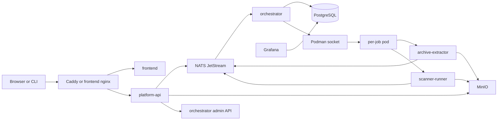
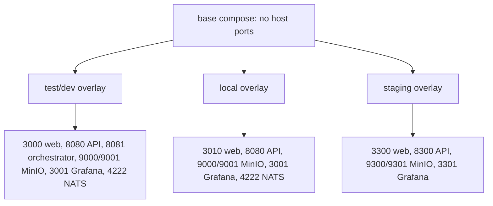
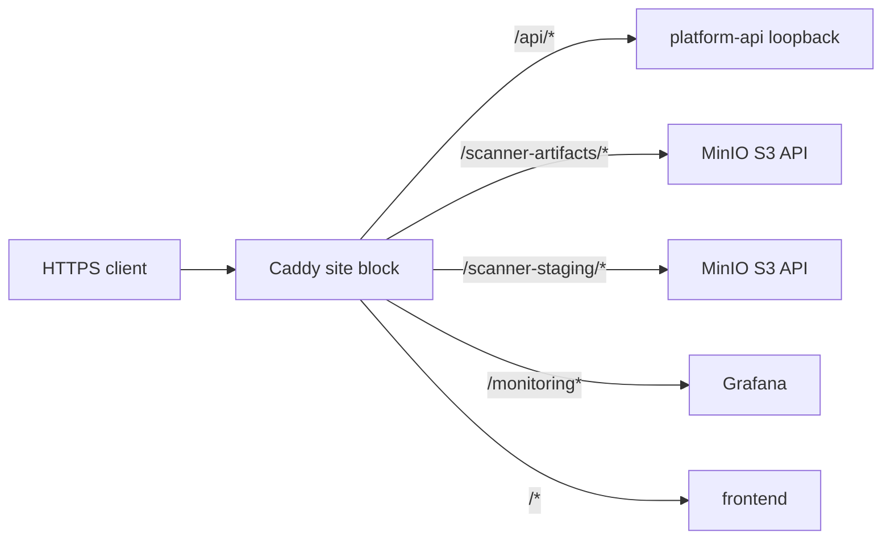
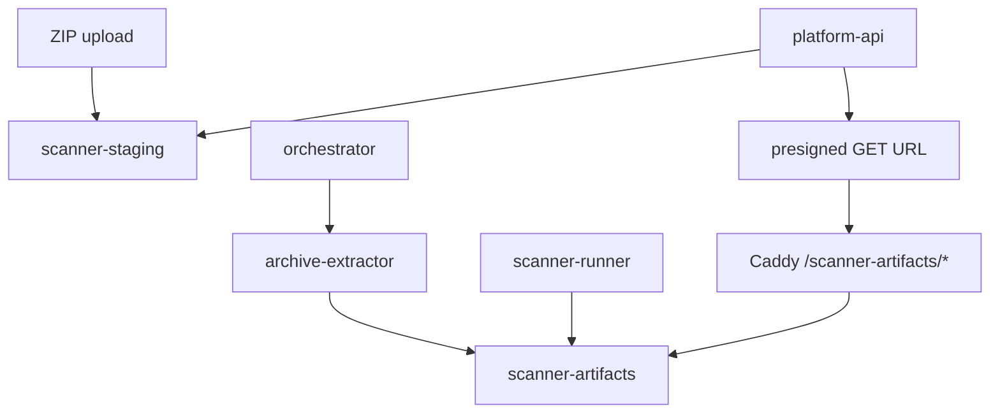
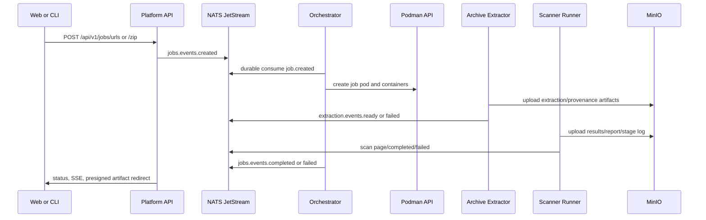

# StageFlow Infra Repo Map

This map covers the `infra` slice: Podman Compose topology, Caddy edge routing, MinIO bootstrap, Grafana provisioning, scanner config, security guidance, local scripts, root `justfile` workflows, and GitHub Actions runtime wiring. It is grounded in local source citations using `path:line`; upstream runtime notes are separated in "External semantics checked" so local behavior and general tool behavior do not blur.

## At A Glance

StageFlow's repo-managed runtime is a Podman Compose stack with NATS JetStream, MinIO, PostgreSQL, Grafana, Platform API, Orchestrator, and static frontend services. The base compose file defines services, networks, volumes, healthchecks, resource limits, and internal service-to-service environment. Overlays decide which loopback ports are exposed for local, test/dev, and staging use. The root `justfile` is the primary operator entrypoint for setup, image build, stack lifecycle, MinIO bootstrap, quality checks, and guarded deployment delegation.

Local source anchors:

| Area | What to read | Source |
|---|---|---|
| Compose base | All services, named volumes, external network | `infra/compose/podman-compose.yml:4`, `infra/compose/podman-compose.yml:322`, `infra/compose/podman-compose.yml:329` |
| Local overlay | Developer ports and private target allowance | `infra/compose/podman-compose.local.yml:1`, `infra/compose/podman-compose.local.yml:18`, `infra/compose/podman-compose.local.yml:35` |
| Test/dev overlay | `just dev up` default overlay with localhost ports | `infra/compose/podman-compose.test.yml:1`, `justfile:187` |
| Staging overlay | Alternate loopback ports for a domain-like stack | `infra/compose/podman-compose.staging.yml:1`, `justfile:333` |
| Caddy edge | Public-domain routing reference, not production boundary | `infra/caddy/Caddyfile:1`, `infra/caddy/Caddyfile:10` |
| MinIO bootstrap | Buckets, anonymous access disablement, app policy/user | `infra/minio/init-buckets.sh:16`, `infra/minio/init-buckets.sh:65`, `infra/minio/init-buckets.sh:70` |
| Grafana | Datasource and dashboard file provisioning | `infra/grafana/provisioning/datasources/orchestrator.yml:3`, `infra/grafana/provisioning/dashboards/dashboards.yml:3` |
| Images | Local image build and inventory check | `infra/scripts/build-images.sh:36`, `infra/scripts/verify-image-inventory.sh:6` |
| CI | Main CI, golden regression, CLI release | `.github/workflows/ci.yml:1`, `.github/workflows/golden-regression.yml:1`, `.github/workflows/release-stageflow-cli.yml:1` |

## Compose Topology

The base file intentionally exposes no host ports; operators apply an overlay to bind loopback ports for the target environment. That boundary is stated in comments at `infra/compose/podman-compose.yml:1` and `infra/compose/podman-compose.yml:2`.

| Service | Image/build | Internal port or command | Dependencies | Volumes | Healthcheck | Security/resource controls |
|---|---|---|---|---|---|---|
| `nats` | `docker.io/library/nats:2.12.2-alpine` | `-js -sd /data -m 8222` enables JetStream storage and HTTP monitoring | None | `nats_data:/data` | `http://127.0.0.1:8222/healthz` | `init: true`, `no-new-privileges`, 256M/1 CPU limit, JSON logs `10m x3`; `infra/compose/podman-compose.yml:6` |
| `minio` | `docker.io/minio/minio:RELEASE.2025-09-07T16-13-09Z` | `server /data --console-address ":9001"` | None | `minio_data:/data` | `/minio/health/live` on port 9000 | required root credentials, 512M/2 CPU limit, `no-new-privileges`, JSON logs `20m x3`; `infra/compose/podman-compose.yml:40` |
| `postgres` | `docker.io/library/postgres:17-alpine` | standard PostgreSQL on 5432 | None | `postgres_data:/var/lib/postgresql/data` | `pg_isready` using compose env | required password, 512M/2 CPU limit, `no-new-privileges`, JSON logs `20m x3`; `infra/compose/podman-compose.yml:74` |
| `grafana` | `docker.io/grafana/grafana:12.2.0` | `GF_SERVER_HTTP_PORT=3001`; subpath serving enabled | healthy `postgres` and `orchestrator` | `grafana_data`, provisioning bind mount | `/api/health` on 3001 | auth required through admin env, 256M/1 CPU limit, `no-new-privileges`, JSON logs `10m x3`; `infra/compose/podman-compose.yml:111` |
| `platform-api` | build `services/platform-api/Dockerfile`, image `localhost/stageflow/platform-api:latest` | `PORT=8080` | healthy `nats`, `minio`, `orchestrator` | `web_server_data:/data`, scanner config read-only | `/usr/local/bin/platform-api-healthcheck` | required MinIO and orchestrator tokens, 512M/2 CPU limit, 30s stop grace, `no-new-privileges`, JSON logs `20m x5`; `infra/compose/podman-compose.yml:161` |
| `orchestrator` | build `services/orchestrator/Dockerfile`, image `localhost/stageflow/orchestrator:latest` | `API_PORT=8081` | healthy `nats`, `minio`, `postgres` | rootless Podman socket, scanner config read-only | `/usr/local/bin/orchestrator-healthcheck` | runs as `0:0` in base compose for socket access, disables SELinux labels on socket mount, 512M/4 CPU limit, 60s stop grace; `infra/compose/podman-compose.yml:218` |
| `frontend` | build `clients/web/Dockerfile`, image `localhost/stageflow/frontend:latest` | nginx listens on 3000 | healthy `platform-api` | none | `http://127.0.0.1:3000/` | 64M/0.5 CPU limit, 10s stop grace, `no-new-privileges`, JSON logs `10m x3`; `infra/compose/podman-compose.yml:281` |

### Networks And Volumes

| Resource | Purpose | Citation |
|---|---|---|
| `stageflow_net` | External Podman network used by all base services; name defaults to `stageflow_net` or `STAGEFLOW_NETWORK_NAME` | `infra/compose/podman-compose.yml:329` |
| `nats_data` | JetStream file storage because NATS runs with `-sd /data` | `infra/compose/podman-compose.yml:8`, `infra/compose/podman-compose.yml:322` |
| `minio_data` | Object storage data | `infra/compose/podman-compose.yml:47`, `infra/compose/podman-compose.yml:324` |
| `postgres_data` | PostgreSQL data directory | `infra/compose/podman-compose.yml:80`, `infra/compose/podman-compose.yml:325` |
| `web_server_data` | Platform API writable `/data`; scanner config is additionally mounted read-only | `infra/compose/podman-compose.yml:182`, `infra/compose/podman-compose.yml:184` |
| `grafana_data` | Grafana application data; provisioning files are read-only bind-mounted from repo | `infra/compose/podman-compose.yml:123`, `infra/compose/podman-compose.yml:125` |

## Overlays And Ports

| Overlay | Compose files | Intended use | Host ports | Important env changes |
|---|---|---|---|---|
| Base only | `podman-compose.yml` | Shared topology; no host surface by itself | none | public-domain defaults, internal service names, required secrets |
| `dev` / test | base + `podman-compose.test.yml` | Default `just dev up` stack; exposes all common test ports on loopback | NATS `4222`, MinIO `9000/9001`, Grafana `3001`, API `8080`, Orchestrator `8081`, frontend `3000` | MinIO public endpoint `localhost:9000`, public SSL false, proxy URLs false, CORS localhost |
| `local` | base + `podman-compose.local.yml` | Demo/golden/local app scanning; frontend on 3010 and job pods use host networking | NATS `4222`, MinIO `9000/9001`, Grafana `3001`, API `8080`, frontend `3010` | `PLATFORM_API_ALLOW_PRIVATE_TARGETS=true`; Orchestrator `userns_mode=keep-id`, `POD_NETNS_MODE=host`, blank `POD_NETWORK` |
| `staging` | base + `podman-compose.staging.yml` | Production-like stack behind an external edge on alternate loopback ports | MinIO `9300/9301`, Grafana `3301`, API `8300`, frontend `3300` | Env supplied by `.env.staging`; project/network are recipe parameters |

Port citations: test overlay `infra/compose/podman-compose.test.yml:5`, local overlay `infra/compose/podman-compose.local.yml:15`, staging overlay `infra/compose/podman-compose.staging.yml:9`. `just dev` selects `test` for `ENV=dev` and `local` for `ENV=local` at `justfile:187`. `just staging` selects the staging overlay at `justfile:370`.

## Environment Wiring

Compose uses `${VAR:?message}` for required values and `${VAR:-default}` for defaults. Docker Compose interpolation documents this syntax and applies interpolation before file merge; Podman `podman compose` delegates Compose behavior through its provider. Local usage is in the checked-in compose and `justfile`, not inferred.

| Env group | Variables | Consumers | Local source |
|---|---|---|---|
| MinIO server | `MINIO_ROOT_USER`, `MINIO_ROOT_PASSWORD`, `MINIO_DOMAIN` | `minio` container | `infra/compose/podman-compose.yml:43` |
| MinIO clients | `MINIO_ENDPOINT`, `MINIO_PUBLIC_ENDPOINT`, `MINIO_ACCESS_KEY`, `MINIO_SECRET_KEY`, `MINIO_USE_SSL`, `MINIO_PUBLIC_USE_SSL`, `MINIO_USE_PROXY_URLS` | Platform API, Orchestrator, scanner/extractor job pods | `infra/compose/podman-compose.yml:170`, `libs/go/config/loaders.go:35`, `services/scanner-runner/src/core/config-loader.ts:78` |
| PostgreSQL | `POSTGRES_DB`, `POSTGRES_USER`, `POSTGRES_PASSWORD`, `DATABASE_URL` | `postgres`, Grafana datasource, Orchestrator repository | `infra/compose/podman-compose.yml:76`, `infra/compose/podman-compose.yml:120`, `infra/compose/podman-compose.yml:234` |
| NATS | `NATS_URL`, reconnect defaults in shared loader | Platform API, Orchestrator, job pods | `infra/compose/podman-compose.yml:168`, `infra/compose/podman-compose.yml:232`, `libs/go/config/loaders.go:13` |
| Platform auth/CORS | `PLATFORM_API_TOKEN`, `PLATFORM_API_AUTH_DISABLED`, `PLATFORM_API_CORS_ALLOW_ORIGINS`, optional `PLATFORM_API_TRUSTED_PROXIES` | Platform API middleware | `.env.example:36`, `.env.example:38`, `services/platform-api/internal/api/middleware.go:280`, `services/platform-api/internal/api/middleware.go:304` |
| Orchestrator admin/API | `ORCHESTRATOR_API_TOKEN`, `ORCHESTRATOR_API_URL`, `API_PORT` | Platform API status client, Orchestrator admin API | `infra/compose/podman-compose.yml:180`, `infra/compose/podman-compose.yml:243`, `services/orchestrator/cmd/orchestrator/config.go:72` |
| Podman job runtime | `PODMAN_SOCKET`, `POD_NETWORK`, `POD_NETNS_MODE`, `NATS_HOST`, `MINIO_HOST`, `EXTRACTION_IMAGE`, `SCANNER_IMAGE` | Orchestrator pod/container launcher | `infra/compose/podman-compose.yml:229`, `infra/compose/podman-compose.yml:240`, `services/orchestrator/cmd/orchestrator/config.go:67` |
| Frontend build | `VITE_API_URL`, `VITE_SITE_TITLE`, `VITE_SITE_URL`, `VITE_GITHUB_URL`, `VITE_TAGLINE`, `VITE_AI_NAVIGATOR_DEFAULT_MODEL` | SvelteKit static build baked into nginx image | `infra/compose/podman-compose.yml:286`, `clients/web/Dockerfile:20`, `clients/web/src/lib/api/utils.ts:13` |
| AI scanner optional | `OPENROUTER_API_KEY`, `OPENROUTER_APP_TITLE`, `OPENROUTER_APP_REFERER` | Orchestrator launch planning for AI-capable scanner config | `.env.example:22`, `infra/compose/podman-compose.yml:247`, `services/orchestrator/cmd/orchestrator/config.go:81` |
| Deployment guardrails | `STAGEFLOW_PROTECTED_HOST`, `STAGEFLOW_ALLOW_VPS_LOCAL_STACKS`, `STAGEFLOW_PROD_DEPLOY_DIR`, `STAGEFLOW_DEPLOY_CONTROL_PLANE` | `just demo`, `just dev`, `just staging`, `just deploy` | `.env.example:53`, `justfile:103`, `justfile:170`, `justfile:353` |

Default env templates:

| File | Purpose | Notes |
|---|---|---|
| `.env.example` | Local-first defaults copied to `.env` | Includes local MinIO/Postgres/Grafana/API/frontend values, optional AI keys, and guardrail variables; `.env.example:1`, `.env.example:5`, `.env.example:34`, `.env.example:53` |
| `infra/.env.staging.example` | Staging env template | Sets public-domain values, `GF_SERVER_ROOT_URL` under `/monitoring`, and staging CORS; `infra/.env.staging.example:1`, `infra/.env.staging.example:16`, `infra/.env.staging.example:27`, `infra/.env.staging.example:39` |

## Caddy Edge

The checked-in Caddyfiles are examples for staging/self-hosted environments, not the live `stageflow.org` production boundary. The main file states this directly and assumes upstream services on `127.0.0.1:3100`, `3101`, `8100`, and `9100`; `infra/caddy/Caddyfile:1`, `infra/caddy/Caddyfile:3`. The staging example maps to the staging overlay ports `3300`, `8300`, `9300`, and `3301`; `infra/caddy/Caddyfile.staging.example:5`.

| Route | Main Caddy upstream | Staging example upstream | Behavior | Citation |
|---|---:|---:|---|---|
| `/api/*` | `127.0.0.1:8100` | `127.0.0.1:8300` | Reverse proxies Platform API | `infra/caddy/Caddyfile:12`, `infra/caddy/Caddyfile.staging.example:12` |
| `/scanner-artifacts/*` | `127.0.0.1:9100` | `127.0.0.1:9300` | Adds CORS headers, answers `OPTIONS 204`, preserves Host header for SigV4 presigned URL validation | `infra/caddy/Caddyfile:17`, `infra/caddy/Caddyfile.staging.example:16` |
| `/scanner-staging/*` | `127.0.0.1:9100` | `127.0.0.1:9300` | Same CORS/preflight/Host handling for staging bucket paths | `infra/caddy/Caddyfile:38`, `infra/caddy/Caddyfile.staging.example:33` |
| `/monitoring*` | `127.0.0.1:3101` | `127.0.0.1:3301` | Imports optional Basic Auth snippet and proxies Grafana subpath | `infra/caddy/Caddyfile:55`, `infra/caddy/Caddyfile.staging.example:48` |
| `/*` | `127.0.0.1:3100` | `127.0.0.1:3300` | Frontend fallback | `infra/caddy/Caddyfile:66`, `infra/caddy/Caddyfile.staging.example:53` |

Why Host preservation matters locally: MinIO public presigning uses a public endpoint client when configured, so private buckets can be served through the public Caddy/MinIO route; `libs/go/storage/minio.go:303`. The Caddy route then passes the original request host to MinIO; `infra/caddy/Caddyfile:32`.

External semantics checked:

| Tool | Relevant official semantics | Link |
|---|---|---|
| Caddy `handle` | Sibling `handle` blocks are mutually exclusive; first matching block is evaluated and a handle without matcher acts as fallback | https://caddyserver.com/docs/caddyfile/directives/handle |
| Caddy `reverse_proxy` | Proxies requests to one or more backends and supports request header manipulation through `header_up` | https://caddyserver.com/docs/caddyfile/directives/reverse_proxy |
| Caddy Automatic HTTPS | Site addresses with hostnames activate automatic HTTPS unless explicitly disabled | https://caddyserver.com/docs/automatic-https |

## MinIO Storage And Bootstrap

StageFlow uses two stable buckets: `scanner-staging` and `scanner-artifacts`. They are defined in shared Go storage code and in the bootstrap shell script; `libs/go/storage/minio.go:126`, `infra/minio/init-buckets.sh:16`.

| Bootstrap step | Detail | Source |
|---|---|---|
| Client container | Runs official MinIO Client image via `$PODMAN run --rm --network "$MC_NETWORK"` and injects an `MC_HOST_<alias>` URL | `infra/minio/init-buckets.sh:6`, `infra/minio/init-buckets.sh:38`, `infra/minio/init-buckets.sh:40` |
| Bucket create | Creates `scanner-staging` and `scanner-artifacts` if missing | `infra/minio/init-buckets.sh:54`, `infra/minio/init-buckets.sh:56` |
| Anonymous access | Sets anonymous policy to `none` on both buckets | `infra/minio/init-buckets.sh:65`, `infra/minio/init-buckets.sh:67` |
| App-user guard | Refuses to manage an app user if `MINIO_ACCESS_KEY` equals `MINIO_ROOT_USER` | `infra/minio/init-buckets.sh:70` |
| App policy | Allows bucket location/list/multipart list on both buckets and object get/put/delete/multipart operations under both bucket prefixes | `infra/minio/init-buckets.sh:80`, `infra/minio/init-buckets.sh:86`, `infra/minio/init-buckets.sh:98` |
| User and attach | Removes/recreates user and policy, then attaches policy to user | `infra/minio/init-buckets.sh:114`, `infra/minio/init-buckets.sh:122`, `infra/minio/init-buckets.sh:126` |

Runtime bucket behavior also exists in code: Platform API starts MinIO with `EnsureBuckets: true`; `services/platform-api/cmd/server/main.go:65`. Shared bootstrap calls `EnsureBuckets` when requested; `libs/go/bootstrap/bootstrap.go:58`. `EnsureBuckets` creates the two stable buckets if missing and retries failures; `libs/go/storage/minio.go:184`, `libs/go/storage/minio.go:197`.

External semantics checked:

| Tool | Relevant official semantics | Link |
|---|---|---|
| MinIO `mc anonymous` | The command family sets or removes anonymous bucket policies; anonymous policies grant unauthenticated bucket/object access | https://min.io/docs/minio/linux/reference/minio-mc.html |
| MinIO `mc admin policy attach` | Attaches IAM-style policies to a MinIO-managed user or group; exactly one `--user` or `--group` is required | https://min.io/docs/minio/linux/reference/minio-mc-admin/mc-admin-policy-attach.html |
| MinIO `mc admin policy` | MinIO policy-based access control uses IAM-compatible JSON policy documents | https://min.io/docs/minio/linux/reference/minio-mc-admin/mc-admin-policy.html |

## Scanner Config

The compose services mount `infra/scanners/scanners.yaml` read-only into both Platform API and Orchestrator at `/data/scanners.yaml`; `infra/compose/podman-compose.yml:184`, `infra/compose/podman-compose.yml:230`. Both services set `SCANNER_CONFIG_PATH=/data/scanners.yaml`; `infra/compose/podman-compose.yml:169`, `infra/compose/podman-compose.yml:235`.

| File | Role | Enabled scanners | Citation |
|---|---|---|---|
| `infra/scanners/scanners.example.yaml` | Template copied by setup when local config is missing | `axe`, `lighthouse`; all others disabled | `infra/scanners/scanners.example.yaml:1`, `infra/scanners/scanners.example.yaml:8`, `infra/scanners/scanners.example.yaml:19` |
| `infra/scanners/scanners.yaml` | Current deployment override mounted into compose services | `axe`, `lighthouse`, `link-checker`, `seo`, `security-headers`, `open-graph`, `spelling-grammar`; `ai-navigator` disabled | `infra/scanners/scanners.yaml:1`, `infra/scanners/scanners.yaml:8`, `infra/scanners/scanners.yaml:19` |
| `infra/scripts/ensure-scanner-config.sh` | Creates `scanners.yaml` from example and rejects non-file paths | Copies example if missing; removes empty accidental directory | `infra/scripts/ensure-scanner-config.sh:4`, `infra/scripts/ensure-scanner-config.sh:8`, `infra/scripts/ensure-scanner-config.sh:23` |

Platform API applies scanner overrides while building its registry; `services/platform-api/cmd/server/main.go:162`. Orchestrator repeats the same override/default pattern and can also let `SCANNER_IMAGE` override the default image in registry config; `services/orchestrator/cmd/orchestrator/main.go:194`, `services/orchestrator/cmd/orchestrator/main.go:241`.

## Grafana Provisioning

Grafana is served from `/monitoring` when the Caddy examples are used. Compose config sets `GF_SERVER_HTTP_PORT=3001` and `GF_SERVER_SERVE_FROM_SUB_PATH=true`, while `GF_SERVER_ROOT_URL` must come from env; `infra/compose/podman-compose.yml:117`, `infra/compose/podman-compose.yml:118`, `infra/compose/podman-compose.yml:119`.

| Provisioning file | Purpose | Source |
|---|---|---|
| `infra/grafana/provisioning/datasources/orchestrator.yml` | Adds a default PostgreSQL datasource named `Orchestrator DB`, using `postgres:5432`, `POSTGRES_USER`, `POSTGRES_DB`, and `POSTGRES_PASSWORD` from env | `infra/grafana/provisioning/datasources/orchestrator.yml:3`, `infra/grafana/provisioning/datasources/orchestrator.yml:8`, `infra/grafana/provisioning/datasources/orchestrator.yml:15` |
| `infra/grafana/provisioning/dashboards/dashboards.yml` | Loads dashboards from `/etc/grafana/provisioning/dashboards`, folder `StageFlow`, with UI updates allowed and 10-second update interval | `infra/grafana/provisioning/dashboards/dashboards.yml:3`, `infra/grafana/provisioning/dashboards/dashboards.yml:9`, `infra/grafana/provisioning/dashboards/dashboards.yml:12` |
| `job-overview.json` | Dashboard titled `StageFlow - Job Overview`, UID `stageflow-job-overview`, with panels such as jobs by state, totals, failures, time series, and recent jobs | `infra/grafana/provisioning/dashboards/job-overview.json:63`, `infra/grafana/provisioning/dashboards/job-overview.json:119`, `infra/grafana/provisioning/dashboards/job-overview.json:391` |
| `provenance-validation.json` | Dashboard titled `StageFlow - Provenance Validation`, UID `stageflow-provenance`, with panels for provenance artifacts, coverage, distribution, and missing provenance | `infra/grafana/provisioning/dashboards/provenance-validation.json:64`, `infra/grafana/provisioning/dashboards/provenance-validation.json:129`, `infra/grafana/provisioning/dashboards/provenance-validation.json:396` |

External semantics checked:

| Tool | Relevant official semantics | Link |
|---|---|---|
| Grafana provisioning | Grafana can manage datasources and dashboards from version-controlled provisioning files and can use environment variables in provisioning configuration | https://grafana.com/docs/grafana/latest/administration/provisioning/ |
| Grafana datasources | Datasources are storage backends that dashboards query | https://grafana.com/docs/grafana/latest/datasources/ |

## Job Runtime Integration

| Integration point | Infra wiring | Runtime behavior | Source |
|---|---|---|---|
| Platform API | Compose sets `PORT=8080`, `NATS_URL=nats://nats:4222`, MinIO internal/public endpoints, scanner config, and Orchestrator admin URL/token | Startup validates config, auth, and security policy, connects to NATS with stream ensure, connects to MinIO with bucket ensure, subscribes status events, and serves HTTP | `infra/compose/podman-compose.yml:166`, `services/platform-api/cmd/server/config.go:17`, `services/platform-api/cmd/server/main.go:34` |
| Platform routes | Caddy and nginx proxy `/api/*` to Platform API | Public routes include URL jobs, ZIP jobs, job status/stream, projects, scanners, and health | `infra/caddy/Caddyfile:12`, `clients/web/nginx.conf:8`, `services/platform-api/internal/api/router.go:8` |
| URL jobs | Local overlay can enable private targets; base public mode defaults to SSRF protections | URL jobs validate HTTP(S), resolve/block unsafe IPs unless private-target mode is allowed, normalize modules/config, store auth state, and publish `job.created` | `infra/compose/podman-compose.local.yml:18`, `services/platform-api/internal/api/security.go:38`, `services/platform-api/internal/api/handlers_jobs_url_submit.go:77` |
| ZIP jobs | MinIO staging bucket exists through bootstrap/runtime bucket ensure | ZIP upload streams multipart, uploads archive/staging data, and enqueues extraction/scanning | `services/platform-api/internal/api/handlers_jobs_zip_upload.go:89`, `libs/go/storage/minio.go:128` |
| Orchestrator | Compose mounts rootless Podman socket and scanner config, sets images and service hostnames | Startup validates DB, socket, image, NATS, MinIO, and token config; creates MinIO/NATS/Postgres/Podman clients; starts consumers and admin API | `infra/compose/podman-compose.yml:223`, `services/orchestrator/cmd/orchestrator/config.go:92`, `services/orchestrator/cmd/orchestrator/main.go:51` |
| Job pod creation | Base sets `POD_NETWORK` to external `stageflow_net`; local overlay uses host netns | Orchestrator creates a `job-<id>` Podman pod, labels it, attaches network in bridge mode, and passes host mappings | `infra/compose/podman-compose.yml:246`, `infra/compose/podman-compose.local.yml:31`, `services/orchestrator/internal/adapters/runtime/job_runtime.go:108` |
| Archive Extractor | Image built from `services/archive-extractor/Dockerfile`, launched by Orchestrator via `EXTRACTION_IMAGE` | Receives `JOB_ID`, `INPUT_PATH`, NATS/MinIO env, `/workspace`, `PORT=8080`, artifact bucket; validates required env before extraction | `infra/scripts/build-images.sh:49`, `services/orchestrator/internal/adapters/runtime/job_runtime.go:220`, `services/archive-extractor/cmd/server/main.go:368` |
| Scanner Runner | Image built from `services/scanner-runner/Dockerfile`, launched by Orchestrator via scanner registry/image | Receives job/scanner IDs, NATS/MinIO env, artifact bucket, provenance/results paths, timeout/screenshot settings, optional `ALLOW_PRIVATE_TARGETS`; publishes scan lifecycle events | `infra/scripts/build-images.sh:51`, `services/orchestrator/internal/application/jobs/scanner_launch_planner.go:183`, `services/scanner-runner/src/core/event-publisher.ts:96` |
| Frontend | Image bakes `VITE_*` build args and serves via nginx on 3000 | API base resolves from `VITE_API_URL`, dev default `localhost:8080`, or browser origin in production | `clients/web/Dockerfile:20`, `clients/web/nginx.conf:1`, `clients/web/src/lib/api/utils.ts:13` |
| Shared messaging | NATS stream creation is shared; Platform API and Orchestrator both use typed subscriptions | Streams: `jobs`, `extraction`, `scan`; subjects include job created/completed/failed, extraction ready/failed, scan page/completed/failed | `libs/go/messaging/streams.go:11`, `services/orchestrator/internal/adapters/messaging/consumers.go:38`, `services/platform-api/internal/messaging/service.go:40` |
| Shared storage | MinIO client supports internal and public endpoints | Presigned report URLs can be generated against a configured public endpoint; Platform API redirects to the presigned URL | `libs/go/storage/minio.go:142`, `libs/go/storage/minio.go:303`, `services/platform-api/internal/api/handlers_jobs_status.go:142` |

## Image Build And Inventory

| Script/command | What it does | Source |
|---|---|---|
| `infra/scripts/build-images.sh` | Resolves repo root, loads `.env` if present, builds local Podman images, tags both `localhost/stageflow/...:latest` and `stageflow/...:latest`, then verifies inventory | `infra/scripts/build-images.sh:4`, `infra/scripts/build-images.sh:17`, `infra/scripts/build-images.sh:24`, `infra/scripts/build-images.sh:62` |
| Platform API image | Go 1.26.3 build, Debian runtime, nonroot UID 65532, exposes 8080 | `services/platform-api/Dockerfile:3`, `services/platform-api/Dockerfile:39`, `services/platform-api/Dockerfile:52`, `services/platform-api/Dockerfile:55` |
| Orchestrator image | Go 1.26.3 build, Debian runtime, nonroot default in image; compose overrides user for socket access | `services/orchestrator/Dockerfile:3`, `services/orchestrator/Dockerfile:35`, `services/orchestrator/Dockerfile:44`, `infra/compose/podman-compose.yml:223` |
| Frontend image | Bun 1.3.8 static build, nginx 1.29-alpine runtime, exposes 3000 | `clients/web/Dockerfile:5`, `clients/web/Dockerfile:45`, `clients/web/Dockerfile:60` |
| Archive Extractor image | Go 1.26.3 Alpine build, Alpine runtime, nonroot `extractor` user | `services/archive-extractor/Dockerfile:3`, `services/archive-extractor/Dockerfile:27`, `services/archive-extractor/Dockerfile:29` |
| Scanner Runner image | Bun/Node/Playwright build, Playwright runtime, `pwuser`, `/data` volume, 8080 healthcheck | `services/scanner-runner/Dockerfile:4`, `services/scanner-runner/Dockerfile:51`, `services/scanner-runner/Dockerfile:77`, `services/scanner-runner/Dockerfile:81` |
| `infra/scripts/verify-image-inventory.sh` | Fails if any required local image is missing: platform-api, orchestrator, frontend, extractor, scanner-runner | `infra/scripts/verify-image-inventory.sh:6`, `infra/scripts/verify-image-inventory.sh:22` |

## Root Justfile Workflows

| Recipe | Purpose | Infra files touched/read | Guardrails and checks | Source |
|---|---|---|---|---|
| `just setup` | Creates `stageflow_net`, then runs deps | `infra/scripts/ensure-scanner-config.sh` through `deps` | none beyond command failures | `justfile:39` |
| `just deps` | Ensures scanner config, syncs Go workspace, installs web and scanner-runner Bun deps | scanner config | frozen Bun lockfiles; skips Playwright browser download for scanner deps | `justfile:49` |
| `just diagnose` | Runs local prerequisite diagnosis | `infra/scripts/diagnose-local-env.sh` | Checks Go/Bun/Node/Podman/just/curl, Podman socket, network, images, ports, env hints, scanner config | `justfile:66`, `infra/scripts/diagnose-local-env.sh:130` |
| `just demo [URL]` | Full local smoke path: diagnose, setup, images, stack restart, MinIO init, wait for services, print endpoints | `.env`, build scripts, local/dev stack | Refuses on protected host unless explicitly allowed; requires `.env` | `justfile:70`, `justfile:103`, `justfile:109` |
| `just dev CMD ENV ENDPOINT` | Local stack lifecycle: `up`, `down`, `restart`, `logs`, `init`; `ENV=dev|local` | base + test/local overlay | Protected-host guard; ensures network/config; requires job images before up/restart; init sources `.env` and runs MinIO bootstrap | `justfile:159`, `justfile:170`, `justfile:186`, `justfile:200` |
| `just dev-refresh` | Rebuild/recreate selected compose services | base + test/local overlay | Protected-host guard; retries after removing selected services if Podman reports conflicts | `justfile:267`, `justfile:313`, `justfile:324` |
| `just staging CMD` | Staging stack lifecycle: `up`, `down`, `restart`, `logs`, `init`, `ps` | base + staging overlay and env file | Protected-host guard; requires env file; creates configured network; MinIO init uses staging endpoint | `justfile:333`, `justfile:353`, `justfile:365`, `justfile:377` |
| `just images` | Builds all container images via infra script | `infra/scripts/build-images.sh` | Inventory verification happens in script | `justfile:540`, `infra/scripts/build-images.sh:62` |
| `just ci` | Local CI mirror: stale vocab, Go build/lint/test/vuln, CLI docs diff, shell tests, frontend CI/storybook/audit, scanner CI/audit | repo-wide | Installs specific Go tools, runs race tests and audits | `justfile:422`, `justfile:462`, `justfile:481`, `justfile:502` |
| `just build` | Build Go modules, web, scanner-runner after deps | repo-wide | command failures only | `justfile:520` |
| `just deploy` | Delegates hosted demo deployment to external control plane | external `/home/matt/Deployment` by default | Fails if control-plane justfile is absent and points to repo-managed docs for local/staging/self-hosted | `justfile:20`, `justfile:25`, `justfile:29` |

The deployment notes reinforce that hosted `stageflow.org` production release, verification, monitoring, rollback, and host-level control plane are outside this public repo; `docs/operations/deployment.md:30`.

## CI And Release Workflows

| Workflow | Trigger | Runtime mapping | Artifacts | Source |
|---|---|---|---|---|
| `CI` | Push/PR to `main` | Uses Go `1.26.3`, Node `22`, Bun `1.3.8`; lints workflows, runs gitleaks, Go build/lint/test/vuln, web CI/storybook, scanner-runner CI, image builds/SBOM/Trivy | Storybook failure artifacts, SBOMs per image | `.github/workflows/ci.yml:3`, `.github/workflows/ci.yml:21`, `.github/workflows/ci.yml:68`, `.github/workflows/ci.yml:272` |
| `Golden Regression` | Manual dispatch and daily cron `23 8 * * *` | Installs Podman, copies `.env.example`, appends CI tokens, builds CLI and images, starts base+local compose stack, waits for MinIO/API/frontend, initializes MinIO, runs `qa/e2e/project-scan-golden.sh` | Failure logs and `artifacts/project-golden` | `.github/workflows/golden-regression.yml:3`, `.github/workflows/golden-regression.yml:49`, `.github/workflows/golden-regression.yml:60`, `.github/workflows/golden-regression.yml:76`, `.github/workflows/golden-regression.yml:101` |
| `Release StageFlow CLI` | Tag `clients/cli/v*` or manual dispatch | Matrix builds CLI for linux/darwin/windows on amd64/arm64 except windows arm64; uses Go `1.26.3`; creates GitHub release only for tag refs | Tar/zip CLI assets and `checksums.txt` | `.github/workflows/release-stageflow-cli.yml:3`, `.github/workflows/release-stageflow-cli.yml:20`, `.github/workflows/release-stageflow-cli.yml:28`, `.github/workflows/release-stageflow-cli.yml:93` |

Image CI builds the same five Dockerfiles referenced by local image scripts: Platform API, Orchestrator, Archive Extractor, Scanner Runner, and Frontend; `.github/workflows/ci.yml:280`. Golden regression starts the same base+local overlay used for local host-network scans; `.github/workflows/golden-regression.yml:79`.

## Security And Operational Controls

| Control | Local behavior | Citation |
|---|---|---|
| Host-port minimization | Base compose exposes no ports; overlays bind loopback only | `infra/compose/podman-compose.yml:2`, `infra/compose/podman-compose.test.yml:6`, `infra/compose/podman-compose.staging.yml:10` |
| `no-new-privileges` | Set on NATS, MinIO, Postgres, Grafana, Platform API, Orchestrator, Frontend in base compose | examples: `infra/compose/podman-compose.yml:22`, `infra/compose/podman-compose.yml:64`, `infra/compose/podman-compose.yml:225` |
| Resource limits | Memory/CPU limits and reservations configured for base services | examples: `infra/compose/podman-compose.yml:24`, `infra/compose/podman-compose.yml:55`, `infra/compose/podman-compose.yml:256` |
| Log rotation | JSON-file logging max-size/max-file per service | examples: `infra/compose/podman-compose.yml:34`, `infra/compose/podman-compose.yml:212`, `infra/compose/podman-compose.yml:275` |
| API auth | Platform API requires token unless `PLATFORM_API_AUTH_DISABLED=true`; warning says not for production | `services/platform-api/internal/api/middleware.go:304`, `.env.example:38` |
| CORS | Compose defaults to public domain origins; local/test overlays override to localhost origins | `infra/compose/podman-compose.yml:179`, `infra/compose/podman-compose.local.yml:24`, `infra/compose/podman-compose.test.yml:25` |
| SSRF/private targets | URL validation rejects unsafe targets in public mode; local overlay explicitly enables private target scans | `services/platform-api/internal/api/security.go:38`, `infra/compose/podman-compose.local.yml:18` |
| Scanner egress | Repo provides a template denying loopback/private/link-local/metadata/reserved ranges, while noting local differs | `infra/security/egress-policy.example.md:3`, `infra/security/egress-policy.example.md:7`, `infra/security/egress-policy.example.md:14` |
| Production-host guardrails | `just demo`, `just dev`, and `just staging` refuse to run repo-local stacks on a protected host unless allowed | `justfile:103`, `justfile:170`, `justfile:353` |
| MinIO app user separation | Bootstrap refuses to manage app credentials equal to root credentials | `infra/minio/init-buckets.sh:70` |
| Private buckets with signed access | Bootstrap disables anonymous access; Platform API redirects via presigned URLs | `infra/minio/init-buckets.sh:65`, `services/platform-api/internal/api/handlers_jobs_status.go:142` |

## Local Diagnosis

`infra/scripts/diagnose-local-env.sh` is read-only diagnostics. It does not start the stack. It validates tooling and likely misconfigurations before `just demo` or manual stack operations.

| Check | Details | Source |
|---|---|---|
| Tool availability | Go, Bun, Node.js, Podman, just, curl | `infra/scripts/diagnose-local-env.sh:132` |
| Version expectations | Go `>=1.26.3`, Bun `>=1.3.8`, Node major `22` | `infra/scripts/diagnose-local-env.sh:13`, `infra/scripts/diagnose-local-env.sh:139` |
| Podman readiness | `podman info`, `podman compose version`, socket path from `PODMAN_SOCKET` or `XDG_RUNTIME_DIR`, `/dev/net/tun`, `stageflow_net` | `infra/scripts/diagnose-local-env.sh:168`, `infra/scripts/diagnose-local-env.sh:175`, `infra/scripts/diagnose-local-env.sh:181`, `infra/scripts/diagnose-local-env.sh:194` |
| Port conflicts | Checks common local/demo ports `3000`, `3001`, `3010`, `4222`, `8080`, `9000`, `9001` with `ss` or `lsof` | `infra/scripts/diagnose-local-env.sh:95`, `infra/scripts/diagnose-local-env.sh:100` |
| Env hints | Warns when `.env` still points public-domain values during local work and fails when app MinIO key equals root user | `infra/scripts/diagnose-local-env.sh:212`, `infra/scripts/diagnose-local-env.sh:221`, `infra/scripts/diagnose-local-env.sh:233` |
| Scanner config | Warns/misses/fails on missing or directory scanner config path | `infra/scripts/diagnose-local-env.sh:240` |

## Directory And File Map

| Path | Role | Key citations |
|---|---|---|
| `infra/compose/podman-compose.yml` | Base service graph, images/build contexts, env wiring, healthchecks, volumes, external network | `infra/compose/podman-compose.yml:4`, `infra/compose/podman-compose.yml:322`, `infra/compose/podman-compose.yml:329` |
| `infra/compose/podman-compose.local.yml` | Local developer overlay with private targets and host-netns job pods | `infra/compose/podman-compose.local.yml:1`, `infra/compose/podman-compose.local.yml:18`, `infra/compose/podman-compose.local.yml:28` |
| `infra/compose/podman-compose.test.yml` | Default dev/test overlay with full localhost surface | `infra/compose/podman-compose.test.yml:1`, `infra/compose/podman-compose.test.yml:20`, `infra/compose/podman-compose.test.yml:29` |
| `infra/compose/podman-compose.staging.yml` | Alternate staging loopback ports | `infra/compose/podman-compose.staging.yml:1`, `infra/compose/podman-compose.staging.yml:9`, `infra/compose/podman-compose.staging.yml:18` |
| `infra/caddy/Caddyfile` | Self-host/staging edge reference for domain, API, MinIO, Grafana, frontend | `infra/caddy/Caddyfile:1`, `infra/caddy/Caddyfile:11`, `infra/caddy/Caddyfile:21`, `infra/caddy/Caddyfile:55` |
| `infra/caddy/Caddyfile.staging.example` | Staging host block for overlay ports | `infra/caddy/Caddyfile.staging.example:1`, `infra/caddy/Caddyfile.staging.example:5`, `infra/caddy/Caddyfile.staging.example:11` |
| `infra/minio/init-buckets.sh` | Bucket and app-user bootstrap via MinIO Client container | `infra/minio/init-buckets.sh:1`, `infra/minio/init-buckets.sh:48`, `infra/minio/init-buckets.sh:80` |
| `infra/scanners/scanners.example.yaml` | Copyable scanner override template | `infra/scanners/scanners.example.yaml:1`, `infra/scanners/scanners.example.yaml:8` |
| `infra/scanners/scanners.yaml` | Active scanner override mounted into compose services | `infra/scanners/scanners.yaml:1`, `infra/scanners/scanners.yaml:8`, `infra/scanners/scanners.yaml:23` |
| `infra/grafana/provisioning/datasources/orchestrator.yml` | Grafana PostgreSQL datasource | `infra/grafana/provisioning/datasources/orchestrator.yml:3` |
| `infra/grafana/provisioning/dashboards/dashboards.yml` | Grafana dashboard provider | `infra/grafana/provisioning/dashboards/dashboards.yml:3` |
| `infra/grafana/provisioning/dashboards/job-overview.json` | Job operations dashboard | `infra/grafana/provisioning/dashboards/job-overview.json:391` |
| `infra/grafana/provisioning/dashboards/provenance-validation.json` | Provenance coverage dashboard | `infra/grafana/provisioning/dashboards/provenance-validation.json:396` |
| `infra/scripts/build-images.sh` | Podman image build orchestration | `infra/scripts/build-images.sh:1`, `infra/scripts/build-images.sh:36` |
| `infra/scripts/verify-image-inventory.sh` | Required local image inventory gate | `infra/scripts/verify-image-inventory.sh:6` |
| `infra/scripts/diagnose-local-env.sh` | Local prerequisite/env/port diagnosis | `infra/scripts/diagnose-local-env.sh:1`, `infra/scripts/diagnose-local-env.sh:130` |
| `infra/scripts/ensure-scanner-config.sh` | Local scanner config file materialization | `infra/scripts/ensure-scanner-config.sh:1`, `infra/scripts/ensure-scanner-config.sh:23` |
| `infra/security/egress-policy.example.md` | Public-deploy scanner egress policy sketch | `infra/security/egress-policy.example.md:1`, `infra/security/egress-policy.example.md:16` |
| `infra/.env.staging.example` | Staging env template | `infra/.env.staging.example:1`, `infra/.env.staging.example:27` |

## Operational Checks

| Scenario | Narrow check | Expected signal | Source |
|---|---|---|---|
| Before first local stack | `just diagnose` | Tooling/env/image/port readiness or actionable warnings | `justfile:66` |
| Before `just dev up` | `just images` | All five local images exist | `justfile:540`, `infra/scripts/verify-image-inventory.sh:6` |
| After stack start | Healthchecks in compose | NATS `/healthz`, MinIO live health, Postgres `pg_isready`, Grafana `/api/health`, service healthcheck binaries, frontend HTTP | `infra/compose/podman-compose.yml:11`, `infra/compose/podman-compose.yml:49`, `infra/compose/podman-compose.yml:82`, `infra/compose/podman-compose.yml:126`, `infra/compose/podman-compose.yml:185`, `infra/compose/podman-compose.yml:250`, `infra/compose/podman-compose.yml:293` |
| After MinIO comes up | `just dev init` or `just staging init` | Buckets present, anonymous access disabled, app policy/user created when app creds are set | `justfile:242`, `justfile:400`, `infra/minio/init-buckets.sh:54` |
| Browser artifacts fail | Check Caddy `/scanner-artifacts/*` route and Platform public MinIO endpoint vars | Presigned URLs must be signed for public host and Host header preserved to MinIO | `infra/caddy/Caddyfile:21`, `libs/go/storage/minio.go:303`, `infra/compose/podman-compose.yml:171` |
| Grafana empty | Check Postgres datasource and dashboard provider mount | Grafana must have DB env and provisioning bind mount | `infra/compose/podman-compose.yml:120`, `infra/compose/podman-compose.yml:125`, `infra/grafana/provisioning/datasources/orchestrator.yml:8` |
| Local private-target scans fail | Use `ENV=local`, not `ENV=dev` | Local overlay sets API private-target allowance and host netns for job pods | `infra/compose/podman-compose.local.yml:18`, `infra/compose/podman-compose.local.yml:31` |
| Public staging safety review | Review egress policy, auth token, CORS, Caddy Basic Auth snippet, non-`change-me` secrets | Repo has examples, but final firewall/snippet/secrets are operator-owned | `infra/security/egress-policy.example.md:25`, `.env.example:3`, `infra/caddy/Caddyfile:55` |

## Uncertainties And Boundaries

| Topic | Status |
|---|---|
| Live production edge | The repo explicitly says `infra/caddy/Caddyfile` is not the live `stageflow.org` production boundary; production control plane lives outside this repo. See `infra/caddy/Caddyfile:1` and `docs/operations/deployment.md:30`. |
| Firewall enforcement | `infra/security/egress-policy.example.md` is a template, not a drop-in firewall; exact hook/interface/order are host-specific. See `infra/security/egress-policy.example.md:25`. |
| Staging upstream ports in main Caddyfile | Main Caddyfile assumes `3100/3101/8100/9100`, while staging example uses overlay ports `3300/3301/8300/9300`. That is intentional in comments but operators must choose the matching file/block. |
| `infra/scanners/scanners.yaml` state | Current file enables more scanners than the example's "core two" comment implies. The actual enabled/disabled values are cited in the scanner config table. |
| Running stack validation | This map did not run live `podman compose` or infrastructure commands per task constraint. It verifies documentation content only. |

## External Semantics Checked

| Component | Official reference used |
|---|---|
| Podman Compose command surface | https://docs.podman.io/en/v5.6.2/markdown/podman-compose.1.html |
| Compose variable interpolation and required/default syntax | https://docs.docker.com/reference/compose-file/interpolation/ |
| Compose `.env`/`--env-file` interpolation sources and precedence | https://docs.docker.com/compose/how-tos/environment-variables/variable-interpolation/ |
| NATS JetStream Docker flag | https://docs.nats.io/running-a-nats-service/nats_docker/jetstream_docker |
| NATS server flags for `-js`, `-sd`, and monitoring port | https://docs.nats.io/running-a-nats-service/introduction/flags |
| NATS monitoring server | https://docs.nats.io/running-a-nats-service/nats_admin/monitoring |
| Caddy `handle` | https://caddyserver.com/docs/caddyfile/directives/handle |
| Caddy `reverse_proxy` | https://caddyserver.com/docs/caddyfile/directives/reverse_proxy |
| Caddy Automatic HTTPS | https://caddyserver.com/docs/automatic-https |
| MinIO Client command reference | https://min.io/docs/minio/linux/reference/minio-mc.html |
| MinIO policy attach | https://min.io/docs/minio/linux/reference/minio-mc-admin/mc-admin-policy-attach.html |
| MinIO policy management | https://min.io/docs/minio/linux/reference/minio-mc-admin/mc-admin-policy.html |
| Grafana provisioning | https://grafana.com/docs/grafana/latest/administration/provisioning/ |
| Grafana datasources | https://grafana.com/docs/grafana/latest/datasources/ |
