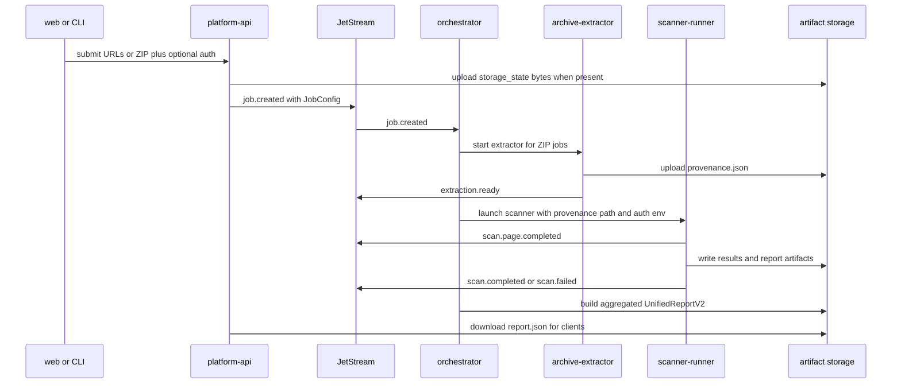
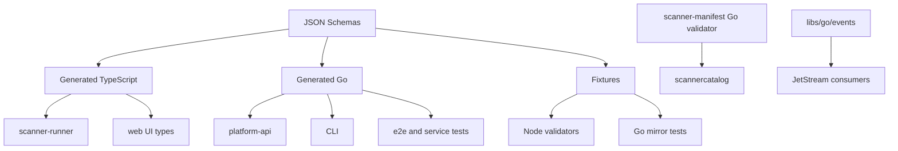

# StageFlow Contracts Repo Map

`libs/contracts` is the schema-first contract slice shared by scanner-runner, Go services, the CLI, and the web UI. It contains four contract families:

| Family | Canonical schema | Generated outputs | Runtime validators | Package export |
| --- | --- | --- | --- | --- |
| Unified report v2 | `libs/contracts/report/schema/unified-report.v2.schema.json` declares `UnifiedReportV2`, requires `version`, `meta`, `summary`, `scanners`, `pages`, and `issues`, and closes the root object with `additionalProperties: false` (`libs/contracts/report/schema/unified-report.v2.schema.json:3`, `libs/contracts/report/schema/unified-report.v2.schema.json:7`, `libs/contracts/report/schema/unified-report.v2.schema.json:8`). | TypeScript `generated/typescript/unified-report.v2.ts`; Go module `generated/go/report_schema.go`; TS runtime validator in `generated/typescript/validator.ts` (`libs/contracts/report/package.json:13`, `libs/contracts/report/package.json:14`, `libs/contracts/report/generated/typescript/index.ts:8`). | Node CLI validator plus TS `validateReport` integrity checks (`libs/contracts/report/schema/validate.js:20`, `libs/contracts/report/schema/validate.js:50`, `libs/contracts/report/generated/typescript/validator.ts:232`). | Public npm package `@stageflow/contracts-report` exports types, schema, and validator CLI (`libs/contracts/report/package.json:2`, `libs/contracts/report/package.json:21`). |
| Provenance/auth | `libs/contracts/provenance/schema/provenance.schema.json` describes scanner-runner intake, requires `version`, `job_id`, `base_url`, and `pages`, and optionally carries discriminated auth (`libs/contracts/provenance/schema/provenance.schema.json:3`, `libs/contracts/provenance/schema/provenance.schema.json:7`, `libs/contracts/provenance/schema/provenance.schema.json:41`). | TypeScript `generated/typescript/provenance.ts`; generated Go under `generated/go/provenance_schema.go` (`libs/contracts/provenance/package.json:14`, `libs/contracts/provenance/package.json:15`). | Node schema validator only; Go services currently use the hand-maintained mirror in `libs/go/provenance/auth.go`, not the generated Go module (`libs/contracts/provenance/schema/validate.js:17`, `libs/go/provenance/auth.go:1`, `libs/go/provenance/auth.go:5`). | Private npm package `@stageflow/contracts-provenance` exports types, schema, and validator CLI (`libs/contracts/provenance/package.json:2`, `libs/contracts/provenance/package.json:9`, `libs/contracts/provenance/package.json:22`). |
| Scanner manifest | `libs/contracts/scanner-manifest/schema/scanner-manifest.schema.json` defines plugin descriptors, requires `id`, `name`, `version`, `capabilities`, and `entry`, and closes the root object (`libs/contracts/scanner-manifest/schema/scanner-manifest.schema.json:3`, `libs/contracts/scanner-manifest/schema/scanner-manifest.schema.json:7`, `libs/contracts/scanner-manifest/schema/scanner-manifest.schema.json:8`). | TypeScript `generated/typescript/scanner-manifest.ts`; generated Go lives in-package as `scanner_manifest.go` and is patched so `configSchema` is `json.RawMessage` (`libs/contracts/scanner-manifest/package.json:14`, `libs/contracts/scanner-manifest/package.json:15`, `libs/contracts/scanner-manifest/Makefile:37`). | Node validator and Go embedded-schema validator both add business checks for embedded `configSchema` and screenshot/browser capabilities (`libs/contracts/scanner-manifest/schema/validate.js:53`, `libs/contracts/scanner-manifest/schema/validate.js:70`, `libs/contracts/scanner-manifest/validator.go:50`). | Private npm package `@stageflow/contracts-scanner-manifest`; Go module `github.com/mattboback/stageflow/libs/contracts/scanner-manifest` (`libs/contracts/scanner-manifest/package.json:2`, `libs/contracts/scanner-manifest/go.mod:1`). |
| Scan events | Three event schemas for `scan.completed`, `scan.failed`, and `scan.page.completed` (`libs/contracts/events/schema/scan.completed.schema.json:3`, `libs/contracts/events/schema/scan.failed.schema.json:3`, `libs/contracts/events/schema/scan.page.completed.schema.json:3`). | No generated code or package manifest in this slice. Go event structs live in `libs/go/events`, and scanner-runner publishes matching envelopes (`libs/go/events/types.go:18`, `services/scanner-runner/src/core/event-publisher.ts:96`). | Custom `validate.mjs` validates fixtures against a small subset of schema keywords (`libs/contracts/events/schema/validate.mjs:21`, `libs/contracts/events/schema/validate.mjs:89`). | No package export in `libs/contracts/events`; runtime consumers use `libs/go/events` and scanner-runner TS code. |

## Directory Map

| Path | Role | Evidence |
| --- | --- | --- |
| `libs/contracts/report/package.json` | Report package metadata, scripts, exports, and local Node dependencies. | Scripts at `libs/contracts/report/package.json:11`; exports at `libs/contracts/report/package.json:21`; Ajv/json-schema-to-typescript deps at `libs/contracts/report/package.json:37`. |
| `libs/contracts/report/Makefile` | Alternate generation/validation entrypoint with explicit schema/output paths and Go module metadata. | Inputs/outputs at `libs/contracts/report/Makefile:11`; generate targets at `libs/contracts/report/Makefile:26`; fixture validation at `libs/contracts/report/Makefile:49`. |
| `libs/contracts/report/schema/unified-report.v2.schema.json` | Canonical aggregate scanner report schema. | Root id/title at `libs/contracts/report/schema/unified-report.v2.schema.json:3`; root required fields at `libs/contracts/report/schema/unified-report.v2.schema.json:7`; root `additionalProperties: false` at `libs/contracts/report/schema/unified-report.v2.schema.json:8`. |
| `libs/contracts/report/schema/validate.js` | Node validator used by package scripts and pre-commit checks. | Ajv setup at `libs/contracts/report/schema/validate.js:20`; schema compile at `libs/contracts/report/schema/validate.js:28`; integrity checks start at `libs/contracts/report/schema/validate.js:73`. |
| `libs/contracts/report/generated/typescript/index.ts` | TS barrel exporting generated types and runtime validator helpers. | Type export at `libs/contracts/report/generated/typescript/index.ts:8`; validator exports at `libs/contracts/report/generated/typescript/index.ts:11`; stable alias at `libs/contracts/report/generated/typescript/index.ts:22`. |
| `libs/contracts/report/generated/typescript/validator.ts` | TS runtime validation plus report business invariants. | Ajv options at `libs/contracts/report/generated/typescript/validator.ts:53`; integrity checks at `libs/contracts/report/generated/typescript/validator.ts:80`; optional `checkIntegrity` at `libs/contracts/report/generated/typescript/validator.ts:232`. |
| `libs/contracts/report/generated/go/report_schema.go` | Generated Go report model used by API, CLI, orchestrator tests, and e2e tests. | Root Go struct at `libs/contracts/report/generated/go/report_schema.go:1064`; required-field checks at `libs/contracts/report/generated/go/report_schema.go:1096`; semver pattern check at `libs/contracts/report/generated/go/report_schema.go:1119`. |
| `libs/contracts/provenance/package.json` | Provenance package metadata, scripts, private package export, fixtures. | Description at `libs/contracts/provenance/package.json:8`; scripts at `libs/contracts/provenance/package.json:12`; files include fixtures at `libs/contracts/provenance/package.json:37`. |
| `libs/contracts/provenance/schema/provenance.schema.json` | Canonical scanner intake document schema, including optional auth. | Contract description at `libs/contracts/provenance/schema/provenance.schema.json:5`; root required fields at `libs/contracts/provenance/schema/provenance.schema.json:7`; auth ref at `libs/contracts/provenance/schema/provenance.schema.json:41`. |
| `libs/contracts/provenance/schema/validate.js` | Node schema validator for provenance fixtures. | Ajv setup at `libs/contracts/provenance/schema/validate.js:17`; schema compile at `libs/contracts/provenance/schema/validate.js:24`; file validation at `libs/contracts/provenance/schema/validate.js:38`. |
| `libs/contracts/provenance/generated/typescript/index.ts` | TS barrel for generated provenance types. | Exports generated types at `libs/contracts/provenance/generated/typescript/index.ts:1`. |
| `libs/contracts/provenance/generated/go/provenance_schema.go` | Generated Go provenance model, in `go.work`, but no active imports were found outside this generated module. | Module is in workspace at `go.work:7`; no non-generated references found by `rg "contracts/provenance/generated/go"`. |
| `libs/contracts/scanner-manifest/package.json` | Scanner manifest package scripts, private package export, and dependency metadata. | Scripts at `libs/contracts/scanner-manifest/package.json:12`; exports at `libs/contracts/scanner-manifest/package.json:21`; deps at `libs/contracts/scanner-manifest/package.json:42`. |
| `libs/contracts/scanner-manifest/schema/scanner-manifest.schema.json` | Canonical scanner plugin descriptor schema. | Root id/title at `libs/contracts/scanner-manifest/schema/scanner-manifest.schema.json:3`; required root fields at `libs/contracts/scanner-manifest/schema/scanner-manifest.schema.json:7`; `configSchema` ref at `libs/contracts/scanner-manifest/schema/scanner-manifest.schema.json:63`. |
| `libs/contracts/scanner-manifest/scanner_manifest.go` | Generated Go manifest model patched to preserve embedded schemas as raw JSON. | Root struct at `libs/contracts/scanner-manifest/scanner_manifest.go:433`; `configSchema` field at `libs/contracts/scanner-manifest/scanner_manifest.go:443`; raw-message alias at `libs/contracts/scanner-manifest/scanner_manifest.go:480`. |
| `libs/contracts/scanner-manifest/validator.go` | Go schema validator for built-in manifests and Go consumers. | Embedded schema at `libs/contracts/scanner-manifest/validator.go:15`; public validator at `libs/contracts/scanner-manifest/validator.go:50`; embedded `configSchema` validation at `libs/contracts/scanner-manifest/validator.go:78`. |
| `libs/contracts/events/schema/*.schema.json` | Scan lifecycle event schema documents. | Completed event payload required fields at `libs/contracts/events/schema/scan.completed.schema.json:13`; failed event required fields at `libs/contracts/events/schema/scan.failed.schema.json:13`; page event required fields at `libs/contracts/events/schema/scan.page.completed.schema.json:13`. |
| `libs/contracts/events/schema/validate.mjs` | Custom fixture validator for event schemas. | Schema map at `libs/contracts/events/schema/validate.mjs:9`; supported keyword checks begin at `libs/contracts/events/schema/validate.mjs:25`; fixture loop at `libs/contracts/events/schema/validate.mjs:89`. |

## Generation Flow

```mermaid
flowchart LR
  ReportSchema[report schema] --> ReportTS[json2ts report TS]
  ReportSchema --> ReportGo[go-jsonschema report Go]
  ReportTS --> ReportPkg[@stageflow/contracts-report]
  ReportGo --> GoConsumers[Go API CLI tests]
  ProvenanceSchema[provenance schema] --> ProvenanceTS[json2ts provenance TS]
  ProvenanceSchema --> ProvenanceGo[go-jsonschema provenance Go]
  ProvenanceTS --> RunnerPrep[scanner-runner prepare contracts]
  ManifestSchema[scanner-manifest schema] --> ManifestTS[json2ts manifest TS]
  ManifestSchema --> ManifestGo[go-jsonschema manifest Go]
  ManifestGo --> RawPatch[sed patch configSchema to json.RawMessage]
  RawPatch --> Catalog[Go scanner catalog]
  EventsSchema[event schemas] --> EventFixtureValidator[custom validate.mjs]
```

| Command | What it does | Evidence |
| --- | --- | --- |
| `cd libs/contracts/report && bun run generate` | Runs `generate:ts` then `generate:go`. | `libs/contracts/report/package.json:12` |
| `cd libs/contracts/report && bun run validate:fixtures` | Validates minimal and all-scans report fixtures. | `libs/contracts/report/package.json:16` |
| `cd libs/contracts/report && bun run build` | Regenerates, validates fixtures, then runs `tsc`. | `libs/contracts/report/package.json:17` |
| `cd libs/contracts/report && make generate` | Generates TS with `json2ts` and Go with `go-jsonschema`, then formats Go with `goimports`. | `libs/contracts/report/Makefile:31`, `libs/contracts/report/Makefile:38` |
| `cd libs/contracts/provenance && bun run generate` | Runs provenance TS and Go generation from the schema. | `libs/contracts/provenance/package.json:13` |
| `cd libs/contracts/provenance && bun run validate:fixtures` | Validates no-auth, storage-state auth, form auth, and literal form auth fixtures. | `libs/contracts/provenance/package.json:17` |
| `cd libs/contracts/scanner-manifest && bun run generate` | Generates TS and in-package Go manifest model. | `libs/contracts/scanner-manifest/package.json:13` |
| `cd libs/contracts/scanner-manifest && make generate-go` | Generates Go then rewrites `configSchema` aliases to `json.RawMessage`. | `libs/contracts/scanner-manifest/Makefile:35`, `libs/contracts/scanner-manifest/Makefile:41` |
| `node libs/contracts/events/schema/validate.mjs` | Loads each event schema and its matching fixture, then validates with the custom subset validator. | `libs/contracts/events/schema/validate.mjs:86`, `libs/contracts/events/schema/validate.mjs:89` |
| `devtools/scripts/precommit/run.mjs <files...>` | Runs `bun run check` for changed report/provenance contracts only; scanner-manifest is not listed. | `devtools/scripts/precommit/run.mjs:13`, `devtools/scripts/precommit/run.mjs:28` |

The TypeScript packages compile with strict TS and JSON module imports enabled (`libs/contracts/report/tsconfig.json:2`, `libs/contracts/report/tsconfig.json:11`). Report and provenance pre-commit checks validate fixtures and regenerate to compare generated outputs against committed files (`libs/contracts/report/scripts/pre-commit-check.sh:44`, `libs/contracts/report/scripts/pre-commit-check.sh:69`, `libs/contracts/provenance/scripts/pre-commit-check.sh:34`, `libs/contracts/provenance/scripts/pre-commit-check.sh:55`).

## Tooling Semantics Verified

Local versions are not uniform:

| Tool | Local version evidence | Official semantics checked |
| --- | --- | --- |
| Ajv for report contract scripts | Report lock resolves `ajv@8.17.1` (`libs/contracts/report/bun.lock:29`). | Ajv v8 docs say `allErrors: true` collects all validation errors, `strict` controls schema strictness rather than changing successful validation results, and formats require `ajv-formats` for standard `format` keywords. Sources: <https://github.com/ajv-validator/ajv/blob/v8.17.1/docs/options.md>, <https://github.com/ajv-validator/ajv/blob/v8.17.1/docs/json-schema.md>. |
| Ajv for provenance and scanner-runner | Provenance lock resolves `ajv@8.20.0`; scanner-runner pins `ajv` to `8.20.0` (`libs/contracts/provenance/bun.lock:25`, `services/scanner-runner/package.json:52`). | Same Ajv v8 behavior applies; repository code is authoritative for which options are passed (`strict: false` in package validators, only `allErrors: true` in scanner-runner manifest validation). |
| json-schema-to-typescript | Report and provenance locks resolve `json-schema-to-typescript@15.0.4` (`libs/contracts/report/bun.lock:47`, `libs/contracts/provenance/bun.lock:43`). | Official README documents `json2ts` CLI input/output usage and `--unreachableDefinitions` generating otherwise unreachable definitions. Source: <https://github.com/bcherny/json-schema-to-typescript>. |
| go-jsonschema | All Makefiles install/use `github.com/atombender/go-jsonschema@v0.20.0` (`libs/contracts/report/Makefile:61`, `libs/contracts/provenance/Makefile:63`, `libs/contracts/scanner-manifest/Makefile:61`). | pkg.go.dev for v0.20.0 describes go-jsonschema as a generator of Go data types from JSON Schema and documents generated validation/unmarshal support plus generator options. Source: <https://pkg.go.dev/github.com/atombender/go-jsonschema@v0.20.0>. |
| santhosh-tekuri/jsonschema | Scanner-manifest Go validator depends on `github.com/santhosh-tekuri/jsonschema/v5 v5.3.1` (`libs/contracts/scanner-manifest/go.mod:5`). | Local module docs/examples support the code pattern used here: `NewCompiler`, `AddResource`, `Compile`, then `Validate`; local validator follows that exactly (`libs/contracts/scanner-manifest/validator.go:24`, `libs/contracts/scanner-manifest/validator.go:63`). |
| JSON Schema drafts | Report schema uses draft 2020-12; provenance and scanner-manifest use draft-07 (`libs/contracts/report/schema/unified-report.v2.schema.json:2`, `libs/contracts/provenance/schema/provenance.schema.json:2`, `libs/contracts/scanner-manifest/schema/scanner-manifest.schema.json:2`). | Official JSON Schema pages distinguish draft 2020-12 and draft-07 metaschemas. Sources: <https://json-schema.org/draft/2020-12>, <https://json-schema.org/draft-07>. |

## Validation Boundaries

| Boundary | Strict behavior | Lenient or narrower behavior | Evidence |
| --- | --- | --- | --- |
| Report JSON Schema | Root and most nested objects are closed with `additionalProperties: false`; generated Go unmarshal checks required fields and semver pattern. | Report CLI and TS validator compile Ajv with `strict: false`, so strict schema warnings are disabled while data validation still runs. | `libs/contracts/report/schema/unified-report.v2.schema.json:8`, `libs/contracts/report/generated/go/report_schema.go:1096`, `libs/contracts/report/generated/typescript/validator.ts:53` |
| Report business invariants | Validator rejects summary totals that do not match arrays, scanner references missing from `scanners`, page references missing from `pages`, and artifact IDs missing from `artifacts`. | TS `validateReport` can skip integrity checks with `checkIntegrity: false`; schema-only validators do not express these cross-reference checks. | `libs/contracts/report/schema/validate.js:79`, `libs/contracts/report/schema/validate.js:124`, `libs/contracts/report/schema/validate.js:140`, `libs/contracts/report/schema/validate.js:156`, `libs/contracts/report/generated/typescript/validator.ts:246` |
| Provenance/auth | Schema forbids unknown root/auth fields and restricts `auth` to storage-state or form branches. `from_env` references must match `^[A-Z][A-Z0-9_]*$`. | Go `ValidateAuth` explicitly says it is narrower than the canonical JSON Schema and checks only orchestrator launch invariants. | `libs/contracts/provenance/schema/provenance.schema.json:13`, `libs/contracts/provenance/schema/provenance.schema.json:415`, `libs/contracts/provenance/schema/provenance.schema.json:188`, `libs/go/provenance/auth.go:212` |
| Scanner manifest | Schema closes root and nested manifest objects; Node and Go validators additionally require valid embedded `configSchema` and reject screenshots without browser capability. | scanner-runner plugin validation adds warnings for short ids and missing descriptions; worker validation can warn instead of throw depending on `strict`. | `libs/contracts/scanner-manifest/schema/scanner-manifest.schema.json:8`, `libs/contracts/scanner-manifest/schema/validate.js:70`, `libs/contracts/scanner-manifest/validator.go:71`, `services/scanner-runner/src/core/manifest/index.ts:60`, `services/scanner-runner/src/worker/worker-validation.ts:46` |
| Events | Schemas require envelope fields and event-specific payload fields. Go `libs/go/events` payload validators enforce required fields and non-negative timing/counts. | `validate.mjs` is a hand-rolled subset: it checks `const`, scalar/object types, `minLength`, `minimum`, `required`, and `properties`, but not full JSON Schema semantics such as `additionalProperties`, arrays, formats, or `oneOf`. | `libs/contracts/events/schema/scan.completed.schema.json:5`, `libs/go/events/types.go:188`, `libs/go/events/types.go:268`, `libs/contracts/events/schema/validate.mjs:21` |

## Contract Flow



## Integration Points

| Consumer | Contract dependency | How it is used | Evidence |
| --- | --- | --- | --- |
| scanner-runner package build | Copies/generated local contract packages into `node_modules` before build. | `prepare:contracts` runs report, scanner-manifest, and provenance prep scripts. | `services/scanner-runner/package.json:29`, `services/scanner-runner/scripts/prepare-contracts-report-types.mjs:47`, `services/scanner-runner/scripts/prepare-contracts-scanner-manifest.mjs:66`, `services/scanner-runner/scripts/prepare-contracts-provenance.mjs:63` |
| scanner-runner report formatter | Imports `UnifiedReportV2` from `@stageflow/contracts-report` and returns it from `WebServerFormatter.format`. | Produces per-scanner report documents that later feed the aggregate report. | `services/scanner-runner/src/core/web-server-formatter.ts:1`, `services/scanner-runner/src/core/web-server-formatter.ts:46` |
| scanner-runner provenance | Uses local TS `Provenance` type and can synthesize provenance from `SCAN_URLS`; attaches auth from `PROVENANCE_AUTH_JSON`. | Auth env is canonical auth shape and is ignored if invalid. | `services/scanner-runner/src/core/types.ts:155`, `services/scanner-runner/src/core/page-iterator.ts:74`, `services/scanner-runner/src/core/page-iterator.ts:618`, `services/scanner-runner/src/core/page-iterator.ts:645` |
| scanner-runner plugin loader | Imports scanner-manifest types and schema package, validates manifests with Ajv, and validates `SCANNER_OPTIONS` against manifest `configSchema`. | Enforces manifest shape at load time and scanner options at worker runtime. | `services/scanner-runner/src/core/manifest/index.ts:7`, `services/scanner-runner/src/core/manifest/index.ts:17`, `services/scanner-runner/src/core/manifest/index.ts:126`, `services/scanner-runner/src/worker/worker-validation.ts:26` |
| scanner-runner events | Publishes scan event envelopes to default NATS subjects. | Emits `scan.page.completed`, `scan.completed`, and `scan.failed`. | `services/scanner-runner/src/core/event-publisher.ts:26`, `services/scanner-runner/src/core/event-publisher.ts:96`, `services/scanner-runner/src/core/event-publisher.ts:115`, `services/scanner-runner/src/core/event-publisher.ts:145` |
| archive-extractor | Generates `provenance.json` from discovered pages and publishes `extraction.ready` with the path/artifact key. | Feeds scanner-runner for ZIP/archive scans. | `services/archive-extractor/internal/provenance/provenance.go:25`, `services/archive-extractor/internal/provenance/provenance.go:46`, `services/archive-extractor/cmd/server/main.go:215`, `services/archive-extractor/cmd/server/main.go:333` |
| platform-api URL submission | Normalizes optional auth; uploads inline storage-state bytes; publishes `job.created`. | Raw storage-state bytes do not cross the NATS boundary; form auth is forwarded with `from_env` references intact. | `services/platform-api/internal/api/handlers_jobs_url_submit.go:49`, `services/platform-api/internal/api/handlers_jobs_url_submit.go:153`, `services/platform-api/internal/api/handlers_jobs_url_submit.go:179`, `services/platform-api/internal/api/handlers_jobs_url_submit.go:304` |
| platform-api status/results | Imports generated Go report types, downloads report JSON, and unmarshals into `report.UnifiedReportV2`. | Serves typed job result data to CLI/web. | `services/platform-api/internal/api/handlers_jobs_status.go:13`, `services/platform-api/internal/api/handlers_jobs_status.go:306`, `services/platform-api/internal/api/handlers_jobs_status.go:327` |
| orchestrator | Consumes job/extraction/scan events and records scan progress/completion. | Scan completion payload writes scanner result paths and issue counts; job completion builds aggregate report. | `services/orchestrator/internal/adapters/messaging/consumers.go:38`, `services/orchestrator/internal/application/jobs/service.go:242`, `services/orchestrator/internal/application/jobs/service.go:278`, `services/orchestrator/internal/application/jobs/service.go:329` |
| Go scanner catalog | Aliases contract `ScannerManifest`, validates embedded built-in manifests with `ValidateManifestJSON`, then unmarshals into Go structs. | Makes manifest contract the source for Go scanner metadata. | `libs/go/scannercatalog/catalog.go:12`, `libs/go/scannercatalog/catalog.go:18`, `libs/go/scannercatalog/catalog.go:84` |
| CLI | Imports generated Go report model, fetches results, unmarshals into `report.UnifiedReportV2`, and renders filtered output. | CLI report envelope embeds canonical report. | `clients/cli/report_output.go:15`, `clients/cli/report_output.go:64`, `clients/cli/report_output.go:86`, `clients/cli/report_output.go:96` |
| web UI | Imports generated report TS directly and aliases `UnifiedReport = UnifiedReportV2`. | UI report explorer uses canonical aggregate report types. | `clients/web/src/lib/types/unified-report.ts:1`, `clients/web/src/lib/types/unified-report.ts:13`, `clients/web/src/lib/types/unified-report.ts:47` |
| shared Go events/messaging | Defines event names and NATS subjects used by services. | JetStream streams cover jobs, extraction, and scan lifecycle subjects. | `libs/go/events/types.go:10`, `libs/go/messaging/streams.go:24`, `libs/go/messaging/streams.go:49` |

## Fixtures

| Fixture | Validates | Evidence |
| --- | --- | --- |
| `report/fixtures/unified-report.v2.json` | Minimal valid aggregate report with one scanner, one page, one issue, empty artifacts/errors, and matching totals. | `libs/contracts/report/fixtures/unified-report.v2.json:2`, `libs/contracts/report/fixtures/unified-report.v2.json:10`, `libs/contracts/report/fixtures/unified-report.v2.json:25`, `libs/contracts/report/fixtures/unified-report.v2.json:62` |
| `report/fixtures/unified-report.v2.all-scans.json` | Full example covering score/grade, all severity buckets, multiple scanners, lighthouse categories, and multiple pages. | `libs/contracts/report/fixtures/unified-report.v2.all-scans.json:10`, `libs/contracts/report/fixtures/unified-report.v2.all-scans.json:21`, `libs/contracts/report/fixtures/unified-report.v2.all-scans.json:31`, `libs/contracts/report/fixtures/unified-report.v2.all-scans.json:38` |
| `provenance/fixtures/provenance.no-auth.json` | Pre-auth shape with two pages and no auth block. | `libs/contracts/provenance/fixtures/provenance.no-auth.json:2`, `libs/contracts/provenance/fixtures/provenance.no-auth.json:7` |
| `provenance/fixtures/provenance.auth-storage-state.json` | Storage-state auth branch carrying an artifact key only. | `libs/contracts/provenance/fixtures/provenance.auth-storage-state.json:11`, `libs/contracts/provenance/fixtures/provenance.auth-storage-state.json:12`, `libs/contracts/provenance/fixtures/provenance.auth-storage-state.json:13` |
| `provenance/fixtures/provenance.auth-form.json` | Form auth branch with `from_env` values and selector success wait. | `libs/contracts/provenance/fixtures/provenance.auth-form.json:10`, `libs/contracts/provenance/fixtures/provenance.auth-form.json:14`, `libs/contracts/provenance/fixtures/provenance.auth-form.json:18` |
| `provenance/fixtures/provenance.auth-form-literal.json` | Form auth branch with literal values rather than env references. | `libs/contracts/provenance/fixtures/provenance.auth-form-literal.json:10`, `libs/contracts/provenance/fixtures/provenance.auth-form-literal.json:14`, `libs/contracts/provenance/fixtures/provenance.auth-form-literal.json:18` |
| `scanner-manifest/fixtures/scanner-manifest.min.json` | Minimal manifest: id/name/version/capabilities/entry only. | `libs/contracts/scanner-manifest/fixtures/scanner-manifest.min.json:2`, `libs/contracts/scanner-manifest/fixtures/scanner-manifest.min.json:5`, `libs/contracts/scanner-manifest/fixtures/scanner-manifest.min.json:12` |
| `scanner-manifest/fixtures/scanner-manifest.full.json` | Full manifest with aliases, browser capability, embedded `configSchema`, requirements, entry factory, and output mapping. | `libs/contracts/scanner-manifest/fixtures/scanner-manifest.full.json:10`, `libs/contracts/scanner-manifest/fixtures/scanner-manifest.full.json:11`, `libs/contracts/scanner-manifest/fixtures/scanner-manifest.full.json:21`, `libs/contracts/scanner-manifest/fixtures/scanner-manifest.full.json:54` |
| `events/fixtures/scan.completed.json` | Completed scan envelope with paths, summary counts, and timing. | `libs/contracts/events/fixtures/scan.completed.json:2`, `libs/contracts/events/fixtures/scan.completed.json:7`, `libs/contracts/events/fixtures/scan.completed.json:12`, `libs/contracts/events/fixtures/scan.completed.json:26` |
| `events/fixtures/scan.failed.json` | Failed scan envelope with error, details, stage log, and recipe path. | `libs/contracts/events/fixtures/scan.failed.json:2`, `libs/contracts/events/fixtures/scan.failed.json:7`, `libs/contracts/events/fixtures/scan.failed.json:11` |
| `events/fixtures/scan.page.completed.json` | Page progress envelope with page index and total pages. | `libs/contracts/events/fixtures/scan.page.completed.json:2`, `libs/contracts/events/fixtures/scan.page.completed.json:7`, `libs/contracts/events/fixtures/scan.page.completed.json:9` |

## Cross-Language Consistency



| Boundary | What stays consistent | Known split |
| --- | --- | --- |
| Report | Go and TS are generated from the same schema; CLI/API/web/scanner-runner all name the aggregate contract `UnifiedReportV2` or the TS `UnifiedReport` alias (`libs/contracts/report/generated/typescript/index.ts:22`, `libs/contracts/report/generated/go/report_schema.go:1064`). | Report business invariants live in Node/TS validators, not generated Go unmarshalling. Go consumers that only `json.Unmarshal` get structural/pattern checks generated by go-jsonschema, but not cross-array integrity checks. |
| Provenance/auth | Schema, TS types, fixtures, platform-api normalization, scanner-runner auth attachment, and `libs/go/provenance` use the same `mode: form` / `mode: storage_state` discriminator (`libs/contracts/provenance/schema/provenance.schema.json:412`, `libs/go/provenance/auth.go:22`, `services/scanner-runner/src/core/types.ts:141`). | Generated Go provenance exists in `go.work`, but active Go logic uses the smaller hand-maintained `libs/go/provenance` mirror. |
| Scanner manifest | TS package, Go module, scanner-runner plugin validation, and Go scanner catalog share the schema. | Go generation is patched because embedded JSON Schemas would otherwise be `interface{}`; the patch makes them raw JSON bytes for downstream validation (`libs/contracts/scanner-manifest/Makefile:37`). |
| Events | String constants and Go payload validators in `libs/go/events` match the event schemas and scanner-runner publisher names (`libs/go/events/types.go:18`, `services/scanner-runner/src/core/event-publisher.ts:97`). | Event schemas are not generated into Go/TS; consistency depends on fixtures, the custom validator, and shared Go/TS event code. |

## Tests And Checks

| Scope | Command | What it proves | Caveat |
| --- | --- | --- | --- |
| Report fixtures | `cd libs/contracts/report && bun run validate:fixtures` | Schema validation plus report integrity invariants for both report fixtures. | Does not run Go consumers or compare generated freshness unless `bun run check` is used. |
| Report build | `cd libs/contracts/report && bun run build` | Regenerates TS/Go, validates fixtures, then typechecks package. | Writes generated files if stale. |
| Report freshness | `cd libs/contracts/report && bun run check` | Validates fixtures and compares regenerated TS/Go against committed generated files. | Pre-commit script writes temporary snapshots and restores originals on mismatch. |
| Provenance fixtures | `cd libs/contracts/provenance && bun run validate:fixtures` | Validates no-auth and auth fixtures against the canonical schema. | Does not run scanner-runner or Go mirror tests. |
| Provenance freshness | `cd libs/contracts/provenance && bun run check` | Validates fixtures and checks generated TS/Go freshness. | Active Go services use `libs/go/provenance`, so mirror tests live outside this slice. |
| Scanner manifest fixtures | `cd libs/contracts/scanner-manifest && bun run validate:fixtures` | Validates minimal/full manifests plus embedded `configSchema` and screenshot/browser invariant. | No `scripts/pre-commit-check.sh` exists for this family in the current file map. |
| Scanner manifest Go validator | `cd libs/contracts/scanner-manifest && go test ./...` | Compiles generated Go and embedded-schema validator. | Docs-only task did not require running this. |
| Event fixtures | `node libs/contracts/events/schema/validate.mjs` | Validates all three scan event fixtures against the custom subset validator. | Not a complete JSON Schema implementation. |
| Downstream scanner-runner contract prep | `cd services/scanner-runner && bun run prepare:contracts` | Copies local generated/schema artifacts into scanner-runner's local packages. | Writes `services/scanner-runner/node_modules`; not needed for docs-only verification. |

## Risks And Follow-Ups

| Risk | Why it matters | Evidence | Recommendation |
| --- | --- | --- | --- |
| Event schemas are manually mirrored | No generated code from `libs/contracts/events`; Go and TS event payloads can drift from schema. | No package/generation files under `libs/contracts/events`; Go constants live in `libs/go/events/types.go:10`; TS publisher emits strings in `services/scanner-runner/src/core/event-publisher.ts:97`. | Consider generating event types or adding a check that serializes Go/TS fixtures and validates against schemas. |
| Event validator is a subset | It ignores important JSON Schema keywords not explicitly implemented. | Supported checks are only in `libs/contracts/events/schema/validate.mjs:25`, `libs/contracts/events/schema/validate.mjs:29`, `libs/contracts/events/schema/validate.mjs:54`, `libs/contracts/events/schema/validate.mjs:58`, and `libs/contracts/events/schema/validate.mjs:62`. | Replace with Ajv or document the subset as intentional. |
| Provenance generated Go is not used | The repo has both generated Go provenance and a hand-maintained Go mirror. | `go.work:7`; `libs/go/provenance/auth.go:1`; no non-generated imports found for `contracts/provenance/generated/go`. | Decide whether generated Go should be consumed or removed from the active contract boundary. |
| Scanner-manifest lacks pre-commit freshness script | Report/provenance have `check`; scanner-manifest package has `build`/`typecheck` but no `check` script. | `libs/contracts/scanner-manifest/package.json:12`; `devtools/scripts/precommit/run.mjs:13`. | Add a scanner-manifest freshness check if schema churn is expected. |
| Report integrity checks are not universal | Go consumers can parse structurally valid reports whose summary counts or references are inconsistent. | Integrity checks are in Node/TS validators (`libs/contracts/report/generated/typescript/validator.ts:80`), while Go generated unmarshal checks fields and pattern (`libs/contracts/report/generated/go/report_schema.go:1096`). | Add Go-side integrity validation or require reports through the TS validator before publication. |
| Ajv draft handling differs by schema family | Report uses draft 2020-12; provenance/scanner-manifest use draft-07. | `libs/contracts/report/schema/unified-report.v2.schema.json:2`; `libs/contracts/provenance/schema/provenance.schema.json:2`; `libs/contracts/scanner-manifest/schema/scanner-manifest.schema.json:2`. | Keep draft choice explicit when adding schemas, especially if using newer 2020-12 keywords. |
| Auth handling crosses several layers | Platform API, orchestrator, scanner-runner, and Go mirror each enforce part of the auth contract. | Platform normalization at `services/platform-api/internal/api/handlers_jobs_url_submit.go:343`; Go mirror validation at `libs/go/provenance/auth.go:212`; scanner-runner env attachment at `services/scanner-runner/src/core/page-iterator.ts:618`. | Keep fixture-driven tests covering the same auth documents in every layer. |

## Unresolved Details

| Detail | Current finding |
| --- | --- |
| Scanner-manifest lockfile | Unlike report/provenance, no `libs/contracts/scanner-manifest/bun.lock` is present in the current file map. Its package declares ranges, while scanner-runner pins Ajv 8.20.0 for runtime validation (`libs/contracts/scanner-manifest/package.json:42`, `services/scanner-runner/package.json:52`). |
| Provenance generated Go consumption | Search found only its own `go.mod`, Makefile module string, and `go.work`; no service imports the generated provenance module. |
| Events package export | There is no local package manifest or generated output under `libs/contracts/events`; the contract is schema+fixtures+custom validator only. |
| Full JSON Schema validation for events | The custom validator intentionally or accidentally covers only the keywords coded in `validate.mjs`; this map does not treat it as equivalent to Ajv. |
