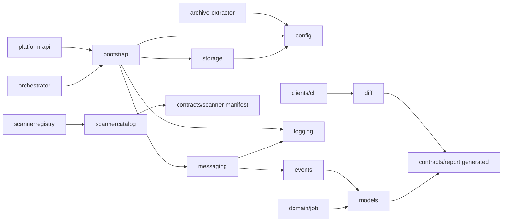
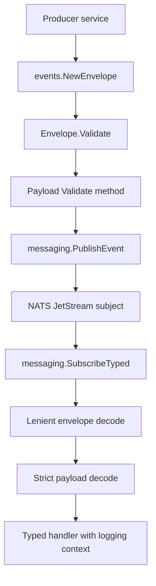
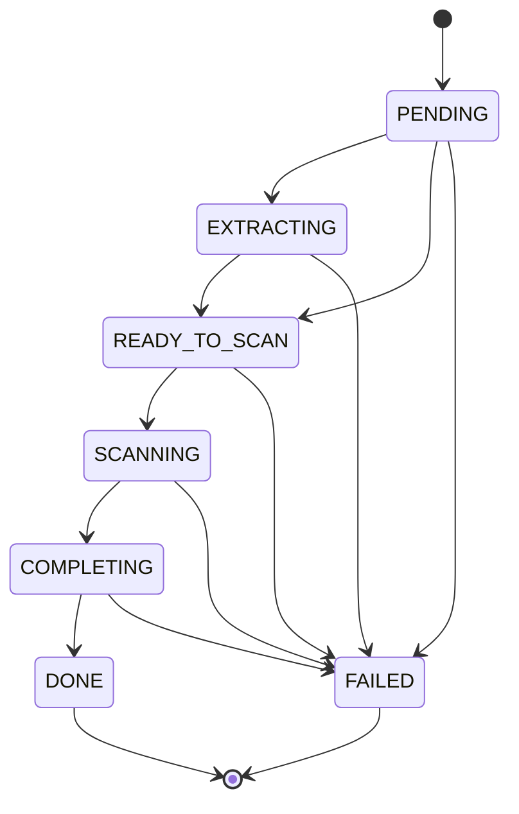
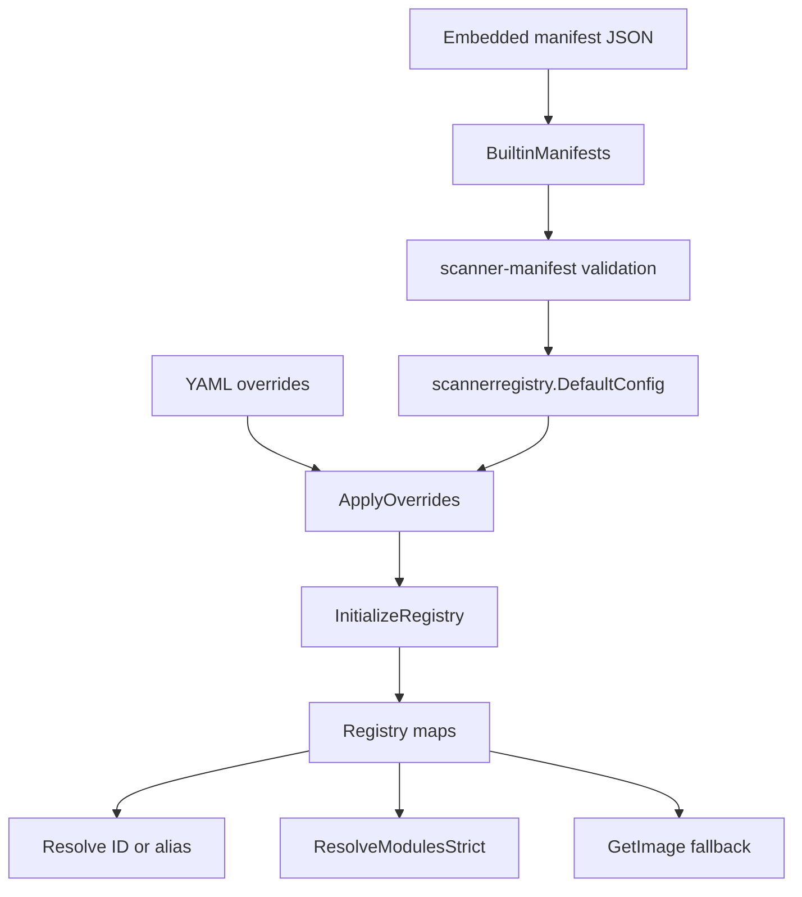

# StageFlow `libs/go` Repo Map

This map documents the shared Go library slice at `/home/matt/Deployment/stageflow/libs/go`. It is grounded in the current worktree, including uncommitted library changes present when this was written. Code citations use `path:line` form and point to exact source lines collected with `nl -ba` or `rg -n`.

## Slice Purpose

`libs/go` is a set of independent Go modules used by services and clients for startup wiring, configuration, event contracts, typed JetStream messaging, shared job models, scanner catalog and registry behavior, provenance auth handling, storage I/O, report diffing, structured logging, and HTTP response helpers. Each package has its own `go.mod`; the workspace uses local `replace` directives from services and clients to consume the modules.

## Package Map

| Package | Module | Main responsibility | Key contracts | Primary citations |
|---|---|---|---|---|
| `bootstrap` | `github.com/mattboback/stageflow/libs/go/bootstrap` | Startup helpers that install default logging, build NATS clients, and build MinIO clients. | `NATSOptions`, `MinIOOptions`, `SetupLogging`, `NewNATSClient`, `NewMinIOClient`. | `libs/go/bootstrap/bootstrap.go:15`, `libs/go/bootstrap/bootstrap.go:21`, `libs/go/bootstrap/bootstrap.go:27`, `libs/go/bootstrap/bootstrap.go:35`, `libs/go/bootstrap/bootstrap.go:58` |
| `config` | `github.com/mattboback/stageflow/libs/go/config` | Environment parsing plus validation helpers for service config. | `NATSConfig`, `MinIOConfig`, `GetEnv*`, `LoadNATSConfig`, `LoadMinIOConfig`, `ValidateAll`. | `libs/go/config/env.go:11`, `libs/go/config/loaders.go:6`, `libs/go/config/loaders.go:24`, `libs/go/config/validation.go:9`, `libs/go/config/validation.go:27` |
| `diff` | `github.com/mattboback/stageflow/libs/go/diff` | Computes issue-level report deltas between generated unified reports. | `Result`, `Delta`, `ComputeDiff`. | `libs/go/diff/diff.go:11`, `libs/go/diff/diff.go:28`, `libs/go/diff/diff.go:38` |
| `domain/job` | `github.com/mattboback/stageflow/libs/go/domain/job` | Shared job lifecycle ranking and transition rules. | `Order`, `IsTerminal`, `StateRankSQL`, `CanTransition`, `AllowedTransitions`. | `libs/go/domain/job/state.go:11`, `libs/go/domain/job/state.go:23`, `libs/go/domain/job/state.go:50`, `libs/go/domain/job/state.go:69`, `libs/go/domain/job/state.go:81` |
| `events` | `github.com/mattboback/stageflow/libs/go/events` | Event names, canonical envelope, and payload validation. | `Envelope`, `NewEnvelope`, event constants, payload structs and `Validate` methods. | `libs/go/events/envelope.go:12`, `libs/go/events/envelope.go:25`, `libs/go/events/envelope.go:42`, `libs/go/events/types.go:10`, `libs/go/events/types.go:36` |
| `httputil` | `github.com/mattboback/stageflow/libs/go/httputil` | JSON responses and structured API error payloads. | `RespondJSON`, `RespondStructuredError`, `ErrorDetail`, typed error factory helpers. | `libs/go/httputil/response.go:10`, `libs/go/httputil/errors.go:11`, `libs/go/httputil/errors.go:36`, `libs/go/httputil/errors.go:53`, `libs/go/httputil/errors.go:120` |
| `logging` | `github.com/mattboback/stageflow/libs/go/logging` | Thin `log/slog` wrapper with StageFlow context fields. | `New`, `NewDefault`, `SetDefault`, `WithJobID`, `FromContext`, `L`, level helpers. | `libs/go/logging/logger.go:1`, `libs/go/logging/logger.go:23`, `libs/go/logging/logger.go:31`, `libs/go/logging/logger.go:59`, `libs/go/logging/logger.go:145`, `libs/go/logging/logger.go:173` |
| `messaging` | `github.com/mattboback/stageflow/libs/go/messaging` | NATS JetStream client, stream setup, publish/subscribe, typed event delivery, and received metadata. | `Client`, stream and subject constants, `EnsureStreams`, `PublishEvent`, `SubscribeTyped`, `ReceivedEventMeta`. | `libs/go/messaging/client.go:16`, `libs/go/messaging/streams.go:11`, `libs/go/messaging/streams.go:25`, `libs/go/messaging/streams.go:35`, `libs/go/messaging/publish.go:37`, `libs/go/messaging/subscribe.go:164`, `libs/go/messaging/envelope.go:11` |
| `models` | `github.com/mattboback/stageflow/libs/go/models` | Shared persisted/API job structs, provenance page model, and report contract compatibility tests. | `JobState`, `Job`, `JobConfig`, `JobStatus`, `Provenance`, screenshot/artifact response structs. | `libs/go/models/job.go:10`, `libs/go/models/job.go:60`, `libs/go/models/job.go:108`, `libs/go/models/job.go:126`, `libs/go/models/job.go:150`, `libs/go/models/provenance.go:9` |
| `provenance` | `github.com/mattboback/stageflow/libs/go/provenance` | Go mirror for the `Provenance.auth` block, env reference walking, validation, and compact JSON serialization. | `Auth`, `FormRecipe`, `StorageStateBlock`, `Compact`, `CollectFromEnvReferences`, `ValidateAuth`. | `libs/go/provenance/auth.go:1`, `libs/go/provenance/auth.go:39`, `libs/go/provenance/auth.go:47`, `libs/go/provenance/auth.go:82`, `libs/go/provenance/auth.go:91`, `libs/go/provenance/auth.go:177`, `libs/go/provenance/auth.go:216` |
| `scannercatalog` | `github.com/mattboback/stageflow/libs/go/scannercatalog` | Embedded built-in scanner manifest catalog validated against the scanner manifest contract. | `BuiltinManifests`, embedded `manifests/*/*.json`, manifest validation. | `libs/go/scannercatalog/catalog.go:15`, `libs/go/scannercatalog/catalog.go:20`, `libs/go/scannercatalog/catalog.go:50`, `libs/go/scannercatalog/catalog.go:84` |
| `scannerregistry` | `github.com/mattboback/stageflow/libs/go/scannerregistry` | Runtime scanner lookup, alias/category indexes, YAML overrides, module resolution, and container image fallback. | `Definition`, `DefaultConfig`, `InitializeRegistry`, `Registry`, `Register`, `Resolve`, `ResolveModulesStrict`. | `libs/go/scannerregistry/types.go:6`, `libs/go/scannerregistry/config.go:13`, `libs/go/scannerregistry/config.go:165`, `libs/go/scannerregistry/config.go:187`, `libs/go/scannerregistry/config.go:205`, `libs/go/scannerregistry/registry.go:6`, `libs/go/scannerregistry/registry_modules.go:11` |
| `storage` | `github.com/mattboback/stageflow/libs/go/storage` | Storage interfaces plus MinIO-backed bucket setup, object I/O, presigned URLs, existence checks, and cleanup. | `Client`, `BucketStaging`, `BucketArtifacts`, `MinIOClient`, `NewMinIOClient`, `EnsureBuckets`, `UploadFile`, `GetPresignedURL`. | `libs/go/storage/client.go:10`, `libs/go/storage/client.go:31`, `libs/go/storage/minio.go:127`, `libs/go/storage/minio.go:133`, `libs/go/storage/minio.go:143`, `libs/go/storage/minio.go:185`, `libs/go/storage/minio.go:285`, `libs/go/storage/minio.go:306` |

## Directory And File Map

| Path | Role | Code citation |
|---|---|---|
| `libs/go/bootstrap/bootstrap.go` | Shared service startup helpers for logger, NATS, and MinIO setup. | `libs/go/bootstrap/bootstrap.go:1` |
| `libs/go/bootstrap/go.mod` | Module declaring local dependencies on config, logging, messaging, and storage. | `libs/go/bootstrap/go.mod:1` |
| `libs/go/config/env.go` | Env var readers with defaults and narrow bool parsing. | `libs/go/config/env.go:11` |
| `libs/go/config/loaders.go` | Shared `NATSConfig` and `MinIOConfig` loaders. | `libs/go/config/loaders.go:6` |
| `libs/go/config/validation.go` | Required-field, positive-number, and aggregated validation helpers. | `libs/go/config/validation.go:9` |
| `libs/go/diff/diff.go` | Stable issue-ID diff implementation for unified reports. | `libs/go/diff/diff.go:38` |
| `libs/go/domain/job/state.go` | Job lifecycle order, transition graph, and SQL rank expression. | `libs/go/domain/job/state.go:23` |
| `libs/go/events/envelope.go` | Canonical bus envelope and UTC timestamp validation. | `libs/go/events/envelope.go:12` |
| `libs/go/events/types.go` | Event constants and payload validation contracts. | `libs/go/events/types.go:10` |
| `libs/go/httputil/errors.go` | Structured API error type and factory helpers. | `libs/go/httputil/errors.go:36` |
| `libs/go/httputil/response.go` | Basic JSON, error, 200, 201, and not-found response helpers. | `libs/go/httputil/response.go:10` |
| `libs/go/logging/logger.go` | JSON slog logger factory and context helpers. | `libs/go/logging/logger.go:1` |
| `libs/go/messaging/client.go` | NATS connection lifecycle, defaults, guards, and tracked consumers. | `libs/go/messaging/client.go:16` |
| `libs/go/messaging/streams.go` | Stream and subject constants plus JetStream stream creation. | `libs/go/messaging/streams.go:11` |
| `libs/go/messaging/publish.go` | JSON publish and validated envelope publishing. | `libs/go/messaging/publish.go:10` |
| `libs/go/messaging/subscribe.go` | Durable consumer subscription, ACK/NAK behavior, strict payload decode, typed handlers. | `libs/go/messaging/subscribe.go:18` |
| `libs/go/messaging/consumer.go` | Consumer creation and stale consumer reset detection. | `libs/go/messaging/consumer.go:11` |
| `libs/go/messaging/envelope.go` | Received event metadata context helpers and publish envelope guard. | `libs/go/messaging/envelope.go:11` |
| `libs/go/models/job.go` | Job lifecycle values, persisted job, API status, artifacts, screenshots, and job config. | `libs/go/models/job.go:10` |
| `libs/go/models/provenance.go` | Provenance document and page validation. | `libs/go/models/provenance.go:9` |
| `libs/go/provenance/auth.go` | Provenance auth branch types, env walker, validation, and schema-shaped JSON round-trip. | `libs/go/provenance/auth.go:1` |
| `libs/go/scannercatalog/catalog.go` | Embedded manifest discovery, schema validation, duplicate ID protection, and sorted return. | `libs/go/scannercatalog/catalog.go:15` |
| `libs/go/scannercatalog/manifests/*/manifest.json` | Built-in scanner manifest data used by `DefaultConfig`. | `libs/go/scannercatalog/manifests/axe/manifest.json:2` |
| `libs/go/scannerregistry/types.go` | Scanner definition, capabilities, requirements, stats, and public info projection. | `libs/go/scannerregistry/types.go:6` |
| `libs/go/scannerregistry/config.go` | YAML override loading, built-in catalog conversion, and registry initialization. | `libs/go/scannerregistry/config.go:13` |
| `libs/go/scannerregistry/registry.go` | Thread-safe registry maps and default image fallback. | `libs/go/scannerregistry/registry.go:6` |
| `libs/go/scannerregistry/registry_registration.go` | Register/unregister logic, alias conflict detection, category index maintenance. | `libs/go/scannerregistry/registry_registration.go:9` |
| `libs/go/scannerregistry/registry_query.go` | Lookup, alias resolution, sorted lists, category lists, image fallback, counts. | `libs/go/scannerregistry/registry_query.go:8` |
| `libs/go/scannerregistry/registry_modules.go` | Lenient and strict module-token resolution. | `libs/go/scannerregistry/registry_modules.go:11` |
| `libs/go/scannerregistry/registry_module_tokens.go` | Token classification helpers for scanner IDs, aliases, categories, disabled modules, and unknown modules. | `libs/go/scannerregistry/registry_module_tokens.go:20` |
| `libs/go/storage/client.go` | Storage interfaces used by services and tests. | `libs/go/storage/client.go:10` |
| `libs/go/storage/minio.go` | MinIO adapter, buckets, retrying bucket creation, upload, download, delete, presign, and existence checks. | `libs/go/storage/minio.go:18` |

Built-in manifests currently embedded by `scannercatalog`:

| Manifest | ID citation | Name citation |
|---|---|---|
| `ai-navigator` | `libs/go/scannercatalog/manifests/ai-navigator/manifest.json:2` | `libs/go/scannercatalog/manifests/ai-navigator/manifest.json:3` |
| `axe` | `libs/go/scannercatalog/manifests/axe/manifest.json:2` | `libs/go/scannercatalog/manifests/axe/manifest.json:3` |
| `lighthouse` | `libs/go/scannercatalog/manifests/lighthouse/manifest.json:2` | `libs/go/scannercatalog/manifests/lighthouse/manifest.json:3` |
| `link-checker` | `libs/go/scannercatalog/manifests/link-checker/manifest.json:2` | `libs/go/scannercatalog/manifests/link-checker/manifest.json:3` |
| `open-graph` | `libs/go/scannercatalog/manifests/open-graph/manifest.json:2` | `libs/go/scannercatalog/manifests/open-graph/manifest.json:3` |
| `security-headers` | `libs/go/scannercatalog/manifests/security-headers/manifest.json:2` | `libs/go/scannercatalog/manifests/security-headers/manifest.json:3` |
| `seo` | `libs/go/scannercatalog/manifests/seo/manifest.json:2` | `libs/go/scannercatalog/manifests/seo/manifest.json:3` |
| `spelling-grammar` | `libs/go/scannercatalog/manifests/spelling-grammar/manifest.json:2` | `libs/go/scannercatalog/manifests/spelling-grammar/manifest.json:3` |

## Core Contracts And Flows

### Event Envelopes And Payload Validation

`events.Envelope` is the bus wrapper for all events and contains `event`, `job_id`, optional request/run IDs, UTC timestamp, producer, and payload fields (`libs/go/events/envelope.go:12`). `NewEnvelope` stamps `time.Now().UTC()` (`libs/go/events/envelope.go:25`), `NewEnvelopeAt` normalizes caller timestamps to UTC (`libs/go/events/envelope.go:31`), and `Validate` requires non-empty event, job ID, producer, timestamp, and UTC location (`libs/go/events/envelope.go:42`).

The payload contract uses named constants for job, extraction, and scan events (`libs/go/events/types.go:10`) plus shared input/status/stage literals (`libs/go/events/types.go:24`). Payload validators enforce:

| Payload | Required invariants | Citation |
|---|---|---|
| `JobCreatedPayload` | `job_id`; `input_type` is `zip` with `input_path` or `urls` with non-empty `urls`; `config.modules` non-empty. | `libs/go/events/types.go:36`, `libs/go/events/types.go:44` |
| `ExtractionReadyPayload` | `job_id`, `provenance_path`, `base_url`, `total_pages > 0`. | `libs/go/events/types.go:78`, `libs/go/events/types.go:88` |
| `ExtractionFailedPayload` | `job_id` and `error`. | `libs/go/events/types.go:112`, `libs/go/events/types.go:120` |
| `ScanPageCompletedPayload` | `job_id`, `page_id`, 1-based `page_index`, `total_pages >= 1`, and `page_index <= total_pages`. | `libs/go/events/types.go:136`, `libs/go/events/types.go:144` |
| `ScanCompletedPayload` | `job_id`, result/report paths, non-negative scanned pages, valid summary, optional valid timing. | `libs/go/events/types.go:176`, `libs/go/events/types.go:188` |
| `ScanSummary` | Non-negative total, non-nil severity map, non-empty severity keys, non-negative counts. | `libs/go/events/types.go:222`, `libs/go/events/types.go:232` |
| `ScanTiming` | Non-negative timing fields and component sum not greater than total when total is positive. | `libs/go/events/types.go:259`, `libs/go/events/types.go:268` |
| `ScanFailedPayload` | `job_id` and `error`. | `libs/go/events/types.go:299`, `libs/go/events/types.go:309` |
| `JobCompletedPayload` | `job_id`, `status == success`, required report artifacts, valid keyed scanner artifacts. | `libs/go/events/types.go:325`, `libs/go/events/types.go:332` |
| `ArtifactLocations` | `report_json` and `report_html`. | `libs/go/events/types.go:362`, `libs/go/events/types.go:370` |
| `ScannerArtifacts` | `scanner_type`, `results_path`, `report_path`. | `libs/go/events/types.go:386`, `libs/go/events/types.go:394` |
| `JobFailedPayload` | `job_id`, `status == failed`, stage in extraction/scanning/reporting, and `error`. | `libs/go/events/types.go:414`, `libs/go/events/types.go:422` |

### Typed Messaging And JetStream

`messaging.Client` holds a NATS connection, JetStream handle, closed flag, mutex, and tracked `ConsumeContext` map (`libs/go/messaging/client.go:16`). `DefaultConfig` uses `nats.DefaultURL`, 10 reconnects, 2 second reconnect wait, and 10 second connect timeout (`libs/go/messaging/client.go:35`). `NewClient` normalizes zero-value config fields, installs NATS async/disconnect/reconnect/closed log handlers, connects, and creates a JetStream context (`libs/go/messaging/client.go:44`).

The package declares three streams, `jobs`, `extraction`, and `scan` (`libs/go/messaging/streams.go:11`), and subject constants for every event topic (`libs/go/messaging/streams.go:25`). `EnsureStreams` guards nil client/context, then calls `CreateOrUpdateStream` with `LimitsPolicy`, 72 hour `MaxAge`, file storage, and stream-specific subject lists (`libs/go/messaging/streams.go:35`).

Publish and subscribe behavior:

| API | Behavior | Citation |
|---|---|---|
| `Publish` | Marshals data to JSON and publishes to a required subject. | `libs/go/messaging/publish.go:10` |
| `PublishEvent` | Requires a live client, non-nil context, and an envelope implementing `Validate() error` before publishing. | `libs/go/messaging/publish.go:37`, `libs/go/messaging/envelope.go:47` |
| `Subscribe` | Creates or refreshes a durable consumer, calls a byte handler, ACKs on success, NAKs with 5 second delay on handler error. | `libs/go/messaging/subscribe.go:18`, `libs/go/messaging/subscribe.go:40` |
| `SubscribeWithContext` | Same durable consumer flow but passes the JetStream message and parent context to the handler. | `libs/go/messaging/subscribe.go:88` |
| `SubscribeTyped[T]` | Requires stream/subject/durable/handler, decodes the envelope leniently for forward-compatible envelope fields, decodes payload strictly, attaches received metadata and logging context, then calls the typed handler. | `libs/go/messaging/subscribe.go:157`, `libs/go/messaging/subscribe.go:164`, `libs/go/messaging/subscribe.go:189`, `libs/go/messaging/subscribe.go:195`, `libs/go/messaging/subscribe.go:222` |
| `createOrRefreshConsumer` | Uses explicit ACK policy, `MaxDeliver` 10, 10 minute ACK wait, and resets stale durable consumers when their delivered/ack floor is beyond the stream tail or the subject advanced with no pending delivery. | `libs/go/messaging/consumer.go:11`, `libs/go/messaging/consumer.go:20`, `libs/go/messaging/consumer.go:53`, `libs/go/messaging/consumer.go:84` |
| `ReceivedEventMeta` | Captures envelope and JetStream metadata such as subject, stream, consumer, sequence, deliveries, pending, and stored time. | `libs/go/messaging/envelope.go:11` |

Upstream note: NATS JetStream stream publishes are server-acknowledged and provide at-least-once semantics with possible redelivery in failure cases; durable consumers with explicit ACK acknowledge messages individually, matching this package's `AckExplicitPolicy` and ACK/NAK code. Sources: NATS JetStream concepts, NATS consumer docs, and the local `github.com/nats-io/nats.go v1.52.0` dependency in `libs/go/messaging/go.mod:21`.

### Job State Machine

`models.JobState` defines the persisted/API values `PENDING`, `EXTRACTING`, `READY_TO_SCAN`, `SCANNING`, `COMPLETING`, `DONE`, and `FAILED` (`libs/go/models/job.go:10`). The domain package ranks those states from pending through completing, with `DONE` and `FAILED` sharing the highest terminal rank (`libs/go/domain/job/state.go:11`). The transition map is the stated single source of truth (`libs/go/domain/job/state.go:23`).

| API | Contract | Citation |
|---|---|---|
| `Order` | Stable lifecycle rank, `-1` for unknown states. | `libs/go/domain/job/state.go:50` |
| `IsTerminal` | Only `DONE` and `FAILED`. | `libs/go/domain/job/state.go:59` |
| `IsLaterThan` | Compares ranks from `Order`. | `libs/go/domain/job/state.go:64` |
| `StateRankSQL` | Returns a static SQL `CASE state` expression mirroring `Order`. | `libs/go/domain/job/state.go:69` |
| `CanTransition` | Checks `allowedTransitions`. | `libs/go/domain/job/state.go:81` |
| `AllowedTransitions` | Exposes the allowed next states, empty slice for unknown states. | `libs/go/domain/job/state.go:91` |

Consumers inline `StateRankSQL` in platform status ordering and orchestrator job updates (`services/platform-api/internal/status/store_queries.go:107`, `services/orchestrator/internal/adapters/repository/job_updates.go:69`). The orchestrator domain wrapper delegates to shared `CanTransition` (`services/orchestrator/internal/domain/jobs/transitions.go:9`), while URL extraction policies deliberately avoid direct shared transition calls in one tested path (`services/orchestrator/internal/domain/jobs/url_extraction_policies_test.go:28`).

### Storage Client, Buckets, And Presigned URLs

`storage.Client` combines upload, download, delete, presign, and existence checks (`libs/go/storage/client.go:31`). The MinIO implementation expects two stable buckets: `scanner-staging` and `scanner-artifacts` (`libs/go/storage/minio.go:127`). `NewMinIOClient` builds an internal MinIO client from endpoint, static V4 credentials, TLS flag, and region, and optionally builds a cached public endpoint client for presigned URLs (`libs/go/storage/minio.go:143`, `libs/go/storage/minio.go:164`).

| API | Behavior | Citation |
|---|---|---|
| `EnsureBuckets` | Ensures both required buckets exist. | `libs/go/storage/minio.go:185` |
| `ensureBucketWithRetry` | Checks context cancellation, retries bucket existence/create up to 30 times with 2 second delay in the production path, and wraps final failure. | `libs/go/storage/minio.go:206`, `libs/go/storage/minio.go:272` |
| `UploadFile` | Uses `PutObject` with `application/octet-stream`; negative size becomes `-1` for streaming uploads. | `libs/go/storage/minio.go:285` |
| `GetPresignedURL` | Uses the cached public client when configured, otherwise the internal client, and returns `PresignedGetObject` URL string. | `libs/go/storage/minio.go:306` |
| `DownloadFile` | Gets object and immediately calls `Stat` so deferred `NoSuchKey` errors surface before returning the reader. | `libs/go/storage/minio.go:322` |
| `DeleteFile` | Calls MinIO `RemoveObject`. | `libs/go/storage/minio.go:340` |
| `FileExists` | Calls `StatObject`, maps MinIO `NoSuchKey` to `(false, nil)`, and wraps other errors. | `libs/go/storage/minio.go:352` |

Upstream note: MinIO's Go SDK documents `PutObject`, `PresignedGetObject`, object operations, and S3-compatible object storage access. This repo pins `github.com/minio/minio-go/v7 v7.1.0` in `libs/go/storage/go.mod:21`; local behavior above is the authoritative contract for StageFlow.

### Scanner Catalog And Registry

`scannercatalog` embeds every `manifests/*/*.json` file (`libs/go/scannercatalog/catalog.go:15`), walks embedded files, sorts manifest paths, validates each JSON blob against the scanner-manifest contract, unmarshals it, performs local sanity checks, rejects duplicate IDs, sorts by manifest ID, and returns the list (`libs/go/scannercatalog/catalog.go:50`, `libs/go/scannercatalog/catalog.go:84`, `libs/go/scannercatalog/catalog.go:97`, `libs/go/scannercatalog/catalog.go:105`).

`scannerregistry.DefaultConfig` loads those built-in manifests, converts contract fields into runtime `Definition` values, sets built-ins enabled, preserves aliases and runtime requirements, and uses `localhost/stageflow/scanner-runner:latest` as the default image (`libs/go/scannerregistry/config.go:205`, `libs/go/scannerregistry/config.go:215`, `libs/go/scannerregistry/config.go:235`, `libs/go/scannerregistry/config.go:255`). `ApplyOverrides` can change default image and known scanner enabled/image/capability/requirement fields from YAML overrides (`libs/go/scannerregistry/config.go:165`).

| Registry API | Behavior | Citation |
|---|---|---|
| `Definition` | Scanner selection and scheduling contract with categories, aliases, image, enabled/built-in flags, config, capabilities, and requirements. | `libs/go/scannerregistry/types.go:6` |
| `ToInfo` | Public API projection that omits aliases/image/config/requirements/stats. | `libs/go/scannerregistry/types.go:69` |
| `LoadOverrides` | Reads cleaned config path and unmarshals YAML into overrides. | `libs/go/scannerregistry/config.go:49` |
| `LoadOverridesFromDir` | Searches `scanners.yaml`, `scanners.yml`, `config/scanners.yaml`, `config/scanners.yml`. | `libs/go/scannerregistry/config.go:66` |
| `InitializeRegistry` | Creates a registry with default image fallback and registers every scanner definition. | `libs/go/scannerregistry/config.go:187` |
| `Register` | Requires ID and name, rejects alias conflicts, updates existing scanner indexes, treats ID as implicit lowercase alias, and adds category mappings. | `libs/go/scannerregistry/registry_registration.go:9` |
| `Resolve` | Looks up by exact ID or lowercased alias. | `libs/go/scannerregistry/registry_query.go:19` |
| `List`, `ListEnabled`, `Categories`, `ListByCategory` | Return stable sorted views, with category lists restricted to enabled scanners. | `libs/go/scannerregistry/registry_query.go:37`, `libs/go/scannerregistry/registry_query.go:72`, `libs/go/scannerregistry/registry_query.go:57`, `libs/go/scannerregistry/registry_query.go:94` |
| `GetImage` | Returns scanner image or registry default image. | `libs/go/scannerregistry/registry_query.go:116` |
| `ResolveModules` | Lenient module resolution: empty defaults to enabled `axe`; tokens may be ID, alias, category; unknown tokens pass through; result sorted/deduped. | `libs/go/scannerregistry/registry_modules.go:11` |
| `ResolveModulesStrict` | Strict module resolution: empty defaults to enabled `axe`; unknown/disabled/empty category produce errors; result sorted/deduped. | `libs/go/scannerregistry/registry_modules.go:58`, `libs/go/scannerregistry/registry_module_tokens.go:54` |

Upstream note: YAML override parsing uses `gopkg.in/yaml.v3 v3.0.1` from `libs/go/scannerregistry/go.mod:21`; the package docs define `yaml.Unmarshal` as decoding a YAML byte slice into the provided output and honoring `yaml` field tags, matching the struct tags in `Config`, `Overrides`, and `Definition`.

### Config And Env Validation

`config.GetEnv` treats empty environment variables as unset (`libs/go/config/env.go:11`). `GetEnvInt` and `GetEnvDuration` fall back to defaults on parse failures (`libs/go/config/env.go:20`, `libs/go/config/env.go:48`). `GetEnvBool` only accepts `1`, `true`, `TRUE`, `True`, `0`, `false`, `FALSE`, and `False`, falling back for other strings (`libs/go/config/env.go:33`).

`LoadNATSConfig` reads `NATS_URL`, `NATS_MAX_RECONNECTS`, `NATS_RECONNECT_WAIT`, and `NATS_CONNECT_TIMEOUT` with defaults `nats://localhost:4222`, `10`, `2s`, and `10s` (`libs/go/config/loaders.go:14`). `LoadMinIOConfig` reads endpoint, public endpoint, root/user credential fallbacks, SSL flags, region, and proxy URL flag (`libs/go/config/loaders.go:36`). `RequireNonEmpty`, `RequirePositive`, and `ValidateAll` standardize startup validation and aggregate errors via `errors.Join` (`libs/go/config/validation.go:9`, `libs/go/config/validation.go:18`, `libs/go/config/validation.go:27`).

### Report Diff

`diff.ComputeDiff` maps baseline and current report issues by stable issue ID, classifies current-only issues as `new`, baseline-only issues as `fixed`, counts unchanged IDs, sorts new/fixed issue slices by ID for deterministic output, and computes score delta only when both summaries have scores (`libs/go/diff/diff.go:38`, `libs/go/diff/diff.go:44`, `libs/go/diff/diff.go:59`, `libs/go/diff/diff.go:67`, `libs/go/diff/diff.go:73`, `libs/go/diff/diff.go:77`). The returned schema string is `stageflow/diff@v1` (`libs/go/diff/diff.go:85`).

### Provenance Auth Walker

The `provenance` package states that the canonical schema lives in `libs/contracts/provenance/schema/provenance.schema.json` and that this Go implementation mirrors the scanner-runner TypeScript secrets resolver (`libs/go/provenance/auth.go:1`). `Auth` is discriminated by `mode`; exactly one of `Form` or `StorageState` is expected (`libs/go/provenance/auth.go:39`). `StorageStateBlock` can hold an artifact key or inline base64 during client/platform wire handoff, but `Compact` strips `content_b64` and emits only `artifact_key` for storage-state auth (`libs/go/provenance/auth.go:82`, `libs/go/provenance/auth.go:91`).

`CollectFromEnvReferences` returns a deduplicated, ASCII-sorted allow-list from form step values that carry `{from_env: NAME}`; storage-state and nil/non-form auth return nil, and only `fill`/`select` values are counted (`libs/go/provenance/auth.go:177`, `libs/go/provenance/auth.go:184`, `libs/go/provenance/auth.go:196`, `libs/go/provenance/auth.go:202`). `ValidateAuth` intentionally checks only orchestrator-needed structure: supported mode, required form fields, success type, storage-state artifact/content presence, and env names matching `^[A-Z][A-Z0-9_]*$` (`libs/go/provenance/auth.go:216`, `libs/go/provenance/auth.go:221`, `libs/go/provenance/auth.go:227`, `libs/go/provenance/auth.go:238`, `libs/go/provenance/auth.go:250`, `libs/go/provenance/auth.go:260`).

### Logging Context Helpers

`logging.New` builds a `slog.NewJSONHandler(os.Stdout, opts)` with configured minimum level and source flag, and attaches `service` when supplied (`libs/go/logging/logger.go:31`). `NewDefault` uses info level, no source, and service name (`libs/go/logging/logger.go:50`). `SetDefault` installs the logger as `slog.Default()` (`libs/go/logging/logger.go:59`).

Context helpers store/read `job_id`, `request_id`, `run_id`, `scanner_type`, and `component` (`libs/go/logging/logger.go:64`, `libs/go/logging/logger.go:69`, `libs/go/logging/logger.go:74`, `libs/go/logging/logger.go:79`, `libs/go/logging/logger.go:84`). `FromContext` converts non-empty values into `slog.Attr`s (`libs/go/logging/logger.go:145`), `L` returns `slog.Default()` enriched with those attrs (`libs/go/logging/logger.go:173`), and `Info/Warn/Error/Debug` delegate through `L` (`libs/go/logging/logger.go:190`).

Upstream note: Go `log/slog` 1.26.4 documents `JSONHandler` as line-delimited JSON, `NewJSONHandler` as writing to an `io.Writer` with handler options, `HandlerOptions` as controlling level/source/attribute replacement, and `SetDefault` as making top-level slog functions use the provided logger. This matches the local wrapper's construction.

### HTTP Error Helpers

`RespondJSON` sets `Content-Type: application/json`, writes the status, encodes data, and logs encoding failures rather than returning them (`libs/go/httputil/response.go:10`). `RespondError`, `RespondOK`, `RespondCreated`, and `RespondNotFound` are thin convenience wrappers (`libs/go/httputil/response.go:20`, `libs/go/httputil/response.go:27`, `libs/go/httputil/response.go:32`, `libs/go/httputil/response.go:37`).

Structured errors use `ErrorResponse{Error: ErrorDetail}` (`libs/go/httputil/errors.go:36`). `ErrorDetail` carries machine-readable code, message, optional details, suggestion, field, retry-after seconds, and metadata (`libs/go/httputil/errors.go:41`). `RespondStructuredError` sets a `Retry-After` header when `RetryAfter > 0` before writing JSON (`libs/go/httputil/errors.go:53`). Factory helpers cover validation, not found, job not found, rate limit, payload too large, unsupported module, invalid format, internal, database, and storage errors (`libs/go/httputil/errors.go:63`, `libs/go/httputil/errors.go:73`, `libs/go/httputil/errors.go:82`, `libs/go/httputil/errors.go:92`, `libs/go/httputil/errors.go:107`, `libs/go/httputil/errors.go:120`, `libs/go/httputil/errors.go:133`, `libs/go/httputil/errors.go:144`, `libs/go/httputil/errors.go:154`, `libs/go/httputil/errors.go:163`).

## Consumer Map

### Module-Level Consumers

| Consumer module | Shared Go libs in `go.mod` | Citation |
|---|---|---|
| `services/platform-api` | `bootstrap`, `config`, `diff`, `domain`, `events`, `httputil`, `logging`, `messaging`, `models`, `scannerregistry`, `storage`; `scannercatalog` indirect. | `services/platform-api/go.mod:8`, `services/platform-api/go.mod:9`, `services/platform-api/go.mod:10`, `services/platform-api/go.mod:11`, `services/platform-api/go.mod:12`, `services/platform-api/go.mod:13`, `services/platform-api/go.mod:14`, `services/platform-api/go.mod:15`, `services/platform-api/go.mod:16`, `services/platform-api/go.mod:17`, `services/platform-api/go.mod:18`, `services/platform-api/go.mod:33` |
| `services/orchestrator` | `bootstrap`, `config`, `domain`, `events`, `httputil`, `logging`, `messaging`, `models`, `provenance`, `scannercatalog`, `scannerregistry`, `storage`. | `services/orchestrator/go.mod:9`, `services/orchestrator/go.mod:10`, `services/orchestrator/go.mod:11`, `services/orchestrator/go.mod:12`, `services/orchestrator/go.mod:13`, `services/orchestrator/go.mod:14`, `services/orchestrator/go.mod:15`, `services/orchestrator/go.mod:16`, `services/orchestrator/go.mod:17`, `services/orchestrator/go.mod:18`, `services/orchestrator/go.mod:19`, `services/orchestrator/go.mod:20` |
| `services/archive-extractor` | `config`, `events`, `messaging`, `models`, `storage`; `logging` indirect. | `services/archive-extractor/go.mod:6`, `services/archive-extractor/go.mod:7`, `services/archive-extractor/go.mod:8`, `services/archive-extractor/go.mod:9`, `services/archive-extractor/go.mod:10`, `services/archive-extractor/go.mod:23` |
| `clients/cli` | `diff`, `models`. | `clients/cli/go.mod:7`, `clients/cli/go.mod:8` |

### Source-Level Consumers

| Package | Representative consumers | Import/use citations |
|---|---|---|
| `bootstrap` | Platform API and orchestrator main programs build NATS/MinIO and logging through startup helpers. | `services/platform-api/cmd/server/main.go:52`, `services/platform-api/cmd/server/main.go:65`, `services/orchestrator/cmd/orchestrator/main.go:51`, `services/orchestrator/cmd/orchestrator/main.go:58` |
| `config` | Server config loaders in platform API, orchestrator, and archive extractor. | `services/platform-api/cmd/server/config.go:25`, `services/orchestrator/cmd/orchestrator/config.go:39`, `services/archive-extractor/cmd/server/main.go:424` |
| `diff` | CLI diff command/rendering and platform API job status diff endpoint. | `clients/cli/cobra_diff.go:96`, `clients/cli/internal/diffrender/diffrender.go:14`, `services/platform-api/internal/api/handlers_jobs_status.go:285` |
| `domain/job` | Platform status ordering and orchestrator update/transition policies. | `services/platform-api/internal/status/store_queries.go:107`, `services/orchestrator/internal/adapters/repository/job_updates.go:69`, `services/orchestrator/internal/domain/jobs/transitions.go:9` |
| `events` | Producers build envelopes; consumers reduce typed payloads; integration tests publish full flows. | `services/platform-api/internal/api/handlers_jobs_url_submit.go:193`, `services/archive-extractor/cmd/server/main.go:352`, `services/orchestrator/internal/adapters/messaging/publisher.go:25`, `services/platform-api/tests/integration/messaging_nats_test.go:32` |
| `httputil` | Platform API handler errors and orchestrator API middleware/server responses. | `services/platform-api/internal/api/handlers_jobs_url_submit.go:103`, `services/platform-api/internal/api/middleware.go:108`, `services/orchestrator/internal/api/server.go:15` |
| `logging` | Platform API handlers/middleware and orchestrator runtime/orchestrator logging context. | `services/platform-api/internal/api/handlers_jobs_status.go:16`, `services/platform-api/internal/api/middleware.go:20`, `services/orchestrator/internal/orchestrator/deadline.go:10`, `services/orchestrator/internal/adapters/runtime/job_runtime.go:9` |
| `messaging` | Platform API and orchestrator typed subscriptions plus event publishes; archive extractor publishes extraction results. | `services/platform-api/internal/messaging/service.go:37`, `services/platform-api/internal/messaging/service.go:42`, `services/orchestrator/internal/adapters/messaging/consumers.go:61`, `services/archive-extractor/cmd/server/main.go:356` |
| `models` | Job persistence, API status, orchestration policies, archive provenance, CLI AI command. | `services/orchestrator/internal/adapters/repository/jobs.go:10`, `services/platform-api/internal/status/model.go:7`, `services/archive-extractor/internal/provenance/provenance.go:11`, `clients/cli/cobra_ai.go:15` |
| `provenance` | Orchestrator auth cleanup, startup lifecycle, and scanner launch planning. | `services/orchestrator/internal/application/jobs/auth_cleanup.go:10`, `services/orchestrator/internal/application/jobs/startup_lifecycle.go:15`, `services/orchestrator/internal/application/jobs/scanner_launch_planner.go:305` |
| `scannercatalog` | Orchestrator diagnostics test reads built-in manifests directly. | `services/orchestrator/internal/diagnostics/diag_test.go:7` |
| `scannerregistry` | Platform API scanner/module APIs and orchestrator scanner scheduling/runtime/image selection. | `services/platform-api/cmd/server/main.go:163`, `services/platform-api/internal/api/handlers_jobs_modules.go:41`, `services/orchestrator/cmd/orchestrator/main.go:202`, `services/orchestrator/internal/adapters/runtime/job_runtime.go:105` |
| `storage` | Upload/download/presign in platform API, archive extractor, orchestrator runtime, report aggregation, and cleanup. | `services/platform-api/internal/api/handlers_jobs_status.go:142`, `services/archive-extractor/internal/extractor/extractor.go:16`, `services/orchestrator/internal/adapters/storage/report_aggregator_storage.go:10`, `services/orchestrator/internal/orchestrator/job_cleanup.go:10` |

### Database Consumers Around The Shared Contracts

`libs/go` does not own SQLite or Postgres repository code, but its job state/model contracts are consumed by those stores. Platform API depends on `github.com/mattn/go-sqlite3 v1.14.44` (`services/platform-api/go.mod:19`), registers it in its internal SQLite package (`services/platform-api/internal/sqlite/sqlite.go:11`), and uses `database/sql` stores around models/status queries (`services/platform-api/internal/status/store.go:4`, `services/platform-api/internal/status/store_queries.go:12`). Orchestrator depends on `github.com/jackc/pgx/v5 v5.9.2` (`services/orchestrator/go.mod:7`), registers the pgx stdlib driver in its repository adapter (`services/orchestrator/internal/adapters/repository/database.go:13`), and uses `database/sql` repositories importing shared models and domain job state helpers (`services/orchestrator/internal/adapters/repository/jobs.go:5`, `services/orchestrator/internal/adapters/repository/job_updates.go:10`).

Upstream note: `github.com/mattn/go-sqlite3` documents itself as a `database/sql` driver and requires CGO; `github.com/jackc/pgx/v5/pgxpool` official package docs cover pgx v5 connection pool APIs. This map does not infer behavior of those repositories beyond the local imports and dependencies above.

## Test Coverage Map

| Package | Test files | Invariants covered | Citation |
|---|---|---|---|
| `config` | `env_test.go`, `loaders_test.go`, `validation_test.go` | Env default/override/parse fallback behavior; NATS and MinIO loader defaults and env precedence; required/non-positive validation and error aggregation. | `libs/go/config/env_test.go:8`, `libs/go/config/loaders_test.go:5`, `libs/go/config/validation_test.go:9` |
| `diff` | `diff_test.go` | New/fixed/unchanged classification, deterministic empty/no-change behavior, empty baseline/current behavior. | `libs/go/diff/diff_test.go:11`, `libs/go/diff/diff_test.go:71`, `libs/go/diff/diff_test.go:101`, `libs/go/diff/diff_test.go:129` |
| `domain/job` | `state_test.go` | Rank order, terminal states, valid and invalid transitions, allowed transition exposure, later-than comparison, SQL expression non-empty shape. | `libs/go/domain/job/state_test.go:9`, `libs/go/domain/job/state_test.go:34`, `libs/go/domain/job/state_test.go:58`, `libs/go/domain/job/state_test.go:109`, `libs/go/domain/job/state_test.go:131`, `libs/go/domain/job/state_test.go:155` |
| `events` | `events_test.go`, `types_test.go`, `contracts_test.go` | Envelope fields/UTC/omitempty; event constants unique and well-formed; payload validation and JSON shape; contract fixtures strictly decode into payload structs. | `libs/go/events/events_test.go:9`, `libs/go/events/types_test.go:33`, `libs/go/events/types_test.go:94`, `libs/go/events/contracts_test.go:78` |
| `httputil` | `response_test.go`, `errors_test.go` | JSON content type/status/body helpers; structured error body and `Retry-After`; factory code/message/field/meta values. | `libs/go/httputil/response_test.go:10`, `libs/go/httputil/errors_test.go:38`, `libs/go/httputil/errors_test.go:87`, `libs/go/httputil/errors_test.go:179` |
| `logging` | `logger_test.go` | Logger creation with nil/default config; context setters/getters; context attr extraction; `L` and convenience methods include context fields. | `libs/go/logging/logger_test.go:11`, `libs/go/logging/logger_test.go:36`, `libs/go/logging/logger_test.go:94`, `libs/go/logging/logger_test.go:138`, `libs/go/logging/logger_test.go:171` |
| `messaging` | `nats_test.go`, `nats_client_test.go`, `nats_consumer_state_test.go` | Stream/subject constants; default config; strict vs lenient JSON decode; client method guards; envelope validation; config normalization; stale consumer detection. | `libs/go/messaging/nats_test.go:14`, `libs/go/messaging/nats_test.go:71`, `libs/go/messaging/nats_client_test.go:13`, `libs/go/messaging/nats_client_test.go:458`, `libs/go/messaging/nats_consumer_state_test.go:9` |
| `models` | `job_test.go`, `provenance_test.go`, `contracts_test.go`, `results_test.go` | Job state helper values; job JSON tags/omitempty; provenance structural validation and JSON tags; generated report fixture strict decode and round-trip shape. | `libs/go/models/job_test.go:9`, `libs/go/models/job_test.go:48`, `libs/go/models/provenance_test.go:8`, `libs/go/models/contracts_test.go:14`, `libs/go/models/results_test.go:13` |
| `provenance` | `auth_test.go` | Fixture-driven env collection, storage-state/no-auth/literal behavior, dedupe/sort, validation acceptance/rejection, JSON round-trip, `Compact` stripping `content_b64`. | `libs/go/provenance/auth_test.go:57`, `libs/go/provenance/auth_test.go:112`, `libs/go/provenance/auth_test.go:143`, `libs/go/provenance/auth_test.go:163`, `libs/go/provenance/auth_test.go:196`, `libs/go/provenance/auth_test.go:221` |
| `scannercatalog` | `catalog_test.go` | Embedded built-in manifests load, validate, and are usable as the catalog source. | `libs/go/scannercatalog/catalog_test.go:8` |
| `scannerregistry` | `types_test.go`, `registry_test.go`, `registry_modules_test.go`, `config_integration_test.go` | Public info projection; register/update/unregister/query/category/image/count behavior; lenient and strict module resolution; default config matches built-in catalog. | `libs/go/scannerregistry/types_test.go:7`, `libs/go/scannerregistry/registry_test.go:10`, `libs/go/scannerregistry/registry_modules_test.go:61`, `libs/go/scannerregistry/config_integration_test.go:65` |
| `storage` | `minio_client_test.go` | Bucket creation/no-create behavior; retry/cancellation; streaming unknown sizes; public/internal presign selection; stat-before-return download behavior; delete error wrap; `NoSuchKey` existence mapping. | `libs/go/storage/minio_client_test.go:176`, `libs/go/storage/minio_client_test.go:215`, `libs/go/storage/minio_client_test.go:255`, `libs/go/storage/minio_client_test.go:281`, `libs/go/storage/minio_client_test.go:380`, `libs/go/storage/minio_client_test.go:412` |

Notable gap: `bootstrap` has no package-local test file in this slice. Its behavior is exercised indirectly by service startup code and service tests, but there is no direct `libs/go/bootstrap/*_test.go` file in the current tree.

## External Dependencies And Verified Semantics

| Dependency | Used by | Local pinned version/source | Verified upstream semantics used in this map |
|---|---|---|---|
| NATS Go / JetStream | `messaging`, `bootstrap` | `github.com/nats-io/nats.go v1.52.0` in `libs/go/messaging/go.mod:21` | NATS JetStream docs describe server-acknowledged stream publishing, at-least-once behavior, and consumer ACK/redelivery semantics. This supports interpreting local `Publish`, `Ack`, `NakWithDelay`, `AckExplicitPolicy`, and `MaxDeliver` behavior. |
| MinIO Go SDK | `storage`, `bootstrap` | `github.com/minio/minio-go/v7 v7.1.0` in `libs/go/storage/go.mod:21` | MinIO SDK docs list object operations including `PutObject` and `PresignedGetObject`, matching local object upload and presigned download wrappers. |
| Go `log/slog` | `logging`, plus direct use in messaging/storage/httputil | Standard library under Go `1.26.4` in module files, for example `libs/go/logging/go.mod:3` | Official Go docs define JSONHandler as line-delimited JSON, `HandlerOptions` for level/source control, and `SetDefault` as installing the logger used by top-level slog functions. |
| `gopkg.in/yaml.v3` | `scannerregistry` | `gopkg.in/yaml.v3 v3.0.1` in `libs/go/scannerregistry/go.mod:21` | Package docs define `Unmarshal` into an output value and support `yaml` field tags, matching YAML override structs. |
| `github.com/mattn/go-sqlite3` | Platform API stores consuming shared models/state | `github.com/mattn/go-sqlite3 v1.14.44` in `services/platform-api/go.mod:19` | Official project docs describe it as a `database/sql` driver and note CGO requirements. `libs/go` itself does not import it. |
| `github.com/jackc/pgx/v5` | Orchestrator repositories consuming shared models/state | `github.com/jackc/pgx/v5 v5.9.2` in `services/orchestrator/go.mod:7` | Official pgx v5 docs cover PostgreSQL driver/pool APIs. `libs/go` itself does not import it. |
| Generated report contract | `diff`, `models` tests | `github.com/mattboback/stageflow/libs/contracts/report/generated/go` in `libs/go/diff/go.mod:29` and `libs/go/models/go.mod:31` | Local generated types define `UnifiedReportV2`; this map only cites local usage and tests, not generated schema internals. |
| Scanner manifest contract | `scannercatalog`, `scannerregistry` | `github.com/mattboback/stageflow/libs/contracts/scanner-manifest` in `libs/go/scannercatalog/go.mod:21` | Local validator `ValidateManifestJSON` is called before embedded manifests are accepted. |

Official references checked:

| Topic | Source |
|---|---|
| NATS JetStream and consumers | https://docs.nats.io/nats-concepts/jetstream and https://docs.nats.io/nats-concepts/jetstream/consumers |
| MinIO Go SDK | https://docs.min.io/enterprise/aistor-object-store/developers/sdk/go/ |
| Go `log/slog` 1.26.4 | https://pkg.go.dev/log/slog@go1.26.4 |
| YAML v3 | https://gopkg.in/yaml.v3 |
| go-sqlite3 | https://github.com/mattn/go-sqlite3 |
| pgx v5 pgxpool | https://pkg.go.dev/github.com/jackc/pgx/v5/pgxpool |

## Operational Notes And Uncertainties

| Item | Status |
|---|---|
| Dirty worktree | Some shared Go sources and service code were already modified before this doc was written. This map reflects the current working tree and does not assert those changes are committed. |
| `storage.MinIOConfig.UseProxyURLs` | The config field exists and is tested in `TestGetPresignedURL_UseProxyURLsStillPresigns`, but current `GetPresignedURL` behavior only chooses public vs internal client; it does not rewrite URLs based on `UseProxyURLs` (`libs/go/storage/minio.go:306`, `libs/go/storage/minio_client_test.go:317`). |
| `provenance` schema scope | `ValidateAuth` explicitly says it is narrower than the canonical JSON schema and checks only orchestrator-needed invariants (`libs/go/provenance/auth.go:212`). |
| `scannerregistry.ResolveModules` | Lenient mode intentionally passes through unknown tokens to support custom scanners (`libs/go/scannerregistry/registry_modules.go:46`); strict mode rejects unknown tokens (`libs/go/scannerregistry/registry_module_tokens.go:55`, `libs/go/scannerregistry/registry_module_tokens.go:57`). Consumers should choose deliberately. |
| `messaging.SubscribeTyped` envelope validation | Subscriber-side envelope decode is lenient and does not call `events.Envelope.Validate`; strict validation is applied to the payload JSON shape, while publisher-side `PublishEvent` requires `Validate()` (`libs/go/messaging/subscribe.go:189`, `libs/go/messaging/publish.go:37`). |
| `bootstrap` tests | No direct tests exist for bootstrap; adding table-driven tests with fake clients would require refactoring package seams, so no docs-only change was made. |
