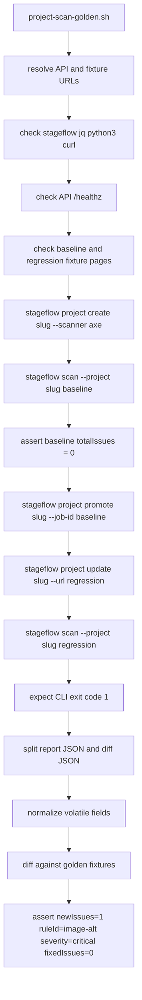

# QA Repo Map

This map documents the `qa` slice of StageFlow: Go E2E tests, fixture inputs,
golden regression fixtures, and the local/CI assumptions that make those flows
meaningful. Every behavioral claim below is grounded in the cited source lines.

## Slice Boundary

| Path | Role | Evidence |
| --- | --- | --- |
| `qa/e2e/config_test.go` | API base URL resolver and unit coverage for URL normalization. | `apiBaseURL` is initialized through `getAPIBaseURL`, which reads `API_BASE_URL`; empty input defaults to `http://localhost:8080/api/v1` (`qa/e2e/config_test.go:9`, `qa/e2e/config_test.go:12`, `qa/e2e/config_test.go:15`). |
| `qa/e2e/url_scan_test.go` | Full URL scan E2E entrypoint. | The test gates on `requireE2E`, waits for API readiness, fetches enabled modules, submits a URL job, waits for completion, parses the report, validates structure/summary/scanner-specific output, and logs performance (`qa/e2e/url_scan_test.go:8`, `qa/e2e/url_scan_test.go:12`, `qa/e2e/url_scan_test.go:16`, `qa/e2e/url_scan_test.go:19`, `qa/e2e/url_scan_test.go:28`, `qa/e2e/url_scan_test.go:32`). |
| `qa/e2e/url_scan_helpers_test.go` | URL scan helpers and report validators. | It fetches `/scanners`, posts to `/jobs/urls`, polls job status, fetches `/jobs/{id}/results`, rewrites MinIO redirects, unmarshals `UnifiedReportV2`, and validates summary consistency (`qa/e2e/url_scan_helpers_test.go:17`, `qa/e2e/url_scan_helpers_test.go:64`, `qa/e2e/url_scan_helpers_test.go:120`, `qa/e2e/url_scan_helpers_test.go:180`, `qa/e2e/url_scan_helpers_test.go:263`, `qa/e2e/url_scan_helpers_test.go:287`, `qa/e2e/url_scan_helpers_test.go:399`). |
| `qa/e2e/zip_scan_test.go` | Full ZIP scan E2E entrypoint and E2E gate. | The test calls `requireE2E`, waits for API readiness, copies the ZIP fixture, uploads it, waits for completion, and verifies report/results endpoints (`qa/e2e/zip_scan_test.go:8`, `qa/e2e/zip_scan_test.go:13`, `qa/e2e/zip_scan_test.go:15`, `qa/e2e/zip_scan_test.go:18`, `qa/e2e/zip_scan_test.go:19`). The gate skips unless `RUN_E2E` is set (`qa/e2e/zip_scan_test.go:29`, `qa/e2e/zip_scan_test.go:30`). |
| `qa/e2e/zip_scan_helpers_test.go` | ZIP upload, readiness, polling, and artifact checks. | It waits on `/healthz` or a POST-only `/jobs/zip` signal, copies `../fixtures/test-site.zip`, posts multipart form field `file` to `/jobs/zip`, polls `/jobs/{id}`, and checks `/report` plus `/results` redirects (`qa/e2e/zip_scan_helpers_test.go:66`, `qa/e2e/zip_scan_helpers_test.go:82`, `qa/e2e/zip_scan_helpers_test.go:98`, `qa/e2e/zip_scan_helpers_test.go:159`, `qa/e2e/zip_scan_helpers_test.go:234`, `qa/e2e/zip_scan_helpers_test.go:334`, `qa/e2e/zip_scan_helpers_test.go:335`). |
| `qa/e2e/project-scan-golden.sh` | Shell golden regression acceptance flow around the `stageflow` CLI and project baseline/diff behavior. | It configures API/fixture variables, wraps `stageflow`, normalizes variable JSON fields, compares golden files, and asserts the expected `image-alt` regression (`qa/e2e/project-scan-golden.sh:9`, `qa/e2e/project-scan-golden.sh:43`, `qa/e2e/project-scan-golden.sh:50`, `qa/e2e/project-scan-golden.sh:123`, `qa/e2e/project-scan-golden.sh:318`). |
| `qa/fixtures/project-golden/*.json` | Normalized golden outputs for the project baseline/diff flow. | Baseline fixture has `totalIssues: 0`; regression report and diff fixtures encode one axe `image-alt` issue and one new issue delta (`qa/fixtures/project-golden/golden-baseline-report.json:80`, `qa/fixtures/project-golden/golden-regression-report.json:56`, `qa/fixtures/project-golden/golden-regression-report.json:134`, `qa/fixtures/project-golden/golden-regression-diff.json:11`, `qa/fixtures/project-golden/golden-regression-diff.json:42`). |
| `qa/fixtures/simple-site/index.html` | Minimal static HTML fixture. | The file is a one-line HTML page (`qa/fixtures/simple-site/index.html:1`). |

## Runtime And Module Dependencies

| Dependency | Used By | Why It Matters | Evidence |
| --- | --- | --- | --- |
| Go `1.26.3` | `qa/e2e` module | E2E tests are an independent Go module in the workspace. | `qa/e2e/go.mod:1`, `qa/e2e/go.mod:3` |
| Generated report contract | URL scan report parser and validators | URL E2E unmarshals `/results` into `report.UnifiedReportV2`, so report contract changes can break the QA slice. | `qa/e2e/url_scan_helpers_test.go:14`, `qa/e2e/url_scan_helpers_test.go:161`, `qa/e2e/url_scan_helpers_test.go:166`, `qa/e2e/go.mod:29`, `qa/e2e/go.mod:31` |
| Platform API | URL and ZIP E2E tests | Tests hit `/api/v1/healthz`, `/scanners`, `/jobs/urls`, `/jobs/zip`, `/jobs/{id}`, `/jobs/{id}/report`, and `/jobs/{id}/results`. | `qa/e2e/config_test.go:17`, `qa/e2e/url_scan_helpers_test.go:20`, `qa/e2e/url_scan_helpers_test.go:80`, `qa/e2e/zip_scan_helpers_test.go:66`, `qa/e2e/zip_scan_helpers_test.go:159`, `qa/e2e/zip_scan_helpers_test.go:238`, `qa/e2e/zip_scan_helpers_test.go:334` |
| Object storage artifact redirects | URL and ZIP result checks | The tests account for signed URLs that point at `minio:9000` by rewriting to localhost while preserving the signed Host header. | `qa/e2e/url_scan_helpers_test.go:263`, `qa/e2e/url_scan_helpers_test.go:234`, `qa/e2e/zip_scan_helpers_test.go:311`, `qa/e2e/zip_scan_helpers_test.go:334`, `qa/e2e/zip_scan_helpers_test.go:335` |
| `stageflow`, `jq`, `python3`, `curl` | Golden regression shell flow | The shell flow refuses to run unless all four commands are available. | `qa/e2e/project-scan-golden.sh:163` |
| Project CRUD, baseline, scan, diff CLI surface | Golden regression shell flow | The script creates a project, scans baseline, promotes baseline, updates URL, rescans, normalizes report+diff, and compares fixtures. | `qa/e2e/project-scan-golden.sh:214`, `qa/e2e/project-scan-golden.sh:222`, `qa/e2e/project-scan-golden.sh:249`, `qa/e2e/project-scan-golden.sh:255`, `qa/e2e/project-scan-golden.sh:261`, `qa/e2e/project-scan-golden.sh:274`, `qa/e2e/project-scan-golden.sh:295` |

## URL Scan Flow

```mermaid
flowchart TD
  A[TestE2E_URLScan] --> B[requireE2E gate]
  B --> C[waitForAPI]
  C --> D[GET /api/v1/scanners]
  D --> E[POST /api/v1/jobs/urls]
  E --> F[Poll GET /api/v1/jobs/{job_id}]
  F --> G{terminal state}
  G -->|DONE or complete| H[GET /api/v1/jobs/{job_id}/results]
  G -->|FAILED| X[fail test]
  H --> I{direct JSON or redirect}
  I -->|200| J[Unmarshal UnifiedReportV2]
  I -->|302 or 307| K[Rewrite minio:9000 to localhost:9000]
  K --> J
  J --> L[Validate report structure]
  J --> M[Validate summary consistency]
  J --> N[Validate each scanner]
  N --> O[Log PERF_SUMMARY]
```

| Step | Source Behavior | Validates | Evidence |
| --- | --- | --- | --- |
| Gate | `requireE2E` skips normal `go test` runs unless `RUN_E2E` is set. | Prevents accidental live E2E execution in unit test loops. | `qa/e2e/zip_scan_test.go:22`, `qa/e2e/zip_scan_test.go:29` |
| API base URL | `API_BASE_URL` is normalized to include `/api/v1` unless an API path is already present. | Local and alternate API endpoints. | `qa/e2e/config_test.go:12`, `qa/e2e/config_test.go:15`, `qa/e2e/config_test.go:22`, `qa/e2e/config_test.go:30` |
| Readiness | `waitForAPI` polls until `/healthz` returns 200, or a GET to `/jobs/zip` returns 405/404 as a router readiness fallback. | API server readiness before job submission. | `qa/e2e/zip_scan_helpers_test.go:25`, `qa/e2e/zip_scan_helpers_test.go:66`, `qa/e2e/zip_scan_helpers_test.go:82`, `qa/e2e/zip_scan_helpers_test.go:95` |
| Scanner discovery | Enabled modules come from `/scanners`; the test fails if no enabled scanners are returned. | Scanner registry exposure and enablement. | `qa/e2e/url_scan_helpers_test.go:17`, `qa/e2e/url_scan_helpers_test.go:20`, `qa/e2e/url_scan_helpers_test.go:37`, `qa/e2e/url_scan_helpers_test.go:55` |
| Submission | The URL payload is `{"urls":["https://example.com"],"modules":modules}` and is sent to `/jobs/urls`. | URL scan submission path and job ID response. | `qa/e2e/url_scan_helpers_test.go:64`, `qa/e2e/url_scan_helpers_test.go:67`, `qa/e2e/url_scan_helpers_test.go:80`, `qa/e2e/url_scan_helpers_test.go:107` |
| Polling | The URL scan waits up to 6 minutes, polling every 3 seconds. | Job lifecycle state progression. | `qa/e2e/url_scan_helpers_test.go:120`, `qa/e2e/url_scan_helpers_test.go:123`, `qa/e2e/url_scan_helpers_test.go:126`, `qa/e2e/url_scan_helpers_test.go:138` |
| Report fetch | Results are fetched from `/jobs/{id}/results`; redirects are followed after MinIO host rewriting. | Artifact access through direct API or signed storage URL. | `qa/e2e/url_scan_helpers_test.go:180`, `qa/e2e/url_scan_helpers_test.go:183`, `qa/e2e/url_scan_helpers_test.go:193`, `qa/e2e/url_scan_helpers_test.go:199`, `qa/e2e/url_scan_helpers_test.go:263` |
| Report contract | The report must be version `2.x`, match the job ID, include expected scanner count, include at least one page, and have a non-nil issues slice. | Unified report schema compatibility. | `qa/e2e/url_scan_helpers_test.go:287`, `qa/e2e/url_scan_helpers_test.go:290`, `qa/e2e/url_scan_helpers_test.go:294`, `qa/e2e/url_scan_helpers_test.go:298`, `qa/e2e/url_scan_helpers_test.go:302`, `qa/e2e/url_scan_helpers_test.go:306` |
| Scanner-specific checks | Lighthouse requires summary categories; axe logs issue count and WCAG tag gaps. | Scanner-specific data shape for important modules. | `qa/e2e/url_scan_helpers_test.go:358`, `qa/e2e/url_scan_helpers_test.go:369`, `qa/e2e/url_scan_helpers_test.go:381` |

## ZIP Scan Flow

```mermaid
flowchart TD
  A[TestE2E_ZipScan] --> B[requireE2E gate]
  B --> C[waitForAPI]
  C --> D[copy qa/fixtures/test-site.zip to temp dir]
  D --> E[POST multipart file to /api/v1/jobs/zip]
  E --> F[decode job_id]
  F --> G[Poll GET /api/v1/jobs/{job_id}]
  G --> H{terminal state}
  H -->|DONE or complete| I[Check /report endpoint]
  H -->|FAILED| X[fail test]
  I --> J[Check /results endpoint]
  J --> K{direct 200 or redirect}
  K -->|redirect| L[Rewrite minio:9000 to localhost:9000 and set Host]
  K -->|200| M[artifact reachable]
  L --> M
```

| Step | Source Behavior | Validates | Evidence |
| --- | --- | --- | --- |
| Fixture lookup | `createTestZip` resolves `../fixtures/test-site.zip`, copies it to a temp path, and fails if it is absent. | ZIP fixture availability and path assumptions. | `qa/e2e/zip_scan_helpers_test.go:98`, `qa/e2e/zip_scan_helpers_test.go:101`, `qa/e2e/zip_scan_helpers_test.go:107`, `qa/e2e/zip_scan_helpers_test.go:110` |
| Upload | `uploadZip` creates multipart form field `file` and posts to `/jobs/zip`. | ZIP intake API behavior. | `qa/e2e/zip_scan_helpers_test.go:133`, `qa/e2e/zip_scan_helpers_test.go:146`, `qa/e2e/zip_scan_helpers_test.go:159` |
| Accepted status | Upload accepts 200, 201, or 202 and decodes `job_id`. | Tolerance for API status-code variants already encoded in tests. | `qa/e2e/zip_scan_helpers_test.go:173`, `qa/e2e/zip_scan_helpers_test.go:183` |
| Polling | ZIP flow waits up to 2 minutes and polls every 2 seconds. | Archive extraction plus scan lifecycle completion. | `qa/e2e/zip_scan_helpers_test.go:193`, `qa/e2e/zip_scan_helpers_test.go:196`, `qa/e2e/zip_scan_helpers_test.go:199`, `qa/e2e/zip_scan_helpers_test.go:209` |
| Terminal states | `done` and `complete` are success; `failed` is failure. | Job state naming compatibility. | `qa/e2e/zip_scan_helpers_test.go:260`, `qa/e2e/zip_scan_helpers_test.go:269` |
| Artifact checks | The test checks both report and results endpoints and follows object-storage redirects. | Rendered HTML report and raw JSON result availability. | `qa/e2e/zip_scan_helpers_test.go:273`, `qa/e2e/zip_scan_helpers_test.go:334`, `qa/e2e/zip_scan_helpers_test.go:335` |

## Project Golden Regression Flow



| Phase | Inputs | Outputs | Evidence |
| --- | --- | --- | --- |
| Configuration | `STAGEFLOW_API_URL`, `STAGEFLOW_API_KEY`, `STAGEFLOW_FIXTURE_BASE_URL`, `PROJECT_GOLDEN_ARTIFACT_DIR`, `STAGEFLOW_BASELINE_URL`, `STAGEFLOW_REGRESSION_URL`. | Runtime URLs and optional copied artifact directory. | `qa/e2e/project-scan-golden.sh:9`, `qa/e2e/project-scan-golden.sh:10`, `qa/e2e/project-scan-golden.sh:11`, `qa/e2e/project-scan-golden.sh:12`, `qa/e2e/project-scan-golden.sh:27`, `qa/e2e/project-scan-golden.sh:28` |
| Local fixture default | If API URL is localhost or 127.0.0.1 and no fixture base is set, fixtures default to `http://localhost:3010`. | Local overlay frontend is expected to serve `/qa/baseline.html` and `/qa/regression.html`. | `qa/e2e/project-scan-golden.sh:15`, `qa/e2e/project-scan-golden.sh:18`, `qa/e2e/project-scan-golden.sh:27`, `qa/e2e/project-scan-golden.sh:28` |
| Prerequisites | `stageflow`, `jq`, `python3`, `curl`, reachable API health endpoint, reachable fixture pages. | Fast failure with setup hints before project mutation. | `qa/e2e/project-scan-golden.sh:163`, `qa/e2e/project-scan-golden.sh:170`, `qa/e2e/project-scan-golden.sh:181` |
| Baseline | `stageflow project create` with the baseline URL and `axe`; then `stageflow scan --project`. | Baseline raw JSON and extracted baseline job ID. | `qa/e2e/project-scan-golden.sh:216`, `qa/e2e/project-scan-golden.sh:224`, `qa/e2e/project-scan-golden.sh:228` |
| Baseline assertion | `report.summary.totalIssues` must be 0. | Regression comparison starts from a clean baseline. | `qa/e2e/project-scan-golden.sh:237`, `qa/e2e/project-scan-golden.sh:242`, `qa/e2e/project-scan-golden.sh:245` |
| Promotion and regression | Promote baseline job, update project URL, run regression scan, expect exit code 1. | Regression scan raw output containing report JSON and diff JSON. | `qa/e2e/project-scan-golden.sh:251`, `qa/e2e/project-scan-golden.sh:257`, `qa/e2e/project-scan-golden.sh:264`, `qa/e2e/project-scan-golden.sh:270` |
| Normalization | `normalize_report`, `split_json_docs`, and `normalize_diff` remove volatile metadata. | Stable files suitable for golden comparison. | `qa/e2e/project-scan-golden.sh:50`, `qa/e2e/project-scan-golden.sh:82`, `qa/e2e/project-scan-golden.sh:91`, `qa/e2e/project-scan-golden.sh:278`, `qa/e2e/project-scan-golden.sh:281`, `qa/e2e/project-scan-golden.sh:293` |
| Golden comparison | `compare_golden` uses `diff -u`; `UPDATE_GOLDENS=1` intentionally creates or refreshes fixtures. | Pass/fail diffs against `qa/fixtures/project-golden`. | `qa/e2e/project-scan-golden.sh:123`, `qa/e2e/project-scan-golden.sh:129`, `qa/e2e/project-scan-golden.sh:141`, `qa/e2e/project-scan-golden.sh:142`, `qa/e2e/project-scan-golden.sh:298`, `qa/e2e/project-scan-golden.sh:302`, `qa/e2e/project-scan-golden.sh:306` |
| Structural assertions | New issues must be 1, new rule must be `image-alt`, severity must be `critical`, fixed issues must be 0. | The golden flow verifies semantic regression shape, not just file bytes. | `qa/e2e/project-scan-golden.sh:313`, `qa/e2e/project-scan-golden.sh:318`, `qa/e2e/project-scan-golden.sh:323`, `qa/e2e/project-scan-golden.sh:328` |

## Tests, Fixtures, Scripts, Commands, Outputs

| Item | Command Or Entry | Inputs | Outputs | Runtime/Subystem Validated | Evidence |
| --- | --- | --- | --- | --- | --- |
| API base URL unit test | `go test ./...` in `qa/e2e` | `API_BASE_URL` cases in table-driven test. | Pass/fail unit result. | Test harness configuration. | `qa/e2e/config_test.go:33`, `qa/e2e/config_test.go:41`, `qa/e2e/config_test.go:49` |
| URL E2E | `RUN_E2E=1 go test ./...` from `qa/e2e` | API stack, enabled scanners, public `https://example.com`. | Parsed `UnifiedReportV2`, validation failures, `PERF_SUMMARY` logs. | Platform API URL job path, scanner registry, scanner runner, artifact storage. | `qa/e2e/url_scan_test.go:8`, `qa/e2e/url_scan_helpers_test.go:67`, `qa/e2e/url_scan_helpers_test.go:512` |
| ZIP E2E | `RUN_E2E=1 go test ./...` from `qa/e2e` | `qa/fixtures/test-site.zip`, API stack. | Reachable `/report` and `/results` artifacts. | ZIP intake, extraction, scan completion, artifact links. | `qa/e2e/zip_scan_test.go:8`, `qa/e2e/zip_scan_helpers_test.go:101`, `qa/e2e/zip_scan_helpers_test.go:334` |
| Golden regression | `bash qa/e2e/project-scan-golden.sh` or `just project-golden` | Local overlay/API, fixture pages, `stageflow`, `jq`, `python3`, `curl`. | Golden compare pass/fail; optional copied work dir; final success text. | CLI project create/promote/update, scan diff, axe regression detection. | `qa/e2e/project-scan-golden.sh:163`, `qa/e2e/project-scan-golden.sh:344`, `justfile:617`, `justfile:620` |
| Baseline report fixture | `qa/fixtures/project-golden/golden-baseline-report.json` | Normalized baseline scan output. | Expected clean report with zero issues. | Project baseline scan. | `qa/fixtures/project-golden/golden-baseline-report.json:2`, `qa/fixtures/project-golden/golden-baseline-report.json:80` |
| Regression report fixture | `qa/fixtures/project-golden/golden-regression-report.json` | Normalized regression scan output. | Expected report with one axe `image-alt` issue. | Regression scan report contract. | `qa/fixtures/project-golden/golden-regression-report.json:2`, `qa/fixtures/project-golden/golden-regression-report.json:56`, `qa/fixtures/project-golden/golden-regression-report.json:134` |
| Regression diff fixture | `qa/fixtures/project-golden/golden-regression-diff.json` | Normalized regression diff output. | Expected diff with one new issue and no fixed issues. | Baseline diff engine and CLI diff output. | `qa/fixtures/project-golden/golden-regression-diff.json:2`, `qa/fixtures/project-golden/golden-regression-diff.json:11`, `qa/fixtures/project-golden/golden-regression-diff.json:42` |

## Local And CI Assumptions

| Assumption | Details | Evidence |
| --- | --- | --- |
| Normal `go test` does not run live E2E flows. | `RUN_E2E` must be set or tests skip. | `qa/e2e/zip_scan_test.go:29`, `qa/e2e/zip_scan_test.go:30` |
| API defaults to localhost on port 8080. | Empty `API_BASE_URL` resolves to `http://localhost:8080/api/v1`; the golden script defaults `STAGEFLOW_API_URL` to `http://localhost:8080`. | `qa/e2e/config_test.go:17`, `qa/e2e/project-scan-golden.sh:9` |
| API readiness timeout is configurable. | `E2E_API_READY_TIMEOUT_SECONDS` overrides the 120 second default. | `qa/e2e/zip_scan_helpers_test.go:48`, `qa/e2e/zip_scan_helpers_test.go:51` |
| Golden local overlay expects frontend fixture pages on port 3010. | Local API URL without explicit fixture base sets `FIXTURE_BASE_URL=http://localhost:3010`. | `qa/e2e/project-scan-golden.sh:15`, `qa/e2e/project-scan-golden.sh:18` |
| `just project-golden` is the root command for the shell golden flow. | Root justfile recipe runs `bash qa/e2e/project-scan-golden.sh`. | `justfile:616`, `justfile:617`, `justfile:620` |
| Golden regression CI is not part of the main CI job. | Separate workflow has `workflow_dispatch` plus daily cron at `23 8 * * *`, installs Podman, starts local compose overlay, runs the golden script, uploads artifacts, and tears down compose. | `.github/workflows/golden-regression.yml:4`, `.github/workflows/golden-regression.yml:6`, `.github/workflows/golden-regression.yml:52`, `.github/workflows/golden-regression.yml:78`, `.github/workflows/golden-regression.yml:108`, `.github/workflows/golden-regression.yml:123`, `.github/workflows/golden-regression.yml:135` |
| Main CI runs Go tests but does not set `RUN_E2E` in the cited command. | The Go CI command is `bash devtools/scripts/go/run-in-work-dirs.sh Testing go test -race ./...`; no `RUN_E2E` is shown on that line. | `.github/workflows/ci.yml:104` |
| Configuration reference requires one URL scan and one ZIP scan for pre-deploy validation. | The deployment checklist explicitly includes both scan types and SSE/report retrieval. | `docs/reference/configuration.md:176`, `docs/reference/configuration.md:177` |

## Uncertainties And Sharp Edges

| Item | Status | Evidence |
| --- | --- | --- |
| `qa/fixtures/test-site.zip` is binary, so this map cites the code path that requires it rather than inspecting ZIP contents. | Confirmed referenced by tests; contents not described here. | `qa/e2e/zip_scan_helpers_test.go:101`, `qa/e2e/zip_scan_helpers_test.go:107` |
| URL E2E test target is fixed to `https://example.com`. | This is hard-coded in the helper; there is no environment override in the cited code. | `qa/e2e/url_scan_helpers_test.go:67` |
| Golden fixtures depend on fixture pages served outside `qa/fixtures/project-golden`. | The script checks URLs but does not define the page HTML in this slice. | `qa/e2e/project-scan-golden.sh:27`, `qa/e2e/project-scan-golden.sh:28`, `qa/e2e/project-scan-golden.sh:181` |
| The golden script can intentionally update fixtures. | `UPDATE_GOLDENS=1` creates missing or refreshed golden files, so reviewers should treat fixture diffs as deliberate only when this variable was used intentionally. | `qa/e2e/project-scan-golden.sh:129`, `qa/e2e/project-scan-golden.sh:142` |
