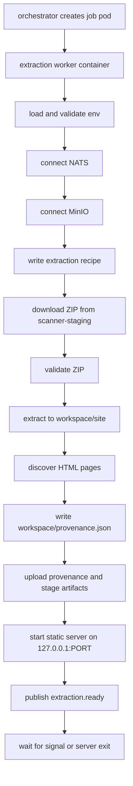
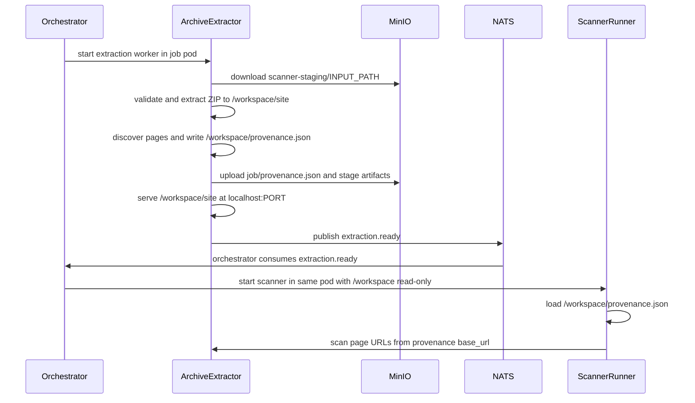

# Archive Extractor Repo Map

This document maps `services/archive-extractor`, the StageFlow runtime that turns a staged ZIP upload into a served static site plus `provenance.json`, then publishes extraction lifecycle events for the orchestrator and scanner runners.

## Runtime Scope

Archive Extractor is a one-job runtime. The orchestrator starts it in the job pod with a shared `/workspace` volume and `INPUT_PATH`; the extractor downloads that ZIP from MinIO staging, validates and extracts it into `/workspace/site`, discovers HTML pages, writes and uploads provenance/stage artifacts, starts a loopback static server, publishes `extraction.ready`, and stays alive until the pod is stopped or the server exits.

Out of scope for this slice: creating the job pod, launching scanner containers, deciding scanner modules, aggregating scan reports, and serving public artifact URLs. Those are orchestrator/platform/scanner-runner responsibilities.

## Directory And File Map

| Path | Responsibility | Key citations |
|---|---|---|
| `cmd/server/main.go` | Main job lifecycle: config, NATS/MinIO clients, extraction, discovery, provenance, static server, success/failure events, shutdown. | `services/archive-extractor/cmd/server/main.go:26`, `services/archive-extractor/cmd/server/main.go:42`, `services/archive-extractor/cmd/server/main.go:123`, `services/archive-extractor/cmd/server/main.go:321`, `services/archive-extractor/cmd/server/main.go:470` |
| `cmd/server/stage_logger.go` | Extraction recipe and stage log schemas, local workspace paths, artifact object keys, event/metric/artifact recording, success/failure finalization. | `services/archive-extractor/cmd/server/stage_logger.go:18`, `services/archive-extractor/cmd/server/stage_logger.go:102`, `services/archive-extractor/cmd/server/stage_logger.go:138`, `services/archive-extractor/cmd/server/stage_logger.go:212` |
| `internal/extractor/extractor.go` | MinIO ZIP download, ZIP validation limits, path sanitization, safe extraction, file permissions, actual-byte extraction enforcement. | `services/archive-extractor/internal/extractor/extractor.go:39`, `services/archive-extractor/internal/extractor/extractor.go:108`, `services/archive-extractor/internal/extractor/extractor.go:166`, `services/archive-extractor/internal/extractor/extractor.go:198`, `services/archive-extractor/internal/extractor/extractor.go:315` |
| `internal/discovery/discovery.go` | Walk extracted site, ignore symlinks, select `.html`/`.htm`, generate URL-style paths and stable page IDs. | `services/archive-extractor/internal/discovery/discovery.go:20`, `services/archive-extractor/internal/discovery/discovery.go:37`, `services/archive-extractor/internal/discovery/discovery.go:73`, `services/archive-extractor/internal/discovery/discovery.go:77`, `services/archive-extractor/internal/discovery/discovery.go:89` |
| `internal/provenance/provenance.go` | Build `models.Provenance`, resolve page URLs from `base_url` plus page path, write indented JSON via temp file and rename. | `services/archive-extractor/internal/provenance/provenance.go:18`, `services/archive-extractor/internal/provenance/provenance.go:25`, `services/archive-extractor/internal/provenance/provenance.go:60` |
| `internal/server/server.go` | Embedded HTTP file server for extracted site, loopback default, CORS headers, graceful stop, listener address. | `services/archive-extractor/internal/server/server.go:25`, `services/archive-extractor/internal/server/server.go:32`, `services/archive-extractor/internal/server/server.go:51`, `services/archive-extractor/internal/server/server.go:120` |
| `integration_test.go` | Build-tagged end-to-end test for local ZIP extraction, discovery, server, provenance URLs, CORS, and traversal fixture rejection. | `services/archive-extractor/integration_test.go:1`, `services/archive-extractor/integration_test.go:25`, `services/archive-extractor/integration_test.go:119` |
| `testdata/` | HTML and ZIP fixtures for discovery and security tests. Some ZIP fixtures are present but not all are referenced by current tests. | `services/archive-extractor/internal/discovery/discovery_test.go:10`, `services/archive-extractor/integration_test.go:127` |
| `Dockerfile` | Multi-stage build for static Linux binary and non-root Alpine runtime user. | `services/archive-extractor/Dockerfile:3`, `services/archive-extractor/Dockerfile:18`, `services/archive-extractor/Dockerfile:26`, `services/archive-extractor/Dockerfile:31` |
| `go.mod` | Slice module and shared StageFlow Go library replacements. | `services/archive-extractor/go.mod:1`, `services/archive-extractor/go.mod:5`, `services/archive-extractor/go.mod:43` |

## Runtime Phases

| Phase | What happens | Inputs | Outputs | Failure behavior |
|---|---|---|---|---|
| Config load/validation | Reads job/env config and validates required post-default fields. | `JOB_ID`, `INPUT_PATH`, NATS/MinIO env, `WORKSPACE`, `PORT`, artifact bucket. | `Config` struct. | Invalid config logs and exits before NATS is created, so no extraction event is published. `services/archive-extractor/cmd/server/main.go:29`, `services/archive-extractor/cmd/server/main.go:31`, `services/archive-extractor/cmd/server/main.go:368`, `services/archive-extractor/cmd/server/main.go:381` |
| NATS connect | Creates shared messaging client. | `cfg.NATS`. | `*messaging.Client`. | Calls centralized failure path, but with `natsClient == nil`, so no event can be published. `services/archive-extractor/cmd/server/main.go:71`, `services/archive-extractor/cmd/server/main.go:73`, `services/archive-extractor/cmd/server/main.go:504` |
| MinIO connect | Creates shared MinIO client. | `cfg.MinIO`. | `*storage.MinIOClient`. | Publishes `extraction.failed` if NATS is available. `services/archive-extractor/cmd/server/main.go:86`, `services/archive-extractor/cmd/server/main.go:87`, `services/archive-extractor/cmd/server/main.go:89` |
| Stage logger init | Creates local recipe/stage directories and uploads extraction recipe. | `WORKSPACE`, `JOB_ID`, `INPUT_PATH`, artifact bucket. | Local `recipes/extraction.json`; object `<job>/recipes/extraction.json`. | Publishes failure at `logging` stage if possible. `services/archive-extractor/cmd/server/stage_logger.go:102`, `services/archive-extractor/cmd/server/stage_logger.go:119`, `services/archive-extractor/cmd/server/stage_logger.go:120`, `services/archive-extractor/cmd/server/main.go:102` |
| ZIP download/extract | Downloads `INPUT_PATH` from `scanner-staging`, writes temp ZIP, validates, extracts to `<workspace>/site`, normalizes permissions. | MinIO `scanner-staging/<INPUT_PATH>`. | Extracted site directory. | Publishes `extraction.failed` at `extraction` stage. `services/archive-extractor/cmd/server/main.go:123`, `services/archive-extractor/cmd/server/main.go:130`, `services/archive-extractor/internal/extractor/extractor.go:57`, `services/archive-extractor/internal/extractor/extractor.go:73`, `services/archive-extractor/cmd/server/main.go:146` |
| HTML discovery | Walks site tree, collects real `.html`/`.htm` files, sorts paths, assigns IDs. | `<workspace>/site`. | `[]discovery.HTMLPage`. | No HTML pages is a discovery error and becomes `extraction.failed`. `services/archive-extractor/cmd/server/main.go:174`, `services/archive-extractor/internal/discovery/discovery.go:32`, `services/archive-extractor/internal/discovery/discovery.go:73`, `services/archive-extractor/cmd/server/main.go:185` |
| Provenance generation | Uses `http://localhost:<PORT>` and discovered pages to write `provenance.json`. | `JOB_ID`, `PORT`, pages. | Local `<workspace>/provenance.json`; in-memory `models.Provenance`. | Publishes `extraction.failed` at `provenance` stage. `services/archive-extractor/cmd/server/main.go:202`, `services/archive-extractor/cmd/server/main.go:211`, `services/archive-extractor/cmd/server/main.go:212`, `services/archive-extractor/internal/provenance/provenance.go:36` |
| Provenance upload | Uploads local provenance to artifacts bucket. | `<workspace>/provenance.json`. | Object `<job>/provenance.json`. | Publishes `extraction.failed` at `provenance_upload` stage. `services/archive-extractor/cmd/server/main.go:234`, `services/archive-extractor/cmd/server/main.go:242`, `services/archive-extractor/cmd/server/main.go:271` |
| Static server | Starts HTTP file server for extracted site. | `<workspace>/site`, `PORT`. | Loopback server at `http://localhost:<PORT>`. | Startup failure publishes `extraction.failed`; later server crash during wait publishes `extraction.failed`. `services/archive-extractor/cmd/server/main.go:288`, `services/archive-extractor/internal/server/server.go:61`, `services/archive-extractor/internal/server/server.go:64`, `services/archive-extractor/cmd/server/main.go:453` |
| Ready event | Finalizes success stage log, sets stage/recipe paths on payload, publishes `extraction.ready`. | Provenance, base URL, artifact object keys. | NATS event on `extraction.events.ready`. | If ready publish fails, attempts `extraction.failed` at `extraction_ready_publish` and exits. `services/archive-extractor/cmd/server/main.go:321`, `services/archive-extractor/cmd/server/main.go:333`, `services/archive-extractor/cmd/server/main.go:343`, `services/archive-extractor/cmd/server/main.go:356` |
| Wait | Keeps server alive until SIGINT/SIGTERM or server exit. | OS signals, server goroutine. | Process lifetime for scanner access. | Server error is terminal failure; normal signal exits without publishing another event. `services/archive-extractor/cmd/server/main.go:432`, `services/archive-extractor/cmd/server/main.go:450` |

## End-To-End Handoff To Scanner Runner

The key handoff is `provenance.json` plus `base_url`. The extractor writes both into the local workspace and event payload. The orchestrator then starts scanners in the same job pod, mounts the workspace read-only at `/workspace`, and sets `PROVENANCE_PATH=/workspace/provenance.json` for ZIP jobs.

| Handoff point | Producer behavior | Consumer behavior | Evidence |
|---|---|---|---|
| Shared pod and workspace | Orchestrator creates an extraction container in `job.PodID` and mounts `workspace-<job>` at `/workspace`. | Scanner launch plan mounts the same `workspace-<job>` read-only at `/workspace`. | `services/orchestrator/internal/adapters/runtime/job_runtime.go:151`, `services/orchestrator/internal/adapters/runtime/job_runtime.go:154`, `services/orchestrator/internal/adapters/runtime/job_runtime.go:156`, `services/orchestrator/internal/application/jobs/scanner_launch_planner.go:146`, `services/orchestrator/internal/application/jobs/scanner_launch_planner.go:148`, `services/orchestrator/internal/application/jobs/scanner_launch_planner.go:150` |
| Loopback static URL | Extractor builds `baseURL = "http://localhost:" + cfg.Port` and stores it in provenance and event payload. The server itself defaults to `127.0.0.1:<port>`. | Scanner loads provenance from `PROVENANCE_PATH` and resolves page URLs from `base_url` plus page path. | `services/archive-extractor/cmd/server/main.go:212`, `services/archive-extractor/cmd/server/main.go:333`, `services/archive-extractor/internal/server/server.go:39`, `services/archive-extractor/internal/server/server.go:41`, `services/scanner-runner/src/core/page-iterator.ts:110`, `services/scanner-runner/src/core/page-iterator.ts:341`, `services/scanner-runner/src/core/page-iterator.ts:348` |
| Scanner env for ZIP jobs | Extraction runtime writes `PORT=8080`; scanner planner uses `/workspace/provenance.json` unless the job is URL-input. | Scanner config loader reads `PROVENANCE_PATH` with a fallback to data dir provenance. | `services/orchestrator/internal/adapters/runtime/job_runtime.go:230`, `services/orchestrator/internal/adapters/runtime/job_runtime.go:231`, `services/orchestrator/internal/application/jobs/scanner_launch_planner.go:172`, `services/orchestrator/internal/application/jobs/scanner_launch_planner.go:174`, `services/scanner-runner/src/core/config-loader.ts:36` |
| Ready event persistence | Payload includes local provenance path, base URL, page count, provenance object key, stage log key, and recipe key. | Orchestrator persists extraction artifacts/provenance paths, then starts scanner containers. | `services/archive-extractor/cmd/server/main.go:333`, `services/archive-extractor/cmd/server/main.go:349`, `services/archive-extractor/cmd/server/main.go:350`, `services/orchestrator/internal/application/jobs/service.go:424`, `services/orchestrator/internal/application/jobs/service.go:436`, `services/orchestrator/internal/application/jobs/service.go:444`, `services/orchestrator/internal/application/jobs/service.go:126`, `services/orchestrator/internal/application/jobs/service.go:156` |

External semantic note: Podman pod defaults include sharing the network namespace (`net`) unless overridden; this matches the repo's same-pod/`localhost` design. See Podman documentation for `--share` defaults and network namespace modes: https://docs.podman.io/en/latest/markdown/podman-pod-create.1.html

## Safety Controls

| Control | Implementation | Test evidence | Notes |
|---|---|---|---|
| Entry count limit | Rejects more than `5000` ZIP entries. | `services/archive-extractor/internal/extractor/extractor.go:19`, `services/archive-extractor/internal/extractor/extractor.go:121`, `services/archive-extractor/internal/extractor/validate_zip_test.go:160` | Protects against tiny-file floods. |
| Aggregate declared uncompressed size | Rejects total declared uncompressed bytes over `1 GiB`. | `services/archive-extractor/internal/extractor/extractor.go:22`, `services/archive-extractor/internal/extractor/extractor.go:149`, `services/archive-extractor/internal/extractor/extractor.go:159` | Uses ZIP central directory values during validation. No direct unit test creates a >1 GiB archive. |
| Per-entry declared uncompressed size | Rejects entries over `250 MiB`. | `services/archive-extractor/internal/extractor/extractor.go:23`, `services/archive-extractor/internal/extractor/extractor.go:140` | No direct test creates a >250 MiB entry. |
| Compression ratio | Rejects declared total/file size ratio over `100x`. | `services/archive-extractor/internal/extractor/extractor.go:21`, `services/archive-extractor/internal/extractor/extractor.go:152`, `services/archive-extractor/internal/extractor/extractor.go:154`, `services/archive-extractor/internal/extractor/validate_zip_test.go:143` | The current test proves normal compression passes; it does not create a rejecting ratio fixture. |
| Empty/long/NUL names | Rejects empty names, names longer than `4096`, and names containing NUL. | `services/archive-extractor/internal/extractor/extractor.go:24`, `services/archive-extractor/internal/extractor/extractor.go:128`, `services/archive-extractor/internal/extractor/extractor.go:132` | No direct tests for these edge cases. |
| Absolute POSIX paths | Rejects names beginning with `/`. | `services/archive-extractor/internal/extractor/extractor.go:170`, `services/archive-extractor/internal/extractor/validate_zip_test.go:84` | Fixture `testdata/absolute-path.zip` exists but is not referenced by current tests. |
| Windows drive paths | Rejects drive-letter paths like `C:/...`. | `services/archive-extractor/internal/extractor/extractor.go:174`, `services/archive-extractor/internal/extractor/extractor.go:177` | No direct test for this case. |
| Backslash normalization | Replaces `\` with `/` before path validation. | `services/archive-extractor/internal/extractor/extractor.go:167`, `services/archive-extractor/internal/extractor/extractor.go:168` | Prevents Windows-style traversal from avoiding URL-path cleanup. No direct test. |
| Dot-dot traversal | Cleans path and rejects `..` or `../...`. | `services/archive-extractor/internal/extractor/extractor.go:182`, `services/archive-extractor/internal/extractor/extractor.go:187`, `services/archive-extractor/internal/extractor/validate_zip_test.go:29`, `services/archive-extractor/internal/extractor/extract_zip_test.go:47` | Integration fixture also proves traversal archive is rejected. `services/archive-extractor/integration_test.go:119` |
| Destination containment | Joins sanitized path under `destDir` and rechecks with `filepath.Rel`. | `services/archive-extractor/internal/extractor/extractor.go:253`, `services/archive-extractor/internal/extractor/extractor.go:255`, `services/archive-extractor/internal/extractor/extractor.go:295` | Defense in depth after name sanitization. |
| Actual extracted byte limit | Tracks actual bytes copied per entry with `io.LimitReader(maxEntryBytes+1)` and aggregate bytes after extraction. | `services/archive-extractor/internal/extractor/extractor.go:226`, `services/archive-extractor/internal/extractor/extractor.go:227`, `services/archive-extractor/internal/extractor/extractor.go:345`, `services/archive-extractor/internal/extractor/extractor.go:351`, `services/archive-extractor/internal/extractor/validate_zip_test.go:190`, `services/archive-extractor/internal/extractor/validate_zip_test.go:206` | This is the runtime backstop if central-directory size metadata is misleading. |
| File permissions | Creates directories `0750` and files `0600`; main also best-effort normalizes extracted tree. | `services/archive-extractor/internal/extractor/extractor.go:214`, `services/archive-extractor/internal/extractor/extractor.go:260`, `services/archive-extractor/internal/extractor/extractor.go:327`, `services/archive-extractor/cmd/server/main.go:157` | Main logs but does not fail if post-extraction chmod fails. |
| Symlink discovery | Discovery skips symlinks and does not traverse symlink directories. | `services/archive-extractor/internal/discovery/discovery.go:37`, `services/archive-extractor/internal/discovery/discovery.go:40`, `services/archive-extractor/internal/discovery/discovery_test.go:274` | ZIP extraction does not create symlinks explicitly; a symlink-mode ZIP entry would be written as a regular file because extraction opens a destination file and copies bytes. |
| Nesting behavior | Nested paths are allowed after sanitization and containment checks. There is no explicit max-depth check. | `services/archive-extractor/internal/extractor/extractor.go:267`, `services/archive-extractor/internal/discovery/discovery_test.go:82`, `services/archive-extractor/internal/provenance/generator_generate_test.go:74` | Deep nesting is bounded indirectly by entry count, name length, and total extracted bytes. |

## Events And Artifacts

| Item | Subject/object/path | Fields or contents | Evidence |
|---|---|---|---|
| `extraction.ready` event | NATS subject `extraction.events.ready` | Envelope event `extraction.ready`, producer `extractor`, request/run IDs copied from config; payload includes job ID, local provenance path, base URL, total pages, provenance artifact path, stage log path, recipe path. | `libs/go/messaging/streams.go:28`, `libs/go/events/types.go:78`, `services/archive-extractor/cmd/server/main.go:333`, `services/archive-extractor/cmd/server/main.go:352`, `services/archive-extractor/cmd/server/main.go:356` |
| `extraction.failed` event | NATS subject `extraction.events.failed` | Envelope event `extraction.failed`, producer `extractor`; payload error is `"<stage> failed"`, details are original error string, optional stage log/recipe paths. | `libs/go/messaging/streams.go:29`, `libs/go/events/types.go:112`, `services/archive-extractor/cmd/server/main.go:505`, `services/archive-extractor/cmd/server/main.go:513`, `services/archive-extractor/cmd/server/main.go:517` |
| Event stream | JetStream stream `extraction` includes ready and failed subjects. | Shared messaging stream setup. | `libs/go/messaging/streams.go:12`, `libs/go/messaging/streams.go:61`, `libs/go/messaging/streams.go:64` |
| Provenance local file | `<WORKSPACE>/provenance.json` | `version`, `job_id`, `base_url`, `pages[]` with `id`, `path`, `url`. | `services/archive-extractor/cmd/server/main.go:213`, `services/archive-extractor/internal/provenance/provenance.go:46`, `libs/go/models/provenance.go:9`, `libs/go/models/provenance.go:46` |
| Provenance object | `<JOB_ID>/provenance.json` in artifacts bucket | Uploaded from local provenance file. | `services/archive-extractor/cmd/server/main.go:242`, `services/archive-extractor/cmd/server/main.go:271` |
| Extraction recipe local/object | Local `<WORKSPACE>/recipes/extraction.json`; object `<JOB_ID>/recipes/extraction.json` | Schema, job ID, stage, generated time, staging input bucket/object, workspace, port, selected env values. | `services/archive-extractor/cmd/server/stage_logger.go:39`, `services/archive-extractor/cmd/server/stage_logger.go:119`, `services/archive-extractor/cmd/server/stage_logger.go:120`, `services/archive-extractor/cmd/server/stage_logger.go:138` |
| Extraction stage log local/object | Local `<WORKSPACE>/stages/extraction.log.json`; object `<JOB_ID>/stages/extraction.log.json` | Schema, status, duration, recipe ref and SHA256, metrics, events, artifacts, optional failure. | `services/archive-extractor/cmd/server/stage_logger.go:55`, `services/archive-extractor/cmd/server/stage_logger.go:121`, `services/archive-extractor/cmd/server/stage_logger.go:122`, `services/archive-extractor/cmd/server/stage_logger.go:248` |
| Stage events | In stage log only | `stage_started`, `zip_extracted`, `discovery_completed`, `provenance_generated`, `provenance_uploaded`, `server_started`, `extraction_ready`, terminal `stage_completed` or `stage_failed`. | `services/archive-extractor/cmd/server/stage_logger.go:130`, `services/archive-extractor/cmd/server/main.go:146`, `services/archive-extractor/cmd/server/main.go:197`, `services/archive-extractor/cmd/server/main.go:229`, `services/archive-extractor/cmd/server/main.go:283`, `services/archive-extractor/cmd/server/main.go:330`, `services/archive-extractor/cmd/server/main.go:341`, `services/archive-extractor/cmd/server/stage_logger.go:226` |
| Buckets | Staging bucket `scanner-staging`; artifact bucket default `scanner-artifacts`. | Shared storage constants. | `libs/go/storage/minio.go:126`, `libs/go/storage/minio.go:128`, `libs/go/storage/minio.go:129` |

## Config, Runtime Dependencies, And Integration Points

| Name | Required/default behavior | Used for | Evidence |
|---|---|---|---|
| `JOB_ID` | Required by extractor validation. | Artifact keys, events, provenance, stage logs. | `services/archive-extractor/cmd/server/main.go:370`, `services/archive-extractor/cmd/server/main.go:383`, `services/archive-extractor/cmd/server/main.go:420` |
| `REQUEST_ID`, `RUN_ID` | Optional. | Copied into ready/failed envelopes when present. | `services/archive-extractor/cmd/server/main.go:371`, `services/archive-extractor/cmd/server/main.go:421`, `services/archive-extractor/cmd/server/main.go:353`, `services/archive-extractor/cmd/server/main.go:514` |
| `INPUT_PATH` | Required by extractor validation. | MinIO object key in `scanner-staging`. | `services/archive-extractor/cmd/server/main.go:373`, `services/archive-extractor/cmd/server/main.go:387`, `services/archive-extractor/cmd/server/main.go:135`, `services/archive-extractor/cmd/server/stage_logger.go:145` |
| `NATS_URL` and reconnect env | Shared loader defaults URL to `nats://localhost:4222`; validation only checks the post-load value is non-empty. | NATS event publishing. | `libs/go/config/loaders.go:13`, `libs/go/config/loaders.go:16`, `services/archive-extractor/cmd/server/main.go:391`, `services/archive-extractor/cmd/server/main.go:424` |
| `MINIO_ENDPOINT`, `MINIO_USE_SSL`, `MINIO_REGION` | Shared loader defaults endpoint to `localhost:9000`, SSL false, region `us-east-1`; validation only checks post-load endpoint non-empty. | MinIO client creation and recipe environment snapshot. | `libs/go/config/loaders.go:35`, `libs/go/config/loaders.go:53`, `libs/go/config/loaders.go:57`, `libs/go/config/loaders.go:59`, `services/archive-extractor/cmd/server/main.go:395` |
| `MINIO_ACCESS_KEY` or `MINIO_ROOT_USER` | Required by validation after fallback. | MinIO auth. | `libs/go/config/loaders.go:42`, `libs/go/config/loaders.go:44`, `services/archive-extractor/cmd/server/main.go:399` |
| `MINIO_SECRET_KEY` or `MINIO_ROOT_PASSWORD` | Required by validation after fallback. | MinIO auth. | `libs/go/config/loaders.go:47`, `libs/go/config/loaders.go:49`, `services/archive-extractor/cmd/server/main.go:403` |
| `WORKSPACE` | Defaults to `/workspace`; validation checks post-load non-empty. | Extracted site, provenance, recipe/stage logs. | `services/archive-extractor/cmd/server/main.go:376`, `services/archive-extractor/cmd/server/main.go:407`, `services/archive-extractor/cmd/server/main.go:426` |
| `PORT` | Defaults to `8080`; not separately validated. | Static server and provenance `base_url`. | `services/archive-extractor/cmd/server/main.go:377`, `services/archive-extractor/cmd/server/main.go:427`, `services/archive-extractor/cmd/server/main.go:212` |
| `MINIO_ARTIFACT_BUCKET` | Defaults to shared `scanner-artifacts`; validation checks post-load non-empty. | Provenance, recipe, and stage log uploads. | `services/archive-extractor/cmd/server/main.go:378`, `services/archive-extractor/cmd/server/main.go:411`, `services/archive-extractor/cmd/server/main.go:428` |
| Shared Go libs | `config`, `events`, `messaging`, `models`, `storage` are direct dependencies; module replaces them to local `libs/go/*`. | Env parsing, event contracts, NATS, provenance model, MinIO I/O. | `services/archive-extractor/go.mod:5`, `services/archive-extractor/go.mod:43` |
| MinIO client | `DownloadFile` stats objects before returning readers; `UploadFile` writes `application/octet-stream`. | Deterministic missing-object errors and artifact upload. | `libs/go/storage/minio.go:284`, `libs/go/storage/minio.go:291`, `libs/go/storage/minio.go:321`, `libs/go/storage/minio.go:328` |
| NATS publishing | `PublishEvent` validates event envelopes before publishing JSON to JetStream. | Ready/failed event emission. | `libs/go/messaging/publish.go:37`, `libs/go/messaging/publish.go:46`, `libs/go/messaging/publish.go:50` |
| Container image | Built from Go 1.26.4 Alpine, copied into Alpine runtime, runs as `extractor` user. | Production runtime. | `services/archive-extractor/Dockerfile:3`, `services/archive-extractor/Dockerfile:24`, `services/archive-extractor/Dockerfile:27`, `services/archive-extractor/Dockerfile:29`, `services/archive-extractor/Dockerfile:31` |

## External Boundaries

| Boundary | Direction | Contract | Evidence |
|---|---|---|---|
| Orchestrator -> Archive Extractor | Starts extraction worker container. | Same job pod, workspace volume mounted at `/workspace`, env includes `JOB_ID`, `INPUT_PATH`, NATS/MinIO details, `WORKSPACE=/workspace`, `PORT=8080`, artifact bucket. | `services/orchestrator/internal/adapters/runtime/job_runtime.go:137`, `services/orchestrator/internal/adapters/runtime/job_runtime.go:151`, `services/orchestrator/internal/adapters/runtime/job_runtime.go:220` |
| Archive Extractor -> MinIO staging | Reads ZIP. | Bucket `scanner-staging`, object path `INPUT_PATH`. | `services/archive-extractor/cmd/server/main.go:135`, `libs/go/storage/minio.go:128`, `libs/go/storage/minio.go:321` |
| Archive Extractor -> MinIO artifacts | Writes provenance, recipe, stage log. | Object keys under `<JOB_ID>/...` in artifact bucket. | `services/archive-extractor/cmd/server/main.go:242`, `services/archive-extractor/cmd/server/stage_logger.go:120`, `services/archive-extractor/cmd/server/stage_logger.go:122`, `services/archive-extractor/cmd/server/stage_logger.go:177` |
| Archive Extractor -> NATS | Publishes terminal extraction event. | `extraction.ready` or `extraction.failed` envelope. | `services/archive-extractor/cmd/server/main.go:352`, `services/archive-extractor/cmd/server/main.go:517`, `libs/go/events/envelope.go:12` |
| NATS -> Orchestrator | Orchestrator consumes extraction events. | Durable consumers on extraction stream ready/failed subjects. | `services/orchestrator/internal/adapters/messaging/consumers.go:69`, `services/orchestrator/internal/adapters/messaging/consumers.go:78` |
| Orchestrator -> Scanner Runner | Starts scanner containers after ready. | Scanners get read-only `/workspace`, writable `/results`, `PROVENANCE_PATH`, NATS/MinIO env. | `services/orchestrator/internal/application/jobs/service.go:156`, `services/orchestrator/internal/application/jobs/scanner_launch_planner.go:183`, `services/orchestrator/internal/application/jobs/scanner_launch_planner.go:188`, `services/orchestrator/internal/application/jobs/scanner_launch_planner.go:146` |
| Scanner Runner -> Archive Extractor static server | Reads pages through provenance URLs. | `base_url` is loopback static server; page URLs are normalized from provenance. | `services/archive-extractor/internal/provenance/provenance.go:38`, `services/scanner-runner/src/core/page-iterator.ts:341`, `services/scanner-runner/src/core/page-iterator.ts:348` |

## Tests And Testdata

| Test family or fixture | What it proves | Evidence |
|---|---|---|
| Extractor validation tests | Valid ZIPs pass; path traversal and absolute paths fail; normal-size and normal-compression ZIPs pass; max-entry limit rejects `5001` entries and allows `5000`; actual aggregate extraction limit catches over-limit writes. | `services/archive-extractor/internal/extractor/validate_zip_test.go:13`, `services/archive-extractor/internal/extractor/validate_zip_test.go:29`, `services/archive-extractor/internal/extractor/validate_zip_test.go:84`, `services/archive-extractor/internal/extractor/validate_zip_test.go:160`, `services/archive-extractor/internal/extractor/validate_zip_test.go:190`, `services/archive-extractor/internal/extractor/validate_zip_test.go:206` |
| Extract ZIP tests | Valid nested files extract and preserve contents; traversal extraction does not write outside destination. | `services/archive-extractor/internal/extractor/extract_zip_test.go:10`, `services/archive-extractor/internal/extractor/extract_zip_test.go:47`, `services/archive-extractor/internal/extractor/extract_zip_test.go:65` |
| Extract file tests | Single ZIP entry extraction writes expected bytes and contents. | `services/archive-extractor/internal/extractor/extract_file_test.go:10`, `services/archive-extractor/internal/extractor/extract_file_test.go:32`, `services/archive-extractor/internal/extractor/extract_file_test.go:42` |
| Discovery tests | Finds `.html` and `.htm`, nested paths, rejects empty/nonexistent/file-only/no-HTML inputs, ignores non-HTML files, handles case-insensitive extensions, stable sequential IDs, URL-style forward-slash paths, skips symlinks. | `services/archive-extractor/internal/discovery/discovery_test.go:10`, `services/archive-extractor/internal/discovery/discovery_test.go:82`, `services/archive-extractor/internal/discovery/discovery_test.go:109`, `services/archive-extractor/internal/discovery/discovery_test.go:155`, `services/archive-extractor/internal/discovery/discovery_test.go:174`, `services/archive-extractor/internal/discovery/discovery_test.go:192`, `services/archive-extractor/internal/discovery/discovery_test.go:219`, `services/archive-extractor/internal/discovery/discovery_test.go:274` |
| Provenance generation tests | Basic fields/URLs, empty page slices, nested URL resolution, different base URLs, 1000-page generation. | `services/archive-extractor/internal/provenance/generator_generate_test.go:10`, `services/archive-extractor/internal/provenance/generator_generate_test.go:57`, `services/archive-extractor/internal/provenance/generator_generate_test.go:74`, `services/archive-extractor/internal/provenance/generator_generate_test.go:103`, `services/archive-extractor/internal/provenance/generator_generate_test.go:148` |
| Provenance write tests | JSON is created, parseable, pretty-printed; invalid path and permission-denied errors are surfaced. | `services/archive-extractor/internal/provenance/generator_write_test.go:13`, `services/archive-extractor/internal/provenance/generator_write_test.go:48`, `services/archive-extractor/internal/provenance/generator_write_test.go:72`, `services/archive-extractor/internal/provenance/generator_write_test.go:90` |
| Provenance integration test | Discovery output feeds provenance generation and written JSON parses back with expected page count. | `services/archive-extractor/internal/provenance/generator_integration_test.go:13`, `services/archive-extractor/internal/provenance/generator_integration_test.go:33`, `services/archive-extractor/internal/provenance/generator_integration_test.go:40`, `services/archive-extractor/internal/provenance/generator_integration_test.go:54` |
| Static server tests | Default address is `127.0.0.1:8080`; server serves files and emits permissive CORS header. | `services/archive-extractor/internal/server/server_test.go:17`, `services/archive-extractor/internal/server/server_test.go:28`, `services/archive-extractor/internal/server/server_test.go:85` |
| Build-tagged integration tests | End-to-end local pipeline extracts a synthetic ZIP, discovers pages, serves them, generates valid provenance, verifies page URLs and CORS; security integration rejects `testdata/path-traversal.zip`. | `services/archive-extractor/integration_test.go:1`, `services/archive-extractor/integration_test.go:25`, `services/archive-extractor/integration_test.go:70`, `services/archive-extractor/integration_test.go:75`, `services/archive-extractor/integration_test.go:91`, `services/archive-extractor/integration_test.go:119` |
| Benchmarks | Benchmarks extraction, validation, discovery, and provenance generation. | `services/archive-extractor/internal/extractor/validate_zip_test.go:269`, `services/archive-extractor/internal/extractor/validate_zip_test.go:288`, `services/archive-extractor/internal/discovery/discovery_test.go:337`, `services/archive-extractor/internal/provenance/generator_benchmark_test.go:10` |
| Testdata | HTML simple/nested/empty fixtures are used by discovery tests; `path-traversal.zip` is used by integration; `absolute-path.zip` and `nested-site.zip` are present but not referenced by current Go tests found in this slice. | `services/archive-extractor/internal/discovery/discovery_test.go:12`, `services/archive-extractor/internal/discovery/discovery_test.go:83`, `services/archive-extractor/internal/discovery/discovery_test.go:110`, `services/archive-extractor/integration_test.go:127` |

## Known Uncertainties And Gaps

| Area | Status |
|---|---|
| Exact production pod lifecycle after scanning | This slice waits for a signal or server exit; scanner completion and pod cleanup live outside Archive Extractor. The orchestrator cleanup path is not documented here beyond the scanner handoff boundary. |
| ZIP fixture usage | `testdata/absolute-path.zip` and `testdata/nested-site.zip` exist, but no current Go test reference was found in this slice. |
| Some validator branches | NUL names, max name length, Windows drive letters, explicit >250 MiB entry rejection, >1 GiB aggregate rejection, and rejecting compression-ratio fixture are implemented but not directly covered by focused tests found here. |
| Depth-specific nesting limit | No explicit directory depth limit exists in code; depth is indirectly constrained by name length, entry count, aggregate size, and OS filesystem behavior. |
| NATS-unavailable failure reporting | If NATS connection itself fails, the centralized failure path exits without publishing because no client exists yet. Config validation failures also occur before NATS setup. |
| Stage log finalization failure | If stage log finalization/upload fails during success or failure, the extractor logs a warning and continues with event publication using empty or previously known artifact paths as coded. |
