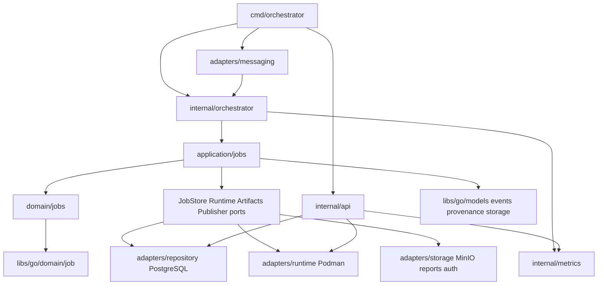
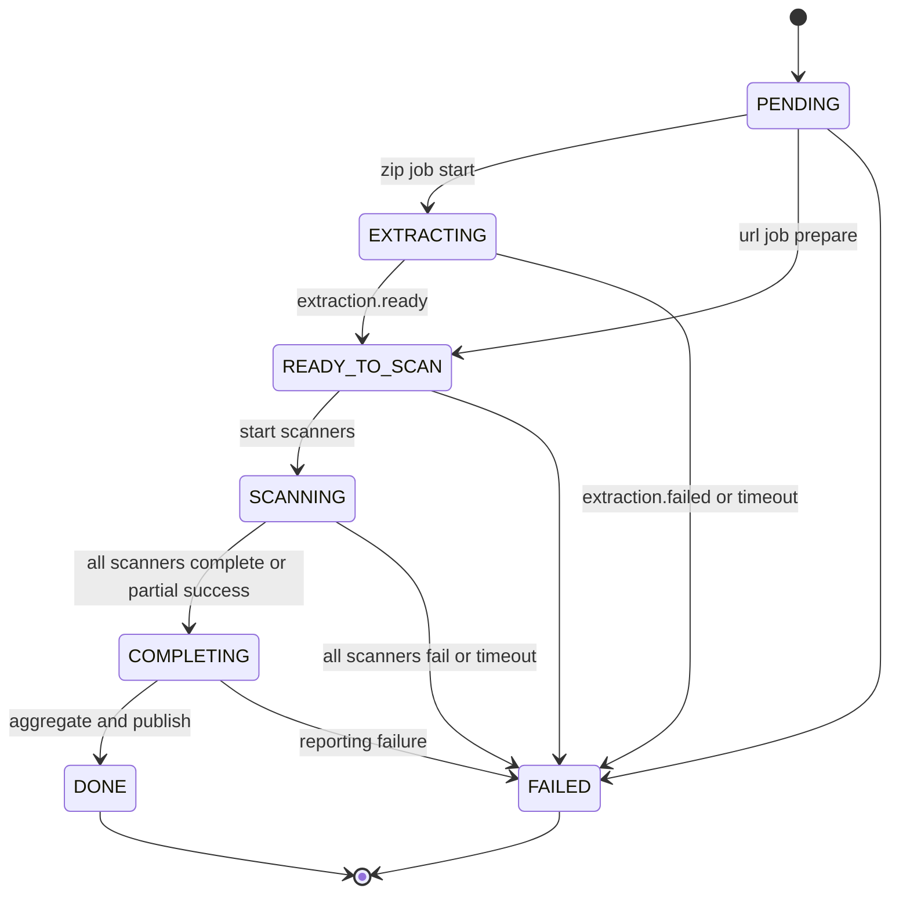
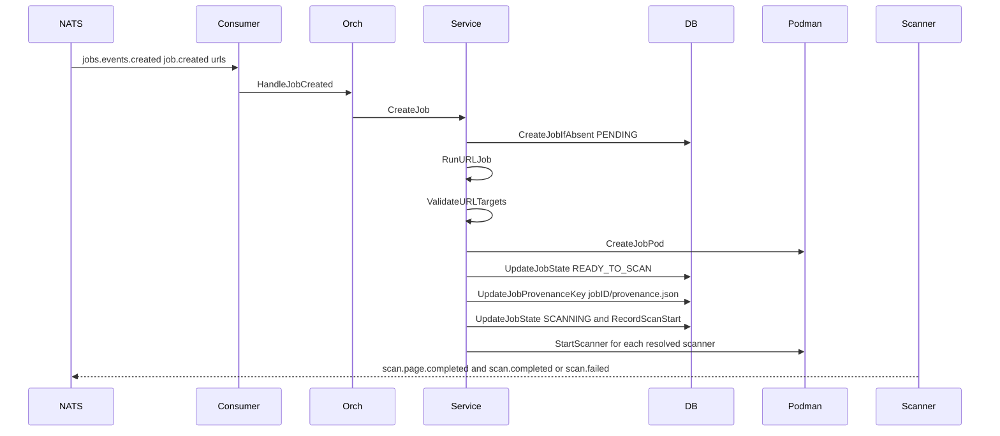
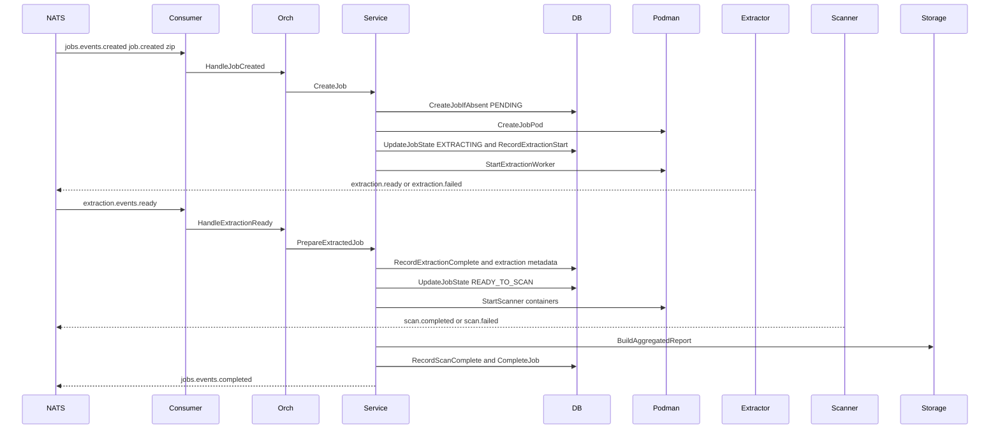

# Orchestrator Repo Map

This map covers the StageFlow monorepo slice `services/orchestrator`. It is code-grounded as of the current worktree and cites source locations in `path:line` form. The orchestrator runtime owns job lifecycle coordination after `job.created`: it consumes lifecycle events from NATS, persists job state and audit rows in PostgreSQL, starts Podman pods/containers, launches scanners, aggregates scanner reports from MinIO, cleans runtime/staging/auth resources, and exposes an internal admin API.

## Runtime Boundaries

| Boundary | What the orchestrator owns | What stays outside | Evidence |
| --- | --- | --- | --- |
| Startup wiring | Loads config, creates MinIO/NATS/PostgreSQL/Podman clients, loads scanner registry, starts NATS consumers, deadline sweeper, and admin API. | Stream definitions, bucket creation, scanner images, and env come from shared libraries/config. | `services/orchestrator/cmd/orchestrator/main.go:32`, `services/orchestrator/cmd/orchestrator/main.go:51`, `services/orchestrator/cmd/orchestrator/main.go:58`, `services/orchestrator/cmd/orchestrator/main.go:78`, `services/orchestrator/cmd/orchestrator/main.go:107`, `services/orchestrator/cmd/orchestrator/main.go:146`, `services/orchestrator/cmd/orchestrator/main.go:154`, `services/orchestrator/cmd/orchestrator/main.go:156` |
| NATS events | Consumes `job.created`, `extraction.ready`, `extraction.failed`, `scan.page.completed`, `scan.completed`, `scan.failed`; publishes `job.completed` and `job.failed`. | Platform API normally publishes `job.created`; extraction/scanner workers publish their own stage events. | `services/orchestrator/internal/adapters/messaging/consumers.go:38`, `services/orchestrator/internal/adapters/messaging/consumers.go:60`, `services/orchestrator/internal/adapters/messaging/publisher.go:23`, `services/orchestrator/internal/adapters/messaging/publisher.go:32`, `services/orchestrator/internal/adapters/messaging/publisher.go:41` |
| Job FSM | Applies domain policies and database transition guards for `PENDING -> EXTRACTING/READY_TO_SCAN -> SCANNING -> COMPLETING -> DONE` or `FAILED`. | Shared job state constants and allowed transitions live in `libs/go`. | `libs/go/models/job.go:12`, `libs/go/domain/job/state.go:21`, `services/orchestrator/internal/domain/jobs/transitions.go:9`, `services/orchestrator/internal/adapters/repository/job_updates.go:57` |
| Runtime containers | Creates one job pod, one workspace volume, one results volume, an extraction worker for ZIP-like inputs, and one scanner container per resolved scanner. | The worker images implement extraction/scanning and publish stage events. | `services/orchestrator/internal/adapters/runtime/job_runtime.go:108`, `services/orchestrator/internal/adapters/runtime/job_runtime.go:137`, `services/orchestrator/internal/adapters/runtime/job_runtime.go:178`, `services/orchestrator/internal/application/jobs/service.go:156` |
| Storage | Reads scanner result JSON from `scanner-artifacts`, writes `{jobID}/report.json`, uploads/cleans private auth storage-state objects, deletes ZIP staging object after terminal cleanup. | Public artifact presigning and bucket definitions are in shared storage. | `services/orchestrator/internal/adapters/storage/report_aggregator.go:29`, `services/orchestrator/internal/adapters/storage/report_aggregator_storage.go:13`, `services/orchestrator/internal/adapters/storage/auth_uploader.go:44`, `services/orchestrator/internal/orchestrator/job_cleanup.go:45`, `libs/go/storage/minio.go:126` |
| Internal API | Authenticated admin-only HTTP endpoints for jobs, job events, pods, system status, and metrics; `/healthz` is unauthenticated. | Public job API belongs to platform API. | `services/orchestrator/internal/api/server.go:98`, `services/orchestrator/internal/api/server.go:106`, `services/orchestrator/internal/api/server.go:117` |

## Clean Architecture Layers

| Layer | Packages | Responsibility | Notes/evidence |
| --- | --- | --- | --- |
| Entrypoint | `cmd/orchestrator`, `cmd/healthcheck` | Runtime assembly, config validation, lifecycle start/shutdown. | Config fields include NATS, MinIO, Podman, DB, images, pod networking, AI Navigator env, retention, and admin rate limit in `services/orchestrator/cmd/orchestrator/config.go:10`; validation requires API token and infrastructure endpoints in `services/orchestrator/cmd/orchestrator/config.go:92`. |
| Domain | `internal/domain/jobs` plus shared `libs/go/domain/job` | Pure policies: transition checks, duplicate event action, URL/loopback policy, extraction-ready action, failure-stage normalization, partial success completion. | `services/orchestrator/internal/domain/jobs/duplicate_event_policy.go:16`, `services/orchestrator/internal/domain/jobs/url_extraction_policies.go:21`, `services/orchestrator/internal/domain/jobs/completion_policy.go:17`, `services/orchestrator/internal/domain/jobs/failure_policy.go:9`. |
| Application | `internal/application/jobs` | Use cases for create job, prepare URL/ZIP jobs, start scanning, record scanner events, complete/fail, normalize/cleanup auth. Ports keep DB/runtime/storage abstract. | Ports are defined in `services/orchestrator/internal/application/jobs/ports.go:10`; service wiring and defaults are in `services/orchestrator/internal/application/jobs/service.go:14`. |
| Orchestrator coordination | `internal/orchestrator` | Connects inbound events to application service, records audit traces/metrics, adapts Podman runtime, monitors containers, deadlines, cleanup. | Event handlers wrap service calls with `withInboundEvent` in `services/orchestrator/internal/orchestrator/events.go:9`; audit tracing is in `services/orchestrator/internal/orchestrator/event_trace.go:107`. |
| Adapters | `internal/adapters/messaging`, `repository`, `runtime`, `storage` | NATS subscribe/publish, PostgreSQL schema/repositories, Podman HTTP client/runtime, MinIO report/auth storage. | NATS consumers in `services/orchestrator/internal/adapters/messaging/consumers.go:60`; DB schema in `services/orchestrator/internal/adapters/repository/schema.sql:1`; Podman client in `services/orchestrator/internal/adapters/runtime/client.go:20`; aggregator in `services/orchestrator/internal/adapters/storage/report_aggregator.go:17`. |
| API/metrics/diagnostics | `internal/api`, `internal/metrics`, `internal/diagnostics` | Admin API, Prometheus text metrics, scanner manifest diagnostics tests. | API route registration in `services/orchestrator/internal/api/server.go:98`; metrics collector in `services/orchestrator/internal/metrics/collector.go:1`; diagnostics test prints built-in scanner manifests in `services/orchestrator/internal/diagnostics/diag_test.go:10`. |

## Directory And File Map

| Path | Role | Key source citations |
| --- | --- | --- |
| `cmd/orchestrator/main.go` | Production executable composition and graceful shutdown. | `services/orchestrator/cmd/orchestrator/main.go:27`, `services/orchestrator/cmd/orchestrator/main.go:118`, `services/orchestrator/cmd/orchestrator/main.go:166` |
| `cmd/orchestrator/config.go` | Env-backed config and validation. | `services/orchestrator/cmd/orchestrator/config.go:38`, `services/orchestrator/cmd/orchestrator/config.go:62`, `services/orchestrator/cmd/orchestrator/config.go:92` |
| `config/scanners.yaml` | Optional scanner overrides for images, enabled flags, resource caps. | `services/orchestrator/config/scanners.yaml:1`, `services/orchestrator/config/scanners.yaml:8`, `services/orchestrator/config/scanners.yaml:29` |
| `internal/domain/jobs` | Orchestrator-specific policies over shared job FSM. | `services/orchestrator/internal/domain/jobs/transitions.go:9`, `services/orchestrator/internal/domain/jobs/extraction_ready_policy.go:17`, `services/orchestrator/internal/domain/jobs/url_extraction_policies.go:66` |
| `internal/application/jobs` | Job use cases and launch planning. | `services/orchestrator/internal/application/jobs/startup_lifecycle.go:19`, `services/orchestrator/internal/application/jobs/service.go:126`, `services/orchestrator/internal/application/jobs/scanner_launch_planner.go:104` |
| `internal/orchestrator` | Event entrypoints, runtime adapters, deadline sweeper, cleanup, event audit. | `services/orchestrator/internal/orchestrator/orchestrator.go:50`, `services/orchestrator/internal/orchestrator/deadline.go:14`, `services/orchestrator/internal/orchestrator/job_cleanup.go:18` |
| `internal/adapters/messaging` | NATS JetStream consumers and publisher. | `services/orchestrator/internal/adapters/messaging/consumers.go:38`, `services/orchestrator/internal/adapters/messaging/publisher.go:23` |
| `internal/adapters/repository` | PostgreSQL schema, job CRUD, state updates, scanner result transactions, job event audit/retention. | `services/orchestrator/internal/adapters/repository/database.go:36`, `services/orchestrator/internal/adapters/repository/jobs.go:61`, `services/orchestrator/internal/adapters/repository/job_scanners.go:39`, `services/orchestrator/internal/adapters/repository/job_events.go:61` |
| `internal/adapters/runtime` | Podman HTTP API client and job runtime request builder. | `services/orchestrator/internal/adapters/runtime/client.go:63`, `services/orchestrator/internal/adapters/runtime/pods.go:45`, `services/orchestrator/internal/adapters/runtime/containers.go:62`, `services/orchestrator/internal/adapters/runtime/job_runtime.go:57` |
| `internal/adapters/storage` | MinIO-backed aggregation, auth storage upload/cleanup, report dedup/page helpers. | `services/orchestrator/internal/adapters/storage/report_aggregator.go:22`, `services/orchestrator/internal/adapters/storage/report_aggregator_aggregate.go:244`, `services/orchestrator/internal/adapters/storage/auth_uploader.go:13` |
| `internal/api` | Admin HTTP routes, auth, rate limiting, metrics rendering. | `services/orchestrator/internal/api/server.go:81`, `services/orchestrator/internal/api/middleware.go:143`, `services/orchestrator/internal/api/metrics.go:12` |
| `internal/metrics` | Dependency-free in-memory Prometheus metric collector. | `services/orchestrator/internal/metrics/collector.go:27`, `services/orchestrator/internal/metrics/collector.go:49`, `services/orchestrator/internal/metrics/collector.go:85` |
| `test` | E2E-style tests with mocks and PostgreSQL harness. | `services/orchestrator/test/e2e_success_test.go:11`, `services/orchestrator/test/e2e_extraction_failure_test.go:11`, `services/orchestrator/test/e2e_scan_failure_test.go:11` |

## Job State Machine

The stable states are shared model constants: `PENDING`, `EXTRACTING`, `READY_TO_SCAN`, `SCANNING`, `COMPLETING`, `DONE`, `FAILED` (`libs/go/models/job.go:12`). The shared FSM allows only the transitions below (`libs/go/domain/job/state.go:21`). The repository also guards updates against regressions and terminal mutation using a SQL state-rank expression (`services/orchestrator/internal/adapters/repository/job_updates.go:57`).

| Policy | Behavior | Evidence |
| --- | --- | --- |
| Terminal events | In terminal states, scan completion/failure/page-completed events are ignored. | `services/orchestrator/internal/domain/jobs/transitions.go:21`, `services/orchestrator/internal/application/jobs/service.go:194`, `services/orchestrator/internal/application/jobs/service.go:274`, `services/orchestrator/internal/application/jobs/handle_scan_page_completed.go:25` |
| Duplicate `job.created` | If existing state is `PENDING`, retry orchestration. If `EXTRACTING`, `READY_TO_SCAN`, `SCANNING`, `COMPLETING`, `DONE`, or `FAILED`, ignore. | `services/orchestrator/internal/domain/jobs/duplicate_event_policy.go:16`, `services/orchestrator/internal/application/jobs/startup_lifecycle.go:50` |
| Unknown job events | Missing jobs are ignored for extraction-ready and scan events when the error contains `job not found:`. | `services/orchestrator/internal/application/jobs/helpers.go:8`, `services/orchestrator/internal/application/jobs/service.go:80`, `services/orchestrator/internal/application/jobs/handle_scan_page_completed.go:16` |
| Partial scanner failure | If not all expected scanners have finished, wait. If all finished and any scanner succeeded, complete with partial results. If all failed, fail the job. | `services/orchestrator/internal/domain/jobs/completion_policy.go:17`, `services/orchestrator/internal/application/jobs/service.go:210`, `services/orchestrator/internal/application/jobs/service.go:230` |
| Failure stages | `extraction`, `scanning`, and `reporting` pass through; empty/setup/scanner-prefixed stages normalize to scanning except `completing`, which maps to reporting. | `services/orchestrator/internal/domain/jobs/failure_policy.go:9` |

## URL Job Flow

URL jobs do not start an extraction worker. They still allocate a pod, validate loopback target policy, persist a synthetic provenance key, enter `READY_TO_SCAN`, and then start scanner containers.

| Step | Detail | Evidence |
| --- | --- | --- |
| Create record | `CreateJob` normalizes auth, persists a `PENDING` job with input type/URLs/config, then dispatches by `payload.InputType`. | `services/orchestrator/internal/application/jobs/startup_lifecycle.go:19`, `services/orchestrator/internal/application/jobs/startup_lifecycle.go:27`, `services/orchestrator/internal/application/jobs/startup_lifecycle.go:45`, `services/orchestrator/internal/application/jobs/startup_lifecycle.go:71` |
| URL policy | URL preparation can advance, no-op if already ready, or ignore later/terminal states. | `services/orchestrator/internal/domain/jobs/url_extraction_policies.go:21`, `services/orchestrator/internal/application/jobs/startup_lifecycle.go:78` |
| Loopback restriction | Loopback URL targets require host networking; otherwise the job is failed during setup. | `services/orchestrator/internal/domain/jobs/url_extraction_policies.go:66`, `services/orchestrator/internal/application/jobs/startup_lifecycle.go:104` |
| Pod and provenance | URL jobs create/reuse the pod, then persist `job.ID + "/provenance.json"` as `provenance_key`. | `services/orchestrator/internal/application/jobs/startup_lifecycle.go:131`, `services/orchestrator/internal/application/jobs/startup_lifecycle.go:149` |
| Scanner launch | `StartScanning` resolves modules, moves to `SCANNING`, records scan start, sets expected scanners, and starts each planned scanner. | `services/orchestrator/internal/application/jobs/service.go:126`, `services/orchestrator/internal/application/jobs/service.go:137`, `services/orchestrator/internal/application/jobs/service.go:148`, `services/orchestrator/internal/application/jobs/service.go:156` |

## ZIP Job Flow

ZIP-style jobs enter extraction first, then use `extraction.ready` to persist extraction metadata and start scanners. The code dispatches URL jobs only when `InputType` equals `urls` case-insensitively; all other values use the extraction path (`services/orchestrator/internal/application/jobs/startup_lifecycle.go:71`). Event payload validation elsewhere defines canonical `zip` and `urls` input types (`libs/go/events/types.go:23`), but direct handler calls do not themselves invoke `JobCreatedPayload.Validate()`.

| Step | Detail | Evidence |
| --- | --- | --- |
| Extraction start | `startExtraction` verifies/advances to `EXTRACTING`, creates/reuses pod, records extraction start, and starts extraction worker. | `services/orchestrator/internal/application/jobs/startup_lifecycle.go:159`, `services/orchestrator/internal/application/jobs/startup_lifecycle.go:181`, `services/orchestrator/internal/application/jobs/startup_lifecycle.go:188`, `services/orchestrator/internal/application/jobs/startup_lifecycle.go:199` |
| Extraction ready | The service records extraction complete, loads the job, persists total pages, extraction artifacts, provenance path/key, advances to `READY_TO_SCAN`, then starts scanning. | `services/orchestrator/internal/application/jobs/service.go:80`, `services/orchestrator/internal/application/jobs/service.go:98`, `services/orchestrator/internal/application/jobs/service.go:102`, `services/orchestrator/internal/application/jobs/service.go:123`, `services/orchestrator/internal/application/jobs/service.go:412` |
| Extraction failure | Extraction failure artifacts are best-effort persisted, then `FailJob` with stage `extraction`. | `services/orchestrator/internal/application/jobs/handle_extraction_failed.go:10`, `services/orchestrator/internal/application/jobs/handle_extraction_failed.go:28`, `services/orchestrator/internal/application/jobs/handle_extraction_failed.go:43` |
| Completion | All scanner completions lead to `COMPLETING`, aggregate report upload, scan-complete timestamp, completion artifact persistence, job `DONE`, cleanup, and `job.completed`. | `services/orchestrator/internal/application/jobs/service.go:312`, `services/orchestrator/internal/application/jobs/service.go:329`, `services/orchestrator/internal/application/jobs/service.go:334`, `services/orchestrator/internal/application/jobs/service.go:341`, `services/orchestrator/internal/application/jobs/service.go:353`, `services/orchestrator/internal/application/jobs/service.go:365` |
| Failure | `FailJob` loads the job, skips terminal jobs, normalizes stage, persists `FAILED`, cleans runtime/auth resources, and publishes `job.failed`. | `services/orchestrator/internal/application/jobs/service.go:379`, `services/orchestrator/internal/application/jobs/service.go:385`, `services/orchestrator/internal/application/jobs/service.go:391`, `services/orchestrator/internal/application/jobs/service.go:397`, `services/orchestrator/internal/application/jobs/service.go:403` |

## Events

| Event | NATS subject | Direction | Handler/publisher | Durable | Important policy |
| --- | --- | --- | --- | --- | --- |
| `job.created` | `jobs.events.created` | Inbound | `HandleJobCreated` | `orchestrator-job-created` | Duplicate pending retries; later states ignore. |
| `extraction.ready` | `extraction.events.ready` | Inbound | `HandleExtractionReady` | `orchestrator-extraction-ready` | Missing jobs ignored; terminal/later states ignored by policy. |
| `extraction.failed` | `extraction.events.failed` | Inbound | `HandleExtractionFailed` | `orchestrator-extraction-failed` | Fails job with extraction stage. |
| `scan.page.completed` | `scan.events.page.completed` | Inbound | `HandleScanPageCompleted` | `orchestrator-scan-page-completed` | Updates progress unless terminal or missing job. |
| `scan.completed` | `scan.events.completed` | Inbound | `HandleScanCompleted` | `orchestrator-scan-completed` | Requires scanner type/results path in service; terminal/missing job ignored. |
| `scan.failed` | `scan.events.failed` | Inbound | `HandleScanFailed` | `orchestrator-scan-failed` | Waits, partial-completes, or fails based on all expected scanners. |
| `job.completed` | `jobs.events.completed` | Outbound | `PublishJobCompleted` | N/A | Published after DB completion and cleanup attempt. |
| `job.failed` | `jobs.events.failed` | Outbound | `PublishJobFailed` | N/A | Published after DB failure and cleanup attempt. |

Event names and payload constants live in `libs/go/events/types.go:10`; NATS stream/subject constants live in `libs/go/messaging/streams.go:11` and `libs/go/messaging/streams.go:24`. Consumer subject/durable wiring is in `services/orchestrator/internal/adapters/messaging/consumers.go:60`. Published envelopes carry request/run IDs from context (`services/orchestrator/internal/adapters/messaging/publisher.go:23`).

Inbound events are audited through `withInboundEvent`: payloads are redacted for inline auth content, NATS metadata is copied when available, handler status/duration are recorded, and metrics observe the outcome (`services/orchestrator/internal/orchestrator/event_trace.go:36`, `services/orchestrator/internal/orchestrator/event_trace.go:49`, `services/orchestrator/internal/orchestrator/event_trace.go:107`, `services/orchestrator/internal/orchestrator/event_trace.go:148`, `services/orchestrator/internal/orchestrator/event_trace.go:160`). Internal container lifecycle events are inserted with producer `orchestrator` (`services/orchestrator/internal/orchestrator/event_trace.go:203`).

## Database And Storage Boundaries

| Store/table/object | Purpose | Mutated/read by | Evidence |
| --- | --- | --- | --- |
| PostgreSQL `jobs` | Primary job record with state, input, URLs/config, pod ID, artifact keys, scanner lists/results, timestamps, and issue metrics. | Repository and admin API. | `services/orchestrator/internal/adapters/repository/schema.sql:1`, `services/orchestrator/internal/adapters/repository/jobs.go:13`, `services/orchestrator/internal/adapters/repository/jobs.go:101` |
| PostgreSQL `job_events` | Audit trail of inbound and internal events, including payload JSON, request/run ID, producer, NATS subject/stream/consumer/sequence/deliveries/stored time, handler status/error/duration. | Event trace and admin API `/events`. | `services/orchestrator/internal/adapters/repository/schema.sql:69`, `services/orchestrator/internal/adapters/repository/job_events.go:37`, `services/orchestrator/internal/adapters/repository/job_events.go:61`, `services/orchestrator/internal/adapters/repository/job_events.go:164` |
| Job event retention | Optional background deletion of old `job_events` rows by cutoff in batches. | Main starts pruner when retention days > 0. | `services/orchestrator/cmd/orchestrator/main.go:91`, `services/orchestrator/internal/adapters/repository/job_events_retention.go:21`, `services/orchestrator/internal/adapters/repository/job_events_retention.go:67` |
| Scanner results JSON | Per-scanner `results.json` read from `scanner-artifacts`. | Report aggregator. | `services/orchestrator/internal/adapters/storage/report_aggregator_storage.go:13`, `libs/go/storage/minio.go:126` |
| Aggregated report | Writes `{jobID}/report.json` to `scanner-artifacts`; completion stores that key in `report_json_key`. | Report aggregator and completion use case. | `services/orchestrator/internal/adapters/storage/report_aggregator.go:62`, `services/orchestrator/internal/adapters/storage/report_aggregator_storage.go:31`, `services/orchestrator/internal/application/jobs/service.go:341` |
| ZIP staging object | Deletes original ZIP input from `scanner-staging` after terminal cleanup, if staging storage is configured. | Orchestrator cleanup. | `services/orchestrator/internal/orchestrator/job_cleanup.go:45`, `services/orchestrator/internal/orchestrator/job_cleanup.go:57` |
| Auth storage-state object | Uploads inline auth bytes to `{jobID}/auth/storage-state.json`, persists only artifact key, and deletes it after terminal state. | Auth uploader/cleaner and application service. | `services/orchestrator/internal/adapters/storage/auth_uploader.go:44`, `services/orchestrator/internal/application/jobs/startup_lifecycle.go:235`, `services/orchestrator/internal/application/jobs/auth_cleanup.go:13` |
| Shared models/contracts | `models.Job`, `ScannerResult`, `JobConfig`, and report/provenance contracts define durable shapes. | Orchestrator, API, storage, runtime env planning. | `libs/go/models/job.go:59`, `libs/go/models/job.go:90`, `libs/go/models/job.go:107`, `libs/go/provenance/auth.go:37` |

Scanner result aggregation sorts scanner IDs, downloads successful result JSON, records failures into report errors, merges metadata/pages/issues/artifacts/errors, deduplicates equivalent issues, recomputes page counts, writes report version `2.1.0`, and fails if no scanner succeeded (`services/orchestrator/internal/adapters/storage/report_aggregator.go:13`, `services/orchestrator/internal/adapters/storage/report_aggregator.go:45`, `services/orchestrator/internal/adapters/storage/report_aggregator_aggregate.go:78`, `services/orchestrator/internal/adapters/storage/report_aggregator_aggregate.go:244`).

## Container And Runtime Boundaries

| Runtime object | Shape | Evidence |
| --- | --- | --- |
| Pod | Name `job-{jobID}`, labels `managed_by=orchestrator` and `job_id`, netns mode from config, optional `HostAdd`, optional configured network only in bridge mode. | `services/orchestrator/internal/adapters/runtime/job_runtime.go:108`, `services/orchestrator/internal/adapters/runtime/job_runtime.go:113`, `services/orchestrator/internal/adapters/runtime/job_runtime.go:119`, `services/orchestrator/internal/adapters/runtime/job_runtime.go:123` |
| Workspace volume | Named `workspace-{jobID}`; mounted read-write to `/workspace` for extraction; read-only to `/workspace` for scanners. | `services/orchestrator/internal/adapters/runtime/job_runtime.go:146`, `services/orchestrator/internal/adapters/runtime/job_runtime.go:156`, `services/orchestrator/internal/application/jobs/scanner_launch_planner.go:146` |
| Results volume | Named `results-{jobID}`; mounted to `/results` for scanner outputs. | `services/orchestrator/internal/application/jobs/scanner_launch_planner.go:152`, `services/orchestrator/internal/adapters/runtime/job_runtime.go:193` |
| Extraction worker container | Name `extraction-worker-{jobID}`, extraction image, job pod, workspace mount, env for job/input/NATS/MinIO/workspace/port/artifacts bucket/correlation. | `services/orchestrator/internal/adapters/runtime/job_runtime.go:137`, `services/orchestrator/internal/adapters/runtime/job_runtime.go:151`, `services/orchestrator/internal/adapters/runtime/job_runtime.go:220` |
| Scanner container | Planned name `scanner-{scannerType}-{jobID}`, image from scanner registry/default/override, user `0`, labels include scanner type, resource limits, workspace/results mounts. | `services/orchestrator/internal/application/jobs/scanner_launch_planner.go:135`, `services/orchestrator/internal/application/jobs/scanner_launch_planner.go:400`, `services/orchestrator/internal/application/jobs/scanner_launch_planner.go:420`, `services/orchestrator/internal/adapters/runtime/job_runtime.go:198` |
| Podman client | Unix-socket HTTP client using Libpod API, default `/v4.0.0/libpod` with v4/v5 fallback; long-poll client disables HTTP timeouts for waits. | `services/orchestrator/internal/adapters/runtime/client.go:20`, `services/orchestrator/internal/adapters/runtime/client.go:47`, `services/orchestrator/internal/adapters/runtime/client.go:63`, `services/orchestrator/internal/adapters/runtime/client.go:144`, `services/orchestrator/internal/adapters/runtime/client.go:150` |
| Cleanup | Stops/removes pod, removes workspace/results volumes, deletes ZIP staging, and deletes auth storage-state in terminal use cases. | `services/orchestrator/internal/orchestrator/job_cleanup.go:18`, `services/orchestrator/internal/orchestrator/job_cleanup.go:32`, `services/orchestrator/internal/orchestrator/job_cleanup.go:45`, `services/orchestrator/internal/application/jobs/auth_cleanup.go:31` |

### Environment Injection

| Env family | Variables | Evidence |
| --- | --- | --- |
| Extraction base env | `JOB_ID`, `INPUT_PATH`, `NATS_URL`, `MINIO_ENDPOINT`, MinIO credentials/use SSL, `WORKSPACE=/workspace`, `PORT=8080`, `MINIO_ARTIFACT_BUCKET`, optional `REQUEST_ID`, `RUN_ID`. | `services/orchestrator/internal/adapters/runtime/job_runtime.go:220` |
| Scanner base env | `JOB_ID`, `SCANNER_TYPE`, NATS/MinIO connection, `MINIO_ARTIFACT_BUCKET`, `PROVENANCE_PATH`, `RESULTS_DIR`, timeout/screenshot/highlight settings, optional private target flag and correlation IDs. | `services/orchestrator/internal/application/jobs/scanner_launch_planner.go:183` |
| URL inputs | URL jobs add JSON `SCAN_URLS`; URL jobs use scanner result directory provenance path instead of `/workspace/provenance.json`. | `services/orchestrator/internal/application/jobs/scanner_launch_planner.go:172`, `services/orchestrator/internal/application/jobs/scanner_launch_planner.go:220` |
| Scanner options | Per-scanner config is marshaled to `SCANNER_OPTIONS` when provided. | `services/orchestrator/internal/application/jobs/scanner_launch_planner.go:235` |
| AI Navigator | Only scanner type `ai-navigator` receives optional `OPENROUTER_API_KEY`, `OPENROUTER_APP_TITLE`, `OPENROUTER_APP_REFERER`. | `services/orchestrator/internal/application/jobs/scanner_launch_planner.go:259` |
| Auth | `PROVENANCE_AUTH_JSON` carries compact auth without raw storage-state bytes; form-mode `{from_env: NAME}` references are allow-listed from host env and injected by name; reserved scanner env names cannot be overwritten. | `services/orchestrator/internal/application/jobs/scanner_launch_planner.go:277`, `services/orchestrator/internal/application/jobs/scanner_launch_planner.go:320`, `services/orchestrator/internal/application/jobs/scanner_launch_planner.go:327`, `services/orchestrator/internal/application/jobs/scanner_launch_planner.go:372` |
| Host networking endpoints | In `POD_NETNS_MODE=host`, containers use `nats://127.0.0.1:4222` and `127.0.0.1:9000`; otherwise they use configured service hostnames. | `services/orchestrator/internal/application/jobs/scanner_launch_planner.go:18`, `services/orchestrator/internal/application/jobs/scanner_launch_planner.go:161`, `services/orchestrator/internal/adapters/runtime/job_runtime.go:246` |

## Deadlines, Monitoring, And Failure Modes

| Failure mode | Runtime behavior | Evidence |
| --- | --- | --- |
| Extraction timeout | Deadline sweeper lists `EXTRACTING` jobs and fails overdue jobs with stage `extraction`. | `services/orchestrator/internal/orchestrator/deadline.go:31` |
| Scan timeout | Deadline sweeper lists `SCANNING` jobs and fails overdue jobs with stage `scanning`. | `services/orchestrator/internal/orchestrator/deadline.go:41` |
| Container non-zero exit | Monitor records exit and optional log tail, then fails the job using component/stage. | `services/orchestrator/internal/orchestrator/podman_helpers.go:44`, `services/orchestrator/internal/orchestrator/podman_helpers.go:60`, `services/orchestrator/internal/orchestrator/podman_helpers.go:107` |
| Scanner launch failure | Start scanning calls `failJobSafe` and returns an error when a scanner container cannot start. | `services/orchestrator/internal/application/jobs/service.go:162` |
| Aggregation no success | Aggregator returns `no successful scanner results to aggregate` if all scanner results failed or were unusable. | `services/orchestrator/internal/adapters/storage/report_aggregator.go:58` |
| Terminal mutation | DB transition/update helpers refuse or no-op terminal mutations depending operation. | `services/orchestrator/internal/adapters/repository/job_updates.go:108`, `services/orchestrator/internal/adapters/repository/job_updates.go:203`, `services/orchestrator/internal/adapters/repository/job_updates.go:256` |
| Missing auth env | Scanner plan fails before launch when a form recipe references unset host env. | `services/orchestrator/internal/application/jobs/scanner_launch_planner.go:337`, `services/orchestrator/internal/application/jobs/scanner_launch_planner.go:361` |
| Inline storage-state at launch | Planner rejects raw `content_b64` at scanner launch; normalization should have uploaded it earlier. | `services/orchestrator/internal/application/jobs/scanner_launch_planner.go:309` |
| Admin API panic | Recovery middleware logs panic and returns structured 500. | `services/orchestrator/internal/api/middleware.go:86` |
| Event handler panic | Consumer-level and orchestrator-level wrappers recover panics and return errors/audit statuses. | `services/orchestrator/internal/adapters/messaging/consumers.go:114`, `services/orchestrator/internal/orchestrator/event_trace.go:116` |

## Internal Admin API

All `/api/v1/*` and `/metrics` routes require auth. The server accepts `X-Api-Key` or `Authorization: Bearer ...` and compares with constant-time comparison; if the configured token is empty, protected routes return 401 (`services/orchestrator/internal/api/server.go:117`). `/healthz` is registered without auth (`services/orchestrator/internal/api/server.go:106`). Optional rate limiting applies to all paths except `/healthz` (`services/orchestrator/internal/api/middleware.go:143`).

| Endpoint | Auth | Method | Behavior | Evidence |
| --- | --- | --- | --- | --- |
| `/healthz` | No | GET effectively; handler does not method-check | Returns `{"status":"healthy"}`. | `services/orchestrator/internal/api/server.go:433` |
| `/api/v1/jobs` | Yes | GET | Lists jobs, optional `state`, `limit`, `offset`; default limit 50, max 1000. | `services/orchestrator/internal/api/server.go:22`, `services/orchestrator/internal/api/server.go:226` |
| `/api/v1/jobs/{job_id}` | Yes | GET | Returns one job or 404. | `services/orchestrator/internal/api/server.go:141`, `services/orchestrator/internal/api/server.go:192` |
| `/api/v1/jobs/{job_id}/events` | Yes | GET | Lists audited job events, default limit 500, max 5000. | `services/orchestrator/internal/api/server.go:141`, `services/orchestrator/internal/api/server.go:158`, `services/orchestrator/internal/api/server.go:168` |
| `/api/v1/pods` | Yes | GET | Lists Podman pods; enriches `job-*` pods with job ID and job state when found. | `services/orchestrator/internal/api/server.go:278`, `services/orchestrator/internal/api/server.go:301` |
| `/api/v1/pods/{id}` | Yes | GET | Inspects one Podman pod; 503 if Podman client absent; 404 on inspect error. | `services/orchestrator/internal/api/server.go:330` |
| `/api/v1/status` | Yes | GET | Counts jobs by state, active/completed/failed, pods by status. | `services/orchestrator/internal/api/server.go:363`, `services/orchestrator/internal/api/server.go:416` |
| `/metrics` | Yes | GET | Prometheus text output: job totals by state, pod totals by status, event handler counters/histogram, HTTP status counters. | `services/orchestrator/internal/api/metrics.go:12`, `services/orchestrator/internal/metrics/collector.go:99`, `services/orchestrator/internal/metrics/collector.go:125`, `services/orchestrator/internal/metrics/collector.go:145` |

## Verification Surface

| Test area | What it covers | Representative tests |
| --- | --- | --- |
| Domain policies | Transition wrapper, terminal event ignore, duplicate job-created policy, extraction-ready/URL preparation, failure-stage normalization, scanner failure completion, primary scanner selection, loopback URL policy. | `services/orchestrator/internal/domain/jobs/transitions_test.go:10`, `services/orchestrator/internal/domain/jobs/duplicate_event_policy_test.go:9`, `services/orchestrator/internal/domain/jobs/url_extraction_policies_test.go:143`, `services/orchestrator/internal/domain/jobs/completion_policy_test.go:9` |
| Application use cases | Create job duplicate/retry, URL lifecycle, ZIP lifecycle, progress persistence, invalid transitions, scanning launch failure/cleanup, auth normalization and cleanup, scanner launch planner auth/env behavior. | `services/orchestrator/internal/application/jobs/lifecycle_usecases_test.go:13`, `services/orchestrator/internal/application/jobs/service_test.go:13`, `services/orchestrator/internal/application/jobs/scanner_launch_planner_auth_test.go:51`, `services/orchestrator/internal/application/jobs/normalize_auth_test.go:88` |
| Repository | DB creation/schema, job CRUD, context cancellation/deadlines, guarded state updates, scanner completion concurrency, job event insert/list, event retention. | `services/orchestrator/internal/adapters/repository/database_test.go:8`, `services/orchestrator/internal/adapters/repository/jobs_update_test.go:12`, `services/orchestrator/internal/adapters/repository/jobs_scanners_test.go:12`, `services/orchestrator/internal/adapters/repository/jobs_events_test.go:11`, `services/orchestrator/internal/adapters/repository/job_events_retention_test.go:14` |
| Runtime/Podman | Client config, response parsing, long-poll waits, bounded logs, pod/container/volume requests, job runtime pod/env/mount/resource behavior, live Podman contracts under `podmanlive` build tag. | `services/orchestrator/internal/adapters/runtime/client_test.go:64`, `services/orchestrator/internal/adapters/runtime/containers_test.go:187`, `services/orchestrator/internal/adapters/runtime/job_runtime_test.go:64`, `services/orchestrator/internal/adapters/runtime/live_resource_limits_contract_test.go:11`, `services/orchestrator/internal/adapters/runtime/live_pod_network_hosts_contract_test.go:12` |
| Storage | Aggregated report success, no-success failure, cross-scanner deduplication, page helpers, auth object upload/cleanup safety. | `services/orchestrator/internal/adapters/storage/report_aggregator_test.go:16`, `services/orchestrator/internal/adapters/storage/report_aggregator_test.go:270`, `services/orchestrator/internal/adapters/storage/report_aggregator_test.go:466`, `services/orchestrator/internal/adapters/storage/auth_uploader_test.go:11` |
| Orchestrator coordination | Initialization, job-created URL/ZIP flows, extraction ready/failed, scan completed/failed/page events, multiple scanners, partial success, cleanup, deadlines, event trace redaction, monitor timeouts. | `services/orchestrator/internal/orchestrator/orchestrator_job_created_test.go:14`, `services/orchestrator/internal/orchestrator/orchestrator_extraction_test.go:12`, `services/orchestrator/internal/orchestrator/orchestrator_scanning_test.go:12`, `services/orchestrator/internal/orchestrator/orchestrator_deadline_test.go:11`, `services/orchestrator/internal/orchestrator/event_trace_test.go:11` |
| Internal API and metrics | Auth behavior, job/job-events/pod/status routes, health, method handling, recovery middleware, rate limiting, Prometheus metrics, collector nil safety/histogram. | `services/orchestrator/internal/api/server_test.go:162`, `services/orchestrator/internal/api/server_test.go:268`, `services/orchestrator/internal/api/server_test.go:372`, `services/orchestrator/internal/api/server_test.go:452`, `services/orchestrator/internal/metrics/collector_test.go:8` |
| E2E-style tests | Full success path, extraction failure, scan failure, concurrency, job event logging with mocks/PostgreSQL harness. | `services/orchestrator/test/e2e_success_test.go:11`, `services/orchestrator/test/e2e_extraction_failure_test.go:11`, `services/orchestrator/test/e2e_scan_failure_test.go:11`, `services/orchestrator/test/e2e_concurrency_test.go:12`, `services/orchestrator/test/e2e_job_events_logging_test.go:14` |

## Uncertainties And Follow-Ups

| Item | Why it is called out |
| --- | --- |
| Direct handler payload validation | Payload types expose `Validate()` methods, but the NATS typed subscriber shown here strictly unmarshals payload JSON and does not call payload `Validate()` in the inspected path. Publishers validate the envelope shape, not payload shape. If runtime validation is required, add or document it explicitly. Evidence: `libs/go/messaging/subscribe.go:177`, `libs/go/messaging/subscribe.go:194`, `libs/go/messaging/envelope.go:47`, `libs/go/events/envelope.go:41`. |
| Non-`urls` inputs use extraction path | `CreateJob` dispatches only `strings.EqualFold(payload.InputType, "urls")` to the URL path; all other input types go to extraction. Event contract validation allows only `zip` and `urls`, but direct service/handler calls can bypass that validation. Evidence: `services/orchestrator/internal/application/jobs/startup_lifecycle.go:71`, `libs/go/events/types.go:44`. |
| API `/healthz` method | `/healthz` does not inspect HTTP method; the documentation above describes its behavior but does not claim method rejection. Evidence: `services/orchestrator/internal/api/server.go:433`. |
| Auth object exposure | Storage-state auth is uploaded to the shared artifacts bucket under an auth path and the comment states the Web UI signed-URL surface does not expose it; that guarantee depends on other services not inspected in this slice. Evidence: `services/orchestrator/internal/adapters/storage/auth_uploader.go:18`. |
