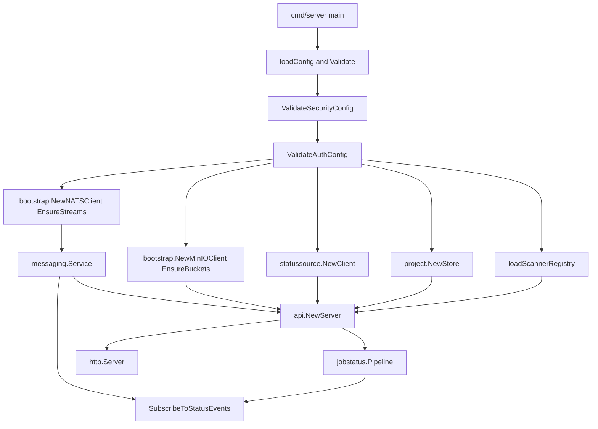
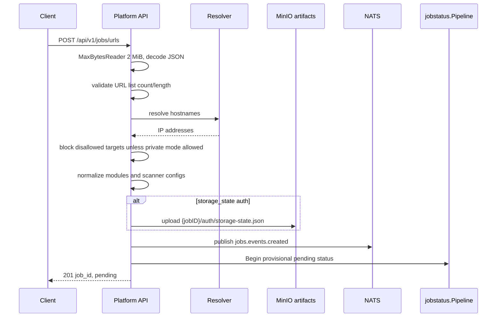
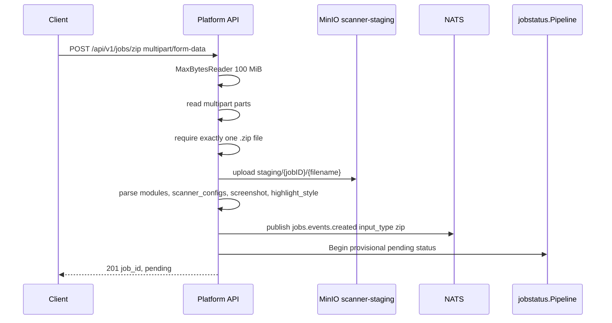
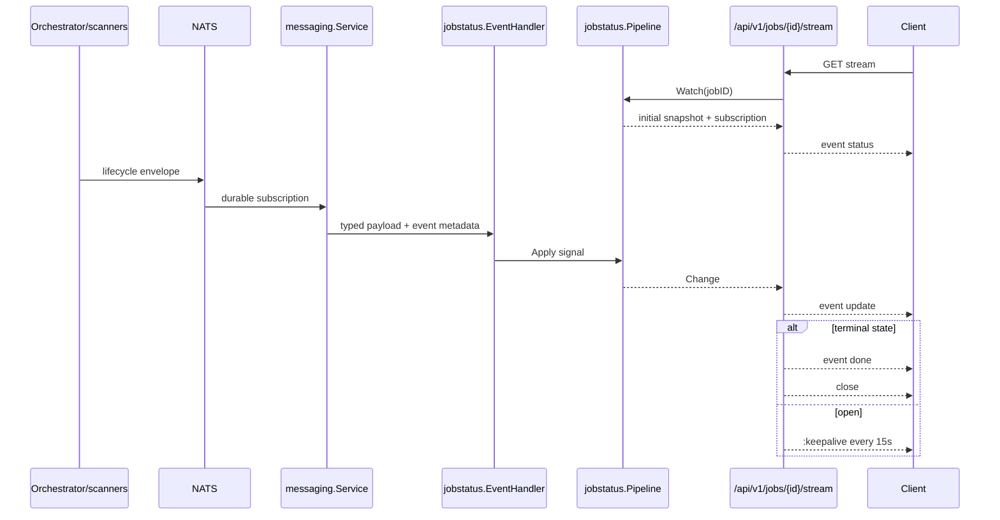

# Platform API Repo Map

This map covers the StageFlow `services/platform-api` runtime as implemented in code. It focuses on the public HTTP boundary, intake validation, job projection, project/baseline workflows, scanner selection/config validation, storage keys, and event subscriptions.

## Runtime Role

The Platform API is the public Go HTTP service for StageFlow. It accepts URL and ZIP scan submissions, validates request shape and target safety, publishes `job.created`, exposes job status and artifact redirects, streams job updates over SSE, and manages SQLite-backed projects and baselines. The service does not run scanners or aggregate final reports itself; those responsibilities are downstream of the NATS event and MinIO artifact boundaries.

| Boundary | Platform API owns | Platform API delegates or reads | Source |
| --- | --- | --- | --- |
| HTTP API | Route registration, middleware, handlers, SSE, health | Reverse proxy and frontend routing are outside this service | `services/platform-api/internal/api/router.go:8`, `services/platform-api/internal/api/router.go:38` |
| URL intake | Body limits, URL count/length, SSRF/DNS checks, module/config normalization, auth payload normalization | Actual crawling/scanning after `job.created` | `services/platform-api/internal/api/handlers_jobs_url_submit.go:77`, `services/platform-api/internal/api/security.go:38`, `services/platform-api/internal/api/handlers_jobs_url_submit.go:179` |
| ZIP intake | Multipart parsing, one `.zip` upload, staging object write, module/config normalization | Archive extraction and scanning | `services/platform-api/internal/api/handlers_jobs_zip_upload.go:89`, `services/platform-api/internal/api/handlers_jobs_zip_upload.go:192`, `services/platform-api/internal/api/handlers_jobs_zip_upload.go:412` |
| Job status | In-memory projection cache, SSE watchers, orchestrator fallback status reader | Orchestrator admin API is the cold-source of persisted job state at runtime | `services/platform-api/internal/jobstatus/pipeline.go:82`, `services/platform-api/internal/statussource/client.go:61`, `services/platform-api/cmd/server/main.go:72` |
| Artifacts | Job-scoped key validation, presigned URL redirects/status payloads, report JSON download for diff/screenshots | MinIO object storage and report generation | `services/platform-api/internal/api/object_keys.go:16`, `services/platform-api/internal/api/handlers_jobs_status.go:142`, `services/platform-api/internal/api/job_status_response.go:47` |
| Projects | Project CRUD, project scan launch, project-job mapping, baseline promotion | Job completion is still verified through job status pipeline | `services/platform-api/internal/api/handlers_projects.go:35`, `services/platform-api/internal/project/schema.sql:1`, `services/platform-api/internal/api/handlers_projects.go:358` |
| Scanner catalog | Lists registry entries, resolves module tokens strictly, validates special scanner configs | Built-in manifests and YAML overrides live in shared registry/catalog libs | `services/platform-api/internal/api/handlers_scanners.go:10`, `services/platform-api/internal/api/handlers_jobs_modules.go:26`, `libs/go/scannerregistry/config.go:204` |

## Startup And Dependency Graph

`cmd/server/main.go` is the runtime entrypoint. Startup loads env config, validates required config, validates the hardcoded SSRF policy and auth configuration, creates NATS and MinIO clients through shared bootstrap helpers, opens the project SQLite store, loads the scanner registry, constructs the API server, subscribes the job-status pipeline to lifecycle events, and starts `net/http` with write timeout disabled for SSE compatibility.



| Step | Runtime behavior | Source |
| --- | --- | --- |
| Load config | Defaults: `PORT=8080`, `ORCHESTRATOR_API_URL=http://localhost:8081`, `PROJECT_DB_PATH=./projects.db`; NATS and MinIO config come from shared loaders | `services/platform-api/cmd/server/config.go:17`, `libs/go/config/loaders.go:13`, `libs/go/config/loaders.go:35` |
| Validate config | Requires positive `PORT`, non-empty NATS URL, MinIO endpoint/credentials, orchestrator URL/token | `services/platform-api/cmd/server/config.go:30` |
| Validate policies | Startup fails on invalid SSRF policy CIDRs or missing API auth token unless auth is explicitly disabled | `services/platform-api/cmd/server/main.go:42`, `services/platform-api/cmd/server/main.go:46`, `services/platform-api/internal/api/middleware.go:304` |
| NATS | Connects with `EnsureStreams: true` | `services/platform-api/cmd/server/main.go:52` |
| MinIO | Connects with `EnsureBuckets: true` | `services/platform-api/cmd/server/main.go:65` |
| Orchestrator status | Creates a 5 second timeout status client with bearer token | `services/platform-api/cmd/server/main.go:72`, `services/platform-api/internal/statussource/client.go:47` |
| Project DB | Opens SQLite project store at `PROJECT_DB_PATH` | `services/platform-api/cmd/server/main.go:81`, `services/platform-api/internal/project/store.go:28` |
| Registry | Loads built-in scanner config, applies optional overrides, initializes registry | `services/platform-api/cmd/server/main.go:162`, `services/platform-api/cmd/server/main.go:195`, `libs/go/scannerregistry/config.go:186` |
| HTTP server | `ReadHeaderTimeout=5s`, `ReadTimeout=15s`, `WriteTimeout=0`, `IdleTimeout=60s` | `services/platform-api/cmd/server/main.go:149` |

## Directory And File Map

| Path | Responsibility | Start here for | Source |
| --- | --- | --- | --- |
| `cmd/server/main.go` | Process boot, dependency wiring, HTTP server construction | Runtime graph and subscriptions | `services/platform-api/cmd/server/main.go:34` |
| `cmd/server/config.go` | Env-backed runtime config and startup validation | Required/default env vars | `services/platform-api/cmd/server/config.go:5` |
| `cmd/healthcheck/main.go` | Container healthcheck binary | Default `/healthz` probe used by Dockerfile/compose healthcheck | `services/platform-api/cmd/healthcheck/main.go:11`, `services/platform-api/Dockerfile:29`, `infra/compose/podman-compose.yml:185` |
| `internal/api/router.go` | Public route table and middleware composition | Endpoint map and timeout exceptions | `services/platform-api/internal/api/router.go:8` |
| `internal/api/middleware.go` | Logging, CORS, API key auth, rate limit, timeout wrappers | Auth/rate/timeout behavior | `services/platform-api/internal/api/middleware.go:23` |
| `internal/api/security.go` | URL parsing, DNS resolution, IP classification for SSRF protection | Public/private/metadata target policy | `services/platform-api/internal/api/security.go:38` |
| `internal/api/handlers_jobs_url_submit.go` | `POST /api/v1/jobs/urls` | URL job request contract and `job.created` publishing | `services/platform-api/internal/api/handlers_jobs_url_submit.go:39` |
| `internal/api/handlers_jobs_zip_upload.go` | `POST /api/v1/jobs/zip` | Multipart ZIP intake, staging upload, zip `job.created` | `services/platform-api/internal/api/handlers_jobs_zip_upload.go:70` |
| `internal/api/handlers_jobs_status.go` | Job status, report/results redirects, project diff | Status response, artifact redirects, diff download | `services/platform-api/internal/api/handlers_jobs_status.go:25` |
| `internal/api/job_status_response.go` | Converts `status.JobRecord` to public `models.JobStatus` | Presigned artifact URLs and done-job normalization | `services/platform-api/internal/api/job_status_response.go:13` |
| `internal/api/job_status_screenshots.go` | Extracts structured screenshot URLs from generated reports | Screenshot artifact derivation | `services/platform-api/internal/api/job_status_screenshots.go:45` |
| `internal/api/object_keys.go` | Job-scoped MinIO key guards | Artifact path traversal and prefix rules | `services/platform-api/internal/api/object_keys.go:16` |
| `internal/api/handlers_sse.go` | `GET /api/v1/jobs/{id}/stream` | SSE headers, keepalives, terminal close behavior | `services/platform-api/internal/api/handlers_sse.go:369` |
| `internal/api/handlers_projects.go` | Project CRUD, scan, promote | Project/baseline workflows | `services/platform-api/internal/api/handlers_projects.go:35` |
| `internal/api/handlers_scanners.go` | `GET /api/v1/scanners` | Scanner metadata projection | `services/platform-api/internal/api/handlers_scanners.go:10` |
| `internal/api/scanner_configs.go` | Per-scanner request config validation | `ai-navigator` goal/model/provider checks | `services/platform-api/internal/api/scanner_configs.go:14` |
| `internal/api/handlers_jobs_modules.go` | Scanner module CSV split and strict registry resolution | Default and unsupported module behavior | `services/platform-api/internal/api/handlers_jobs_modules.go:26` |
| `internal/jobstatus/` | In-memory projection pipeline, reducer, cache, watcher broker, event handler | Status projection and SSE update source | `services/platform-api/internal/jobstatus/pipeline.go:13`, `services/platform-api/internal/jobstatus/reducer.go:44` |
| `internal/messaging/service.go` | Platform wrapper over shared NATS client | Subjects/durables and `job.created` publishing | `services/platform-api/internal/messaging/service.go:35` |
| `internal/project/` | SQLite project store and schema | Projects, project-job mapping, baselines | `services/platform-api/internal/project/schema.sql:1`, `services/platform-api/internal/project/store.go:73` |
| `internal/status/` | SQLite projection store model/schema/helpers | Persistent status-store package and public model conversion | `services/platform-api/internal/status/schema.sql:1`, `services/platform-api/internal/status/model.go:45` |
| `internal/statussource/` | Orchestrator admin API client | Runtime status fallback/source of truth | `services/platform-api/internal/statussource/client.go:25` |
| `internal/sqlite/sqlite.go` | Shared SQLite open defaults | WAL, busy timeout, foreign keys, single connection | `services/platform-api/internal/sqlite/sqlite.go:14` |
| `tests/integration/messaging_nats_test.go` | NATS integration tests for lifecycle events | End-to-end event projection behavior | `services/platform-api/tests/integration/messaging_nats_test.go:27` |
| `Dockerfile` | Multi-stage build and runtime image | CGO server build, static healthcheck, nonroot runtime | `services/platform-api/Dockerfile:23`, `services/platform-api/Dockerfile:52` |

## API Surface And Middleware

Routes are registered on `http.ServeMux`. `/api/v1/jobs/zip` uses upload middleware, `/api/v1/jobs/{id}/stream` uses stream middleware without the per-request timeout wrapper, and `/healthz` is unwrapped by the API middleware chain.

| Method | Route | Handler | Middleware | Behavior | Source |
| --- | --- | --- | --- | --- | --- |
| `POST` | `/api/v1/jobs/urls` | `handleJobURLSubmit` | logging, CORS, API key, rate limit, 60s timeout | Accept URL scan request and publish `job.created` | `services/platform-api/internal/api/router.go:14`, `services/platform-api/internal/api/handlers_jobs_url_submit.go:77` |
| `POST` | `/api/v1/jobs/zip` | `handleJobZipUpload` | logging, CORS, API key, rate limit, 5m timeout | Accept one ZIP multipart upload and publish `job.created` | `services/platform-api/internal/api/router.go:13`, `services/platform-api/internal/api/handlers_jobs_zip_upload.go:89` |
| `GET` | `/api/v1/jobs/{id}` | `handleJobStatus` | standard | Return current public `JobStatus` projection | `services/platform-api/internal/api/router.go:15`, `services/platform-api/internal/api/handlers_jobs_status.go:25` |
| `GET` | `/api/v1/jobs/{id}/stream` | `handleJobStream` | logging, CORS, API key, rate limit | SSE stream; no timeout middleware | `services/platform-api/internal/api/router.go:28`, `services/platform-api/internal/api/handlers_sse.go:369` |
| `GET` | `/api/v1/jobs/{id}/report` | `handleJobReport` via status router | standard | Require completed job, presign HTML report, temporary redirect | `services/platform-api/internal/api/handlers_jobs_status.go:43`, `services/platform-api/internal/api/handlers_jobs_status.go:87` |
| `GET` | `/api/v1/jobs/{id}/results` | `handleJobResults` via status router | standard | Require completed job, presign JSON report, temporary redirect | `services/platform-api/internal/api/handlers_jobs_status.go:49`, `services/platform-api/internal/api/handlers_jobs_status.go:153` |
| `GET` | `/api/v1/jobs/{id}/diff` | `handleJobDiff` via status router | standard | Diff project scan report JSON against project baseline | `services/platform-api/internal/api/handlers_jobs_status.go:53`, `services/platform-api/internal/api/handlers_jobs_status.go:201` |
| `GET` | `/api/v1/projects` | `handleListProjects` | standard | List projects from SQLite | `services/platform-api/internal/api/router.go:16`, `services/platform-api/internal/api/handlers_projects.go:148` |
| `POST` | `/api/v1/projects` | `handleCreateProject` | standard | Create project with slug/name/URLs/scanners | `services/platform-api/internal/api/handlers_projects.go:40`, `services/platform-api/internal/api/handlers_projects.go:100` |
| `GET` | `/api/v1/projects/{slug}` | `handleGetProject` | standard | Fetch project by slug | `services/platform-api/internal/api/handlers_projects.go:56`, `services/platform-api/internal/api/handlers_projects.go:164` |
| `PATCH` | `/api/v1/projects/{slug}` | `handleUpdateProject` | standard | Patch mutable project fields | `services/platform-api/internal/api/handlers_projects.go:60`, `services/platform-api/internal/api/handlers_projects.go:188` |
| `DELETE` | `/api/v1/projects/{slug}` | `handleDeleteProject` | standard | Delete project and cascade project-job rows | `services/platform-api/internal/api/handlers_projects.go:62`, `services/platform-api/internal/api/handlers_projects.go:235` |
| `POST` | `/api/v1/projects/{slug}/scan` | `handleProjectScan` | standard | Launch stored URL scan and record job mapping | `services/platform-api/internal/api/handlers_projects.go:71`, `services/platform-api/internal/api/handlers_projects.go:261` |
| `POST` | `/api/v1/projects/{slug}/promote` | `handleProjectPromote` | standard | Promote a completed project job as baseline | `services/platform-api/internal/api/handlers_projects.go:80`, `services/platform-api/internal/api/handlers_projects.go:358` |
| `GET` | `/api/v1/scanners` | `handleListScanners` | standard | Return scanner metadata, categories, enabled count | `services/platform-api/internal/api/router.go:18`, `services/platform-api/internal/api/handlers_scanners.go:11` |
| any | `/healthz` | `handleHealth` | none from `withMiddleware` | Return `{"status":"healthy"}` | `services/platform-api/internal/api/router.go:19`, `services/platform-api/internal/api/handlers_health.go:9` |

| Middleware/control | Details | Failure/status behavior | Source |
| --- | --- | --- | --- |
| Logging | Adds `X-Request-ID`, stores request ID in context, logs method/path/status/duration | Does not reject | `services/platform-api/internal/api/middleware.go:236` |
| CORS | Allows exact configured origins or `*`; methods header is `GET, POST, OPTIONS`; headers are `Content-Type, Authorization, X-Api-Key`; OPTIONS short-circuits 200 | Origin not configured means no `Access-Control-Allow-Origin` | `services/platform-api/internal/api/middleware.go:280` |
| API key auth | `PLATFORM_API_TOKEN` is accepted through `X-Api-Key` or bearer token and compared with constant-time compare | Missing/wrong token returns `401 {"error":"unauthorized","code":"UNAUTHORIZED"}` | `services/platform-api/internal/api/middleware.go:327` |
| Auth startup guard | Missing `PLATFORM_API_TOKEN` fails startup unless `PLATFORM_API_AUTH_DISABLED=true` | Disabled auth logs a warning | `services/platform-api/internal/api/middleware.go:304` |
| Rate limit | In-memory per-key fixed window: 120 requests per minute, max 10000 tracked entries | Returns structured 429 with retry-after details | `services/platform-api/internal/api/middleware.go:31`, `services/platform-api/internal/api/middleware.go:97` |
| Trusted proxies | `X-Forwarded-For` is used only if `RemoteAddr` is in `PLATFORM_API_TRUSTED_PROXIES` | Invalid proxy CIDRs are ignored with warning | `services/platform-api/internal/api/middleware.go:139`, `services/platform-api/internal/api/middleware.go:201` |
| Request timeout | Standard routes get 60s context deadline, uploads get 5m; timeout response is `503 {"error":"request timeout","code":"REQUEST_TIMEOUT"}` | Late writes from handler are ignored by buffered writer | `services/platform-api/internal/api/middleware.go:23`, `services/platform-api/internal/api/middleware.go:387` |
| SSE timeout exception | Stream middleware skips timeout wrapper and relies on server `WriteTimeout=0` | Long-lived stream uses keepalives and request cancellation | `services/platform-api/internal/api/router.go:58`, `services/platform-api/cmd/server/main.go:155` |

## Config And Environment

| Variable | Runtime use | Default or compose value | Required by code | Source |
| --- | --- | --- | --- | --- |
| `PORT` | HTTP listen port | code default `8080`; compose `8080` | positive | `services/platform-api/cmd/server/config.go:19`, `infra/compose/podman-compose.yml:167` |
| `NATS_URL` | Shared NATS client | shared default `nats://localhost:4222`; compose `nats://nats:4222` | non-empty | `libs/go/config/loaders.go:14`, `services/platform-api/cmd/server/config.go:34`, `infra/compose/podman-compose.yml:168` |
| `NATS_MAX_RECONNECTS` | Shared NATS reconnect setting | `10` | no | `libs/go/config/loaders.go:17` |
| `NATS_RECONNECT_WAIT` | Shared NATS reconnect wait | `2s` | no | `libs/go/config/loaders.go:18` |
| `NATS_CONNECT_TIMEOUT` | Shared NATS connect timeout | `10s` | no | `libs/go/config/loaders.go:19` |
| `MINIO_ENDPOINT` | Internal MinIO API endpoint | code default `localhost:9000`; compose `minio:9000` | non-empty | `libs/go/config/loaders.go:52`, `services/platform-api/cmd/server/config.go:35`, `infra/compose/podman-compose.yml:170` |
| `MINIO_PUBLIC_ENDPOINT` | Optional endpoint used for presigned public URLs | falls back to `STAGEFLOW_PUBLIC_DOMAIN`; compose uses public domain | no | `libs/go/config/loaders.go:37`, `infra/compose/podman-compose.yml:171` |
| `MINIO_ACCESS_KEY` / `MINIO_ROOT_USER` | MinIO credential alias | empty unless env provides it | access key non-empty | `libs/go/config/loaders.go:42`, `services/platform-api/cmd/server/config.go:36` |
| `MINIO_SECRET_KEY` / `MINIO_ROOT_PASSWORD` | MinIO credential alias | empty unless env provides it | secret non-empty | `libs/go/config/loaders.go:47`, `services/platform-api/cmd/server/config.go:37` |
| `MINIO_USE_SSL` | Internal MinIO TLS | `false` | no | `libs/go/config/loaders.go:57` |
| `MINIO_PUBLIC_USE_SSL` | Public presign TLS | `true`; local/test overlays set `false` | no | `libs/go/config/loaders.go:58`, `infra/compose/podman-compose.local.yml:21` |
| `MINIO_REGION` | MinIO region | `us-east-1` | no | `libs/go/config/loaders.go:59` |
| `ORCHESTRATOR_API_URL` | Status-source base URL | code default `http://localhost:8081`; compose `http://orchestrator:8081` | non-empty | `services/platform-api/cmd/server/config.go:20`, `infra/compose/podman-compose.yml:180` |
| `ORCHESTRATOR_API_TOKEN` | Bearer token for orchestrator status API | empty by code; compose requires env | non-empty | `services/platform-api/cmd/server/config.go:21`, `services/platform-api/internal/statussource/client.go:75` |
| `SCANNER_CONFIG_PATH` | Optional YAML scanner override path | empty by code; compose `/data/scanners.yaml` | no | `services/platform-api/cmd/server/config.go:22`, `infra/compose/podman-compose.yml:169` |
| `PLATFORM_API_ALLOW_PRIVATE_TARGETS` | Server-side opt-in for private target scans | `false`; local overlay sets `true` | no | `services/platform-api/cmd/server/config.go:23`, `infra/compose/podman-compose.local.yml:18` |
| `PROJECT_DB_PATH` | SQLite project store path | `./projects.db` | path required by store when opened | `services/platform-api/cmd/server/config.go:24`, `services/platform-api/internal/project/store.go:28` |
| `PLATFORM_API_TOKEN` | Public API token | empty by code | required unless auth disabled | `services/platform-api/internal/api/middleware.go:304`, `services/platform-api/internal/api/middleware.go:327` |
| `PLATFORM_API_AUTH_DISABLED` | Explicit local auth opt-out | `false` in compose | no, but dangerous in public deploys | `services/platform-api/internal/api/middleware.go:309`, `infra/compose/podman-compose.yml:178` |
| `PLATFORM_API_CORS_ALLOW_ORIGINS` | Browser origin allowlist | compose public domains; local/test localhost | no | `services/platform-api/internal/api/middleware.go:280`, `infra/compose/podman-compose.yml:179` |
| `PLATFORM_API_TRUSTED_PROXIES` | CIDRs/IPs allowed to provide `X-Forwarded-For` rate-limit key | empty by default | no | `services/platform-api/internal/api/middleware.go:139` |
| `AI_NAVIGATOR_DEFAULT_MODEL` | Backend fallback model if `ai-navigator` config omits `vision.model` | not set in code | needed only for fallback path | `services/platform-api/internal/api/scanner_configs.go:63`, `docs/reference/configuration.md:134` |

## Request And Data Flows

### URL Job Flow



| Step | Detail | Source |
| --- | --- | --- |
| Body limit | URL submit body capped at 2 MiB | `services/platform-api/internal/api/handlers_jobs_url_submit.go:25`, `services/platform-api/internal/api/handlers_jobs_url_submit.go:84` |
| URL list validation | Requires at least one URL, max 100 URLs, max 2048 chars each | `services/platform-api/internal/api/handlers_jobs_url_submit.go:233` |
| SSRF validation | Parses only `http`/`https`, requires host, resolves DNS and rejects any disallowed resolved IP | `services/platform-api/internal/api/security.go:68`, `services/platform-api/internal/api/security.go:108` |
| Private target opt-in | Request `allow_private_targets=true` is accepted only when server config allows private targets | `services/platform-api/internal/api/handlers_jobs_url_submit.go:108`, `services/platform-api/internal/api/handlers_jobs_url_submit.go:270` |
| Module resolution | Empty modules default to `axe` when enabled; explicit modules are strict registry IDs, aliases, or categories | `services/platform-api/internal/api/handlers_jobs_modules.go:26`, `libs/go/scannerregistry/registry_modules.go:58` |
| Scanner configs | `ai-navigator` requires config with `goal.objective`; `vision.model` can fall back to env; provider must be omitted or `openrouter` | `services/platform-api/internal/api/scanner_configs.go:24`, `services/platform-api/internal/api/scanner_configs.go:63`, `services/platform-api/internal/api/scanner_configs.go:79` |
| Auth | Form auth is validated but credentials are not resolved; storage state is base64 JSON, max 1 MiB, uploaded before publish | `services/platform-api/internal/api/handlers_jobs_url_submit.go:49`, `services/platform-api/internal/api/handlers_jobs_url_submit.go:351`, `services/platform-api/internal/api/handlers_jobs_url_submit.go:304` |
| Event | Publishes `events.EventJobCreated` with `InputType: "urls"`, URLs, modules, scanner configs, screenshot, highlight, private flag, auth | `services/platform-api/internal/api/handlers_jobs_url_submit.go:179`, `libs/go/events/types.go:36` |
| Failure cleanup | Uploaded storage-state auth is deleted if context is canceled or publish fails | `services/platform-api/internal/api/handlers_jobs_url_submit.go:197`, `services/platform-api/internal/api/handlers_jobs_url_submit.go:209`, `services/platform-api/internal/api/handlers_jobs_url_submit.go:330` |

### ZIP Job Flow



| Step | Detail | Source |
| --- | --- | --- |
| Body limit | Upload body capped at 100 MiB and upload middleware timeout is 5 minutes | `services/platform-api/internal/api/handlers_jobs_zip_upload.go:24`, `services/platform-api/internal/api/handlers_jobs_zip_upload.go:96`, `services/platform-api/internal/api/middleware.go:28` |
| Multipart parsing | Uses streaming multipart reader and generates job/run IDs before processing parts | `services/platform-api/internal/api/handlers_jobs_zip_upload.go:192` |
| File rules | Requires a single `file` part with `.zip` filename; filename is reduced to `filepath.Base` | `services/platform-api/internal/api/handlers_jobs_zip_upload.go:224`, `services/platform-api/internal/api/handlers_jobs_zip_upload.go:286`, `services/platform-api/internal/api/handlers_jobs_zip_upload.go:37` |
| Staging key | Uploads to `scanner-staging` with key `staging/{jobID}/{filename}` and unknown size streaming | `services/platform-api/internal/api/handlers_jobs_zip_upload.go:313`, `services/platform-api/internal/api/handlers_jobs_zip_upload.go:319`, `libs/go/storage/minio.go:126` |
| Form fields | Reads `modules` up to 16 KiB, `scanner_configs` up to 256 KiB, `highlight_style` and `screenshot` up to 32 bytes each | `services/platform-api/internal/api/handlers_jobs_zip_upload.go:331`, `services/platform-api/internal/api/handlers_jobs_zip_upload.go:346`, `services/platform-api/internal/api/handlers_jobs_zip_upload.go:374` |
| Event | Publishes `InputType: "zip"` with `InputPath` and scan config | `services/platform-api/internal/api/handlers_jobs_zip_upload.go:407`, `services/platform-api/internal/api/handlers_jobs_zip_upload.go:412` |

### SSE Update Path



| Step | Detail | Source |
| --- | --- | --- |
| Stream route | `handleJobsRoute` detects `/stream` and uses stream middleware with no timeout wrapper | `services/platform-api/internal/api/router.go:24`, `services/platform-api/internal/api/router.go:58` |
| Initial snapshot | `Watch` subscribes then reads `Current`; handler sends full public job status as `event: status` | `services/platform-api/internal/jobstatus/pipeline.go:107`, `services/platform-api/internal/api/handlers_sse.go:196` |
| Headers | Uses `text/event-stream`, `no-cache`, `keep-alive`, and `X-Accel-Buffering: no` | `services/platform-api/internal/api/handlers_sse.go:84` |
| Update mapping | Converts pipeline signals to compact SSE payloads for progress, scanner completion, extraction ready/failed, scan/job failed, and job complete | `services/platform-api/internal/api/handlers_sse.go:98` |
| Keepalive | Sends `:keepalive` every 15 seconds | `services/platform-api/internal/api/handlers_sse.go:324` |
| Terminal close | Terminal update emits both `update` and `done`, then closes; initial terminal snapshot also emits `done` | `services/platform-api/internal/api/handlers_sse.go:222`, `services/platform-api/internal/api/handlers_sse.go:284` |
| Backpressure | Watcher channels have size 16 and evict one stale change when full | `services/platform-api/internal/jobstatus/broker.go:23`, `services/platform-api/internal/jobstatus/broker.go:86` |

### Project And Baseline Flow

```mermaid
flowchart TD
    Create[POST /projects] --> ProjectDB[(projects SQLite)]
    ProjectDB --> Scan[POST /projects/{slug}/scan]
    Scan --> ValidateURLs[Validate stored URLs]
    ValidateURLs --> Publish[Publish job.created]
    Publish --> Map[Record project_jobs mapping]
    Map --> Status[Job status reaches DONE]
    Status --> Promote[POST /projects/{slug}/promote]
    Promote --> CheckMap[JobBelongsToProject]
    CheckMap --> CheckDone[Current state is DONE]
    CheckDone --> Baseline[Set baseline_job_id]
    Baseline --> Diff[GET /jobs/{jobID}/diff]
    Diff --> Reports[Download current and baseline report JSON]
    Reports --> Result[diff.ComputeDiff]
```

| Step | Detail | Source |
| --- | --- | --- |
| Project schema | `projects` stores slug/name JSON URLs, JSON scanners, optional `baseline_job_id`; `project_jobs` maps jobs and cascades on project delete | `services/platform-api/internal/project/schema.sql:1`, `services/platform-api/internal/project/schema.sql:12` |
| Slug validation | 2 to 64 chars, lowercase alphanumeric and hyphen, cannot start/end with hyphen | `services/platform-api/internal/api/handlers_projects.go:23`, `services/platform-api/internal/api/handlers_projects.go:27` |
| Body limit | Project JSON body capped at 1 MiB | `services/platform-api/internal/api/handlers_projects.go:25`, `services/platform-api/internal/api/handlers_projects.go:432` |
| Create/list/get/update/delete | Store marshals URL/scanner slices as JSON and updates only included fields | `services/platform-api/internal/project/store.go:73`, `services/platform-api/internal/project/store.go:121`, `services/platform-api/internal/project/store.go:144`, `services/platform-api/internal/project/store.go:195` |
| Project scan | Normalizes stored scanners, validates stored URLs in public mode, publishes URL `job.created`, records job mapping after publish | `services/platform-api/internal/api/handlers_projects.go:261`, `services/platform-api/internal/api/handlers_projects.go:290`, `services/platform-api/internal/api/handlers_projects.go:326`, `services/platform-api/internal/api/handlers_projects.go:340` |
| Promote | Requires `job_id`, verifies job belongs to project, verifies current state is `DONE`, then sets baseline | `services/platform-api/internal/api/handlers_projects.go:373`, `services/platform-api/internal/api/handlers_projects.go:388`, `services/platform-api/internal/api/handlers_projects.go:403`, `services/platform-api/internal/api/handlers_projects.go:417` |
| Diff | Requires project mapping, baseline, current job not baseline, current done, and both report JSON files downloadable within a 64 MiB cap | `services/platform-api/internal/api/handlers_jobs_status.go:210`, `services/platform-api/internal/api/handlers_jobs_status.go:228`, `services/platform-api/internal/api/handlers_jobs_status.go:239`, `services/platform-api/internal/api/handlers_jobs_status.go:269`, `services/platform-api/internal/api/handlers_jobs_status.go:337` |

### Scanner Config Flow

| Phase | Behavior | Source |
| --- | --- | --- |
| Registry load | Built-in manifests are loaded from `libs/go/scannercatalog`, converted to registry definitions, and marked enabled/built-in | `libs/go/scannerregistry/config.go:204` |
| Override load | If `SCANNER_CONFIG_PATH` is non-empty, load that YAML; otherwise look in working directory for `scanners.yaml`, `scanners.yml`, `config/scanners.yaml`, or `config/scanners.yml` | `services/platform-api/cmd/server/main.go:195`, `libs/go/scannerregistry/config.go:63` |
| Module strict resolution | Tokens may be scanner IDs, aliases, or categories; empty selection defaults to enabled `axe`; unknown/disabled tokens error | `libs/go/scannerregistry/registry_modules.go:58` |
| API metadata | `/api/v1/scanners` lists scanner ID/name/version/categories/aliases/image/enabled/builtIn/capabilities and aggregates enabled categories | `services/platform-api/internal/api/handlers_scanners.go:18`, `services/platform-api/internal/api/handlers_scanners.go:76` |
| Config validation | Current request-level special validation is for `ai-navigator`; other scanner configs are carried through but not schema-validated in this service | `services/platform-api/internal/api/scanner_configs.go:14` |
| AI navigator goal | Requires `scanner_configs.ai-navigator.goal.objective` to be a non-empty string | `services/platform-api/internal/api/scanner_configs.go:36`, `services/platform-api/internal/api/scanner_configs.go:47` |
| AI navigator model | Requires `vision.model` unless `AI_NAVIGATOR_DEFAULT_MODEL` is set, in which case the handler mutates the request config with that default | `services/platform-api/internal/api/scanner_configs.go:57`, `services/platform-api/internal/api/scanner_configs.go:63`, `services/platform-api/internal/api/scanner_configs.go:76` |
| AI navigator provider | If present and non-empty, `vision.provider` must equal `openrouter` case-insensitively | `services/platform-api/internal/api/scanner_configs.go:79` |

### Status Projection Flow

```mermaid
flowchart LR
    Created[job.created] --> Handler[EventHandler]
    Extraction[extraction.ready/failed] --> Handler
    Scan[scan.page.completed / scan.completed / scan.failed] --> Handler
    Completed[job.completed / job.failed] --> Handler
    Handler --> Reducer[reduceSnapshot]
    Reducer --> Cache[15m in-memory cache]
    Cache --> Broker[watcherBroker]
    Broker --> SSE[SSE subscribers]
    Cache --> StatusGET[GET /jobs/{id}]
    Orchestrator[orchestrator admin API] --> StatusGET
```

| Phase | Behavior | Source |
| --- | --- | --- |
| Event subscription | Subscribes to jobs, extraction, and scan lifecycle subjects with durable names | `services/platform-api/internal/messaging/service.go:40` |
| Typed envelopes | Shared messaging leniently unmarshals envelope fields, strictly unmarshals payload fields, attaches metadata/logging context, and ACKs only after handler success | `libs/go/messaging/subscribe.go:164`, `libs/go/messaging/subscribe.go:189`, `libs/go/messaging/subscribe.go:194`, `libs/go/messaging/subscribe.go:234` |
| Begin | Seeds a pending snapshot with expected scanners and URL total pages before later lifecycle events | `services/platform-api/internal/jobstatus/reducer.go:15`, `services/platform-api/internal/jobstatus/reducer.go:36` |
| Apply | Loads cache or orchestrator snapshot, reduces signal, writes cache, publishes watcher change when changed | `services/platform-api/internal/jobstatus/pipeline.go:51`, `services/platform-api/internal/jobstatus/pipeline.go:128` |
| State order | State only advances while not terminal; DONE and FAILED are sticky against later lower-rank updates | `services/platform-api/internal/jobstatus/reducer.go:332` |
| Failure stickiness | Job failure does not override `DONE`; job completion does not override `FAILED` | `services/platform-api/internal/jobstatus/reducer.go:278`, `services/platform-api/internal/jobstatus/reducer.go:314` |
| Current snapshot | Cache is preferred; orchestrator status API is used on cache miss; missing records return `status.ErrJobNotFound` | `services/platform-api/internal/jobstatus/pipeline.go:82` |
| Done status response | Completed jobs may download generated report JSON to normalize issue count, then presign artifact URLs and screenshot URLs | `services/platform-api/internal/api/job_status_response.go:13`, `services/platform-api/internal/api/job_status_response.go:20`, `services/platform-api/internal/api/job_status_response.go:29` |

## Storage, Database, And Messaging Boundaries

| Boundary | Implementation | Keys/data | Source |
| --- | --- | --- | --- |
| MinIO staging bucket | Shared storage bucket constant `scanner-staging`; Platform API writes ZIP uploads there | `staging/{jobID}/{filename}` | `libs/go/storage/minio.go:126`, `services/platform-api/internal/api/handlers_jobs_zip_upload.go:313` |
| MinIO artifacts bucket | Shared storage bucket constant `scanner-artifacts`; Platform API presigns report/results/log/recipe/provenance/screenshot keys and stores auth storage state | `{jobID}/auth/storage-state.json`, `{jobID}/report.json`, `{jobID}/report.html`, `{jobID}/{scanner}/...` | `libs/go/storage/minio.go:128`, `services/platform-api/internal/api/handlers_jobs_url_submit.go:304`, `services/platform-api/internal/api/job_status_response.go:47` |
| Presigned URL lifetime | Artifact redirects and status payload artifact URLs use 15 minute presigned URLs | HTML report, JSON report, logs, recipes, provenance, scanner artifacts, screenshots | `services/platform-api/internal/api/handlers_jobs_status.go:142`, `services/platform-api/internal/api/job_status_response.go:160`, `services/platform-api/internal/api/job_status_screenshots.go:272` |
| Job-scoped key guard | Normalizes slashes, strips leading slash, `path.Clean`s, rejects `.`/`..`/bare job ID and keys outside `{jobID}/` | Prevents presigning arbitrary object keys from status records | `services/platform-api/internal/api/object_keys.go:8`, `services/platform-api/internal/api/object_keys.go:16`, `services/platform-api/internal/api/object_keys.go:39` |
| Project SQLite | Runtime opens this store at `PROJECT_DB_PATH`; SQLite uses WAL, 5s busy timeout, foreign keys, single open/idle connection | `projects`, `project_jobs` | `services/platform-api/cmd/server/main.go:81`, `services/platform-api/internal/sqlite/sqlite.go:14`, `services/platform-api/internal/project/schema.sql:1` |
| Status SQLite package | `internal/status` defines a persistent projection schema and store helpers. In the current `cmd/server/main.go`, the runtime wires `statussource.NewClient` into `jobstatus.New` rather than opening `status.NewStore`; this package is still used as the record/model type and by tests. | `job_status` schema has state, progress, artifact keys, scanner JSON fields | `services/platform-api/internal/status/schema.sql:1`, `services/platform-api/internal/status/store.go:25`, `services/platform-api/cmd/server/main.go:72`, `services/platform-api/internal/jobstatus/types.go:11` |
| NATS streams | Shared client ensures `jobs`, `extraction`, and `scan` streams with lifecycle subjects | `jobs.events.created/completed/failed`, `extraction.events.ready/failed`, `scan.events.page.completed/completed/failed` | `libs/go/messaging/streams.go:11`, `libs/go/messaging/streams.go:24`, `services/platform-api/cmd/server/main.go:52` |
| Platform publish | Publishes `job.created` to `jobs.events.created` through `messaging.Service` | Envelope producer is `platform-api`; request/run IDs are copied from context | `services/platform-api/internal/messaging/service.go:35`, `services/platform-api/internal/api/handlers_jobs_url_submit.go:193`, `services/platform-api/internal/api/handlers_jobs_zip_upload.go:424` |
| Platform subscribe | Subscribes all lifecycle events to `jobstatus.EventHandler` with stable durable names | NATS messages update in-memory projection and SSE watchers | `services/platform-api/internal/messaging/service.go:40`, `services/platform-api/cmd/server/main.go:114` |

## Security Controls And Failure Behavior

| Area | Control | Failure behavior | Source |
| --- | --- | --- | --- |
| URL schemes | Only `http` and `https` accepted | 400 with parsing/validation error | `services/platform-api/internal/api/security.go:68` |
| URL host | Host is required; host:port is split; IPv6 brackets are trimmed | 400 on missing/invalid host | `services/platform-api/internal/api/security.go:83` |
| DNS SSRF | Hostnames are resolved and every returned IP must be allowed | 400 if resolution fails or any resolved IP is disallowed | `services/platform-api/internal/api/security.go:108` |
| Always-blocked ranges | Blocks unspecified/link-local/multicast plus configured ranges including `0.0.0.0/8`, carrier-grade NAT, link-local, documentation, multicast, reserved, IPv6 unspecified, unique local, link-local, multicast | `isAllowedTargetIP` returns false | `services/platform-api/internal/api/security.go:136`, `services/platform-api/internal/api/security.go:278` |
| Metadata service | Explicitly blocks `169.254.169.254` | Cannot be allowed by private mode | `services/platform-api/internal/api/security.go:164`, `services/platform-api/internal/api/security.go:282` |
| Private mode | Private/loopback ranges `10/8`, `127/8`, `172.16/12`, `192.168/16`, `::1/128` are allowed only when request and server both opt in | Without server opt-in, request is rejected before target validation | `services/platform-api/internal/api/security.go:156`, `services/platform-api/internal/api/security.go:250`, `services/platform-api/internal/api/handlers_jobs_url_submit.go:277` |
| ZIP size | Request body capped at 100 MiB; proxies must be kept in sync per code comment | 413 on `MaxBytesError` or body-too-large message | `services/platform-api/internal/api/handlers_jobs_zip_upload.go:24`, `services/platform-api/internal/api/handlers_jobs_zip_upload.go:157` |
| ZIP file part | Requires one `.zip` filename; multiple file parts rejected; filename is basename-only | 400 structured validation error | `services/platform-api/internal/api/handlers_jobs_zip_upload.go:292`, `services/platform-api/internal/api/handlers_jobs_zip_upload.go:302` |
| Request cancellation | URL/ZIP handlers check context before publish/enqueue | 503 on deadline, 408 on cancellation | `services/platform-api/internal/api/handlers_jobs_url_submit.go:197`, `services/platform-api/internal/api/handlers_jobs_zip_upload.go:103` |
| Artifact presigning | Report/results/status artifacts must be job-scoped before presign | Non-job-scoped keys are refused and usually omitted or 404 | `services/platform-api/internal/api/handlers_jobs_status.go:134`, `services/platform-api/internal/api/job_status_response.go:153` |
| Auth storage | Inline storage state is decoded, JSON-validated, capped at 1 MiB, uploaded under job prefix; raw bytes are not published over NATS | Bad auth is 400; storage failure is 500; cleanup attempts on publish failure | `services/platform-api/internal/api/handlers_jobs_url_submit.go:53`, `services/platform-api/internal/api/handlers_jobs_url_submit.go:366`, `services/platform-api/internal/api/handlers_jobs_url_submit.go:375`, `services/platform-api/internal/api/handlers_jobs_url_submit.go:209` |
| Credential resolution | Form auth `{from_env: NAME}` is validated but not resolved by Platform API | Bad env-name syntax returns 400; downstream resolves allowed env vars | `services/platform-api/internal/api/handlers_jobs_url_submit.go:57`, `services/platform-api/internal/api/handlers_jobs_url_submit.go:487` |
| API authentication | Token required at startup unless disabled; request token accepted from API key header or bearer auth | 401 for bad/missing token | `services/platform-api/internal/api/middleware.go:304`, `services/platform-api/internal/api/middleware.go:343` |

## Integration Points

| Integration | How Platform API uses it | Source |
| --- | --- | --- |
| `libs/go/events` | Defines event names, payloads, validation, and canonical envelope used for NATS messages | `libs/go/events/types.go:10`, `libs/go/events/envelope.go:9` |
| `libs/go/models` | Defines job states, job config, status response, artifact response, and screenshot response shapes | `libs/go/models/job.go:9`, `libs/go/models/job.go:107`, `libs/go/models/job.go:125` |
| `libs/go/messaging` | Provides NATS JetStream streams, publish, typed subscription, ACK/NAK behavior, and received event metadata | `libs/go/messaging/streams.go:35`, `libs/go/messaging/publish.go:37`, `libs/go/messaging/subscribe.go:164` |
| `libs/go/storage` | Provides MinIO client, buckets, upload/download/delete/presign interface, public endpoint presigning | `libs/go/storage/client.go:30`, `libs/go/storage/minio.go:142`, `libs/go/storage/minio.go:303` |
| `libs/go/httputil` | Provides structured JSON response helpers and error details used by handlers | `services/platform-api/internal/api/handlers_jobs_url_submit.go:17`, `services/platform-api/internal/api/middleware.go:19` |
| `libs/go/scannerregistry` | Loads built-in/override scanner metadata and resolves modules strictly | `libs/go/scannerregistry/config.go:13`, `libs/go/scannerregistry/registry_modules.go:58` |
| `libs/go/scannercatalog` | Supplies embedded built-in scanner manifests to registry default config | `libs/go/scannerregistry/config.go:10`, `libs/go/scannerregistry/config.go:204` |
| `libs/contracts/report/generated/go` | Generated report contract used to parse `UnifiedReportV2` for issue counts, screenshots, and diff | `services/platform-api/internal/api/handlers_jobs_status.go:13`, `libs/contracts/report/generated/go/report_schema.go:1064` |
| Orchestrator admin API | Runtime cold-source for job status; Platform API calls `GET {ORCHESTRATOR_API_URL}/api/v1/jobs/{id}` with bearer token | `services/platform-api/internal/statussource/client.go:61`, `services/platform-api/internal/statussource/client.go:75` |
| Infra compose | Sets platform-api env, mounts `/data/scanners.yaml`, runs healthcheck binary, and limits resources | `infra/compose/podman-compose.yml:161`, `infra/compose/podman-compose.yml:182`, `infra/compose/podman-compose.yml:185` |

## Tests And Verification Surface

| Test file/function | What it proves | Source |
| --- | --- | --- |
| `internal/api/security_test.go` `TestValidateTargetURLs_*` | Public URL allow, private IPv4/IPv6 block, invalid scheme/empty/invalid URLs, port handling, private mode behavior, invalid policy config | `services/platform-api/internal/api/security_test.go:8` |
| `internal/api/security_dns_test.go` | DNS resolution policy, private-mode DNS behavior, comprehensive disallowed IP classification | `services/platform-api/internal/api/security_dns_test.go:9` |
| `internal/api/middleware_test.go` | CORS, logging/request ID, API key auth, startup auth validation, trusted proxy rate-limit key behavior, 429 and timeout behavior | `services/platform-api/internal/api/middleware_test.go:20` |
| `internal/api/handlers_test.go` URL cases | URL submit empty/too many/too long/body too large, private target opt-ins, storage-state auth upload/cleanup, ai-navigator config paths | `services/platform-api/internal/api/handlers_test.go:58` |
| `internal/api/handlers_coverage_test.go` URL/ZIP/status/report cases | Highlight normalization, ai-navigator validation details, ZIP config parsing/missing file/non-zip, status/report/results redirects, done-job artifacts | `services/platform-api/internal/api/handlers_coverage_test.go:114` |
| `internal/api/handlers_jobs_modules_test.go` | CSV splitting, unsupported module extraction, no-registry fallback, registry-backed strict module resolution, supported module listing | `services/platform-api/internal/api/handlers_jobs_modules_test.go:12` |
| `internal/api/object_keys_test.go` | Job-scoped key and join prefix/path traversal behavior | `services/platform-api/internal/api/object_keys_test.go:5` |
| `internal/api/handlers_sse_test.go` and `handlers_sse_wire_test.go` | SSE terminal update/done behavior, terminal payload validation, golden JSON payload mapping | `services/platform-api/internal/api/handlers_sse_test.go:81`, `services/platform-api/internal/api/handlers_sse_wire_test.go:16` |
| `internal/api/job_status_screenshots_test.go` | Derived issue IDs, report artifact path collection, overview scanner selection, screenshot artifact validation | `services/platform-api/internal/api/job_status_screenshots_test.go:9` |
| `internal/jobstatus/pipeline_test.go` | Begin seeding, watcher updates, scanner completion accumulation, sticky failure, reader fallback/cache preference/error propagation, context cancellation | `services/platform-api/internal/jobstatus/pipeline_test.go:32` |
| `internal/project/store_test.go` | Project CRUD, duplicate slug, project-job mapping, baseline, cascade delete, scanner list persistence | `services/platform-api/internal/project/store_test.go:25` |
| `internal/status/store_test.go` | Status DB schema helpers, JSON field decoding, row creation, terminal state protection, failure marking | `services/platform-api/internal/status/store_test.go:42` |
| `internal/statussource/client_test.go` | Orchestrator 404 mapping and model-to-record status mapping | `services/platform-api/internal/statussource/client_test.go:16` |
| `tests/integration/messaging_nats_test.go` | Real NATS lifecycle event projection for ZIP and URL jobs, per-scanner artifacts, sticky failure after late success | `services/platform-api/tests/integration/messaging_nats_test.go:27` |

## Known Uncertainties And Edges

| Topic | What is known | What remains unclear or intentionally outside this slice |
| --- | --- | --- |
| Persistent status SQLite in runtime | The package exists and has tests/schema, but `cmd/server/main.go` wires orchestrator status source plus in-memory projection cache, not `status.NewStore` | If a future runtime should persist projection locally, wiring and migration policy need to be added or documented elsewhere |
| Scanner config schema breadth | Only `ai-navigator` has service-level config validation here | Other scanner-specific option validation may happen downstream; this service currently passes those maps through |
| ZIP content safety | Platform API validates request size and `.zip` filename before staging upload | ZIP bomb/path traversal/content extraction limits belong to the extractor service, not this handler |
| DNS rebinding after validation | Platform API resolves hostnames during intake and blocks disallowed current answers | Scanner runtime network egress enforcement is outside this service; see infra/network policy if present |
| Rate-limit persistence | Limiter is process-local memory | Multi-replica/global rate limiting is not represented in this code |
| Auth disabled mode | Code permits explicit disabled auth for local development | Public deployments must supply `PLATFORM_API_TOKEN`; enforcement beyond startup check is operational |
