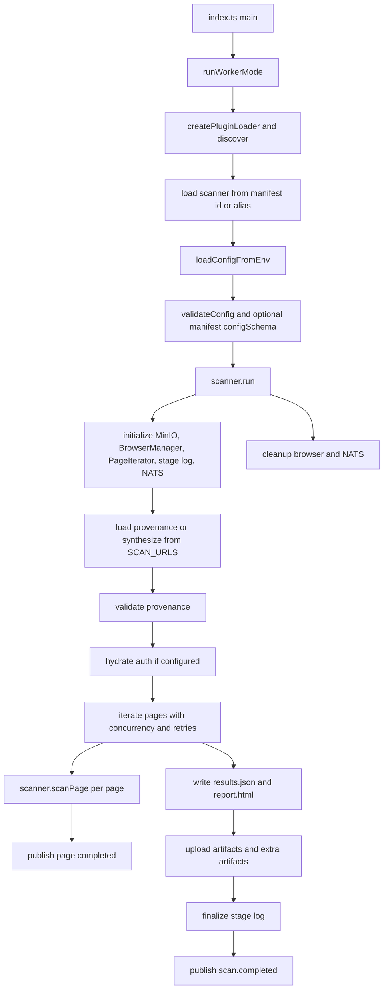
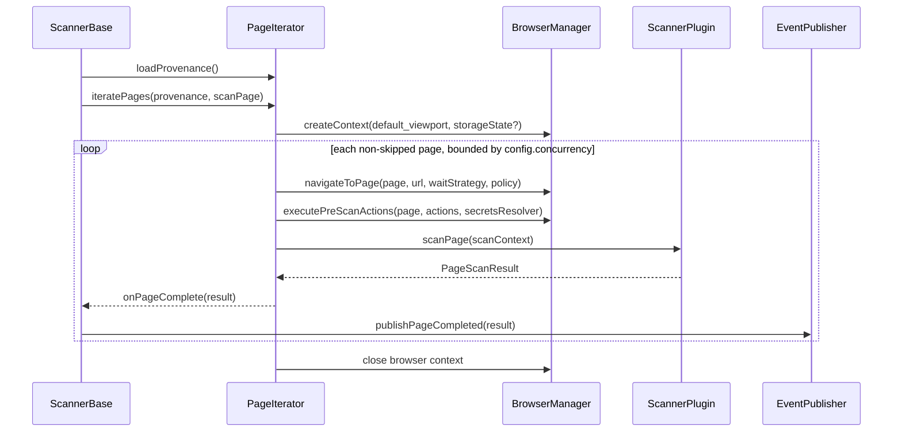
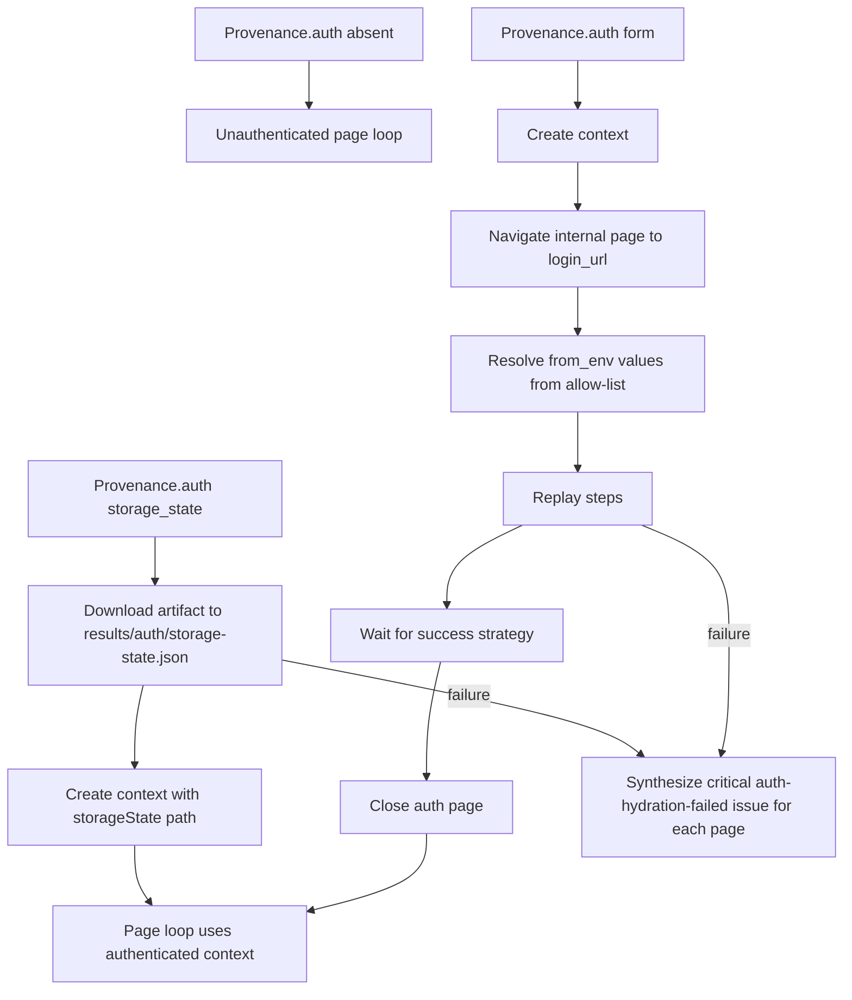
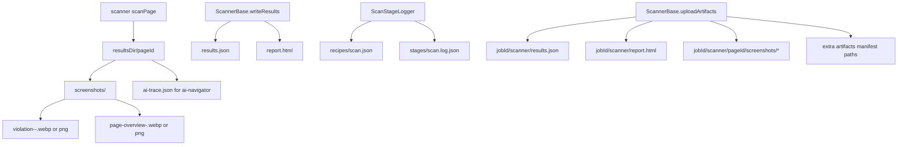

# Scanner Runner Repo Map

This map documents the `services/scanner-runner` slice as it exists in this
worktree. It is intentionally code-grounded: repo behavior is cited as
`path:line`, and external framework notes are limited to semantics that the
runtime directly uses.

## Responsibility and Boundaries

`scanner-runner` is a per-job scanner runtime. The local README says it runs
inside per-job pods, loads provenance, resolves a scanner module, writes
artifacts, uploads them to object storage, and publishes scan lifecycle events
over NATS (`services/scanner-runner/README.md:3`,
`services/scanner-runner/README.md:5`, `services/scanner-runner/README.md:9`).
It explicitly does not accept job submissions, orchestrate pods, or aggregate
multi-scanner job output (`services/scanner-runner/README.md:11`,
`services/scanner-runner/README.md:14`).

| Boundary | In scope here | Out of scope here | Source |
|---|---|---|---|
| Job execution | Load env config, provenance, scanner plugin, browser context, page loop, scanner callback, results, artifacts, events | Job submission API and pod orchestration | `services/scanner-runner/src/index.ts:6`, `services/scanner-runner/src/worker.ts:108`, `services/scanner-runner/README.md:11` |
| Scanner selection | Manifest discovery, alias resolution, dynamic import, factory/class instantiation, metadata/manifest consistency check | Scanner catalog authoring outside copied manifests | `services/scanner-runner/src/core/plugins/plugin-loader.ts:183`, `services/scanner-runner/src/core/plugins/plugin-discovery.ts:14`, `services/scanner-runner/src/core/plugins/plugin-load.ts:15`, `services/scanner-runner/src/worker.ts:71` |
| Browser automation | Chromium launch, Playwright context/page lifecycle, routing-based target blocking, waits, pre-scan actions | Browser sandbox hardening beyond current container flags | `services/scanner-runner/src/core/browser-manager.ts:56`, `services/scanner-runner/src/core/browser-manager.ts:132`, `services/scanner-runner/src/core/browser-manager.ts:197`, `services/scanner-runner/README.md:20` |
| Storage | MinIO bucket ensure, file/buffer/directory upload, storage-state download | Object storage provisioning outside bucket creation | `services/scanner-runner/src/core/storage-provider/minio-storage-provider.ts:42`, `services/scanner-runner/src/core/storage-provider/minio-storage-provider.ts:71`, `services/scanner-runner/src/core/storage-provider/minio-storage-provider.ts:186` |
| Messaging | NATS JetStream event envelopes for page completion, scan completion, scan failure | NATS stream setup and downstream consumers | `services/scanner-runner/src/core/event-publisher.ts:72`, `services/scanner-runner/src/core/event-publisher.ts:96`, `services/scanner-runner/src/core/event-publisher.ts:106`, `services/scanner-runner/src/core/event-publisher.ts:145` |

## Runtime Flow

| Step | What happens | Source |
|---|---|---|
| Entrypoint | `src/index.ts` only runs worker mode and exits non-zero on uncaught error. | `services/scanner-runner/src/index.ts:6`, `services/scanner-runner/src/index.ts:12` |
| Scanner type | `SCANNER_TYPE` defaults to `axe`. | `services/scanner-runner/src/worker.ts:108` |
| Plugin initialization | The loader discovers manifests and logs discovery errors before scanner loading. | `services/scanner-runner/src/worker.ts:20`, `services/scanner-runner/src/worker.ts:26`, `services/scanner-runner/src/worker.ts:28` |
| Manifest-backed scanner | `pluginLoader.load(scannerType)` returns a plugin factory; `scanner.metadata.name` is checked against manifest id. | `services/scanner-runner/src/worker.ts:57`, `services/scanner-runner/src/worker.ts:68`, `services/scanner-runner/src/worker.ts:71` |
| Config loading | Env config is loaded after scanner resolution so manifest `maxConcurrency` can become the default concurrency. | `services/scanner-runner/src/worker.ts:144`, `services/scanner-runner/src/worker.ts:146` |
| Options validation | If the manifest has `configSchema`, `SCANNER_OPTIONS` is validated against it; production mode exits on strict failure. | `services/scanner-runner/src/worker.ts:160`, `services/scanner-runner/src/worker.ts:176`, `services/scanner-runner/src/worker/worker-validation.ts:26` |
| Lifecycle | `ScannerBase.run` initializes, loads provenance, validates it, iterates pages, writes results, uploads artifacts, finalizes stage logs, publishes completion, and cleans up. | `services/scanner-runner/src/core/scanner-base.ts:63`, `services/scanner-runner/src/core/scanner-base.ts:75`, `services/scanner-runner/src/core/scanner-base.ts:78`, `services/scanner-runner/src/core/scanner-base.ts:89`, `services/scanner-runner/src/core/scanner-base.ts:97`, `services/scanner-runner/src/core/scanner-base.ts:101`, `services/scanner-runner/src/core/scanner-base.ts:113`, `services/scanner-runner/src/core/scanner-base.ts:117`, `services/scanner-runner/src/core/scanner-base.ts:138` |

## Directory and File Map

| Path | Role | Source |
|---|---|---|
| `src/index.ts` | Process entrypoint; delegates to worker mode. | `services/scanner-runner/src/index.ts:6` |
| `src/worker.ts` | Worker orchestration: plugin discovery/loading, env config, manifest options validation, scanner run, process exit. | `services/scanner-runner/src/worker.ts:20`, `services/scanner-runner/src/worker.ts:108`, `services/scanner-runner/src/worker.ts:191` |
| `src/core/config-loader.ts` | Parses env into `ScannerConfig`, including browser, storage, messaging, and JSON `SCANNER_OPTIONS`. | `services/scanner-runner/src/core/config-loader.ts:18`, `services/scanner-runner/src/core/config-loader.ts:57`, `services/scanner-runner/src/core/config-loader.ts:78`, `services/scanner-runner/src/core/config-loader.ts:93`, `services/scanner-runner/src/core/config-loader.ts:158` |
| `src/core/types.ts` | Defines provenance, auth, page entries, scanner config, results, events, storage interface, and scanner metadata. | `services/scanner-runner/src/core/types.ts:119`, `services/scanner-runner/src/core/types.ts:155`, `services/scanner-runner/src/core/types.ts:194`, `services/scanner-runner/src/core/types.ts:232`, `services/scanner-runner/src/core/types.ts:301`, `services/scanner-runner/src/core/types.ts:329` |
| `src/core/scanner-base.ts` | Shared scanner lifecycle, MinIO/NATS setup, page iteration callbacks, result formatting, artifact upload, stage log, cleanup. | `services/scanner-runner/src/core/scanner-base.ts:37`, `services/scanner-runner/src/core/scanner-base.ts:261`, `services/scanner-runner/src/core/scanner-base.ts:425`, `services/scanner-runner/src/core/scanner-base.ts:442`, `services/scanner-runner/src/core/scanner-base.ts:638` |
| `src/core/page-iterator.ts` | Provenance loading/synthesis, auth hydration, target policy, concurrency/retry loop, per-page Playwright page lifecycle. | `services/scanner-runner/src/core/page-iterator.ts:74`, `services/scanner-runner/src/core/page-iterator.ts:125`, `services/scanner-runner/src/core/page-iterator.ts:146`, `services/scanner-runner/src/core/page-iterator.ts:200`, `services/scanner-runner/src/core/page-iterator.ts:405` |
| `src/core/browser-manager.ts` | Chromium launch, context creation, navigation wait strategy, request blocking, pre-scan action executor. | `services/scanner-runner/src/core/browser-manager.ts:56`, `services/scanner-runner/src/core/browser-manager.ts:117`, `services/scanner-runner/src/core/browser-manager.ts:141`, `services/scanner-runner/src/core/browser-manager.ts:227` |
| `src/core/auth-hydrator.ts` | Implements `storage_state` download and form-login recipe hydration. | `services/scanner-runner/src/core/auth-hydrator.ts:70`, `services/scanner-runner/src/core/auth-hydrator.ts:104` |
| `src/core/secrets-resolver.ts` | Builds an allow-list from provenance and resolves `{ from_env }` values only from that list. | `services/scanner-runner/src/core/secrets-resolver.ts:61`, `services/scanner-runner/src/core/secrets-resolver.ts:102` |
| `src/core/target-validation.ts` | Blocks non-http(s), blocked IP ranges, DNS results to blocked ranges, with opt-in private target allowance. | `services/scanner-runner/src/core/target-validation.ts:21`, `services/scanner-runner/src/core/target-validation.ts:115`, `services/scanner-runner/src/core/target-validation.ts:235` |
| `src/core/event-publisher.ts` | NATS JetStream publisher and no-op publisher. | `services/scanner-runner/src/core/event-publisher.ts:42`, `services/scanner-runner/src/core/event-publisher.ts:230` |
| `src/core/storage-provider/minio-storage-provider.ts` | MinIO storage provider with retry/timeout wrapping and directory upload. | `services/scanner-runner/src/core/storage-provider/minio-storage-provider.ts:18`, `services/scanner-runner/src/core/storage-provider/minio-storage-provider.ts:129` |
| `src/core/scan-stage-logger.ts` | Writes and uploads scan recipe and scan stage logs. | `services/scanner-runner/src/core/scan-stage-logger.ts:72`, `services/scanner-runner/src/core/scan-stage-logger.ts:102`, `services/scanner-runner/src/core/scan-stage-logger.ts:171` |
| `src/core/web-server-formatter.ts` | Converts scanner-native results to unified report v2.1.0, including artifacts and page overview metadata. | `services/scanner-runner/src/core/web-server-formatter.ts:46`, `services/scanner-runner/src/core/web-server-formatter.ts:209` |
| `src/core/plugins/*` | Manifest validation, discovery, alias map, dynamic import, scanner factory validation. | `services/scanner-runner/src/core/manifest/index.ts:45`, `services/scanner-runner/src/core/plugins/plugin-discovery.ts:14`, `services/scanner-runner/src/core/plugins/plugin-load.ts:15`, `services/scanner-runner/src/core/plugins/plugin-loader.ts:26` |
| `src/scanners/*` | Built-in scanner implementations exported by `src/scanners/index.ts`. | `services/scanner-runner/src/scanners/index.ts:1` |
| `src/screenshots/*` and `src/core/screenshots.ts` | Screenshot services, axe violation captures, page overview captures, and issue-to-overview adapter. | `services/scanner-runner/src/core/screenshots.ts:66`, `services/scanner-runner/src/screenshots/AxeScreenshotService.ts:36`, `services/scanner-runner/src/screenshots/page-overview-from-issues.ts:22` |
| `scripts/prepare-contracts-*.mjs` | Copies generated contracts into local `node_modules/@stageflow/*` packages before build/lint/test/typecheck. | `services/scanner-runner/scripts/prepare-contracts-report-types.mjs:36`, `services/scanner-runner/scripts/prepare-contracts-scanner-manifest.mjs:51`, `services/scanner-runner/scripts/prepare-contracts-provenance.mjs:48` |
| `scripts/copy-builtin-manifests.mjs` | Copies shared built-in manifests into `dist/scanners` after build. | `services/scanner-runner/scripts/copy-builtin-manifests.mjs:8`, `services/scanner-runner/scripts/copy-builtin-manifests.mjs:19`, `services/scanner-runner/scripts/copy-builtin-manifests.mjs:24` |
| `Dockerfile` | Multi-stage build on Playwright image with Bun 1.3.8 and Node 22; runtime runs `node dist/index.js` as `pwuser`. | `services/scanner-runner/Dockerfile:4`, `services/scanner-runner/Dockerfile:7`, `services/scanner-runner/Dockerfile:41`, `services/scanner-runner/Dockerfile:77`, `services/scanner-runner/Dockerfile:83` |

## Config and Environment

| Env var | Required | Parsed as | Default | Behavior | Source |
|---|---:|---|---|---|---|
| `JOB_ID` | yes | string | none | Job id in config, artifacts, events. | `services/scanner-runner/src/core/config-loader.ts:22` |
| `REQUEST_ID` | no | trimmed string | omitted | Correlation id added to event envelope when present. | `services/scanner-runner/src/core/config-loader.ts:23`, `services/scanner-runner/src/core/event-publisher.ts:210` |
| `RUN_ID` | no | trimmed string | omitted | Correlation id added to event envelope when present. | `services/scanner-runner/src/core/config-loader.ts:24`, `services/scanner-runner/src/core/event-publisher.ts:211` |
| `SCANNER_DATA_DIR` | no | path | `process.cwd()/data`; Docker sets `/data` | Base for default provenance/results paths. | `services/scanner-runner/src/core/config-loader.ts:16`, `services/scanner-runner/src/core/config-loader.ts:25`, `services/scanner-runner/Dockerfile:54` |
| `PROVENANCE_PATH` | no | path | `${SCANNER_DATA_DIR}/provenance.json` | Provenance read path, or written path when synthesized from `SCAN_URLS`. | `services/scanner-runner/src/core/config-loader.ts:36`, `services/scanner-runner/src/core/page-iterator.ts:74` |
| `RESULTS_DIR` | no | path | `${SCANNER_DATA_DIR}/results` | Root for `results.json`, `report.html`, per-page dirs, stage logs, recipes. | `services/scanner-runner/src/core/config-loader.ts:38`, `services/scanner-runner/src/core/scanner-base.ts:431`, `services/scanner-runner/src/core/scan-stage-logger.ts:98` |
| `SCAN_CONCURRENCY` | no | integer >= 0, later validated >= 1 | manifest `maxConcurrency` or 4 | Page-level concurrency cap. | `services/scanner-runner/src/core/config-loader.ts:40`, `services/scanner-runner/src/core/config-loader.ts:198` |
| `MAX_RETRIES` | no | integer >= 0, later validated >= 1 | 3 | Per-page scan attempts. | `services/scanner-runner/src/core/config-loader.ts:41`, `services/scanner-runner/src/core/page-iterator.ts:405` |
| `BROWSER_HEADLESS` | no | bool | true | Chromium headless setting. | `services/scanner-runner/src/core/config-loader.ts:59` |
| `BROWSER_ARGS` | no | comma-separated strings | none | Additional Chromium launch args appended after defaults. | `services/scanner-runner/src/core/config-loader.ts:60` |
| `VIEWPORT_WIDTH`, `VIEWPORT_HEIGHT` | no | integer | 1280 x 720 | Default browser viewport. | `services/scanner-runner/src/core/config-loader.ts:67` |
| `DEVICE_SCALE_FACTOR` | no | number | 2 | Browser context device scale factor. | `services/scanner-runner/src/core/config-loader.ts:71`, `services/scanner-runner/src/core/browser-manager.ts:132` |
| `DEFAULT_TIMEOUT` | no | integer | 30000 | Action/selector default timeout. | `services/scanner-runner/src/core/config-loader.ts:72`, `services/scanner-runner/src/core/browser-manager.ts:248` |
| `PAGE_LOAD_TIMEOUT` | no | integer | 15000 | `page.goto` timeout. | `services/scanner-runner/src/core/config-loader.ts:73`, `services/scanner-runner/src/core/browser-manager.ts:161` |
| `BROWSER_BYPASS_CSP` | no | bool | false | Passed to Playwright context for scanner CSS/JS injection. | `services/scanner-runner/src/core/config-loader.ts:74`, `services/scanner-runner/src/core/browser-manager.ts:135` |
| `MINIO_ENDPOINT` | yes | string | none | MinIO endpoint. | `services/scanner-runner/src/core/config-loader.ts:79` |
| `MINIO_ACCESS_KEY` or `MINIO_ROOT_USER` | yes | string | none | MinIO access key. | `services/scanner-runner/src/core/config-loader.ts:80` |
| `MINIO_SECRET_KEY` or `MINIO_ROOT_PASSWORD` | yes | string | none | MinIO secret key. | `services/scanner-runner/src/core/config-loader.ts:81` |
| `MINIO_ARTIFACT_BUCKET` | yes | string | none | Upload/download bucket. | `services/scanner-runner/src/core/config-loader.ts:82` |
| `MINIO_USE_SSL` | no | bool | false | MinIO SSL flag. | `services/scanner-runner/src/core/config-loader.ts:88` |
| `NATS_URL` | yes | string | none | NATS connection URL. | `services/scanner-runner/src/core/config-loader.ts:94` |
| `NATS_SUBJECT_PAGE_COMPLETED` | no | string | `scan.events.page.completed` | Page completed subject. | `services/scanner-runner/src/core/config-loader.ts:99` |
| `NATS_SUBJECT_SCAN_COMPLETED` | no | string | `scan.events.completed` | Scan completed subject. | `services/scanner-runner/src/core/config-loader.ts:100` |
| `NATS_SUBJECT_SCAN_FAILED` | no | string | `scan.events.failed` | Scan failed subject. | `services/scanner-runner/src/core/config-loader.ts:101` |
| `SCANNER_OPTIONS` | no | JSON object | omitted | Scanner-specific options, optionally schema-validated by manifest. | `services/scanner-runner/src/core/config-loader.ts:158`, `services/scanner-runner/src/core/config-loader.ts:172` |
| `SCAN_URLS` | no | JSON array of strings | none | Synthesizes live-mode provenance if provenance file is absent; also enables runtime target validation. | `services/scanner-runner/src/core/page-iterator.ts:77`, `services/scanner-runner/src/core/page-iterator.ts:85`, `services/scanner-runner/src/core/target-validation.ts:157` |
| `PROVENANCE_AUTH_JSON` | no | JSON `Provenance.auth` object | none | Attaches auth to loaded/synthesized provenance if the file does not already have auth. | `services/scanner-runner/src/core/page-iterator.ts:113`, `services/scanner-runner/src/core/page-iterator.ts:629` |
| `ALLOW_PRIVATE_TARGETS` | no | literal `true` | false | Allows private IPv4 and loopback allowlisted ranges, but not the whole blocked list. | `services/scanner-runner/src/core/target-validation.ts:49`, `services/scanner-runner/src/core/target-validation.ts:115` |
| `PLUGIN_PATHS` | no | colon-separated paths | none | Adds plugin search paths. | `services/scanner-runner/src/core/plugins/plugin-loader.ts:199` |
| `PLUGIN_VERBOSE` | no | literal `true` | false | Enables verbose plugin logging. | `services/scanner-runner/src/core/plugins/plugin-loader.ts:206` |
| `NODE_ENV` | no | string | Docker sets production | Makes plugin/manifest validation strict in production. | `services/scanner-runner/src/core/plugins/plugin-loader.ts:206`, `services/scanner-runner/Dockerfile:54` |
| `LIGHTHOUSE_CHROME_PATH`, `CHROME_PATH` | no | path | Playwright Chromium path or image fallback | Selects Chrome executable for Lighthouse. | `services/scanner-runner/src/scanners/lighthouse/chrome-lifecycle.ts:10` |
| `OPENROUTER_API_KEY` | ai-navigator only | string | none | Required API key for ai-navigator vision client. | `services/scanner-runner/src/scanners/ai-navigator/index.ts:39` |
| `OPENROUTER_APP_TITLE`, `OPENROUTER_APP_REFERER` | ai-navigator only | trimmed string | omitted | Optional OpenRouter app metadata, rejected if passed inside `SCANNER_OPTIONS`. | `services/scanner-runner/src/scanners/ai-navigator/index.ts:44`, `services/scanner-runner/src/scanners/ai-navigator/options.ts:136` |
| `A11Y_*` screenshot env vars | no | bool/int/number/string | see screenshot config | Control axe/page-overview screenshots, output format, quality, thumbnails, overlay strategy. | `services/scanner-runner/src/screenshots/axe/config.ts:17`, `services/scanner-runner/src/screenshots/axe/config.ts:24` |
| `A11Y_PAGE_OVERVIEW_*` env vars | no | bool/int | see page overview config | Control page overview capture, scrolling, animation stabilization, max elements/height. | `services/scanner-runner/src/screenshots/axe/page-overview.ts:49`, `services/scanner-runner/src/screenshots/axe/page-overview.ts:74` |

## Provenance and Page Iteration

`PageIterator.loadProvenance` reads `config.provenancePath`; if the file is
missing and `SCAN_URLS` is set, it synthesizes live-mode provenance with
`domcontentloaded` default wait and `url-1`, `url-2`, ... page ids
(`services/scanner-runner/src/core/page-iterator.ts:74`,
`services/scanner-runner/src/core/page-iterator.ts:87`,
`services/scanner-runner/src/core/page-iterator.ts:95`). It attaches
`PROVENANCE_AUTH_JSON` only when no auth block is already present
(`services/scanner-runner/src/core/page-iterator.ts:113`,
`services/scanner-runner/src/core/page-iterator.ts:118`). `ScannerBase`
validates that provenance has a version, job id, pages, and either a base URL or
absolute page URLs (`services/scanner-runner/src/core/scanner-base.ts:294`).

Page iteration filters skipped pages, builds target validation policy, collects
secret references, and runs pages with a shared browser context
(`services/scanner-runner/src/core/page-iterator.ts:130`,
`services/scanner-runner/src/core/page-iterator.ts:133`,
`services/scanner-runner/src/core/page-iterator.ts:135`,
`services/scanner-runner/src/core/page-iterator.ts:171`). It schedules page
promises until `activePromises.size >= config.concurrency`, then waits for one
to finish (`services/scanner-runner/src/core/page-iterator.ts:200`,
`services/scanner-runner/src/core/page-iterator.ts:219`). Each page gets up to
`maxRetries` attempts, a fresh Playwright `Page`, optional page viewport,
navigation, auth-wall detection, pre-scan actions, a per-page results directory,
and the scanner callback (`services/scanner-runner/src/core/page-iterator.ts:405`,
`services/scanner-runner/src/core/page-iterator.ts:409`,
`services/scanner-runner/src/core/page-iterator.ts:411`,
`services/scanner-runner/src/core/page-iterator.ts:418`,
`services/scanner-runner/src/core/page-iterator.ts:425`,
`services/scanner-runner/src/core/page-iterator.ts:434`,
`services/scanner-runner/src/core/page-iterator.ts:442`,
`services/scanner-runner/src/core/page-iterator.ts:455`).

## Authenticated Scanning

| Area | Behavior | Source |
|---|---|---|
| Auth schema | Provenance supports `storage_state` with `artifact_key` and `form` with `login_url`, `steps`, and `success`. | `services/scanner-runner/src/core/types.ts:141`, `services/scanner-runner/src/core/types.ts:146` |
| Storage-state hydration | Downloads the storage-state artifact from MinIO to `results/auth/storage-state.json`, chmods it `0600`, and passes it to context creation. | `services/scanner-runner/src/core/auth-hydrator.ts:70`, `services/scanner-runner/src/core/auth-hydrator.ts:76`, `services/scanner-runner/src/core/auth-hydrator.ts:78`, `services/scanner-runner/src/core/auth-hydrator.ts:216`, `services/scanner-runner/src/core/page-iterator.ts:150`, `services/scanner-runner/src/core/browser-manager.ts:132` |
| Form hydration | Opens one internal page, navigates to login URL, executes recipe steps through the pre-scan executor, waits for success, rejects visible login-form leftovers, then closes the auth page. | `services/scanner-runner/src/core/auth-hydrator.ts:104`, `services/scanner-runner/src/core/auth-hydrator.ts:108`, `services/scanner-runner/src/core/auth-hydrator.ts:118`, `services/scanner-runner/src/core/auth-hydrator.ts:125`, `services/scanner-runner/src/core/auth-hydrator.ts:127`, `services/scanner-runner/src/core/auth-hydrator.ts:130`, `services/scanner-runner/src/core/auth-hydrator.ts:159` |
| Success waits | Form success can wait for load, DOMContentLoaded, networkidle, selector, or timeout. | `services/scanner-runner/src/core/auth-hydrator.ts:170` |
| Secret resolution | Only `{ from_env }` names found in form auth steps and per-page pre-scan actions are allowed; unset or out-of-list references throw. | `services/scanner-runner/src/core/secrets-resolver.ts:61`, `services/scanner-runner/src/core/secrets-resolver.ts:68`, `services/scanner-runner/src/core/secrets-resolver.ts:76`, `services/scanner-runner/src/core/secrets-resolver.ts:102` |
| Redaction invariant | Comments and tests assert resolved credentials stay out of stored provenance, reports, stage logs, and NATS-like payloads. | `services/scanner-runner/src/core/secrets-resolver.ts:5`, `services/scanner-runner/tests/core/auth-pipeline-redaction.test.ts:1`, `services/scanner-runner/tests/core/auth-pipeline-redaction.test.ts:312`, `services/scanner-runner/tests/core/auth-pipeline-redaction.test.ts:407` |
| Auth failure | Hydration failures skip normal page iteration and synthesize one critical `auth-hydration-failed` page result per page. | `services/scanner-runner/src/core/page-iterator.ts:258`, `services/scanner-runner/src/core/page-iterator.ts:306`, `services/scanner-runner/src/core/page-iterator.ts:309`, `services/scanner-runner/src/core/page-iterator.ts:311` |
| Auth wall detection | Redirects to login-like paths or visible login forms become `auth-wall-detected` issues; severity is `serious` if auth was configured and hydrated, otherwise `info`. | `services/scanner-runner/src/core/auth-wall.ts:32`, `services/scanner-runner/src/core/auth-wall.ts:35`, `services/scanner-runner/src/core/auth-wall.ts:40`, `services/scanner-runner/src/core/auth-wall.ts:52`, `services/scanner-runner/src/core/auth-wall.ts:63` |
| Target validation | Initial URL, final URL after redirects, and HTTP(S) subresource routes are validated against blocked ranges unless an allowed static origin applies. | `services/scanner-runner/src/core/browser-manager.ts:147`, `services/scanner-runner/src/core/browser-manager.ts:178`, `services/scanner-runner/src/core/browser-manager.ts:197`, `services/scanner-runner/src/core/target-validation.ts:210`, `services/scanner-runner/src/core/target-validation.ts:222` |

## Plugin Discovery and Loading

Default search paths are built-in `dist/scanners`, `/plugins`,
`${HOME}/.stageflow/plugins`, and `PLUGIN_PATHS` (`services/scanner-runner/src/core/plugins/plugin-loader.ts:187`,
`services/scanner-runner/src/core/plugins/plugin-loader.ts:190`,
`services/scanner-runner/src/core/plugins/plugin-loader.ts:195`,
`services/scanner-runner/src/core/plugins/plugin-loader.ts:199`). Manifest file
names are `manifest.json` or `scanner.json`
(`services/scanner-runner/src/core/plugins/plugin-loader-types.ts:39`).
Discovery loads and schema-validates manifests, builds a map by id, and adds
case-insensitive aliases (`services/scanner-runner/src/core/plugins/plugin-discovery.ts:143`,
`services/scanner-runner/src/core/plugins/plugin-discovery.ts:165`,
`services/scanner-runner/src/core/plugins/plugin-discovery.ts:40`,
`services/scanner-runner/src/core/plugins/plugin-discovery.ts:54`,
`services/scanner-runner/src/core/plugins/plugin-discovery.ts:57`,
`services/scanner-runner/src/core/plugins/plugin-discovery.ts:194`).

Loading rejects manifests outside configured search paths, resolves entry
modules without absolute paths or directory escape, dynamic-imports the module,
and resolves either a named factory function or a class export
(`services/scanner-runner/src/core/plugins/plugin-load.ts:23`,
`services/scanner-runner/src/core/manifest/index.ts:108`,
`services/scanner-runner/src/core/plugins/plugin-load.ts:51`,
`services/scanner-runner/src/core/plugins/plugin-load.ts:94`,
`services/scanner-runner/src/core/plugins/plugin-load.ts:107`).

## Built-in Scanner Map

The built-in manifest source of truth currently lives in
`libs/go/scannercatalog/manifests/*/manifest.json` and is copied into
`dist/scanners` during build (`services/scanner-runner/scripts/copy-builtin-manifests.mjs:8`,
`services/scanner-runner/scripts/copy-builtin-manifests.mjs:19`,
`services/scanner-runner/scripts/copy-builtin-manifests.mjs:24`). A test
guards the expected eight built-ins and checks entrypoint/export alignment
against `src/scanners/<id>/index.ts`
(`services/scanner-runner/tests/core/plugins/builtin-manifests.test.ts:8`,
`services/scanner-runner/tests/core/plugins/builtin-manifests.test.ts:43`,
`services/scanner-runner/tests/core/plugins/builtin-manifests.test.ts:65`).

| Scanner | Runtime implementation | Manifest capabilities and concurrency | Runtime options and inputs | Outputs and artifacts | Notes |
|---|---|---|---|---|---|
| `axe` | `AxeScanner` uses `@axe-core/playwright` `AxeBuilder`, waits for networkidle best-effort plus dynamic wait, disables rules and/or limits tags, maps violations and reportable incomplete results. | Accessibility, JSON/HTML, screenshots, browser required, offline supported, manifest `maxConcurrency: 4`. | Runtime parses `dynamicContentWaitMs`, `disabledRules`, `runOnlyTags`; manifest schema instead lists `rules`, `disabledRules`, `standard`, `includeBestPractices`. | Per-violation screenshots plus page overview in `<pageId>/screenshots`; raw axe results with `pageOverview`. | Options/schema drift is real: `dynamicContentWaitMs` and `runOnlyTags` are accepted by runtime but not manifest schema. Sources: `services/scanner-runner/src/scanners/axe/index.ts:62`, `services/scanner-runner/src/scanners/axe/index.ts:84`, `services/scanner-runner/src/scanners/axe/index.ts:169`, `services/scanner-runner/src/scanners/axe/index.ts:201`, `services/scanner-runner/src/scanners/axe/index.ts:213`, `services/scanner-runner/src/scanners/axe/index.ts:238`, `services/scanner-runner/src/scanners/axe/index.ts:317`, `libs/go/scannercatalog/manifests/axe/manifest.json:10`, `libs/go/scannercatalog/manifests/axe/manifest.json:34` |
| `lighthouse` | `LighthouseScanner` launches a dedicated Chrome via `chrome-launcher`, imports `lighthouse`, serializes Lighthouse invocations through an internal queue, extracts issues, re-navigates the Playwright page, and captures page overview. | Performance/accessibility/SEO/quality, JSON/HTML, manifest screenshots false, browser required, offline false, manifest `maxConcurrency: 1`. | Runtime only parses `categories` and defaults to `accessibility`, `best-practices`, `seo`; manifest schema also lists `throttling`, `formFactor`, `onlyAudits`, and `skipAudits`, but runtime does not consume them. | Raw LHR in `rawResults`, `summary.lighthouseCategories` aggregated by `ScannerBase`, page overview screenshot when capture succeeds. | Runtime serializes even if page iterator concurrency were higher. Sources: `services/scanner-runner/src/scanners/lighthouse/index.ts:42`, `services/scanner-runner/src/scanners/lighthouse/index.ts:63`, `services/scanner-runner/src/scanners/lighthouse/index.ts:85`, `services/scanner-runner/src/scanners/lighthouse/index.ts:91`, `services/scanner-runner/src/scanners/lighthouse/index.ts:225`, `services/scanner-runner/src/scanners/lighthouse/index.ts:245`, `services/scanner-runner/src/scanners/lighthouse/types.ts:72`, `services/scanner-runner/src/scanners/lighthouse/lighthouse-invoker.ts:32`, `libs/go/scannercatalog/manifests/lighthouse/manifest.json:10`, `libs/go/scannercatalog/manifests/lighthouse/manifest.json:34` |
| `seo` | Extracts title, meta, canonical, robots, viewport, charset, language, headings, images, links, OG/Twitter tags, JSON-LD, and word count, then runs check modules. | SEO, JSON/HTML, no screenshots, browser required, manifest `maxConcurrency: 10`. | No scanner-specific runtime options found. Inputs are current DOM and page URL. | Issues for meta/headings/images/social/technical/content checks; raw summary of SEO data. | Sources: `services/scanner-runner/src/scanners/seo/index.ts:15`, `services/scanner-runner/src/scanners/seo/index.ts:28`, `services/scanner-runner/src/scanners/seo/index.ts:30`, `services/scanner-runner/src/scanners/seo/extract.ts:5`, `services/scanner-runner/src/scanners/seo/checks/index.ts:10`, `libs/go/scannercatalog/manifests/seo/manifest.json:8` |
| `link-checker` | Extracts unique non-mail/tel/data/script links, checks links in internal batches of 5 using HEAD with GET fallback, manual redirects, target validation, and classifies broken, redirect-chain, slow, empty, and inaccessible-text links. | Quality, JSON/HTML, no screenshots in manifest, browser required, manifest `maxConcurrency: 3`. | No scanner-specific runtime options found. Inputs are anchors in current DOM plus target validation policy. | Issues plus page overview screenshot from issue metadata nodes when available; raw link counts and average response time. | Source code captures page overview despite manifest `supportsScreenshots: false`; manifest may be stale. Sources: `services/scanner-runner/src/scanners/link-checker/index.ts:49`, `services/scanner-runner/src/scanners/link-checker/index.ts:65`, `services/scanner-runner/src/scanners/link-checker/index.ts:71`, `services/scanner-runner/src/scanners/link-checker/index.ts:134`, `services/scanner-runner/src/scanners/link-checker/index.ts:349`, `services/scanner-runner/src/scanners/link-checker/validation.ts:104`, `libs/go/scannercatalog/manifests/link-checker/manifest.json:8` |
| `security-headers` | Fetches the current page URL through Playwright request API, checks security headers, mixed HTTP resources, and cookie flags. | Security, JSON/HTML, no screenshots, browser required, manifest `maxConcurrency: 10`. | No scanner-specific runtime options found. Inputs are page URL, fetched response headers, and DOM resource URLs. | Issues for missing/invalid headers, mixed content, insecure cookies; raw selected headers/status/mixed-content count. | Sources: `services/scanner-runner/src/scanners/security-headers/index.ts:23`, `services/scanner-runner/src/scanners/security-headers/index.ts:83`, `services/scanner-runner/src/scanners/security-headers/index.ts:102`, `services/scanner-runner/src/scanners/security-headers/index.ts:111`, `services/scanner-runner/src/scanners/security-headers/index.ts:123`, `services/scanner-runner/src/scanners/security-headers/index.ts:140`, `libs/go/scannercatalog/manifests/security-headers/manifest.json:8` |
| `open-graph` | Reads `meta[property^="og:"]`, requires `og:title`, `og:description`, and `og:image`. | SEO, JSON, no screenshots, browser required, manifest `maxConcurrency: 10`. | No scanner-specific runtime options found. | Issues for missing required OG tags; raw OG tag map and missing tag list. | Sources: `services/scanner-runner/src/scanners/open-graph/index.ts:9`, `services/scanner-runner/src/scanners/open-graph/index.ts:21`, `services/scanner-runner/src/scanners/open-graph/index.ts:36`, `libs/go/scannercatalog/manifests/open-graph/manifest.json:8` |
| `spelling-grammar` | Reads `document.body.innerText` and checks two hard-coded common misspellings: `teh` -> `the`, `adn` -> `and`. | Quality, JSON, no screenshots, browser required, manifest `maxConcurrency: 5`. | No scanner-specific runtime options found. | Minor content-quality issues and raw word count / issue count. | Sources: `services/scanner-runner/src/scanners/spelling-grammar/index.ts:6`, `services/scanner-runner/src/scanners/spelling-grammar/index.ts:11`, `services/scanner-runner/src/scanners/spelling-grammar/index.ts:23`, `libs/go/scannercatalog/manifests/spelling-grammar/manifest.json:8` |
| `ai-navigator` | Uses OpenRouter-backed vision client, page analyzer, action decider, screenshot service, and a step loop to navigate toward a configured goal. | Custom, JSON/HTML, screenshots, browser required, offline false, manifest `maxConcurrency: 1`. | Requires `SCANNER_OPTIONS.goal.objective` and `SCANNER_OPTIONS.vision.model`; optional success criteria, max steps/time, input values, model limits, retry. Requires `OPENROUTER_API_KEY`; rejects API key/app metadata inside options. | Writes `<pageId>/ai-trace.json`, step screenshots under `<pageId>/screenshots`, uploads traces after base artifacts, returns success/failure flow issue with full trace metadata. | Sources: `services/scanner-runner/src/scanners/ai-navigator/index.ts:20`, `services/scanner-runner/src/scanners/ai-navigator/index.ts:36`, `services/scanner-runner/src/scanners/ai-navigator/index.ts:39`, `services/scanner-runner/src/scanners/ai-navigator/index.ts:65`, `services/scanner-runner/src/scanners/ai-navigator/index.ts:76`, `services/scanner-runner/src/scanners/ai-navigator/index.ts:85`, `services/scanner-runner/src/scanners/ai-navigator/index.ts:108`, `services/scanner-runner/src/scanners/ai-navigator/options.ts:8`, `services/scanner-runner/src/scanners/ai-navigator/agent.ts:38`, `services/scanner-runner/src/scanners/ai-navigator/trace-uploader.ts:6`, `libs/go/scannercatalog/manifests/ai-navigator/manifest.json:8` |

## Screenshots, Page Overview, and Artifact Paths

| Artifact | Local path | Object key | Producer | Source |
|---|---|---|---|---|
| Unified results | `${RESULTS_DIR}/results.json` | `${JOB_ID}/${scanner}/results.json` | `ScannerBase.writeResults` and `ScannerBase.uploadArtifacts` | `services/scanner-runner/src/core/scanner-base.ts:431`, `services/scanner-runner/src/core/artifact-paths.ts:1`, `services/scanner-runner/src/core/scanner-base.ts:446` |
| Standalone report | `${RESULTS_DIR}/report.html` | `${JOB_ID}/${scanner}/report.html` | `ScannerBase.writeResults` and `ScannerBase.uploadArtifacts` | `services/scanner-runner/src/core/scanner-base.ts:435`, `services/scanner-runner/src/core/artifact-paths.ts:5`, `services/scanner-runner/src/core/scanner-base.ts:453` |
| Per-page screenshots | `${RESULTS_DIR}/${pageId}/screenshots/*` | `${JOB_ID}/${scanner}/${pageId}/screenshots/*` | Scanners and `ScannerBase.uploadArtifacts` directory sweep | `services/scanner-runner/src/core/scanner-base.ts:471`, `services/scanner-runner/src/core/scanner-base.ts:477` |
| Synthesized provenance | `${PROVENANCE_PATH}` | `${JOB_ID}/provenance.json` | Only when `SCAN_URLS` was used | `services/scanner-runner/src/core/scanner-base.ts:625`, `services/scanner-runner/src/core/scanner-base.ts:631` |
| Stage recipe | `${RESULTS_DIR}/recipes/scan.json` | `${JOB_ID}/recipes/scan.${scanner}.json` | `ScanStageLogger.start` | `services/scanner-runner/src/core/scan-stage-logger.ts:95`, `services/scanner-runner/src/core/scan-stage-logger.ts:98`, `services/scanner-runner/src/core/scan-stage-logger.ts:132` |
| Stage log | `${RESULTS_DIR}/stages/scan.log.json` | `${JOB_ID}/stages/scan.${scanner}.log.json` | `ScanStageLogger.finalize` | `services/scanner-runner/src/core/scan-stage-logger.ts:96`, `services/scanner-runner/src/core/scan-stage-logger.ts:99`, `services/scanner-runner/src/core/scan-stage-logger.ts:215` |
| Extra artifacts | Paths listed in `${RESULTS_DIR}/.stageflow-artifacts.json` | `${JOB_ID}/${scanner}/${relativePath}` | `ScannerBase.uploadExtraArtifacts` | `services/scanner-runner/src/core/scanner-base.ts:514`, `services/scanner-runner/src/core/scanner-base.ts:535`, `services/scanner-runner/src/core/scanner-base.ts:578` |
| Axe violation screenshot | `${pageId}/screenshots/violation-${rule}-${uuid}.webp|png` | Uploaded by screenshot directory sweep | Axe screenshot service | `services/scanner-runner/src/screenshots/axe/violation-capture.ts:75`, `services/scanner-runner/src/screenshots/axe/violation-capture.ts:76` |
| Page overview screenshot | `${pageId}/screenshots/page-overview-${pageId}.webp|png` | Uploaded by screenshot directory sweep | Axe/page overview service, also used by Lighthouse and link checker | `services/scanner-runner/src/screenshots/axe/page-overview.ts:664`, `services/scanner-runner/src/screenshots/axe/page-overview.ts:665`, `services/scanner-runner/src/scanners/lighthouse/index.ts:91`, `services/scanner-runner/src/scanners/link-checker/index.ts:134` |
| AI trace | `${pageId}/ai-trace.json` | `${JOB_ID}/ai-navigator/${pageId}/ai-trace.json` | ai-navigator scanner and trace uploader | `services/scanner-runner/src/scanners/ai-navigator/index.ts:65`, `services/scanner-runner/src/scanners/ai-navigator/index.ts:85`, `services/scanner-runner/src/scanners/ai-navigator/trace-uploader.ts:31` |

Screenshot capture has two layers. `core/screenshots.ts` provides generic
full-page and highlighted screenshots using Playwright screenshots and Sharp
format conversion (`services/scanner-runner/src/core/screenshots.ts:135`,
`services/scanner-runner/src/core/screenshots.ts:149`,
`services/scanner-runner/src/core/screenshots.ts:153`,
`services/scanner-runner/src/core/screenshots.ts:176`). `AxeScreenshotService`
wraps the richer accessibility strategy: CSS or Sharp overlays, union crop,
single-target viewport, element screenshot, semantic overlay, and viewport
fallback (`services/scanner-runner/src/screenshots/AxeScreenshotService.ts:26`,
`services/scanner-runner/src/screenshots/axe/violation-capture.ts:39`,
`services/scanner-runner/src/screenshots/axe/violation-capture.ts:124`,
`services/scanner-runner/src/screenshots/axe/violation-capture.ts:151`,
`services/scanner-runner/src/screenshots/axe/violation-capture.ts:177`,
`services/scanner-runner/src/screenshots/axe/violation-capture.ts:203`).

Page overview capture is a separate full-page evidence layer. It prepares lazy
media, content visibility, fonts, assets, scroll position, and animations before
taking the screenshot and calculating overlay bounds from pre-captured element
boxes (`services/scanner-runner/src/screenshots/axe/page-overview.ts:641`,
`services/scanner-runner/src/screenshots/axe/page-overview.ts:694`,
`services/scanner-runner/src/screenshots/axe/page-overview.ts:747`,
`services/scanner-runner/src/screenshots/axe/page-overview.ts:783`,
`services/scanner-runner/src/screenshots/axe/page-overview.ts:875`).

## Events and Stage Logs

| Event or log item | Subject or object path | Payload highlights | Source |
|---|---|---|---|
| `scan.page.completed` | `NATS_SUBJECT_PAGE_COMPLETED`, default `scan.events.page.completed` | job id, scanner type, page id, page index, total pages. | `services/scanner-runner/src/core/event-publisher.ts:96`, `services/scanner-runner/src/core/event-publisher.ts:97` |
| `scan.completed` | `NATS_SUBJECT_SCAN_COMPLETED`, default `scan.events.completed` | results path, report path, page count, severity summary, optional timing, stage log path, recipe path. | `services/scanner-runner/src/core/event-publisher.ts:106`, `services/scanner-runner/src/core/event-publisher.ts:115`, `services/scanner-runner/src/core/event-publisher.ts:130`, `services/scanner-runner/src/core/event-publisher.ts:140` |
| `scan.failed` | `NATS_SUBJECT_SCAN_FAILED`, default `scan.events.failed` | error, details, optional stage log path and recipe path. Publish errors are suppressed for failure events. | `services/scanner-runner/src/core/event-publisher.ts:145`, `services/scanner-runner/src/core/event-publisher.ts:150`, `services/scanner-runner/src/core/event-publisher.ts:163` |
| Event envelope | NATS JetStream message body | event, job id, timestamp, producer, payload, optional request id/run id. | `services/scanner-runner/src/core/event-publisher.ts:204`, `services/scanner-runner/src/core/event-publisher.ts:210` |
| Stage recipe | `${JOB_ID}/recipes/scan.${scanner}.json` | schema, job id, scanner type, provenance path, scan_urls flag, results dir, non-secret environment. | `services/scanner-runner/src/core/scan-stage-logger.ts:95`, `services/scanner-runner/src/core/scan-stage-logger.ts:106`, `services/scanner-runner/src/core/scan-stage-logger.ts:117` |
| Stage log | `${JOB_ID}/stages/scan.${scanner}.log.json` | status, timing, recipe ref/hash, metrics, audit events, artifact refs, optional failure. | `services/scanner-runner/src/core/scan-stage-logger.ts:188`, `services/scanner-runner/src/core/scan-stage-logger.ts:198`, `services/scanner-runner/src/core/scan-stage-logger.ts:203` |

The NATS publisher uses `connect`, `StringCodec`, and `connection.jetstream()`
from `nats`, then publishes JSON envelopes with `jetstream.publish`
(`services/scanner-runner/src/core/event-publisher.ts:7`,
`services/scanner-runner/src/core/event-publisher.ts:72`,
`services/scanner-runner/src/core/event-publisher.ts:83`,
`services/scanner-runner/src/core/event-publisher.ts:215`). The contract test
checks that envelope shape does not include a top-level `scanner` field and
that timing keys stay snake_case
(`services/scanner-runner/tests/core/event-publisher.contract.test.ts:27`,
`services/scanner-runner/tests/core/event-publisher.contract.test.ts:43`,
`services/scanner-runner/tests/core/event-publisher.contract.test.ts:96`).

## Package, Build, Docker, Runtime Shape

| Area | Detail | Source |
|---|---|---|
| Package manager and runtime | Package declares `bun@1.3.8` and Node `22.x`; Docker copies Bun from a pinned Bun image and Node from `node:22.22.2-bookworm-slim`. | `services/scanner-runner/package.json:11`, `services/scanner-runner/package.json:12`, `services/scanner-runner/Dockerfile:4`, `services/scanner-runner/Dockerfile:5` |
| Main outputs | Package main/types point to `dist/index.js` and `dist/index.d.ts`; exports also include `./lib`. | `services/scanner-runner/package.json:16`, `services/scanner-runner/package.json:18` |
| Build | `bun run build` prepares contracts, compiles TS with `tsconfig.build.json`, then copies built-in manifests. | `services/scanner-runner/package.json:29`, `services/scanner-runner/package.json:30` |
| Validation scripts | Lint/typecheck/test all run contract prep first; CI also runs format check and coverage. | `services/scanner-runner/package.json:33`, `services/scanner-runner/package.json:39`, `services/scanner-runner/package.json:41`, `services/scanner-runner/package.json:44` |
| Key dependencies | `@axe-core/playwright`, `lighthouse`, `chrome-launcher`, `minio`, `nats`, `playwright`, `sharp`, `uuid`, `ajv`, `fast-glob`. | `services/scanner-runner/package.json:48` |
| Runtime image | Final image is `mcr.microsoft.com/playwright:v1.60.0-noble`, sets `NODE_ENV=production`, `PORT=8080`, `SCANNER_DATA_DIR=/data`, creates `/data`, runs as `pwuser`, exposes 8080, and uses `node dist/healthcheck.js`. | `services/scanner-runner/Dockerfile:51`, `services/scanner-runner/Dockerfile:54`, `services/scanner-runner/Dockerfile:69`, `services/scanner-runner/Dockerfile:77`, `services/scanner-runner/Dockerfile:80`, `services/scanner-runner/Dockerfile:81` |
| Healthcheck | Healthcheck only verifies `SCANNER_DATA_DIR` is accessible. | `services/scanner-runner/src/healthcheck.ts:3`, `services/scanner-runner/src/healthcheck.ts:4` |

## Tests and Verification Surface

| Test area | Coverage intent | Source |
|---|---|---|
| Vitest config | Includes `tests/**/*.{test,spec}.{ts,tsx}`, excludes `dist` and `node_modules`, V8 coverage with thresholds. | `services/scanner-runner/vitest.config.ts:3`, `services/scanner-runner/vitest.config.ts:8`, `services/scanner-runner/vitest.config.ts:23` |
| Auth hydration and redaction | Unit and integration-style tests cover auth modes, failure behavior, and no secret leakage across persisted/published surfaces. | `services/scanner-runner/tests/core/auth-pipeline-redaction.test.ts:1`, `services/scanner-runner/tests/core/auth-pipeline-redaction.test.ts:9`, `services/scanner-runner/tests/core/auth-pipeline-redaction.test.ts:312`, `services/scanner-runner/tests/integration/auth-scan-real-browser.test.ts:2` |
| Plugin manifests | Drift guard for eight built-in manifests, aliases, and manifest entry exports. | `services/scanner-runner/tests/core/plugins/builtin-manifests.test.ts:8`, `services/scanner-runner/tests/core/plugins/builtin-manifests.test.ts:23`, `services/scanner-runner/tests/core/plugins/builtin-manifests.test.ts:84` |
| NATS contract | Event envelope/payload compatibility with downstream Go consumers. | `services/scanner-runner/tests/core/event-publisher.contract.test.ts:27`, `services/scanner-runner/tests/core/event-publisher.contract.test.ts:47`, `services/scanner-runner/tests/core/event-publisher.contract.test.ts:106` |
| Screenshot integration | Real Chromium and pixel/metadata checks for generic highlights and page overview bounds. | `services/scanner-runner/tests/core/screenshots.integration.test.ts:61`, `services/scanner-runner/tests/core/screenshots.integration.test.ts:75`, `services/scanner-runner/tests/screenshots/axe/page-overview.integration.test.ts:41`, `services/scanner-runner/tests/screenshots/axe/page-overview.integration.test.ts:102` |
| Scanner tests | Built-in scanners have targeted tests under `tests/scanners/*`; link checker and lighthouse have especially broad test files. | `services/scanner-runner/tests/scanners/axe/index.test.ts:99`, `services/scanner-runner/tests/scanners/lighthouse/index.test.ts:127`, `services/scanner-runner/tests/scanners/link-checker/scanPage.test.ts:86`, `services/scanner-runner/tests/scanners/security-headers/index.test.ts:126`, `services/scanner-runner/tests/scanners/seo/checks.test.ts:1` |
| Core tests | Config loader, browser manager, page iterator, scanner base, storage provider, target validation, web formatter. | `services/scanner-runner/tests/core/config-loader.test.ts:1`, `services/scanner-runner/tests/core/browser-manager.test.ts:1`, `services/scanner-runner/tests/core/page-iterator.test.ts:1`, `services/scanner-runner/tests/core/scanner-base.test.ts:175`, `services/scanner-runner/tests/core/storage-provider.test.ts:1`, `services/scanner-runner/tests/core/target-validation.test.ts:1` |

## External Semantics Checked

The repo pins Playwright `1.60.0`, Lighthouse `^13.3.0`,
`@axe-core/playwright` `^4.11.3`, NATS `^2.29.3`, and Bun `1.3.8`
(`services/scanner-runner/package.json:11`,
`services/scanner-runner/package.json:49`,
`services/scanner-runner/package.json:57`,
`services/scanner-runner/package.json:59`,
`services/scanner-runner/package.json:60`).

| External system | Local use | Verification note |
|---|---|---|
| Playwright | `browser.newContext({ storageState })`, `page.goto({ waitUntil, timeout })`, `page.route`, `route.abort`, `page.screenshot`, `page.addStyleTag`. | Context7 official Playwright docs confirmed these option/API names for storage state, navigation waitUntil/timeout, routing abort, screenshots, and style injection. |
| Lighthouse | Node module invocation against URL/Chrome port; categories are passed as `onlyCategories`. | Chrome for Developers docs state Lighthouse can run from command line or as a Node module and audits performance, accessibility, SEO, best practices, and more. Local code provides the exact flags/config. |
| axe-core Playwright | `new AxeBuilder({ page }).disableRules(...).withTags(...).analyze()`. | Deque/axe-core package docs document the chainable Playwright builder, `withTags`, `disableRules`, and `analyze`. Local code proves the actual configured calls. |
| NATS JetStream | `connect`, `StringCodec`, `connection.jetstream()`, `jetstream.publish`, `connection.drain()`. | Official NATS.js API docs expose `JetStreamClient.publish(subj, payload, options)` and `NatsConnection` methods including `jetstream`, `publish`, `drain`; local code proves current usage. |

Useful official references:

| Topic | URL |
|---|---|
| Playwright docs | `https://github.com/microsoft/playwright/tree/main/docs/src` |
| Lighthouse overview | `https://developer.chrome.com/docs/lighthouse` |
| NATS.js JetStream API | `https://nats-io.github.io/nats.js/jetstream/index.html` |
| NATS.js `JetStreamClient.publish` API | `https://nats-io.github.io/nats.js/jetstream/types/JetStreamClient.html` |
| Deque axe-core npm packages | `https://github.com/dequelabs/axe-core-npm` |

## Uncertainties and Follow-ups

| Item | Why it matters | Evidence |
|---|---|---|
| Axe manifest schema does not fully match runtime options. | In production, manifest schema validation may reject `dynamicContentWaitMs` or `runOnlyTags`, while runtime supports them. | Runtime: `services/scanner-runner/src/scanners/axe/index.ts:62`; manifest: `libs/go/scannercatalog/manifests/axe/manifest.json:34`; strict validation: `services/scanner-runner/src/worker.ts:160` |
| Lighthouse manifest schema lists options runtime ignores. | Users may expect `throttling`, `formFactor`, `onlyAudits`, or `skipAudits` to work because the manifest accepts them, but runtime only parses `categories`. | Runtime: `services/scanner-runner/src/scanners/lighthouse/types.ts:77`; manifest: `libs/go/scannercatalog/manifests/lighthouse/manifest.json:34` |
| Link checker captures page overview screenshots while manifest says screenshots are unsupported. | Downstream UI/catalog may hide artifact capability even though runtime can produce overview screenshots. | Runtime: `services/scanner-runner/src/scanners/link-checker/index.ts:134`; manifest: `libs/go/scannercatalog/manifests/link-checker/manifest.json:11` |
| Security headers scanner uses `page.request.fetch` without explicitly passing target validation. | The initial navigated page is validated by BrowserManager, but the follow-up fetch uses Playwright request API against the current page URL/page entry URL. This appears intended but should be reviewed if redirect or request-context behavior changes. | `services/scanner-runner/src/scanners/security-headers/index.ts:96`, `services/scanner-runner/src/scanners/security-headers/index.ts:102`, `services/scanner-runner/src/core/browser-manager.ts:147` |
| `README.md` says `results.json` format version `2.0.0`; formatter emits `2.1.0`. | Docs and downstream expectations may be stale. | README: `services/scanner-runner/README.md:39`; formatter: `services/scanner-runner/src/core/web-server-formatter.ts:209` |
