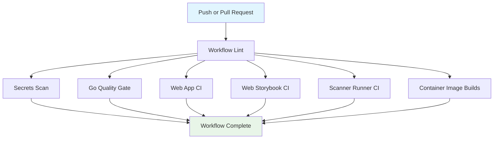

## Workflow Overview

**Purpose**: Validate repository integrity on every protected-branch change before merge or release work continues.
**Trigger Events**: `push` to `main`; `pull_request` targeting `main`
**Target Environments**: GitHub-hosted Linux runners for repository CI only

## Execution Flow Diagram



## Jobs & Dependencies

| Job Name | Purpose | Dependencies | Execution Context |
|----------|---------|--------------|-------------------|
| `workflow_lint` | Validate workflow definitions and embedded shell usage | None | GitHub-hosted Linux runner |
| `secrets` | Scan repository history and content for exposed secrets | `workflow_lint` | GitHub-hosted Linux runner |
| `go` | Validate Go services, docs generation, shell regressions, and vulnerability posture | `workflow_lint` | GitHub-hosted Linux runner |
| `clients_web` | Validate web formatting, lint, typecheck, tests, and package audit | `workflow_lint` | GitHub-hosted Linux runner |
| `clients_web_storybook` | Validate Storybook build, browser tests, and failure artifacts | `workflow_lint` | GitHub-hosted Linux runner |
| `scanner-runner` | Validate scanner-runner lint, typecheck, tests, and package audit | `workflow_lint` | GitHub-hosted Linux runner |
| `images` | Build all primary container images | `workflow_lint` | GitHub-hosted Linux runner |

## Requirements Matrix

### Functional Requirements

| ID | Requirement | Priority | Acceptance Criteria |
|----|-------------|----------|---------------------|
| REQ-001 | The workflow must run automatically for pushes to `main` and pull requests targeting `main`. | High | Both event types create a CI run without manual intervention. |
| REQ-002 | Workflow syntax and embedded shell usage must be validated before repository quality jobs start. | High | Invalid workflow definitions fail in `workflow_lint` and block downstream jobs. |
| REQ-003 | Go modules in `go.work` must build, lint, test, and pass vulnerability scanning. | High | The Go job exits successfully only when every discovered module passes all gates. |
| REQ-004 | The web client and scanner-runner must pass their package-level CI checks. | High | Each package job exits successfully only when install, audit, and CI commands succeed. |
| REQ-005 | Storybook interaction and accessibility coverage must remain enforced and produce failure artifacts for debugging. | Medium | Failed Storybook runs upload the configured test artifacts. |
| REQ-006 | Primary container images must remain buildable from repository state. | High | The image build job successfully builds all declared images. |

### Security Requirements

| ID | Requirement | Implementation Constraint |
|----|-------------|---------------------------|
| SEC-001 | The workflow must use least-privilege token access by default. | Set workflow-level permissions to read-only unless a job requires more. |
| SEC-002 | Secret exposure scanning must run on every qualifying CI execution. | The secrets job cannot be optional within this workflow. |
| SEC-003 | Third-party dependency risk must be checked in JavaScript package jobs. | Web and scanner-runner jobs must include dependency audit gates. |
| SEC-004 | Go dependency vulnerability posture must be checked in CI. | The Go job must include vulnerability scanning across all workspace modules. |

### Performance Requirements

| ID | Metric | Target | Measurement Method |
|----|--------|--------|--------------------|
| PERF-001 | Superseded branch runs | Canceled automatically | Workflow concurrency cancels in-progress runs for the same ref. |
| PERF-002 | Hung job duration | Bounded per job | Each job defines an explicit timeout. |
| PERF-003 | Storybook failure artifact retention | Short-lived | Uploaded debug artifacts expire after a defined short retention window. |

## Input/Output Contracts

### Inputs

```yaml
events:
  push:
    branches: [main]
  pull_request:
    branches: [main]

repository_state:
  workflow_files: .github/workflows/*
  go_workspace: go.work
  package_manifests:
    - clients/web/package.json
    - services/scanner-runner/package.json
  container_build_context: repository root
```

### Outputs

```yaml
job_results:
  workflow_lint: pass_fail
  secrets: pass_fail
  go: pass_fail
  clients_web: pass_fail
  clients_web_storybook: pass_fail
  scanner_runner: pass_fail
  images: pass_fail

artifacts:
  storybook_failure_artifacts:
    type: debug_bundle
    availability: failure_only
```

### Secrets & Variables

| Type | Name | Purpose | Scope |
|------|------|---------|-------|
| Token | `GITHUB_TOKEN` | Repository checkout and workflow-integrated actions | Workflow |
| Variable | Go version | Standardize Go execution environment | Workflow/job |
| Variable | Bun version | Standardize Bun execution environment | Workflow/job |

## Execution Constraints

### Runtime Constraints

- **Timeouts**: Every job has an explicit upper bound.
- **Concurrency**: One in-progress run per workflow/ref pair; newer runs cancel older ones.
- **Resource Limits**: Default GitHub-hosted Linux runner resources only.

### Environmental Constraints

- **Runner Requirements**: Linux runner with container build support and browser-install capability.
- **Network Access**: Outbound access required for dependency installation, vulnerability data, browser install, and action downloads.
- **Permissions**: Read-only repository token by default; no write access assumed.

## Error Handling Strategy

| Error Type | Response | Recovery Action |
|------------|----------|-----------------|
| Workflow syntax failure | Fail fast in `workflow_lint` | Correct workflow definition before rerun |
| Secrets scan failure | Mark workflow failed | Remove or rotate exposed secret material |
| Build or test failure | Mark owning job failed | Fix code or environment issue and rerun CI |
| Vulnerability or audit failure | Mark owning job failed | Upgrade or remediate affected dependency |
| Storybook failure | Upload debug artifacts, then fail job | Inspect artifacts and repair UI regression |
| Image build failure | Mark workflow failed | Fix Dockerfile or build context issue |

## Quality Gates

| Gate | Criteria | Bypass Conditions |
|------|----------|-------------------|
| Workflow lint | GitHub workflow syntax and embedded shell validation pass | None in standard CI |
| Secret scanning | No disallowed secrets detected | None in standard CI |
| Go quality | Build, lint, race tests, generated CLI docs, shell regression tests, and vuln scan all pass | None in standard CI |
| Web quality | Audit and package CI pass for `clients/web` | None in standard CI |
| Storybook quality | Build and Storybook tests pass | Failure artifacts may be uploaded, but the gate still fails |
| Scanner-runner quality | Audit and package CI pass for scanner-runner | None in standard CI |
| Container buildability | All declared images build successfully | None in standard CI |

## Monitoring & Observability

### Key Metrics

- **Success Rate**: Percentage of CI runs completing with all gates green.
- **Execution Time**: Per-job duration bounded by timeouts and reduced by concurrency cancellation.
- **Failure Diagnostics**: Storybook artifacts retained briefly for post-failure inspection.

### Alerting

| Condition | Severity | Notification Target |
|-----------|----------|---------------------|
| Any required CI job failure on pull request | High | Pull request status checks |
| Workflow syntax regression | High | Pull request status checks |
| Secret scan failure | Critical | Pull request status checks and repository maintainers |

## Integration Points

### External Systems

| System | Integration Type | Data Exchange | SLA Requirements |
|--------|------------------|---------------|------------------|
| GitHub Actions runners | Execution environment | Source checkout, logs, statuses | Available for every triggering event |
| Go vulnerability database | Dependency advisory lookup | Go module metadata | Needed during vuln scan job |
| Package registry ecosystem | Dependency install and audit metadata | Package manifests and lockfiles | Needed during Bun package jobs |
| Browser package sources | Playwright browser installation | Browser binaries | Needed for Storybook browser tests |

### Dependent Workflows

| Workflow | Relationship | Trigger Mechanism |
|----------|--------------|-------------------|
| `golden-regression.yml` | Separate validation workflow, not gated by this specification | Independent |
| `release-stageflow-cli.yml` | Separate release workflow | Independent |

## Compliance & Governance

### Audit Requirements

- **Execution Logs**: GitHub Actions run logs provide the audit trail.
- **Approval Gates**: Merge policy is enforced through required status checks outside the workflow definition.
- **Change Control**: Update this specification before materially changing CI behavior.

### Security Controls

- **Access Control**: Read-only token by default.
- **Secret Management**: Use GitHub-managed workflow token instead of embedding credentials.
- **Vulnerability Scanning**: Secret scanning, JS audits, and Go vulnerability scanning are part of normal CI.

## Edge Cases & Exceptions

| Scenario | Expected Behavior | Validation Method |
|----------|-------------------|-------------------|
| Force-push or rapid commit sequence on same branch | Older in-progress run is canceled in favor of the latest | Observe concurrency behavior in Actions UI |
| Storybook test failure | Debug artifacts upload before job failure completes | Trigger a failing Storybook run in a test branch |
| Invalid workflow shell snippet | `workflow_lint` fails before downstream jobs run | Introduce a temporary malformed script in a test branch |
| New Go workspace module added | Go job automatically includes it if listed in `go.work` | Add module entry in a test branch and confirm iteration |

## Validation Criteria

- **VLD-001**: The workflow remains `actionlint`-clean.
- **VLD-002**: The workflow spec matches the actual trigger conditions and job graph.
- **VLD-003**: Concurrency cancellation occurs for superseded runs on the same ref.
- **VLD-004**: All required jobs remain visible as stable status checks.

## Change Management

### Update Process

1. Update this specification to reflect the intended CI behavior.
2. Review workflow contract changes, especially permissions, triggers, and required jobs.
3. Apply workflow edits.
4. Validate with local workflow lint plus GitHub Actions execution.
5. Promote the workflow update through normal repository review.

### Version History

| Version | Date | Changes | Author |
|---------|------|---------|--------|
| 1.0 | 2026-04-03 | Initial CI workflow specification | Codex |

## Related Specifications

- `.github/workflows/ci.yml`
- `.github/workflows/golden-regression.yml`
- `.github/workflows/release-stageflow-cli.yml`
