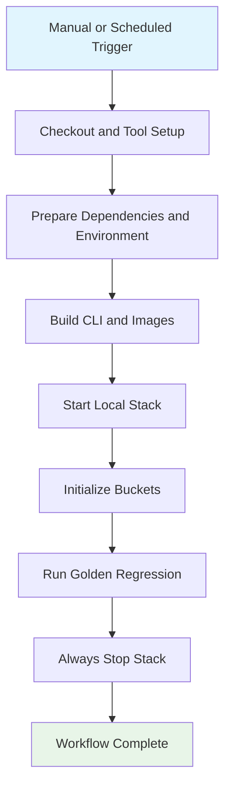

## Workflow Overview

**Purpose**: Run the project-mode golden regression flow on a scheduled or manual basis against a locally booted StageFlow stack.
**Trigger Events**: `workflow_dispatch`; scheduled cron execution
**Target Environments**: GitHub-hosted Linux runner with Podman-based local stack execution

## Execution Flow Diagram



## Jobs & Dependencies

| Job Name | Purpose | Dependencies | Execution Context |
|----------|---------|--------------|-------------------|
| `golden` | Build local prerequisites, boot the stack, run the golden regression, and clean up | None | GitHub-hosted Linux runner |

## Requirements Matrix

### Functional Requirements

| ID | Requirement | Priority | Acceptance Criteria |
|----|-------------|----------|---------------------|
| REQ-001 | The workflow must support both manual execution and scheduled regression runs. | High | Operators can dispatch manually and the cron schedule triggers automatically. |
| REQ-002 | The workflow must build and install the StageFlow CLI used by the golden regression script. | High | The regression script can invoke `stageflow` from the runner environment. |
| REQ-003 | The workflow must build all required local images before stack startup. | High | The stack starts using freshly built images from repository state. |
| REQ-004 | The workflow must provision the local stack and initialize required buckets before running the golden script. | High | The golden script runs against a ready local environment. |
| REQ-005 | The workflow must always tear down the stack after the test flow completes or fails. | High | Cleanup runs regardless of prior step result. |

### Security Requirements

| ID | Requirement | Implementation Constraint |
|----|-------------|---------------------------|
| SEC-001 | The workflow must use read-only repository access by default. | Workflow-level permissions remain `contents: read`. |
| SEC-002 | The workflow must generate its temporary runtime environment from repository examples. | Runtime secrets or tokens are created ephemerally inside the job. |

### Performance Requirements

| ID | Metric | Target | Measurement Method |
|----|--------|--------|--------------------|
| PERF-001 | Overlapping runs | Canceled per workflow/ref grouping | Concurrency cancellation prevents duplicate in-progress runs. |
| PERF-002 | Execution bound | Capped by explicit timeout | Job timeout limits stalled infrastructure runs. |

## Input/Output Contracts

### Inputs

```yaml
events:
  workflow_dispatch: {}
  schedule:
    - cron: nightly

repository_state:
  compose_files:
    - infra/compose/podman-compose.yml
    - infra/compose/podman-compose.local.yml
  bootstrap_files:
    - .env.example
    - infra/minio/init-buckets.sh
  regression_script:
    - qa/e2e/project-scan-golden.sh
```

### Outputs

```yaml
job_results:
  golden: pass_fail

runtime_effects:
  local_stack_started: transient
  buckets_initialized: transient
  stack_torn_down: always
```

### Secrets & Variables

| Type | Name | Purpose | Scope |
|------|------|---------|-------|
| Token | Temporary orchestrator API token | Local regression environment bootstrap | Job |
| Variable | Go version | Standardize Go runtime | Job |
| Variable | Bun version | Standardize Bun runtime | Job |

## Execution Constraints

### Runtime Constraints

- **Timeouts**: One explicit timeout bounds the full regression job.
- **Concurrency**: One in-progress run per workflow/ref or manual dispatch identity.
- **Resource Limits**: Default GitHub-hosted Linux runner capacity with Podman installed during the job.

### Environmental Constraints

- **Runner Requirements**: Linux runner capable of installing and using Podman.
- **Network Access**: Outbound access required for dependency installation and image build prerequisites.
- **Permissions**: Read-only repository token is sufficient.

## Error Handling Strategy

| Error Type | Response | Recovery Action |
|------------|----------|-----------------|
| Dependency setup failure | Fail job | Repair dependency or environment bootstrap issue |
| Image build failure | Fail job | Fix build context or Dockerfile-level error |
| Stack startup failure | Fail job | Inspect compose/service bootstrap logs |
| Golden regression failure | Fail job after execution | Inspect regression script output and service state |
| Cleanup failure | Report in cleanup step | Repair stack teardown path |

## Quality Gates

| Gate | Criteria | Bypass Conditions |
|------|----------|-------------------|
| Environment bootstrap | Tool setup, dependencies, and env prep succeed | None |
| Image buildability | Local images build successfully | None |
| Golden regression | `project-scan-golden.sh` completes successfully | None |
| Cleanup guarantee | Stack teardown runs with `always()` semantics | None |

## Monitoring & Observability

### Key Metrics

- **Success Rate**: Scheduled and manual regression pass rate.
- **Execution Time**: End-to-end runtime for local stack boot plus golden flow.
- **Cleanup Reliability**: Frequency of successful stack teardown after failures.

### Alerting

| Condition | Severity | Notification Target |
|-----------|----------|---------------------|
| Scheduled golden regression failure | High | Workflow status / maintainers |
| Stack cleanup failure | High | Workflow status / maintainers |

## Edge Cases & Exceptions

| Scenario | Expected Behavior | Validation Method |
|----------|-------------------|-------------------|
| Manual rerun while a prior run is still active | Older run is canceled | Observe workflow concurrency behavior |
| Regression script fails mid-run | Cleanup still executes | Force a failing golden branch and inspect run graph |
| Podman network absent | Workflow creates or recreates it during startup | Validate startup path on a clean runner |

## Validation Criteria

- **VLD-001**: The workflow remains `actionlint`-clean.
- **VLD-002**: The stack teardown step still runs under failure conditions.
- **VLD-003**: Trigger definitions and regression lifecycle remain aligned with the workflow file.

## Change Management

### Update Process

1. Update this specification before changing the workflow contract.
2. Apply workflow edits to triggers, lifecycle, or cleanup behavior.
3. Validate with local workflow lint and a GitHub Actions execution.
4. Confirm the regression job still boots and tears down the stack correctly.

### Version History

| Version | Date | Changes | Author |
|---------|------|---------|--------|
| 1.0 | 2026-04-03 | Initial golden regression workflow specification | Codex |

## Related Specifications

- `.github/workflows/golden-regression.yml`
- `.github/workflows/ci.yml`
- `qa/e2e/project-scan-golden.sh`
