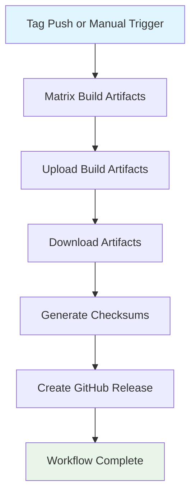

## Workflow Overview

**Purpose**: Build cross-platform StageFlow CLI release artifacts and publish them to a GitHub Release.
**Trigger Events**: Tag push matching `clients/cli/v*`; manual dispatch
**Target Environments**: GitHub-hosted Linux runners for build and release publication

## Execution Flow Diagram



## Jobs & Dependencies

| Job Name | Purpose | Dependencies | Execution Context |
|----------|---------|--------------|-------------------|
| `build` | Cross-compile the CLI, package platform artifacts, and upload them | None | GitHub-hosted Linux runner |
| `release` | Download packaged artifacts, generate checksums, and publish the GitHub Release | `build` | GitHub-hosted Linux runner |

## Requirements Matrix

### Functional Requirements

| ID | Requirement | Priority | Acceptance Criteria |
|----|-------------|----------|---------------------|
| REQ-001 | The workflow must trigger on version tags for the CLI and support manual dispatch. | High | Matching tag pushes and manual runs create workflow executions. |
| REQ-002 | The build job must produce packaged CLI artifacts for each supported OS/architecture pair. | High | Each matrix target emits one archive with the expected naming contract. |
| REQ-003 | Windows packaging must produce ZIP artifacts and non-Windows packaging must produce tarballs. | High | Artifact extension matches platform packaging rules. |
| REQ-004 | The release job must aggregate all build artifacts into a single GitHub Release. | High | The created release includes all packaged artifacts and checksums. |
| REQ-005 | Checksums must be generated from the downloaded release assets before publishing. | High | `checksums.txt` is included in the release payload. |

### Security Requirements

| ID | Requirement | Implementation Constraint |
|----|-------------|---------------------------|
| SEC-001 | The workflow must use read-only repository access by default. | Workflow-level permissions remain `contents: read`. |
| SEC-002 | Release publication permissions must be granted only to the publishing job. | Elevate `contents: write` only on the `release` job. |
| SEC-003 | Shell scripts must be safe for workflow lint and shell lint tooling. | Packaging and checksum scripts must remain `actionlint`/`shellcheck` clean. |

### Performance Requirements

| ID | Metric | Target | Measurement Method |
|----|--------|--------|--------------------|
| PERF-001 | Matrix throughput | Parallel builds across supported platforms | Observe matrix execution in Actions |
| PERF-002 | Overlapping tag/manual runs | Canceled per workflow/ref | Concurrency grouping prevents duplicate in-progress runs |
| PERF-003 | Artifact retention | Short-lived intermediate storage | Uploaded build artifacts expire after a short retention period |

## Input/Output Contracts

### Inputs

```yaml
events:
  push:
    tags:
      - clients/cli/v*
  workflow_dispatch: {}

matrix:
  goos: [linux, darwin, windows]
  goarch: [amd64, arm64]
  excluded_pairs:
    - windows/arm64
```

### Outputs

```yaml
build_outputs:
  packaged_cli_archives:
    naming: stageflow_<version>_<goos>_<goarch>.<archive_ext>
  release_checksums:
    file: checksums.txt

publication_outputs:
  github_release: created_or_updated
```

### Secrets & Variables

| Type | Name | Purpose | Scope |
|------|------|---------|-------|
| Token | `GITHUB_TOKEN` | Artifact upload and release publication | Workflow/job |
| Variable | Go version | Standardize build environment | Job |

## Execution Constraints

### Runtime Constraints

- **Timeouts**: Both build and release jobs have explicit upper bounds.
- **Concurrency**: One in-progress run per workflow/ref pair.
- **Resource Limits**: Default GitHub-hosted Linux runner capacity only.

### Environmental Constraints

- **Runner Requirements**: Linux runner with Go toolchain support and archive tooling.
- **Network Access**: Required for action downloads and Go toolchain setup.
- **Permissions**: Read-only at workflow level; write access only in the release job.

## Error Handling Strategy

| Error Type | Response | Recovery Action |
|------------|----------|-----------------|
| Cross-compile failure | Fail the owning matrix leg | Fix build portability or version metadata issue |
| Packaging failure | Fail the owning matrix leg | Repair archive generation logic |
| Artifact upload failure | Fail build job | Repair artifact path or runner state |
| Checksum generation failure | Fail release job | Repair artifact download or shell-safe checksum logic |
| Release publication failure | Fail release job | Repair permissions or release action configuration |

## Quality Gates

| Gate | Criteria | Bypass Conditions |
|------|----------|-------------------|
| Build matrix | Every supported target compiles and packages successfully | None |
| Artifact handoff | All matrix outputs upload and download correctly | None |
| Checksum generation | Release assets produce a checksum manifest | None |
| Release publication | GitHub Release action completes successfully on tag-triggered release runs | None |

## Monitoring & Observability

### Key Metrics

- **Success Rate**: Percentage of release workflows completing with all assets published.
- **Matrix Duration**: Time to produce all platform artifacts.
- **Publication Reliability**: Frequency of successful release creation after build completion.

### Alerting

| Condition | Severity | Notification Target |
|-----------|----------|---------------------|
| Matrix build failure | High | Workflow status / maintainers |
| Release publication failure | Critical | Workflow status / maintainers |

## Edge Cases & Exceptions

| Scenario | Expected Behavior | Validation Method |
|----------|-------------------|-------------------|
| Manual dispatch on a non-tag ref | Build may run; release publication remains gated to tag refs | Trigger manually on a branch and confirm `release` does not publish |
| Re-run on same tag | Older in-progress run is canceled by concurrency | Observe Actions UI on repeated same-tag execution |
| Artifact names with leading dashes | Checksum step treats artifacts as paths, not options | Validate shell-safe checksum command under `actionlint` |

## Validation Criteria

- **VLD-001**: The workflow remains `actionlint`-clean.
- **VLD-002**: The release job alone owns write-level release permissions.
- **VLD-003**: Artifact naming and packaging rules remain consistent with the current release contract.

## Change Management

### Update Process

1. Update this specification before changing the release workflow contract.
2. Apply workflow edits to permissions, matrix shape, packaging, or publication behavior.
3. Validate with local workflow lint and a GitHub Actions run.
4. Confirm the release output still matches the expected CLI asset contract.

### Version History

| Version | Date | Changes | Author |
|---------|------|---------|--------|
| 1.0 | 2026-04-03 | Initial CLI release workflow specification | Codex |

## Related Specifications

- `.github/workflows/release-stageflow-cli.yml`
- `.github/workflows/ci.yml`
- `clients/cli`
